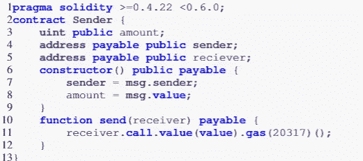
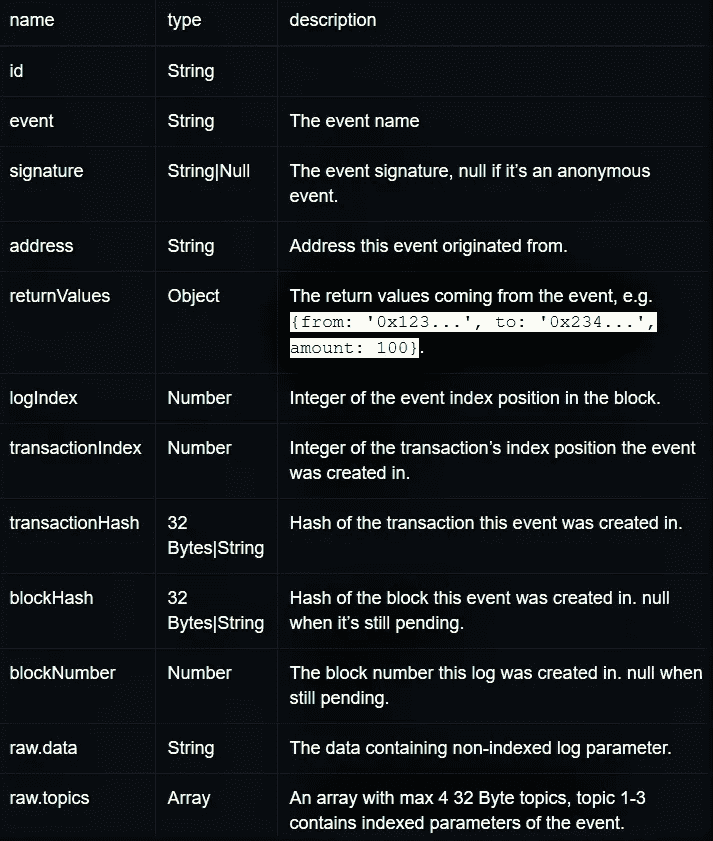

# 在以太坊区块链中查询数据

> 原文：<https://medium.com/coinmonks/querying-data-in-an-ethereum-blockchain-86289d3fc385?source=collection_archive---------0----------------------->

## 以太坊区块链内部

## 使用智能合约读取/写入以太坊区块链


您可能已经听说过以太坊是一个区块链公共网络，交易价值数十亿美元。但是你可能没有意识到以太坊代码库也被世界各地的组织用来建立商业区块链网络。这些私人以太坊区块链网络通常是许可的，尽管它们与公共以太坊主网分离，但它们可以选择访问主网上的数据。以太坊区块链技术的这种适应需要很好地理解使用智能合约的读写方式。

> 尝试 Bitquery graph QL[API 查询以太坊区块链](https://bitquery.io/products/ethereum-api)。

## 固态

以太坊智能合约大多是用一种新设计的高级图灵-完全编程语言 Solidity 开发的。可靠性越来越受欢迎，因为它是专门为满足以太坊交易的要求而设计的。这些程序被编译成以太坊虚拟机(EVM)字节码，这是一种基于堆栈的低级语言，然后部署在以太坊区块链网络上，在所有以太坊节点上运行。例如，下面的清单显示了用 Solidity 编程语言编写的智能契约。程序的第一行声明了这个智能契约中使用的 Solidity 的版本。该程序包含一个构造函数来创建一个契约实例，以及函数。



Solidity Smart Contract

## 固态数据

可以说，Solidity 就像其他编程语言一样，只是在运行代码和处理数据方面有所不同。有趣的是，Solidity 只处理 EVM 或区块链网络中的数据，其存储方式也很特别。固体中的变量主要有两种:状态变量和局部变量。状态变量负责通过将值保存在区块链上的[块中来存储智能合约的状态。这些变量类似于其他编程语言中的全局变量，因为它们在`contract`部分中定义，并且在智能契约中的任何地方都可用。和其他编程语言的局部变量一样，Solidity 中的局部变量是在函数内部定义的。这些变量仅在定义它们的函数执行期间保存它们的值。](https://www.dummies.com/personal-finance/the-structure-of-blockchains/)

## 以太坊区块链中的数据存储

> 以太坊实现了一个 trie 数据结构来管理临时和永久数据。以太坊区块链中的三类 trie 数据结构是**状态 Trie、存储 Trie 和事务 Trie。**

挖掘并确认的交易被记录在交易 trie 中。像上面提到的本地变量和帐户地址这样的临时数据被存储在状态 trie 中，在状态 trie 中它不断地改变和更新，从而更新整个以太坊区块链的状态。

## **状态 trie**

以太坊中有一个不断更新的全局状态 trie。它包含一个键-值对，其中键是以太坊帐户的地址，值是以太坊网络上帐户的随机数、余额、存储根的递归长度前缀(RLP)编码值。

## **存储 trie**

存储 trie 是存储所有合同数据的地方。每个以太坊账号都有自己的存储 trie。存储 trie 的根节点的 256 位散列作为 **storageRoot** 值存储在全局状态 trie 中。

## **交易 trie**

事务 trie 中特定事务的路径是通过事务在块中所处位置的索引(的 RLP 编码)。挖掘的块从不更新；事务在块中的位置永远不会改变。这意味着，一旦在块的事务 trie 中找到一个事务，就可以反复返回到相同的路径来检索相同的结果。

## Geth 和 LevelDB 访问以太坊区块链元数据

Go Ethereum 是以太坊协议的三个原始实现之一(另两个是 C++和 Python)。它是用 Go 编写的，是完全开源的，可以作为一个名为 Geth 的独立客户端获得。Geth 下载完整的以太坊区块链，并用某个数据库对其进行索引，以实现高效的数据查找和检索或存储状态。Geth 使用 LevelDB，因为 LevelDB 是在 GO 中实现的，具有键-值对，并包括现代数据存储(即磁盘上的多个层，在后台组织)

但是，使用 LevelDB 也有一些限制:

*   以太坊使用的散列是均匀随机分布的标识符。LevelDB 在磁盘上“按字母顺序”组织键，因此，访问与散列相关的值是非常昂贵的。
*   只要 LevelDB 的大部分内容能够放入内存，它就能很好地执行，但是随着磁盘空间的增加，性能会下降。
*   查询 LevelDB 会返回编码的结果，因为以太坊在与 LevelDB 交互时使用了“修改的 Merkle Patricia Trie”实现。

然而，要访问以太坊区块链上存储的数据，也有一些现有的工具。如果数据与交易相关联，[以太坊(ETH)区块链浏览器](https://etherscan.io/)可用于查看数据。如果数据存储在某些智能合约中，智能合约的接口可用于读取数据。要将一些数据写入以太坊区块链，无论是将一些以太发送到嵌入数据的地址，还是与以太坊区块链上的智能合约进行交互，都可以实现为您写入数据。

## Web3.js 访问以太坊区块链上的事件数据

[Web3.js](https://web3js.readthedocs.io/) 可用于有效地查询和监听以太坊区块链上的合约事件，从而实现当满足特定标准时触发的动作规范。

可以通过以下方式使用即将到来的事件的事件侦听器来指定当事件发出时将发生的回调，

*   对于任何事件，`contract.events.allEvents()`可以用来为所有事件指定一个回调。

```
contract.events.allEvents()
.on('data', (event) => {
	console.log(event);
})
.on('error', console.error);
```

*   对于特定的事件，`contract.events.EventName()`可以用来指定特定事件类型的动作。例如，`Transfer`:

```
contract.events.Transfer()
.on('data', (event) => {
	console.log(event);
})
.on('error', console.error);
```

上述事件侦听器的输出返回有价值的数据，下表详细描述了这些数据。



Event listener Data Output Taxonomy by [https://www.pauric.blog/](https://www.pauric.blog/)

## 结论

以太坊区块链的功能相当简单，不同尝试中永久和临时数据的不同存储空间确保了数据的安全和数据的易于管理。因此，能够安全轻松地访问以太坊区块链上存储的数据。

> 加入 Coinmonks [电报频道](https://t.me/coincodecap)和 [Youtube 频道](https://www.youtube.com/c/coinmonks/videos)获取每日[加密新闻](http://coincodecap.com/)

## 另外，阅读

*   [复制交易](/coinmonks/top-10-crypto-copy-trading-platforms-for-beginners-d0c37c7d698c) | [加密税务软件](/coinmonks/crypto-tax-software-ed4b4810e338)
*   [网格交易](https://coincodecap.com/grid-trading) | [加密硬件钱包](/coinmonks/the-best-cryptocurrency-hardware-wallets-of-2020-e28b1c124069)
*   [最佳加密交易所](/coinmonks/crypto-exchange-dd2f9d6f3769) | [印度最佳加密交易所](/coinmonks/bitcoin-exchange-in-india-7f1fe79715c9)
*   [密码电报信号](/coinmonks/top-3-telegram-channels-for-crypto-traders-in-2021-8385f4411ff4) | [密码交易机器人](/coinmonks/crypto-trading-bot-c2ffce8acb2a)
*   [开发者最佳加密 API](/coinmonks/best-crypto-apis-for-developers-5efe3a597a9f)
*   最佳[密码借贷平台](/coinmonks/top-5-crypto-lending-platforms-in-2020-that-you-need-to-know-a1b675cec3fa)
*   [SmithBot 评论](https://coincodecap.com/smithbot-review) | [4 款最佳免费开源交易机器人](https://coincodecap.com/free-open-source-trading-bots)
*   [比特币基地僵尸工具](/coinmonks/coinbase-bots-ac6359e897f3) | [AscendEX 审查](/coinmonks/ascendex-review-53e829cf75fa) | [OKEx 交易僵尸工具](/coinmonks/okex-trading-bots-234920f61e60)
*   [如何在印度购买比特币？](/coinmonks/buy-bitcoin-in-india-feb50ddfef94) | [瓦济克斯评论](/coinmonks/wazirx-review-5c811b074f5b)
*   [加密交易机器人](/coinmonks/crypto-trading-bot-c2ffce8acb2a) | [Probit 审查](https://coincodecap.com/probit-review)
*   [隐翅虫替代品](/coinmonks/cryptohopper-alternatives-d67287b16d27) | [HitBTC 审查](/coinmonks/hitbtc-review-c5143c5d53c2)
*   [CBET 评论](https://coincodecap.com/cbet-casino-review) | [库科恩 vs 比特币基地](https://coincodecap.com/kucoin-vs-coinbase)
*   [折叠 App 审核](https://coincodecap.com/fold-app-review) | [Kucoin 交易机器人](/coinmonks/kucoin-trading-bot-automate-your-trades-8cf0ca2138e0)
*   [免费加密信号](/coinmonks/free-crypto-signals-48b25e61a8da) | [加密交易机器人](/coinmonks/crypto-trading-bot-c2ffce8acb2a)
*   [杠杆代币终极指南](/coinmonks/leveraged-token-3f5257808b22)