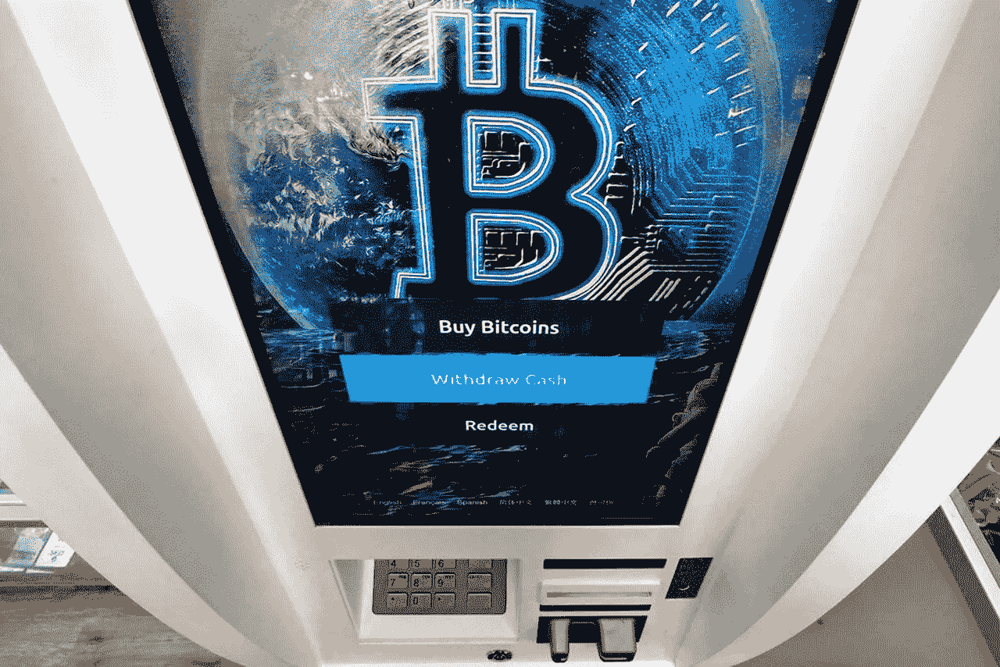

# 购买加密货币前要问自己的问题

> 原文：<https://medium.com/coinmonks/questions-to-ask-yourself-before-purchasing-cryptocurrency-8ad8bce7bcae?source=collection_archive---------6----------------------->

## 随着加密货币成为主流，重要的是要问一问参与加密货币是否符合你的最佳利益

加密货币以前是金融界的边缘元素，现在正成为主流。

10 月 19 日，一只与比特币期货挂钩的 ProShares 交易所交易基金在纽约证券交易所首次亮相。艺术家通过出售“符号化”的数字作品赚取了数百万美元。像银行和保险公司一样，加密交易所也在黄金时段的电视上做广告。

另一方面，探索加密技术的个人投资者可能会遇到一个不同于传统金融的另类世界。在仅由计算机代码块支持的资产快速交易期间，价格可能会快速波动。

尽管复杂，专家表示，投资加密货币的策略与其他高风险投资类似:不要投资你输不起的钱，确保你已经覆盖了所有其他金融基础，并保持耐心。

“人们接触到的大多数信息都是关于加密交易的。这是关于如何购买下一个热门加密。这是关于如何识别下一枚飞向月球的硬币，”华盛顿州的注册财务规划师史蒂夫·拉森说。“加密投资非常不同。这是关于买一些你认为具有长期价值的基本面的东西。”

拉森教授投资顾问如何与他们的客户讨论数字资产，他觉得被称为区块链的底层技术很有前途。在一个区块链网络中，计算机合作认证交易，而不需要银行或政府监管机构等中央机构(及其相关费用)。

## **1。你有财力购买加密货币吗？**

一般来说，如果你决定购买 crypto，它属于一个相对风险较高的资产群，占你整个投资组合的一小部分——5%到 10%是一个常见的指导方针。

Larsen 说，他不建议任何人[在实现短期和长期财务健康的其他目标之前投资加密货币](https://www.nerdwallet.com/article/investing/cryptocurrency-7-things-to-know?utm_campaign=ct_prod&utm_content=1078931&utm_medium=wire&utm_source=syndication&utm_term=oregonian)。他说，例如，投资者应该消除任何消费者债务，并确保他们进行足够的投资，以获得雇主对退休账户(如 401(k)s)的匹配缴款。

除此之外，购买 crypto 不需要大量的资金投入。一些在线交易所允许顾客以一美元或更少的增量购买。

量子经济学研究公司的首席执行官马体·葛林斯潘说，进入加密领域的一个方法是每周存几美元。

## **2。你做了足够的研究吗？**

近年来，加密货币交易所让购买、持有和出售变得更加容易。如果你不想把现金的安全托付给交易所的运营商，你需要更多地了解数字钱包的功能，以及哪种钱包最适合你。

“这个行业充斥着没有使用案例的硬币，在许多情况下实际上是彻头彻尾的骗局，这意味着他们只是想得到你的钱的人，”位于以色列特拉维夫的格林斯潘相信这一点。他声称，关键在于识别真正的创新者。

虽然不要求有编码背景，但研究如何使用加密货币是值得的。做到这一点的一个方法是研究白皮书，这通常是一个技术文件，展示了一个网络将如何工作。

例如，比特币被设计成一种真正的数字货币，可以用来支付商品和服务。

以太是第二大最有价值的加密货币，也可以作为一种支付形式或对协助以太坊网络运营的用户进行补偿。该网络旨在执行“智能合约”，如果符合特定情况，可以自动结算。

格林斯潘建议观察加密货币的供应量是如何分散的，以及是否有一个可以流通的最大供应量。

他说，这样的调查“可能会非常乏味，但它们肯定会让你重点关注随着时间的推移，硬币的价格会发生什么。”

## **3。你将如何扩大你的投资组合的资产？**

所有加密货币都面临同样的风险:区块链技术仍然相对较新，没有人确切知道它是否会带来其支持者所期望的经济收益。

纽约市雷曼学院(Lehman College)的商业和经济学助理教授肖恩·斯坦·史密斯(Sean Stein Smith)表示同意，“任何投资……任何加密资产都是对未来的押注，交易、资产和信息将越来越多地在底层区块链上存储和传输。”。

即使区块链实现了技术投资者的期望，也会有加密货币失败。格林斯潘建议将你的钱分散到一些他认为有长期前景的资产上。

没有多少加密货币替代共同基金或其他投资工具，为普通投资者提供各种资产的广泛敞口。

一些交易所交易基金专注于从事区块链相关项目的公司，此外还有新的比特币相关 ETF(股票代码:BITO)。已经有人提出了其他持有加密货币的 ETF，但它们尚未获得批准。

The ETF with the ticker symbol “BITO” is expected to begin trading Tuesday, barring any opposition from regulators. It’s the latest milestone for Bitcoin and for the ETF industry in general. (AP Photo/Charles Krupa, File)

投资者可能会考虑加密货币行业的股票，如比特币基地。

无论你如何处理加密货币，都应该在你的整个投资组合中实现投资多样化，另类投资通常只占其中的一小部分。

> 加入 Coinmonks [电报频道](https://t.me/coincodecap)和 [Youtube 频道](https://www.youtube.com/c/coinmonks/videos)了解加密交易和投资

## 另外，阅读

*   [用信用卡购买密码的 10 个最佳地点](https://blog.coincodecap.com/buy-crypto-with-credit-card)
*   [OKEx 回顾](/coinmonks/okex-review-6b369304110f) | [Kucoin 交易机器人](/coinmonks/kucoin-trading-bot-automate-your-trades-8cf0ca2138e0) | [期货交易机器人](/coinmonks/futures-trading-bots-5a282ccee3f5)
*   [AscendEx Staking](https://blog.coincodecap.com/ascendex-staking)|[Bot Ocean Review](https://blog.coincodecap.com/bot-ocean-review)|[最佳比特币钱包](https://blog.coincodecap.com/bitcoin-wallets-india)
*   [霍比评论](https://blog.coincodecap.com/huobi-review) | [OKEx 保证金交易](https://blog.coincodecap.com/okex-margin-trading) | [期货交易](https://blog.coincodecap.com/futures-trading)
*   [CoinFLEX 评论](https://blog.coincodecap.com/coinflex-review) | [AEX 交易所评论](https://blog.coincodecap.com/aex-exchange-review) | [UPbit 评论](https://blog.coincodecap.com/upbit-review)
*   [AscendEx 保证金交易](https://blog.coincodecap.com/ascendex-margin-trading) | [Bitfinex 赌注](https://blog.coincodecap.com/bitfinex-staking) | [bitFlyer 审核](https://blog.coincodecap.com/bitflyer-review)
*   [麻雀交换评论](https://blog.coincodecap.com/sparrow-exchange-review) | [纳什交换评论](https://blog.coincodecap.com/nash-exchange-review)
*   [拥护卡审核](https://blog.coincodecap.com/uphold-card-review) | [信任钱包 vs MetaMask](https://blog.coincodecap.com/trust-wallet-vs-metamask)
*   [Exness 评测](https://blog.coincodecap.com/exness-review)|[moon xbt Vs bit get Vs Bingbon](https://blog.coincodecap.com/bingbon-vs-bitget-vs-moonxbt)
*   [如何开始通过加密贷款赚取被动收入](https://blog.coincodecap.com/passive-income-crypto-lending)
*   [加密货币储蓄账户](/coinmonks/cryptocurrency-savings-accounts-be3bc0feffbf) | [加密交易机器人](https://blog.coincodecap.com/best-crypto-trading-bots)
*   [BigONE 交易所评论](/coinmonks/bigone-exchange-review-64705d85a1d4) | [CEX。IO 审查](https://blog.coincodecap.com/cex-io-review) | [Swapzone 审查](/coinmonks/swapzone-review-crypto-exchange-data-aggregator-e0ad78e55ed7)