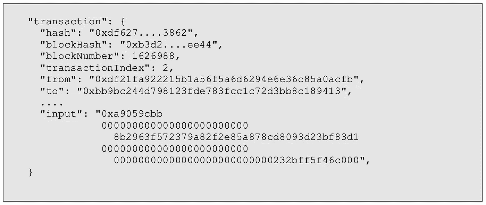
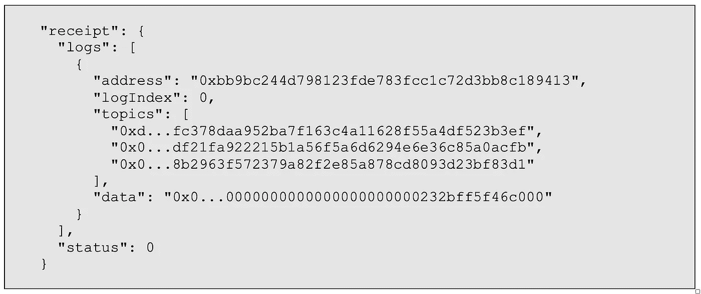
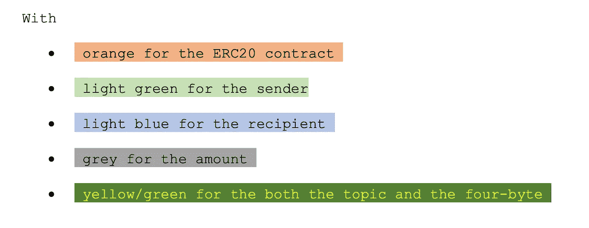
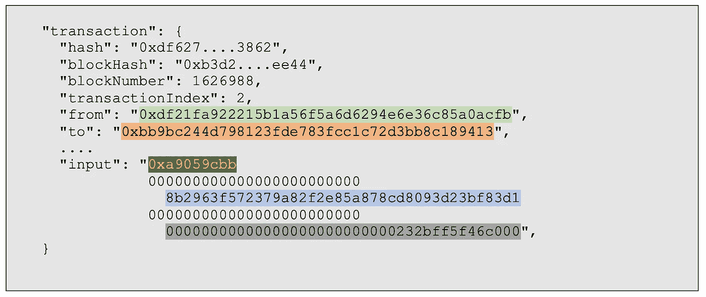
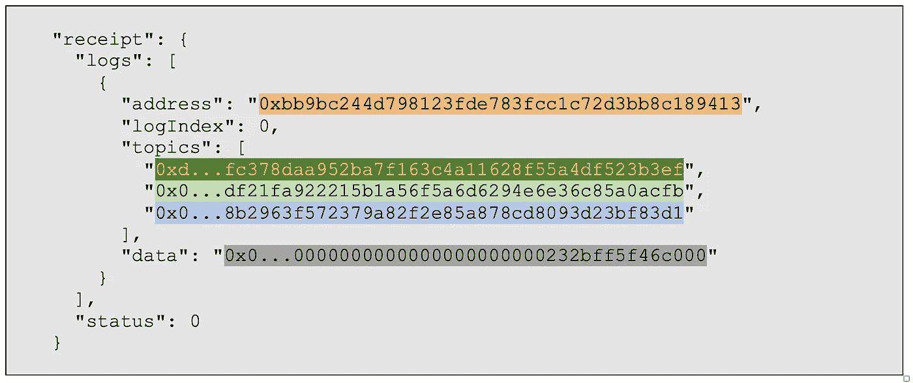
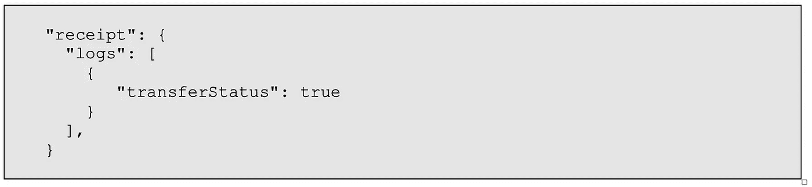

# 压缩 ERC20 日志

> 原文：<https://medium.com/coinmonks/quick-take-on-a-dumb-idea-8c5638129c7?source=collection_archive---------6----------------------->

我没有时间，所以我在这里对我思考了很久的事情做了一个快速的总结。这更像是一个思想实验。

**事实:**区块链以太坊上的很多交易都是简单的 ERC20 代币转账。

那又怎样？

## 如果 ERC20 令牌是链中的本地令牌会怎样？

使用标准 ERC20 令牌`transfer`函数(或`transferFrom`，我们在下面看到可以安全地忽略)在链上出现的每个令牌传输。

在 ERC20 标准中，[传递函数](https://eips.ethereum.org/EIPS/eip-20)定义为:

```
**function** transfer(address _to, uint256 _value) 
```

翻译成一个四字节的签名`0xa9059cbb`。

查看从 RPC 获得的典型 ERC20 传输，它看起来像这样:



传输生成的日志如下所示:



如果你仔细观察，会发现有大量的冗余信息。

## 着色的东西让它更明显

查看一些 gobblygook 字节，使其更加清晰，给出:



我们看到…



对于交易和…



为了日志。注意到什么了吗？

除了`status`之外，每张代币转账收据都已经存在于交易数据中。

## 我有个主意

如果我们从标准要求的事件中删除冗余信息，并将传输日志转换为链固有的特殊情况，会怎么样呢？

传输日志可能如下所示，例如:



换句话说，关于 ERC20 令牌传输，我们真正需要知道的是它是否成功。所有其他信息已经包含在交易中。

## 明显的反对意见

**太难了，现在改。所有的 dApps 都会破裂。**

这是真的。很多东西会坏掉。但我建议我们向前看 50 年，而不是过去的 5 年。

**太难了，所有的客户端代码都得修改。**

这也是事实。看看我之前的回答，再看看下面我快速计算了一下这样可以节省多少空间。

**它降低了查询速度。**

这也是事实。它会降低查询速度，因为节点软件经过了高度优化，可以提供与日志相关的查询。

目前，dApp 发送事务，然后查询日志，因此，这就是为什么可能包含冗余信息的原因。不过，据推测，dApp 是事务的来源，因此它已经拥有了重建完整日志所需的信息。

在事后链外擦除的情况下，事务信息很可能也已经可用，因为许多链外擦除会在扫描特定日志之前扫描数据块和事务。

## 利益

**节点存储的数据量减少。**

即使这没有通过成为一个特殊的本地原语而进入协议层，观察使我们得出结论，我们可以大大减少机器硬盘上的数据大小。我们使用非常粗略的粗略计算得出了下面的估计值。

**通过线路传输的总字节数减半。**

电线上的空间是无限的，不是吗？高流量到底是什么意思？

这意味着有太多的字节试图挤到网上。因此，每一点都很重要，这可以显著降低网络上传输的字节数。

**更小的数据意味着更多的“普通人”可以运行节点。**

我所做的一切的整体目标是使运行本地节点更容易。关于运行一个节点最大的抱怨之一是它占用了多少磁盘空间。这将降低这一数量，从而允许更多的人运行更多的节点。

## 这会节省多少空间？

我们从 TrueBlocks 命令行工具`chifra`运行了以下命令:

```
chifra blocks 1756978-1757000 | grep input | cut -c1-26
```

这产生了一个文件(`file.txt`)，其中包含大约 24，000 笔交易的数据，只提取了`input`字段。这代表了在 3，000，000 到 13，000，000 个块之间随机采样的大约 200 个块。

这些数据看起来像这样:

```
"input": "0x",
"input": "0x18cbafe5"
"input": "0xc9807539"
"input": "0xab834bab"... plus 24,375 more rows...
```

不惊人，但相当有趣。

我们对该数据文件运行以下命令，在 24，379 条记录中发现了 1，578 个不同的四字节代码，其中 10 条记录显示了超过 100 个具有该四字节的事务。

```
cat file.txt | sort | uniq -c | sort -n
```

使用以太坊四字节目录，我们找到(10 个最常出现的函数)以下信息:

```
**Count     Four-Byte     Signature**
------------------------------------------------------------------
  105     0x23b872dd    transferFrom(address,address,uint256)
  111     0x202ee0ed    submit(uint256,int256)
  117     0x6ea056a9    sweep(address,uint256)
  127     0xef343588    trade(uint256[8],address[4],...) 
  191     0x38ed1739    swapExactTokensForTokens(uint256,uint256...)
  195     0x18cbafe5    swapExactTokensForETH(uint256,uint256,...)
  352     0x7ff36ab5    swapExactETHForTokens(uint256,address[],...)
  486     0x095ea7b3    approve(address,uint256)
 7485     0xa9059cbb    transfer(address,uint256)
10343     0x            (straight up ETH transfer)
```

或者，以百分比表示:

```
**Percent   Four-Byte     Signature**
------------------------------------------------------------------
  0.54%   0x23b872dd    transferFrom(address,address,uint256)
  0.57%   0x202ee0ed    submit(uint256,int256)
  0.60%   0x6ea056a9    sweep(address,uint256)
  0.65%   0xef343588    trade(uint256[8],address[4],...) 
  0.98%   0x38ed1739    swapExactTokensForTokens(uint256,uint256...)
  1.00%   0x18cbafe5    swapExactTokensForETH(uint256,uint256,...)
  1.80%   0x7ff36ab5    swapExactETHForTokens(uint256,address[],...)
  2.49%   0x095ea7b3    approve(address,uint256)
 38.36%   0xa9059cbb    transfer(address,uint256)
 53.01%   0x            (straight up ETH transfer)
```

因此`91%`在我们抽样的所有交易中，要么是 ETH 的直接转让，要么是 ERC20 令牌转让。

## 挥手

我们对同一组数据块运行了以下命令:

```
chifra blocks --raw 3000000-13000000:50000 | jq | grep size
```

并将结果相加，发现我们采样的 200 个块占用了硬盘上的 5，132，592 字节(5 MB)。在撰写本文时，将这一数据扩展到 13，800，429 个数据块，我们得到的估计数据块大小仅为`5,132,592 * 13,800,429 = 354,159,857,410`字节或大约为`350 GB`字节。

一个非常粗略的猜测是，日志数据(不作为块的一部分存储)的数量与块的数量一样多，如果我们将`350 GB`加到`350 GB`上，我们得到的`700 GB`与已知的链大小(2TB)数量级相同。

因此，让我们使用`350 GB`作为日志的大小。

扩展`350 GB * .3836 * .1`(因为我们可以将传输日志的大小减小到当前的大小`1/10`)我们得到了`13.5 GB`。很多吗？不完全是…

如果我们用显示成功或失败的简单布尔值替换所有的`transfer`日志，并从产生传输的事务中提取剩余的数据，我们可以将硬盘上的数据大小减少大约总数的`15 GB`或`1%`(假设总数为`1.5 TB`)。

**结论:**不值得努力！

**→【修正—2021 年 12 月 30 日】**

我在上面的计算中犯了一个错误。它应该使用`.9`而不是`.1`的值，因为我们正在将大小减小到其原始大小`1/10`。所以`350 GB * .3836 * .9`会救`120.834 GB`。这实际上是非常不同的结论。可能值得。

**→【修正—2021 年 12 月 30 日】**

支持我们的工作

TrueBlocks 完全由我们自己的个人基金和一些赠款自筹资金，如以太基金会(2018 年)、Consensys (2019 年)、Moloch DAO (2021 年)和最近的 Filecoin/IPFS (2021 年)。

如果你喜欢这篇文章或者你只是想支持我们的工作，请访问我们的 git coin grant[https://gitcoin.co/grants/184/trueblocks](https://gitcoin.co/grants/184/trueblocks)。捐赠给下一轮比赛。我们得到了额外的好处，那就是更多的匹配资助。即使很少的量也会有很大的影响。

如果您愿意，可以随时将任何代币发送到我们的公共以太坊地址 **trueblocks.eth** 或 0x f 503017d 7 ba F7 FBC 0 fff 7492 b 751025 c6a 78179 b。

> 加入 Coinmonks [电报频道](https://t.me/coincodecap)和 [Youtube 频道](https://www.youtube.com/c/coinmonks/videos)了解加密交易和投资

## 也阅读

[](/coinmonks/leveraged-token-3f5257808b22) [## 杠杆代币[多头代币]终极指南

### 杠杆化令牌是具有杠杆化风险敞口的 ERC20 令牌，不考虑保证金、要求、管理…

medium.com](/coinmonks/leveraged-token-3f5257808b22) [](https://blog.coincodecap.com/crypto-exchange) [## 最佳加密交易所| 2021 年十大加密货币交易所

### 加密货币交易所的加密交易需要了解市场，这可以帮助你获得利润。之前…

blog.coincodecap.com](https://blog.coincodecap.com/crypto-exchange) [](https://blog.coincodecap.com/best-swap-platforms) [## 2021 年最佳加密交换平台| CoinCodeCap

### 如果我们看看今天的场景，许多加密货币交换平台提供了广泛的功能和深度…

blog.coincodecap.com](https://blog.coincodecap.com/best-swap-platforms) [](/coinmonks/top-5-crypto-lending-platforms-in-2020-that-you-need-to-know-a1b675cec3fa) [## 2021 年最佳加密借贷平台| 6 大比特币借贷平台

### 获得比特币和其他加密货币的最佳贷款利率

medium.com](/coinmonks/top-5-crypto-lending-platforms-in-2020-that-you-need-to-know-a1b675cec3fa) [](/coinmonks/crypto-trading-bot-c2ffce8acb2a) [## 2021 年最佳免费加密交易机器人

### 2021 年币安、比特币基地、库币和其他密码交易所的最佳密码交易机器人。四进制，位间隙…

medium.com](/coinmonks/crypto-trading-bot-c2ffce8acb2a) [](/coinmonks/best-crypto-signals-telegram-5785cdbc4b2b) [## 最佳 4 个加密交易信号电报通道

### 这是乏味的找到正确的加密交易信号提供商。因此，在本文中，我们将讨论最好的…

medium.com](/coinmonks/best-crypto-signals-telegram-5785cdbc4b2b) [](https://blog.coincodecap.com/bitsgap-review) [## 获取信号、交易机器人和套利

### 在本文中，我们将回顾 Bitsgap，这是一个满足您所有交易需求的一站式加密交易平台。它…

blog.coincodecap.com](https://blog.coincodecap.com/bitsgap-review)