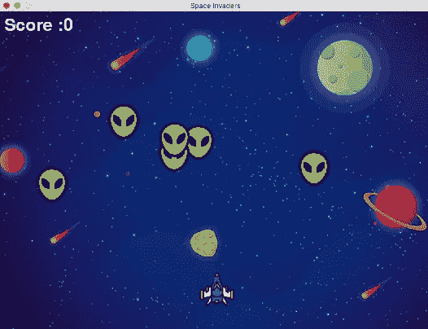

# python py game 快速入门

> 原文：<https://medium.com/coinmonks/quickstart-for-pygame-with-python-8db108a19650?source=collection_archive---------1----------------------->

在本文中，我们将使用 pygame 库用 python 创建一个简单的游戏(太空入侵者)。

这是一个射击游戏，这是游戏最后的样子:

在开始之前，我想提一下，这篇文章是在 Udemy 平台上的一个在线课程之后创作的，如果你喜欢这篇文章，并想通过视频获得更详细的解释，我会…