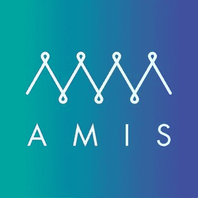

# Quorum 区块链共识算法

> 原文：<https://medium.com/coinmonks/quorum-blockchain-consensus-algorithms-ab38790091?source=collection_archive---------1----------------------->

本文将重点讨论在 [**法定人数**](https://github.com/jpmorganchase/quorum) 许可的区块链中使用**筏**和**伊斯坦堡 BFT** 的利弊。

# 历史

[**伊斯坦布尔 BFT**](https://github.com/getamis/istanbul-tools) 灵感来自[**小团体 PoA**](https://github.com/ethereum/EIPs/issues/225) **【权威证明】**。Clique PoA 目前用于以太坊的 Rinkeby 测试网络以及[以太坊专用网络](https://poa.network/)。我将在以后的文章中介绍 Clique PoA。

[**筏**](https://raft.github.io/) 在容错和性能上相当于 [**Paxos**](https://en.wikipedia.org/wiki/Paxos_(computer_scien) 。

# BFT 对 CFT

**伊斯坦布尔 BFT** 是**拜占庭容错(BFT)** 而 Raft 是**崩溃容错(CFT)** 。 **BFT** 保护区块链不受坏演员的影响，而 **CFT** 只保护节点不崩溃。

# 福克斯？

“two silver bread knife and fork” by [G. Crescoli](https://unsplash.com/@freegraphictoday?utm_source=medium&utm_medium=referral) on [Unsplash](https://unsplash.com?utm_source=medium&utm_medium=referral)

与 **PoW** (比特币/以太坊)和 **PoET** ( [Hyperledger 锯齿](https://sawtooth.hyperledger.org/docs/))不同，我们不必担心用**筏**或**IBFT**进行分叉，从而允许更快的终结。

# 大量

**共识类型:**CFT
健康节点所需: 2f+1

**优点**
-超级快，默认块生成时间为 50 毫秒
-不生成空块，为我们节省了大量存储空间
-事务终结，确保我们不会遇到会减慢我们速度的分叉

**缺点** -没有针对不良行为者的保护，事实上历史块信息可以被修改，然后块散列重新计算到 ***编辑*** 过去。一种解决方法是实现一个自定义解决方案，将块哈希存储在一个单独的系统上。

# BFT 伊斯坦布尔

**共识类型:**BFT
廉洁奉公所需节点: 3f+1

**优点**
-保护区块链免受大约 30%的不良参与者的影响
-非常难以篡改过去，因为不良参与者需要来自验证者和提议者节点的所有私有签名密钥来编辑块。

**缺点** ——以恒定的速率铸造块，甚至是占据不必要的存储空间的空块
——像所有的投票算法一样，随着我们添加验证器节点，有大量的消息传递开销会成倍地恶化。

# 结论

如果你相信你所有的节点都不会成为坏演员，那么 Raft 是一个不错的选择，但是如果你只是部分信任你的联盟成员，那么就选择 IBFT。

你觉得这篇文章怎么样？如果你喜欢它或者学到了什么，请留下你的掌声！ [DarkBlock.io](https://darkblock.io/) 是一家区块链企业发展公司，我们一直在接纳新客户。通过 [sheffield@darkblock.io](mailto:sheffield@darkblock.io) 联系我或者访问我们的网站 [DarkBlock.io](https://darkblock.io/) ！

> [直接在您的收件箱中获得最佳软件交易](https://coincodecap.com/?utm_source=coinmonks)

