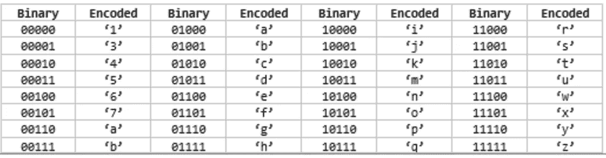

# 纳米确定性帐户地址

> 原文：<https://medium.com/coinmonks/raiblocks-deterministic-keys-8cb869cc6046?source=collection_archive---------0----------------------->

在进入 Nano(当时的 RaiBlocks)之后，我决定开发自己的 iOS 轻型钱包。我开发的第一个功能是从 raiwallet.com 生成的种子中获得相同的 Nano 帐户地址。在编写自己的 Swift 实现时，我参考了 raiwallet.com 的源代码和 T2 的轻量级 Python 钱包。

从种子到纳米地址:

*   从种子生成密钥
*   从秘密密钥导出公开密钥
*   从公钥中导出 Nano 帐户地址

我注意到至少有几次，在公钥和帐户地址之间的区别上有些混淆。为了清楚起见，以下是我的定义:

**种子:**一个随机的 32 字节值。这可以是任何随机数据。通常被视为 64 个字符的十六进制字符串。保密！

**秘钥:**也叫私钥。Keyp 也是这个密钥的秘密，因为它负责签名块。

**公钥:**您的帐户地址所源自的密钥。公钥是可以共享的。

**账户地址:**从公钥导出的地址。Base-32 编码，带有校验和，前面有“xrb_”。

# 图书馆

*   [利钠盐](https://github.com/nebyark/libsodium)(氯化钠)
*   [斯威夫特钠](https://github.com/nebyark/swift-sodium)

# 生成密钥

这个上下文中的密钥只是一个 32 字节十六进制值(您的种子)和一个 4 字节种子索引值的 Blake2b 散列。我花了令人沮丧的几秒钟想知道为什么我的密钥在散列种子和索引后出现了不同——结果是我的索引字节数是 32 而不是 4 lol。

种子索引应该从 0 开始，并且应该在每次用户使用相同的种子创建新的帐户地址时递增。使用无符号 32 位整数，可以生成 2 -1 个唯一的密钥对。

注意:swift-sodium 的 genericHash 类在引擎盖下使用 Blake2b。

# 从秘密衍生出公开

## 修改 Ed25519

Nano 使用带有 Blake2b 内部哈希的 Ed25519 密钥对/签名函数，这与 libna 的内部 SHA512 不同。

我为 lib Nair 的 keypair.c 添加了一个额外的函数，以便能够从一个秘密密钥中导出 public:

在 Swift 中调用它:

# XRB 帐户地址

XRB 账户地址由 3 部分组成:

*   xrb_ '
*   编码公钥
*   编码校验和

<encoded public="" key="">xrb _ '</encoded>

## 编码

整数中的每个 5 位块是 32 个字母编码字母表'*13456789 abcdefghijkmnopqrstuwxyz '*中的一个字符的索引。您可以创建一个编码查找表，其中数字 00000–11111(0–31)映射到字母表中的一个字母:

encoding lookup table that was shared in the Nano discord (slight error with ‘00110’ and ‘00111’, they should be ‘8’ and ‘9’ respectively)

对整数(或位数组)进行编码需要以 5 位为单位进行解析:

## 公开密钥

从公钥字节数组创建一个位数组，并用 4 个额外的位(256 -> 260 位)填充它。因为公钥的前 4 位是零填充的，所以帐户地址的第一个字母只能是“1”或“3”(00000:“1”，00001:“3”)。

## 校验和

获取一个 5 字节摘要大小的公钥 Blake2b 哈希，并对结果哈希执行字节交换。将结果编码。

将所有 3 个连接起来，您将得到一个类似于下面的地址:

*xrb _ 1 SF 5 f 67 NW 56 ts 998 bsrnjhp 4 po 3y 9 ky 57mg 6 c 4534 rqbz 96 sczotn 4 nu fhf 7*

> [在您的收件箱中直接获得最佳软件交易](https://coincodecap.com/?utm_source=coinmonks)

