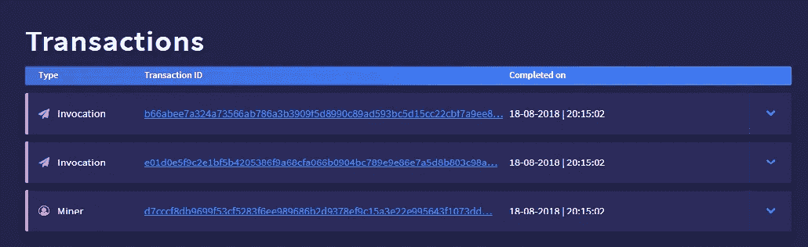

# 运行时的随机数— NEO SmartContract

> 原文：<https://medium.com/coinmonks/random-number-at-runtime-neo-smartcontract-60c4e6cb0bb1?source=collection_archive---------5----------------------->


> 我看过这个帖子:[在 Neo 智能合约中使用随机数](/verisfoundation/using-random-numbers-in-neo-smart-contracts-af7fecd2a23d)

读完之后，我想到了一个问题。如果我们使用上面的代码在同一个块中发送两个事务？

答案是，我们在这个块中的所有交易都有相同的数字。

新问题:**如何在 NEO 网络内部获得每笔交易的随机数？**

我期待的答案在与[潘石屹](https://medium.com/u/78defa96e5f4?source=post_page-----60c4e6cb0bb1--------------------------------)的一次对话中诞生了。

# **智能合约**

## **编译上面的代码以获得 AVM**

> 00c 56 b 5861650700616 c 756652 c 56 b 6 c 766 b 00527 AC 46168295379737574696 f 6e 456 e 67696 e 652 e 476574536372697074436 f 6e
> 7461696 e 655

在某个 privatenet 上部署契约后，我们现在可以调用那个智能契约并查看结果。

## **调用**

我设法将两个事务放在同一个块上，如下所示:



检查这两个事务的结果:

> TX1:e 01d 0 e 5 f 9 C2 E1 BF 5b 4205386 f 9 a 68 CFA 066 b 0904 BC 789 e 9 e 86 e 7 a 5d 8 b 803 c 98 a 结果:8 AC 903 b 8 a 5 e 7869 e 9 e 78 BC 04096 b 06 fa 8 ca 6 f 9865320 B4 f 51 b 2 e 9 C5 f 0 e 1 de 0
> 
> TX2:b 66 abee 7a 324 a 73566 ab 786 a3 b 3909 F5 d 8990 c 89 ad 593 BC 5d 15 cc 22 CBF 7 a9 ee 8 结果:e 89 e 7 ab F2 cc 25 CD 1c 53 b 59 ad 890 c 99d 8 f 509393 b 6 a 78 ab 6635 a 724 a 3 e 7 be 6 ab 6

如你所见，**我们可以**在每笔交易中使用随机数，正因为如此，我们现在可以有很多想法，而不需要很多步骤。

我们实际上可以为每个事务创建一个运行时随机数**,那么我们该如何改进呢？答案就在下面。**再次，[潘彦祖](https://medium.com/u/78defa96e5f4?source=post_page-----60c4e6cb0bb1--------------------------------)和我一起创造了这个例子，所以享受吧！！

# 智能合同—改进版

## 编译上面的代码以获得 AVM

> 55 c56b 51616556016 c 766 b 00527 AC 46 c 766 b 00 c 35 a 617 c 6583006 c 766 b 51
> 527 AC 46 c 766 b 51 c 353617 c 6571006 c 766 b 52527 AC 46 c 766 b 52 c 353617 c 65
> 5f 006 c 766 b 53527

## 调用结果

因为第一部分已经证明了每笔交易可能有不同的数字，所以我在这里只使用一个结果:

```
[
  {
    "jsonrpc": "2.0",
    "id": 5,
    "result": {
      "txid": "0xa92f338a79e6948a652b5d514f6ed3f06d8f61c45596ef00c4c154f974a8b9c0",
      "executions": [
        {
          "trigger": "Application",
          "contract": "0x6225f0a52de0270b861fd3cb1b330fdf7a2721ba",
          "vmstate": "HALT, BREAK",
          "gas_consumed": "0.908",
          "stack": [],
          "notifications": [
            {
              "contract": "0x4c04655314fe10da374b7ee056459e311aae86fc",
              "state": {
                "type": "Array",
                "value": [
                  {
                    "type": "ByteArray",
                    "value": "a9"
                  },
                  {
                    "type": "ByteArray",
                    "value": "21ad0e73178610e1c24b"
                  },
                  {
                    "type": "ByteArray",
                    "value": "b1342d"
                  },
                  {
                    "type": "ByteArray",
                    "value": "9821bd"
                  },
                  {
                    "type": "ByteArray",
                    "value": "9368e892f1"
                  }
                ]
              }
            }
          ]
        }
      ]
    }
  }
]
```

正如你所看到的，这个代码生成的所有数字都是互不相同的。

# 附加说明

有了这个随机数，你也可以像 Jason L Perry 在我开始链接的文章中所做的一样。

如果您想要一个范围内的随机数，您可以执行以下操作:

非常感谢丹尼尔·潘，他在这个问题上给了我很多讨论和建议。

再次感谢[杰森·L·佩里](https://medium.com/u/8c3177ff38c2?source=post_page-----60c4e6cb0bb1--------------------------------)给我提供了一份有趣的阅读材料，这是在 NEO SmartContract 上使用随机数这一新想法的第一步。

对于那些想知道如何处理 NEO SmartContract 的人来说，GitHub 上有一个名为 [HowToNEO](https://github.com/FabioRick/HowToNEO) 的 [mine](https://github.com/FabioRick) 资源库，这只是一个开始，但我会尽快把很多东西放在那里！！

# 修订本

01-将块哈希与事务哈希一起使用。

> [直接在您的收件箱中获得最佳软件交易](https://coincodecap.com/?utm_source=coinmonks)

[](https://coincodecap.com/?utm_source=coinmonks)