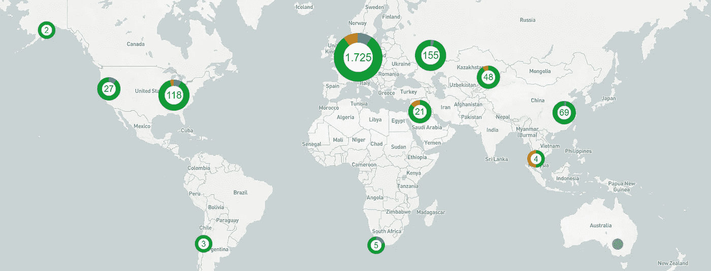
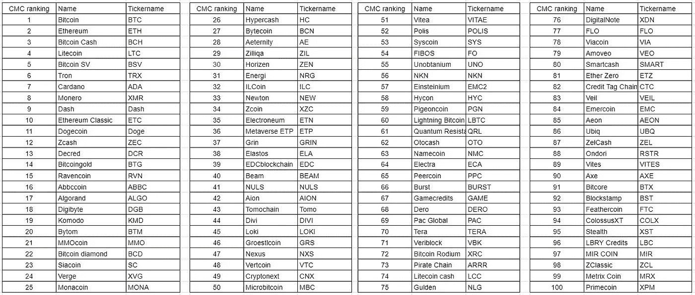
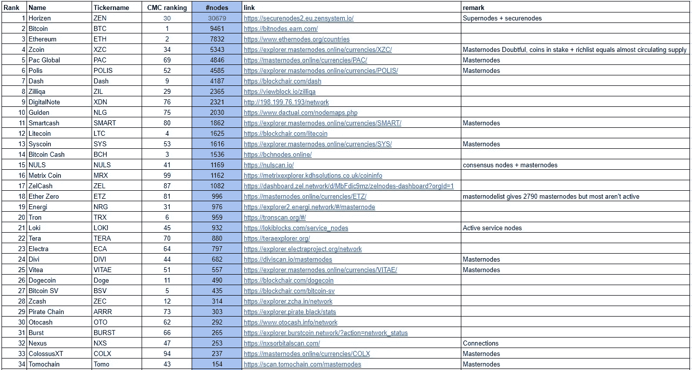
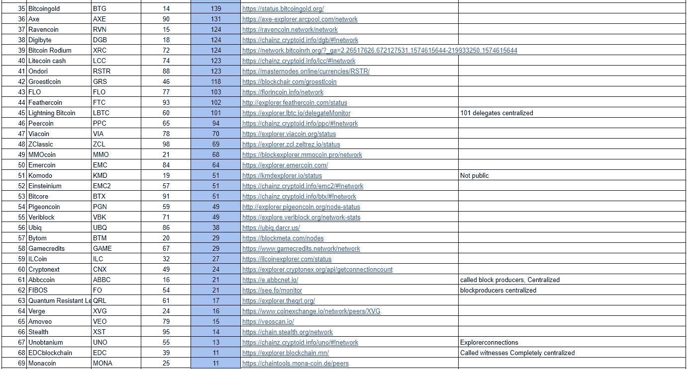
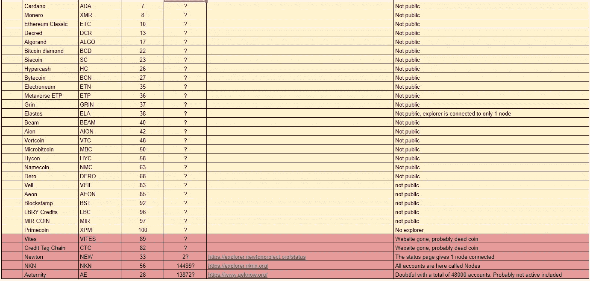

# 按节点数量排列密码

> 原文：<https://medium.com/coinmonks/ranking-cryptos-by-number-of-nodes-57a12e4ae51a?source=collection_archive---------0----------------------->

[荷兰语版此处](/@aat.de.kwaasteniet/ranking-cryptos-door-aantallen-nodes-bf5d520bfdf4)

# 介绍

正如在之前的报道中已经解释的那样，基于市值的 CoinMarketCap 排名非常值得怀疑。[见故事《Marketcap 的胡说八道](/altcoin-magazine/the-nonsense-of-marketcap-8a2bacb70757?source=your_stories_page---------------------------)。
有人尝试用其他方式对加密硬币进行分级。例如，故事[中的一系列关于加密硬币的研究项目，其中加密成为了新的支付系统](/coinmonks/which-crypto-becomes-the-new-payment-system-69f95b2d2ec3?source=your_stories_page---------------------------)以及故事[中的好、坏、丑，对加密硬币](/coinmonks/the-good-the-bad-and-the-ugly-classifying-the-crypto-coins-9d192154579a?source=your_stories_page---------------------------)进行了分类。但是有些项目需要价值判断，不幸的是，每个人对此都有不同的想法。另一个尝试是 story [Crypto 按用户数量排名](/coinmonks/crypto-ranked-by-numbers-of-users-c736d1543d8c?source=your_stories_page---------------------------)，其中一个可测量的数据项用于获得不同的、更好的加密硬币排名。此外，在这个故事中，输入了一个可测量的数据项，根据某个硬币在该领域中运行的节点数进行排名。衡量硬币如何工作并在实践中使用，而不仅仅被视为交易对象，并在交易所将货币从一个钱包转移到另一个钱包。当然，这个排名并不是唯一让你开心的排名，因此盲目地依赖这个排名就像只看 MarketCap 排名一样短视。但无论如何，这个排名是一个更公平的数字，可以赋予不同的硬币。最重要的是，最好的建议仍然是“自己做研究”。

# 测量方法

已经就要调查的硬币达成了一些协议。一方面限制工作量，另一方面分离不能以这种方式测量的硬币，因为它们本身没有节点。特别是 ERC20 令牌不能参与，依赖于另一个平台的令牌也是不可能的。
此外，所有非“可开采”的硬币都已从列表中删除。因为这些硬币在 CoinMarketCap 列表中的排名是错误的。这是更公平的比较硬币或多或少相同的开始，并通过采矿获得和扩大其流通补充中本聪的意图。

因此，在 CMC 中，排名列表是基于“硬币”和“可开采”而生成的。该列表中的前 100 枚硬币被纳入研究范围。

检查了过去 24 小时内连接到货币网络的节点/对等体的数量。我们指的是活跃在网络中并参与检查/批准交易的节点/对等体。所以实际上只监控网络的手机钱包不算在内。相当多的硬币与所谓的主节点、超级节点、提供者、共识节点或他们给它们起的任何名字一起工作。此外，使用这些硬币，可以获得过去 24 小时内连接到网络的…节点数。
对于一些硬币，只有探索者的状态页才表示探索者已经或曾经有过连接的节点数。则获取该数目，尽管已知在这种情况下并不是网络中的所有节点都被计数。但这是这些硬币唯一已知的数字。
在大约三分之一的情况下，节点/对等点的数量在网站或硬币的探索者上找不到。这些是用黄色标记的。

一些硬币被取消资格，因为提到的数字不成比例，所以有一个错误的结果。例如，因为已经在网络上报告过一次的所有(主)节点都被计数。
大约两枚硬币在 CMC 列表中已经所剩无几。可能是死硬币。
最后两类用红色标出。

对于每一枚硬币，链接都指向提到节点数的页面。不幸的是，在上面的列表中，它们是不可点击的。

**免责声明:
在 2019 年 11 月 24 日的某一天搜索了所有值。这是一个快照，可以随时更改。所以不要担心一枚硬币在列表中的位置是 35 还是 38。然而，大致的轮廓是可见的，并且对于进行评估是有用的。我们已经尽最大努力处理了这个列表，但是作者不能保证它的正确性。**

该作者的其他文章有:

[比特币需要更换](/coinmonks/bitcoin-needs-to-change-96c793d3523b?source=your_stories_page---------------------------)
[恢复短语，防故障还是不防故障？
矿工、工读生和孤儿，三位一体。](/altcoin-magazine/the-recovery-phrase-fail-safe-or-not-668146453cba?source=your_stories_page---------------------------) [哪个 crypto 成为未来的支付系统？](/coinmonks/which-crypto-becomes-the-new-payment-system-69f95b2d2ec3)
[好的、坏的、丑的，对加密硬币进行分类。](/coinmonks/the-good-the-bad-and-the-ugly-classifying-the-crypto-coins-9d192154579a)
[白帽子道德投资者](/coinmonks/the-white-hat-ethical-investor-8a3ba9b3028e)
[的废话……TPS(每秒交易数)](/@aat.de.kwaasteniet/the-nonsense-of-tps-transactions-per-second-2d7156df5e53)
[按用户数量排名的 Crypto](/coinmonks/crypto-ranked-by-numbers-of-users-c736d1543d8c?source=your_stories_page---------------------------) [事实查看居尔登网站](/@aat.de.kwaasteniet/fact-check-gulden-website-ce66a947dcf9?source=your_stories_page---------------------------)
[比特币汇率能达到 10 万美元吗？](/altcoin-magazine/can-the-bitcoin-exchange-rate-reach-100-000-b291aed38ae7?source=your_stories_page---------------------------)
[居尔登，区块链如愿](/coinmonks/gulden-blockchain-as-intended-582bab190cf)
[居尔登见证](/@aat.de.kwaasteniet/gulden-witnessing-163cb0eae289?source=your_stories_page---------------------------)
[居尔登手机-钱包链接桌面-钱包](/@aat.de.kwaasteniet/gulden-mobile-wallet-linking-to-desktop-wallet-eff117eb208f?source=your_stories_page---------------------------)
[挖矿居尔登](/coinmonks/mining-gulden-d4fe8c690939?source=your_stories_page---------------------------)

感谢捐赠。
居尔登:gjhgkae 88n 21d 2 tnucvaxjrcxcgbr 7 mald
比特币:3q R1 yvpr 1 VCM 3 dfyzhfpjslf 4 vggvzhsk

> [直接在您的收件箱中获得最佳软件交易](https://coincodecap.com/?utm_source=coinmonks)

