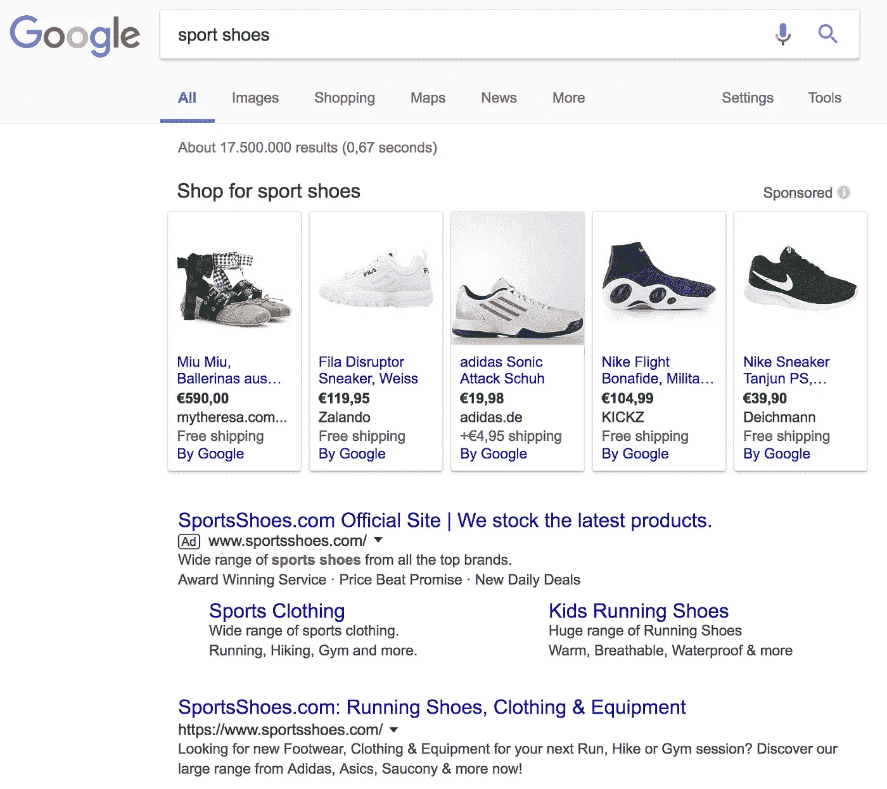

# 对令牌管理的注册表进行排名

> 原文：<https://medium.com/coinmonks/ranking-token-curated-registries-e9a92dc85b31?source=collection_archive---------3----------------------->

上个月我得到了以太坊营地物联网黑客马拉松的免费门票。我喜欢黑客马拉松，但我从未做过任何与物联网相关的事情。幸运的是，有一个不需要任何硬件的密码经济机制设计挑战。我为我们正在 [*Way*](https://www.way.network/) *开发的符号化信息信号的想法想出了一个与物联网相关的用例，提出了这个想法，并找到了一群优秀的人一起工作了 4 天。我们最终获得了三等奖，几天后还会见了主要赞助商* [*Weeve*](https://weeve.network/) *进一步磨砺我们的机制。下面的文章概述了整个过程中出现的主要思想。它是用简单的语言写的，不需要任何技术背景，但需要一定程度的注意力和对主题的兴趣才能通过；)*

Thanks [Ethereum Camp](https://www.ethereumcamp.io/) for the organization + photos and [weeve](https://weeve.network/) for sponsorship!

在这篇文章中，我首先解释了为什么排名列表在世界信息领域变得越来越重要。然后，我讨论了激励个人在没有可信中心的情况下策划高质量排名列表的密码经济学机制。我得出的结论是，分散排名协议将是任何非排名注册中心的主要威胁，并讨论了进一步发展的方向。如果你熟悉去中心化、监管市场和代币监管注册的好处，你可能想直接跳到第二部分。

# 为什么好的列表很重要

**有序列表引导我们的注意力，从而引导我们的行动**

信息时代最大的问题是信息过载。可用信息的数量以越来越快的速度增长，而我们的注意力却保持不变，吸收更多信息的潜力有限。因此，今天最有价值和最强大的公司是那些建立信息过滤器的公司:谷歌和脸书扫描互联网的巨大丛林，并为我们提供满足我们每一个需求的相关信息的简短列表。最好的结果总是显示在我们的指针指向的顶端，所以我们不会浪费时间和精力点击次优的答案。一旦这些名单被认为是可靠和快速的信息来源，它们就开始决定我们的行为。创造它们的公司可以赚很多钱，只要有人付钱给他们，他们就可以把不一定有价值的条目添加到列表的顶部。这就是网络广告的本质。

人类经验的持续数字化将进一步增加对信息过滤的需求。未来，我们将沉浸在不仅来自电脑屏幕和智能手机，还来自日常物质世界的信息流中。我们将被数十亿台机器包围，它们将试图与我们交流。这些机器中的一些将伴随我们一生，我们将非常了解它们。但是其他人很少会遇到我们，所以我们需要有用的建议来快速决定我们可以委托哪台机器来执行给定的任务。谁创造了机器服务和数据提供商的最佳排名，谁就拥有在物联网(也就是现实世界)中引导我们的注意力和选择的巨大力量。

**分散列表制作**

现代信息技术使得一群陌生人能够远距离地相互交流和合作。但多亏了区块链加密货币，他们现在也可以从这种大规模的合作中获得经济回报。不再是一个封闭的公司协调并支付几个人来解决一个问题，我们现在可以让全球的爱好者大军使用区块链协议围绕一个共同的目标进行协调——如果他们成功了，每个人都可以得到他们的一份。比特币只是这种全球草根协作的第一个例子。这种新的工作组织有两个重要的好处:

首先，我们可以推断，它将导致更公平的收入分配，特别是在自然垄断形成的背景下，基于网络的技术。当少数大公司以高转换成本获得大型网络的所有财务利益时，我们认为这是不公正和不民主的。显而易见，这些公司有时利用它们的垄断力量，以牺牲用户为代价来中饱私囊。此外，随着好软件的开发成本越来越低，我们开始意识到这些垄断并不主要建立在专有技术的质量上。软件算法之所以有价值，只是因为我们这些用户向它们注入了大量的数据。这些数据本质上是对我们的行为、我们的选择、我们的生活的持续记录。然而，我们并不真正拥有这些录音。它们被我们的服务提供商锁在地窖里，我们无法将它们带到另一家服务提供商那里。基于区块链的基础设施将最有价值的网络资产的所有权还给人们，并承诺以公平的方式补偿所有参与者。

第二，可以认为网络的分散化将导致网络产生更好的服务。在许多情况下，将工作分配给许多人，并激励每个人都做出贡献，可以完成更多、更好、更多样化的工作。数据管理和列表制作就是这样的例子。只要有效地协调贡献者，如果更多的人积极地贡献他们的技能和时间来寻找、创造和管理信息，就可以找到更好的信息，并创建更好的列表。在 web 2.0 中，是用户通过喜欢、链接和评论来表现信息和显示其相关性。如果一个人可以从这些活动中获得报酬，人们可能会在这些活动中做得更好。

我们现在已经确定了清单的重要性和权力下放的好处。现在是时候将这两种想法结合起来，转向本文的主要问题:在没有中央权威机构“帮助”的情况下，如何协调和激励人们组织高质量的名单？

# 对令牌管理的注册表进行排名

最近，区块链社区的一些主要声音认识到了列表的重要性，这导致了第一个关于分散列表制作的区块链协议的创建。consensys 的 Mike Goldin 和 Simon de la Rouviere 一直处于这一发展的前沿。在 adchain 上工作时，Mike 实现了令牌管理的注册中心，该注册中心现在被该领域的各种项目广泛采用。在这一部分中，我们简要介绍了令牌管理的注册中心的基本思想，然后继续讨论它的一个主要弱点:缺乏排名。

**TCR 1.0**

在令牌管理的注册中心，一个罕见的、可交易的令牌被编程为用于非常特定的目的:它赋予其持有者投票权，以决定在与该特定令牌相关联的列表中包括哪些条目以及排除哪些条目。这些条目通常是服务提供商。当代币持有者集体在只将好的服务投票到列表中而将坏的服务排除在外方面做得很好时，该列表成为消费者确定给定服务是高质量还是低质量的有用信号。这样的话，服务就应该出现在列表上，因为出现在列表上会让你的生意更好。这大概会增加代币的价格，因为决定谁上名单的权力现在价值$$，允许早期策展人从他们的长期策展工作中获利。他们将受到激励去做好监管工作，直到这种监管的边际成本超过了从改进名单中获得的经济利益。这个系统可以用于任何种类的独家名单，只要它作为一个特定质量信号的消费者的一个很好的焦点，只要有令牌持有者愿意并且能够做管理它的工作。

然而，标准的 TCR 机制有一个很大的问题:它只管理谁能上列表和谁不能上列表的二元选择。该协议没有规定条目如何排序。正如我们在上面所看到的，对于许多面向消费者的应用程序来说，仅仅知道列表中的所有条目都同样好是不够的。当给定的需求有多种选择时，消费者会希望最好的放在最上面。如果 TCR 中有多个非常相似的条目没有被订购，甚至会给消费者带来负担，因为他们将独自做出决定。因此，在许多情况下，令牌持有者将受到激励，每种服务只包括一种，可能是该服务所有竞争对手中最好的——在某个方面，令牌持有者隐含地同意了这一点。有更多的选择会使清单变得不那么有用，因为它会让普通消费者感到困惑。但有更具体需求的消费者，或者对“最好”的定义与主流不同的消费者，会希望看到更多的选择。她将依赖于针对这种特定类型的服务的独立 TCR，然后单独考虑该 TCR 的每个条目。在一个注意力是主要稀缺资源的时代，这将带来巨大的搜索成本。我们在这方面有明显的改进余地。

因此，这篇博文的剩余部分致力于考虑通过激励条目的合理排序来使 TCR 更有用的机制。这些大多是现有的想法，目前正在讨论和试验，没有任何最终裁决已经作出。我在这里用一个一致的框架列出并讨论它们，是为了激发一场关于该走哪条路的更有条理的辩论。让我们一起思考，在下面的评论中讨论。

Cranking it out, winner’s smile

**介绍订单**

排序 TCR 条目的最简单方法是通过一些客观可验证的标准。这确实是这个领域的许多项目在第一阶段实现中计划做的事情。例如，TCR 数据市场 weeve 正在考虑将针对条目提出的挑战数量作为排序标准。其他人则提议每件作品都要有保证金，这表明了被收录者对自己作为名录成员的地位有多自信(因为如果策展人决定把她踢出去，她会失去什么)。但是，客观标准在评估这一水平的差别质量方面不太可能有多大价值。只有当质量很难在客观基础上评估时，才需要 TCR，因此我们接受主观投票的总和作为质量的最佳信号。

我们可以做得更好，并将用于 TCR 的入/出决策的相同逻辑应用于 TCR 的排名:当列表的排序对消费者有用时，列表是最有价值的。因此，为了代币持有者的长期利益，创造一个好的排名，使他们成为决定这个排名的最佳代理。有三种不同的方式来协调这种集体决策:第一，通过二元成对投票，第二，通过在 TCR 的申请流程中包括排名位置，第三，通过使用标准监管市场的逻辑。

在第一个设计中，任何认为自己应该在 TCR 中获得更好排名的被调查者都可以下注，申请上升一个级别，超越直接在她之上的被调查者。如果受到质疑，这将触发一次投票，允许令牌持有者以简单的二进制方式决定他们认为两个条目中哪个更好。这种机制有两个问题:在名单上向上移动一步可能不值得太多，因此只有在明确的情况下，名单上的人才会冒最小股份的风险，从而促使令牌持有者策划这种特定的二进制排名。在不太明确的情况下，没人会费心去改变排名。此外，这种设计对新进入者来说相当困难:大概每个进入者都会从最底层开始，但对于一个显然是最好的进入者来说，一路走到最高层将需要很长的时间，并导致过多的交易成本。

因此，第二个备选设计让 TCR 的申请人在申请中包括他们想要的位置。令牌持有者然后可以决定他们是否希望将候选人包括在期望的位置或直接拒绝申请。这在我看来也相当麻烦，因为一个给定的申请人在被接受之前可能不得不放弃几笔押金。她甚至可能会在发现哪些排名令牌持有者可以接受之前放弃，也不知道她是否有任何机会在名单上(除非她申请了最后一级)。排名很重要，但它不应扭曲 TCR 设计精美的进出机制。

**回到基础知识**

因此，我继续讨论一种新的机制，这种机制受到了 Simon de la Rouviere、userfeeds 的 Maciej Olpinski 以及 steemit 开创的 101 策展市场设计的启发。在这个方案中，TCR 令牌持有者除了选择允许谁进入之外，还可以使用他们的余额对现有条目进行加权投票(背书)。在最简单的设计中，当你拥有 100 个代币并为一个条目投票时，该条目将获得 100 的支持。代币持有者可以背书多个条目，但是对于任何给定的条目，她只能有一个背书。然后根据收到的总背书对条目进行排序。当我们引入可变权重时，即用户可以选择用多少令牌来为给定条目投票，每个用户都可以创建一个个人排名来反映她的偏好，然后聚合结果甚至可以很好地捕捉相对差异(尽管这需要更全面的分析)。

During the hackathon, we used the above mechanism to create an ordered list of temperature data providers. If there are many competing temperature sensors, which one should we trust to have the correct temperature? ToT, trust of things.

对这种机制的一个反对意见是，它会让贿赂行为在短期内不受惩罚，因为如果贿赂方不值得它用贿赂为自己购买的排名，那么除了由于列表的用处减少而导致的令牌价值的轻微下降之外，对自私的令牌持有者来说没有什么风险。为了应对这一点，如果一件作品的趋势得分与早期策展人的投票方向一致，可以为早期策展人提供奖励。Slava Balasanov 的相关策展市场设计已经实现了这种形式。另一种选择是通过引入仅可用于给定 TCR 内加权背书投票的单独令牌，将 TCR 排名与 TCR 分离。这将增加对接受贿赂的抑制，因为随之而来的排名质量的恶化将损害仅对于排名有价值的令牌，而不是损害整体 TCR 令牌。

总的来说，我不认为在一个引入注意力市场的系统中，防止贿赂应该是一个主要的关注点。在我看来，在这种情况下谈论贿赂是没有意义的。谷歌已经创建了世界上排名最好的列表，他们从一些显示在顶部的条目中收取金钱，但这并不完全是贿赂。一旦代币持有者获得了一个有吸引力的排名，那么接受被列名者或候选人的钱来换取支持票应该被认为是一种合法的(从根本上说是不可察觉的)方式来将他们的策展工作货币化。同时，给定的 TCR 只有在令牌持有者不接受太多贿赂的情况下才会起作用，因为这会使列表变得毫无价值，从而使令牌变得一文不值。参与过度受贿的 TCR 排名社区将被更诚实的社区击败。谷歌如果接受太多贿赂，在整个屏幕上贴满广告，那就太傻了。当然，任何代币持有者的合作社能否集体达到同样的智慧水平，还有待观察。

我已经讨论了有序列表的分散管理的不同机制。现在让我们最后看一下这些清单将来可能应用于何处以及如何应用。

# 观点

像所有的秘密经济机制一样，TCR 在竞争中茁壮成长。如果从中期来看，某个 TCR 没有兑现其承诺，为消费者需求筛选出一个有用的列表，那么可以预期另一个群体会启动一个新的 TCR 或派生出现有的 TCR，目的完全相同，但治理和参数都有所改进。在这篇文章中，我认为条目的排序对消费者来说非常重要，因此，一个新的 TCR，在不扭曲或过度复杂化基本机制的情况下提供有用的排名，将使现有的 TCR 过时。因此，开始试验这里讨论的扩展符合每个 TCR 社区的强烈兴趣。

不仅搜索结果和机器列表可以被视为有序列表。社交媒体、新闻源、约会应用、市场、地图、增强现实层——列表无处不在。每当用户还不知道她到底在找什么或采取什么行动时，即在发现领域，这些列表是非常强大的。如果它们被很好地管理，我们相信它们能帮助我们迅速找到满足我们需求的最满意的答案，只要有空间，它们就会引导人类的行为和注意力。在一个我们选择丰富的世界里，没有什么比这更有价值了。

今天，大公司赚了所有能用这种力量赚到的钱。在精心设计的 TCR 的帮助下，像你我这样的人可以集中我们的资源，将它们投入到工作中，如果我们设法创建人们信任的列表，就可以获得经济回报。让我们一起来解决这个问题。评论或邮件至 achill@way.network

感谢您的关注。

*致谢:上述许多想法是从与以下无序列表中的人的聊天、电子邮件、博客帖子、视频和对话中获得的灵感或灵感:Meher Roy、Maciej Olpinski、Simon de la Rouviere、Mike Goldin、Luke Duncan、Felipe Gaucho、Trent McConaghy、Sebastian Gajek、Sidd Bhasin、Chris Haug、Claudio Weck、David Terry、AB Rao、Max Roessner、Eckart Burgwedel。*

