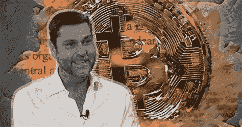
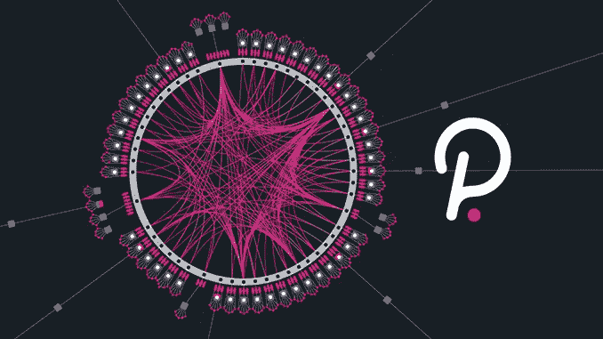
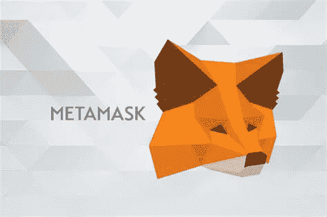

# 拉乌尔·帕尔看好 2022 年的 Q1:AMA 概览|加密市场更新 12.21

> 原文：<https://medium.com/coinmonks/raoul-pal-is-bullish-for-q1-2022-ama-overview-crypto-market-update-12-20-f3823a1077e4?source=collection_archive---------8----------------------->

## Raoul Pal 访谈|加密市场更新|新闻|新手每日一课:Metamask 速成班；来袭空投

Photo by [愚木混株 cdd20](https://unsplash.com/@cdd20?utm_source=medium&utm_medium=referral) on [Unsplash](https://unsplash.com?utm_source=medium&utm_medium=referral)

# 概观

*   拉乌尔·帕尔·AMA
*   市场更新
*   主要秘密新闻
*   新手的一天的教训:Metamask 速成班，获得你的免费空投

# 拉乌尔·帕尔·AMA 概述

12 月 16 日，拉乌尔·帕尔做了一次 AMA，宣传 Real Vision 的新 Crypto Pro 平台。在长达一小时的视频中，他谈到了几个话题，包括加密法规、宏观经济趋势和该行业的风险。下面是一个快速概述。

**美联储和利率**

Pal 预测通货膨胀将在 2022 年抑制经济增长，当经济数据与他们的预测不一致时，中央银行**将放弃加息**。他指出，通常用于预测 GDP 和利率变化的债券收益率，仍然不相信央行即将到来的利率预测。较低的速率通常被认为对加密有利。几天前，我在这篇报道中提到了 FOMC 的最新声明。

**法规**

帕尔似乎对加里·詹斯勒(Gary Gensler)等监管者表现出的强硬立场漠不关心，并解释说这是一种谈判策略。他预计，当程序敲定后，秘密实体和监管机构将在中间的某个地方会面。帕尔提到，stablecoins 面临的最大风险是一个不可预见的风险:USDC 的发行者 Circle 的非银行化。

**机构投资**

帕尔回答了一个关于直觉投资的问题，这个问题引出了他对 2022 年的预测。机构级投资者并不普遍担心加密扰乱他们的行业，而是将其视为一个机会载体。作为交易的中间人，银行最有可能为了自我保护而抵制领养。

资产配置者正在结算今年的账目，并在假期前重新平衡头寸。这些投资者可能会从 2022 年初开始重新打开资产负债表。此外，许多机构已经制定了加密指令，这些指令也将在 Q1 生效。Pal 预测，由于这些原因，今年年初将非常乐观。

> " Crypto 是有史以来最大的 Marco 上篮."-拉乌尔·帕尔。

Pal 是 crypto 的大力支持者，他的经验和观点在金融和加密领域都很受尊敬，包括我自己。他半信半疑地给出了预测，并建议为各种情况做好准备，但他对主要长期采用的信念是坚定的。

帕尔并不是唯一预测明年 Q1 可能强势的秘密人物。其他人包括 TA 专家 Ben Cowen 和 Messari 首席执行官 Ryan Selkis 通过他的 2022 年论文报告。我说“可能”是因为真正的专家不会对市场预测采取强硬立场。相反，他们遵循数据，并为他们是正确的事件做准备。我们也应该这样做。

Photo by [Adam Nowakowski](https://unsplash.com/@adamaszczos?utm_source=medium&utm_medium=referral) on [Unsplash](https://unsplash.com?utm_source=medium&utm_medium=referral)

# **加密市场更新**

**比特币(BTC)** 突破了 12 月 7 日开始的下降趋势线，显示出有希望的迹象。但是，先不要变得太乐观。在可能的反弹之前，比特币可能会测试几次支撑。 **BTC 上涨 3.87%，至 48.6 万英镑**。

**比特币的统治地位(BTC。D)** 上涨 **+.50%至 40.66%** 。BTC。d 拒绝跌破 40%,因为另一个上升趋势可能正在酝酿之中，这表明短期内 BTC 对 alts 的强烈偏好。

**以太坊统治地位(ETH。D)** 为**下跌-1.50%至 21.05%。**20%的水平是一个值得关注的监测水平。以太坊花了 200 天才打破这个久经考验的水平。

**Terra (LUNA)** 涨停强势+ **6.34%** 。在这些水平上，不要犹豫在 LUNA 中获取一些利润。我仍然看好 LUNA 的长期潜力，但短期内可能会有一些调整。LUNA 在过去的七天里上涨了 65%。

今天，随着一些重要的风险投资公司成功获得融资，T21 股价上涨了 31%。渲染是我玩元宇宙趋势的首选方法——在下面的新闻部分有更多关于融资的信息。

著名演员(7d)

*   **渴望+77%**
*   **法术+67%**
*   **HLM +40%**
*   **MATIC +26%**
*   **AVAX +49%**
*   **HBAR +36%**
*   **AR +47%**
*   **一个+41%**

看到市场推高优质项目，这是一个健康的迹象。

# 主要加密新闻 12.21

*   波尔卡多副链是活的！
*   [北海巨妖加密交易所已经收购了一家托管的风险投资初创公司 Staked，为客户开发创新的风险投资产品。](https://www.theblockcrypto.com/linked/128294/crypto-exchange-kraken-acquires-staking-startup-staked?utm_source=rss&utm_medium=rss)
*   [**渲染网络(RNDR)** ，一个分散渲染引擎，已经从主要支持者 Multicoin，Alameda 和 Solana Foundation 筹集了 3000 万美元。Render 是我最喜欢的加密基础设施之一。](https://www.coindesk.com/business/2021/12/21/decentralized-rendering-engine-raises-30m-in-rndr-token-sale-as-metaverse-graphics-go-big/)
*   [**【多链(ANY)】**，原名 Anyswap，获得 6000 万美元资金，投资方包括主要风投公司三箭、币安实验室、红杉资本。](https://www.theblockcrypto.com/linked/128199/binance-labs-leads-60-million-investment-in-multichain?utm_source=rss&utm_medium=rss)
*   [Block 首席执行官杰克·多尔西批评 Web3 变得过于集中，并表示比特币最终将取代美元。](https://www.coindesk.com/business/2021/12/21/bitcoin-will-replace-the-dollar-jack-dorsey/)

# 值得注意的事件

**Avalanche (AVAX)** 将于今日起在北海巨妖交易所上市。

TotemFi (TOTM) 将于今日发布其锆石 Mainnet。

[硬币局发布了一个基于瑞安·塞尔基斯的《梅萨里 2022 论文》的视频](https://www.youtube.com/watch?v=hXp32pWkwqI)。我过去的报告提到阅读和报道，但硬币局捷足先登。这是他们的观点。

# 新手的每日一课。

**Metamask 速成班。获得免费空投！**

*采取一切行动，风险自担。从小事做起，DYOR，把你的钥匙放在安全的地方。*

出于两个原因，我今天将在我的新手部分写关于 Metamask 的文章。首先，有传言说 Metamask 将很快进行空投。空投是向用户分发令牌。作为早期用户，你可以获得免费代币。空投在 crypto 中很常见，有一些已经给用户带来了实质性的回报。例如，Uniswap 向早期用户空投了 400 枚 UNI 代币，相当于今天的 6000 美元。11 月，以太坊名称服务。eth 域 DAO，空投用户高达 1000 ENS 代币，折合高达 80k 美元。我知道这听起来很疯狂，但这是加密的。这是你第一次空投的机会。

Metamask 是市场上使用最广泛的加密钱包之一，在全球拥有 2100 万用户，可用于各种网络，包括以太坊、币安、雪崩、Fantom、Harmony 等。此外，它很容易使用，是我早期加密时测试协议的首选方法。哦，它完全免费下载。

我建议你在下载 Metamask 之前先看看这个视频。

*   [币局的 Metamask 分步指南](https://www.youtube.com/watch?v=MfkqgXNPiHg&t=25s)

然后，您可以在此下载元掩码:

*   [https://metamask.io/](https://metamask.io/)

使用 METAMASK 进行一些交易，以获得空投资格。我推荐使用和谐一网(one)，币安智能链(BNB)，或多边形(MATIC)。这些网络易于使用，交易成本很低。

在 SUSHISWAP 上做几笔小额交易(少于 5 美元)。下面是一个教程:

*   [https://www.youtube.com/watch?v=gSnhi68uMcc](https://www.youtube.com/watch?v=gSnhi68uMcc)

第一条规则:把你的钥匙放在一个安全的地方！

现在退后，等待空投。我们会祈祷好运的，这是一个相当大的数目，不能保证！

***如果你喜欢这篇时事通讯，并且认为它值 20 satoshis(0.01 美分)，请点击下面的按钮。(最多 50 次！)***

感谢您今天的阅读。我希望你喜欢这些内容。我总是乐于接受建议，所以请随时给我发消息。

# 加比

*关注我上* [*推特*](https://twitter.com/TraderGabi) *和* [*中*](/@TraderGabi) *或订阅本刊快讯上* [*子栈*](https://tradergabi.substack.com/)

从这份时事通讯中获益:我建议每天阅读它，以跟上加密市场的步伐。它将把读者放在消息灵通的 2%的市场参与者中。读者将开始看到一些并不明显的机会，并会打开更多的机会。时事通讯包括许多小时的图表、链上指标、新闻和发展叙述的日常研究，浓缩为 5 分钟的更新。我对加密社区的贡献给了我太多。

> 加入 Coinmonks [电报频道](https://t.me/coincodecap)和 [Youtube 频道](https://www.youtube.com/c/coinmonks/videos)了解加密交易和投资

## 另外，阅读

*   [有哪些交易信号？](https://blog.coincodecap.com/trading-signal) | [Bitstamp vs 比特币基地](https://blog.coincodecap.com/bitstamp-coinbase) | [买索拉纳](https://blog.coincodecap.com/buy-solana)
*   [ProfitFarmers 回顾](https://blog.coincodecap.com/profitfarmers-review) | [如何使用 Cornix Trading Bot](https://blog.coincodecap.com/cornix-trading-bot)
*   [MXC 交易所评论](/coinmonks/mxc-exchange-review-3af0ec1cba8c) | [Pionex vs 币安](https://blog.coincodecap.com/pionex-vs-binance) | [Pionex 套利机器人](https://blog.coincodecap.com/pionex-arbitrage-bot)
*   [我的密码交易经验](/coinmonks/my-experience-with-crypto-copy-trading-d6feb2ce3ac5) | [比特币基地评论](/coinmonks/coinbase-review-6ef4e0f56064)
*   [CoinFLEX 评论](https://blog.coincodecap.com/coinflex-review) | [AEX 交易所评论](https://blog.coincodecap.com/aex-exchange-review) | [UPbit 评论](https://blog.coincodecap.com/upbit-review)
*   [AscendEx 保证金交易](https://blog.coincodecap.com/ascendex-margin-trading) | [Bitfinex 赌注](https://blog.coincodecap.com/bitfinex-staking) | [bitFlyer 点评](https://blog.coincodecap.com/bitflyer-review)
*   [麻雀交换评论](https://blog.coincodecap.com/sparrow-exchange-review) | [纳什交换评论](https://blog.coincodecap.com/nash-exchange-review)
*   [支持卡审核](https://blog.coincodecap.com/uphold-card-review) | [信任钱包 vs 元掩码](https://blog.coincodecap.com/trust-wallet-vs-metamask)
*   [Exness 评测](https://blog.coincodecap.com/exness-review)|[moon xbt Vs bit get Vs Bingbon](https://blog.coincodecap.com/bingbon-vs-bitget-vs-moonxbt)
*   [MoonXBT vs Bybit vs 币安](https://blog.coincodecap.com/bybit-binance-moonxbt) | [Arbitrum:第二层解决方案](https://blog.coincodecap.com/arbitrum)
*   [买 PancakeSwap(蛋糕)](https://blog.coincodecap.com/buy-pancakeswap)|[matrix export Review](https://blog.coincodecap.com/matrixport-review)