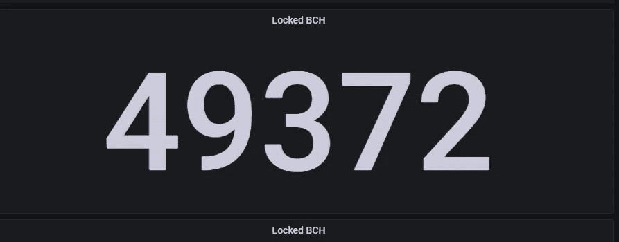
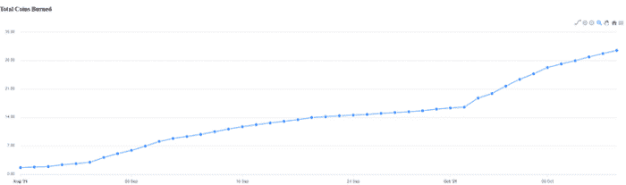
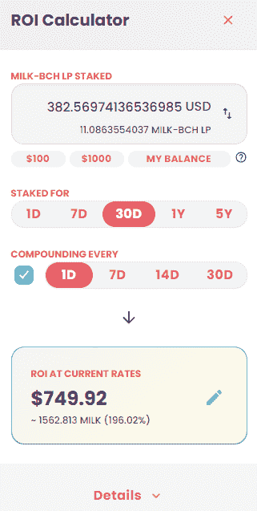

# SmartBCH 网络的快速增长— DeFi，NFTs 蓬勃发展

> 原文：<https://medium.com/coinmonks/rapid-growth-of-the-smartbch-network-defi-nfts-booming-10b75cbe93ed?source=collection_archive---------3----------------------->

随着 smart BCH side chain mainnet 的发布，比特币现金成为一个任何人都不应错过的投资机会。

最近发展很快，可能有些人没有考虑参与。然而，这是一个有益的努力，我们有责任告知其他人这个机会。

# 快速增长

[Source](https://smartbch.fountainhead.cash/grafana/d/GUnTOBGnz/smartbch?orgId=1&refresh=5s)

SmartBCH 的几个月前刚刚发布。值得注意的是，主流加密媒体根本没有报道这一事件。没有一个加密媒体是可信的，但当有创新时，他们应该促进而不是忽视。

因此，BTC 之外的每个人都有正当的理由反对 BTC 极端主义者和一小撮控制者推动的审查制度。只能证明这种逻辑的追随者的狭隘。

不过，继续吧。SmartBCH 最近经历了深刻的发展。

我从 2019 年开始关注以太坊 DeFi。

我觉得 DeFi 这个词第一次出现是在 2018 年，虽然是 2019 年末才开始“热”起来。到 2020 年初，Vitalik 继续发表各种推文和演讲，称赞去中心化的金融技术，并宣传其优点。

以太坊之前也有 dex(以太三角洲，福克三角洲，等等)，但这些从未提供金融服务，如贷款和收益农业。

我记得 DeFi 一开始的关注度有多低，它是如何开始的，它是如何吸引了数十亿美元的资金。这是通过发展，而不仅仅是通过在加密媒体的营销。

目前，三个 dex 正在 SmartBCH 中运行，提供类似以太坊和 BSC 的 DeFi 机会。

高收益是有的，利息也在慢慢上升。

与以太坊 DeFi 一样，很早进入革命性的东西只是一个微小的机会窗口，仅持续 4-6 个月。当然，以太坊和 BSC DeFi 总能提供比银行系统更好的收益。尽管如此，最大的利润是在不冒太大风险的足够早的时候获得的。

SmartBCH 收取小额费用(每笔交易约 3 美分)。进行交易或与合约互动不收取 100 美元的费用。

> 订阅 [**Coinmonks Youtube 频道**](https://www.youtube.com/c/coinmonks/videos) 获取每日加密新闻。

## **BCH 每天通过 SmartBCH 烧钱**

([source](https://bitbox.ee/alexandria/index.html))

以太坊在最近的升级中增加了一个燃烧过程(“伦敦”)，这个事件对价格产生了极大的影响。

此外，这张图表解释了人们对 SmartBCH 日益增长的兴趣。我预计随着新的发展和对这个网络的兴趣，BCH 的燃烧会迅速增加。

显然，SmartBCH 已经有了一些早期机会:

[使用 SmartBCH DeFi 的产量农业](https://read.cash/@Pantera/yield-farming-with-smartbch-defi-2a58beda)

我在 DeFi 方面不太有经验，还在学习过程中，但我总是试图把握好投资时机。进行研究和尽职调查与谨慎选择投资时机同样重要。

MuesliSwap DEX — ROI calculator

# NFTs

我跳过了 SmartBCH 上的 NFTs 开发部分。有一个名为“池畔河豚”的 NFTs 系列，它是独一无二的，目的很好，因为所有收入都捐给了越南的一家孤儿院。

One of my Puffer NFTs

来自 Bitcoin.com 的 Corbin Fraser 是这个 NFT 系列的幕后推手，投资者仅用三天时间就铸造了 2100 个河豚 NFT。

致力于 SmartBCH NFTs 的新 NFT 市场正在开发中，将在几周内宣布。
**绿洲**将成为 NFT NFT 收藏品交易的大本营。

# 最后

有更多的 dex 正在开发中，一些 Dapps 可能会成为游戏规则的改变者。

短短三个月的 SmartBCH 市场显示出非常积极的迹象，社区越来越多，越来越热情。

它现在是 3 个 dex，30 个可交易代币项目和几个 NFT 系列的所在地。增长可能达到抛物线，因为它经常发生在任何新事物的背后。

SmartBCH 面向所有人，不仅仅是比特币现金社区。它是通往以太坊的桥梁，使用比特币现金网络，收费低廉。

Follow me on: ● [ReadCash](https://read.cash/@Pantera) ● [NoiseCash](https://noise.cash/u/Pantera99) ● [Medium](/@panterabch) ● [Hive](https://hive.blog/@pantera1) ● [Steemit](https://steemit.com/@pantera1) ●[Vocal](https://vocal.media/authors/pantera) ● [Minds](https://www.minds.com/pantera99/) ● [Twitter](https://twitter.com/Panterabch) ● [LinkedIn](https://www.linkedin.com/in/panterabch/) ● [email](https://read.cash/@Pantera/localcryptos-p2p-exchange-is-now-offering-bitcoin-cash-trading-06637230#bad-link)

***支持内容创作者。***

如果你喜欢这个故事，就订阅吧！

*原发布于*[*https://read . cash*](https://read.cash/@Pantera/rapid-growth-of-the-smartbch-network-defi-nfts-booming-20ce5a3c)*。*

> 加入 Coinmonks [电报频道](https://t.me/coincodecap)和 [Youtube 频道](https://www.youtube.com/c/coinmonks/videos)了解加密交易和投资

## 另外，阅读

*   [OKEx vs KuCoin](https://blog.coincodecap.com/okex-kucoin) | [摄氏替代品](https://blog.coincodecap.com/celsius-alternatives) | [如何购买 VeChain](https://blog.coincodecap.com/buy-vechain)
*   [币安期货交易](https://blog.coincodecap.com/binance-futures-trading)|[3 commas vs Mudrex vs eToro](https://blog.coincodecap.com/mudrex-3commas-etoro)
*   [在印度利用加密套利赚取被动收入](https://blog.coincodecap.com/crypto-arbitrage-in-india)
*   [德国最佳加密交易所](https://blog.coincodecap.com/crypto-exchanges-in-germany) | [WazirX P2P](https://blog.coincodecap.com/wazirx-p2p)
*   [如何购买 Monero](https://blog.coincodecap.com/buy-monero) | [IDEX 评论](https://blog.coincodecap.com/idex-review) | [BitKan 交易机器人](https://blog.coincodecap.com/bitkan-trading-bot)
*   [币安 vs Bitstamp](https://blog.coincodecap.com/binance-vs-bitstamp) | [比特熊猫 vs 比特币基地 vs Coinsbit](https://blog.coincodecap.com/bitpanda-coinbase-coinsbit)
*   [如何购买 Ripple (XRP)](https://blog.coincodecap.com/buy-ripple-india) | [非洲最好的加密交易所](https://blog.coincodecap.com/crypto-exchange-africa)
*   [非洲最佳加密交易所](https://blog.coincodecap.com/crypto-exchange-africa) | [胡交易所评论](https://blog.coincodecap.com/hoo-exchange-review)
*   [eToro vs robin hood](https://blog.coincodecap.com/etoro-robinhood)|[MoonXBT vs by bit vs Bityard](https://blog.coincodecap.com/bybit-bityard-moonxbt)
*   [Stormgain 回顾](https://blog.coincodecap.com/stormgain-review) | [Bexplus 回顾](https://blog.coincodecap.com/bexplus-review) | [币安 vs Bittrex](https://blog.coincodecap.com/binance-vs-bittrex)
*   [Bookmap 评论](https://blog.coincodecap.com/bookmap-review-2021-best-trading-software) | [美国 5 大最佳加密交易所](https://blog.coincodecap.com/crypto-exchange-usa)
*   [如何在 FTX 交易所交易期货](https://blog.coincodecap.com/ftx-futures-trading) | [OKEx vs 币安](https://blog.coincodecap.com/okex-vs-binance)