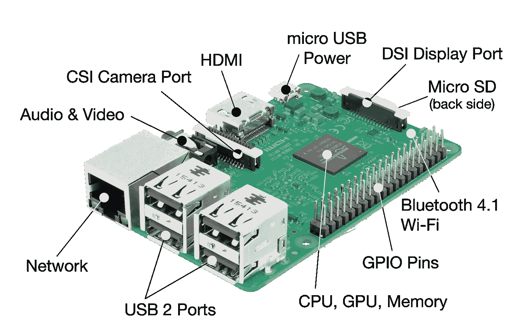
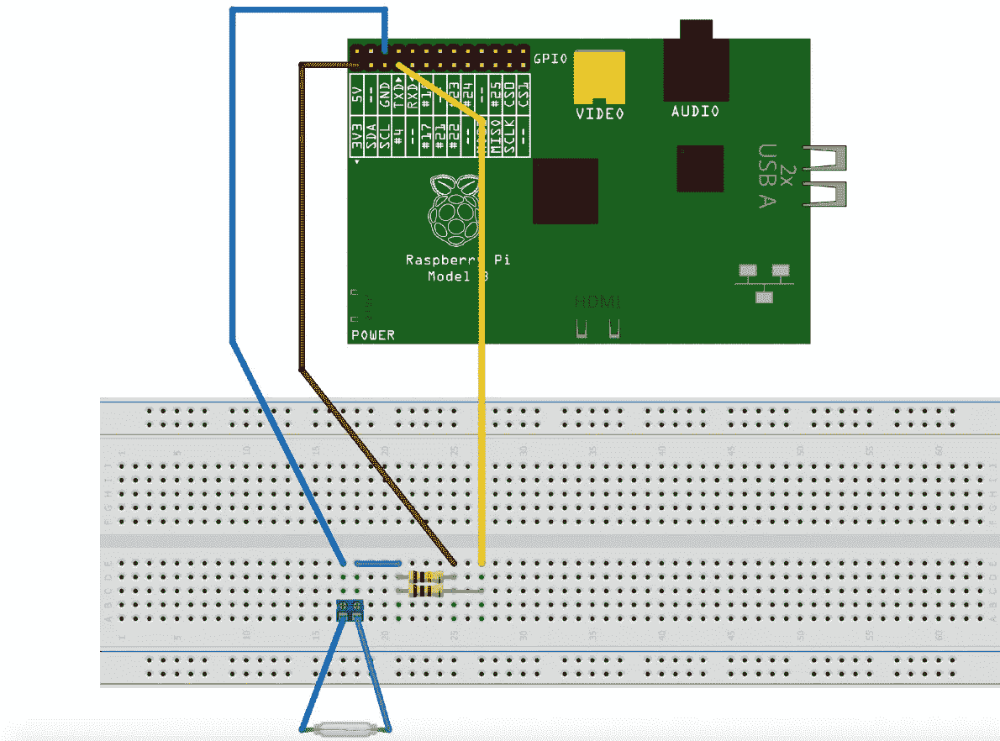
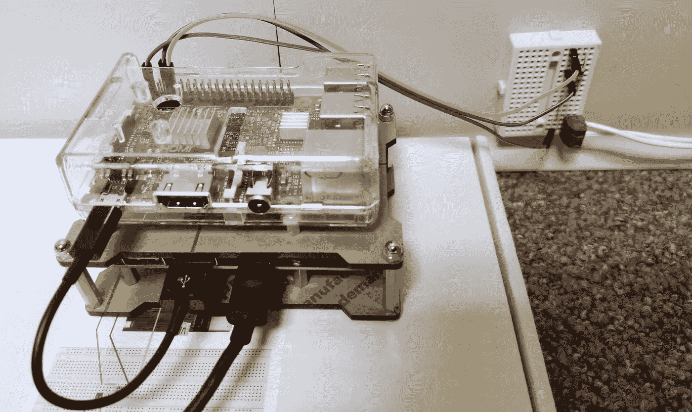

# Raspberry Pi 3 —外壳脚本—门监控器(物联网设备)

> 原文：<https://medium.com/coinmonks/raspberry-pi-3-model-b-shell-scripting-door-monitor-b44944f82d87?source=collection_archive---------1----------------------->

我最近在做一个有趣的项目，我们在本地安装了不同的硬件和服务器。为了安全起见，我安装了一个门监控系统来跟踪房间里的每个入口。

尽管有一些门监控设备、服务和小工具我可以在网上购买，但我决定利用我电子和编程背景，用 Raspberry Pi 从头开始构建一个。



**Raspberry Pi 3 Model B**

因此，我将分享我在使用 Raspberry Pi 3 Model B、迷你试验板、磁性开关门传感器、端子板、3 米钟形线、2 个电阻(10K 和 1K)和 3 条到 Pi 的 IDC 连接线构建全功能门监控器时遇到的一些问题以及我如何解决这些问题。所有这些套件都可以在亚马逊网上购买。



connection diagram — photo credit: Tim Rustige

完成所有连接后，下一步是编码，创建一个脚本来监控门的状态并发送通知。我在我的项目中使用了 shell 脚本。脚本也可以用 python 编写。



**IoT Device**

上图我的 Pi 是通过电池组扩展板电源连接供电的。这种做法解决了断电故障，并在断电的情况下保持 Pi 运行，这允许我们在 Pi 无法发送电子邮件通知时检查门状态日志文件。


**Door Sensors**

磁性开关门传感器应安装在要监控的门上。

## 什么是剧本？“用简单的英语”

计算机是严格的逻辑机器，毫无常识。这意味着如果我们想让他们做些什么，我们必须为他们提供详细的、一步一步的指示，告诉他们到底该怎么做。这就是剧本。按特定顺序完成的步骤列表，如果我们正在做一些非常基本的事情，比如简单的数学方程，这就足够简单了，但是当我们运行更复杂的运算时，就变得困难多了。

> **如何制作可执行的 shell 脚本**

在这一点上，我假设您已经完成了所有必要的连接，并且已经在 Raspbian OS 的最新版本上为 Raspberry Pi 设置并运行了您的 Pi。

打开终端，键入以下命令:

```
nano test.sh
```

这将打开 nano，一个基本的文本编辑器，并允许您输入一系列命令，以便在执行脚本时执行，从而形成脚本的基础。让我们编写一个脚本，在执行时显示一条消息。在 test.sh 上输入以下内容:

```
echo "Hello! this is a test script"
```

然后保存文件并退出。如果您不熟悉 nano:

> 要保存您所做的更改，请按 Ctrl + O。要退出 nano，请按 Ctrl + X。如果您要求 nano 退出已修改的文件，它会询问您是否要保存它。如果不知道就按 N，如果知道就按 Y。然后它会要求你输入文件名。只要输入它，或者如果你已经有一个文件，比如 test.sh。只要按下回车键。
> 
> 如果您意外地确认了想要保存文件，但实际上并没有，那么当系统提示您输入文件名时，您总是可以通过按 Ctrl + C 来取消。

要使 *test.sh* 可执行类型:

```
chmod u+x test.sh
```

然后运行脚本:

```
sudo ./test.sh
```

以下是我在项目中使用的 door motored shell 脚本。当门打开或关闭时，它会发送一封电子邮件，并将门的状态写入日志文件，以便在互联网连接中断或断电时进行检查。

doorStatus.sh

如果您正在处理一个类似的项目，并且想要使用这个脚本，您可以简单地创建一个 shell 文件，复制并粘贴上面的代码，使这个脚本可执行，并在您的 Pi 上运行它。

在运行脚本之前，您需要将 Pi 连接到互联网，拥有或创建一个 Gmail 帐户(使用您的 PC ),该帐户将用于从 Pi 发送电子邮件通知，并从互联网安装配置几个邮件应用程序。

安装以下软件包:

```
sudo apt-get install ssmtpsudo apt-get install mailutilssudo apt-get install mpack
```

设置默认设置 SSMTP，以便 Pi 可以发送电子邮件。打开 ssmtp.config 文件:

```
sudo nano /etc/ssmtp/ssmtp.conf
```

下面是我如何配置我的 ssmtp.config 文件:

ssmtp.config file

保存文件并退出。

确保 Pi 已连接到互联网。使用此命令发送一封测试电子邮件，将下面的电子邮件地址替换为您自己的电子邮件地址:

```
echo “This is a test email” | mail -s “Subject” example2@gmail.com
```

假设一切正常，现在可以运行您的脚本了。

```
sudo ./yourDoorScript.sh
```

假设所有的硬件连接都是正确的，脚本也写得很好。每次开门时，都会向脚本中指定的电子邮件地址发送一封电子邮件通知。

# 树莓 pi 3 提示

以下是一些关于设置 Pi 的提示。

> **检查脚本状态/检测脚本崩溃**

门监视器脚本旨在连续运行(无限循环运行),检查门的状态并在门打开时发送通知。我创建了另一个名为 scriptStatus.sh 的脚本，它检查 door monitor 脚本是否运行良好，如果它由于某种原因崩溃了，就重新启动它。

> **启动时如何在 RPi3 上运行脚本或程序**

它们是在 Raspberry Pi 上引导时运行程序或脚本的五种可用方式或方法:

*   rc .本地
*   。bashrc
*   初始标签
*   系统 d
*   crontab

在本文中，我将探索 **rc.local** 方法。如果 Pi 不打算连接到显示器，您希望在无头模式下启动 Pi，并让它在没有配置或手动启动的情况下运行程序，此方法特别有用。

为了在 Pi 启动时运行命令或程序，编辑/etc/rc.local 文件，并将命令添加到 **rc.local** 文件中。我在这篇文章中使用的是 nano，你可以使用自己选择的编辑器。

```
sudo nano /etc/rc.local
```

使用完整的文件路径或文件位置的绝对引用*添加命令以运行 shell 脚本。确保行**出口 0** 在末尾，然后保存文件并退出。*

> **提示**

*   确保引用绝对文件名，而不是相对于您的个人文件夹。例如，使用“/home/pi/Desktop/myScript.sh”而不是“myScript.sh”。
*   如果您的命令连续运行(可能运行无限循环)或者可能不会退出，您必须确保通过在命令末尾添加一个&符号来分叉该进程，如下所示:

```
sudo /home/pi/Desktop/myScript.sh &
```

否则，脚本不会结束，Pi 也不会启动。“与”符号允许命令在单独的进程中运行，并在进程运行时继续引导。这是我编辑过的 rc.local 文件的副本:

重新启动 Pi 以执行脚本启动:

```
sudo reboot
```

> 更多详情，请查看我的 [**GitHub**](https://github.com/YannMjl/RaspberryPi-Scripts) 上的项目代码
> 
> 如果你喜欢这篇文章，你可能也会喜欢“ [**如何构建物联网双向应用/用 Python 聊天**](/coinmonks/how-to-built-a-bidirectional-app-for-internet-of-thing-chat-with-python-fc926e605b0f) ”

> 干杯！！！！
> 
> 加入 Coinmonks [电报频道](https://t.me/coincodecap)和 [Youtube 频道](https://www.youtube.com/c/coinmonks/videos)获取每日[加密新闻](http://coincodecap.com/)

## 另外，阅读

*   [复制交易](/coinmonks/top-10-crypto-copy-trading-platforms-for-beginners-d0c37c7d698c) | [加密税务软件](/coinmonks/crypto-tax-software-ed4b4810e338)
*   [网格交易](https://coincodecap.com/grid-trading) | [加密硬件钱包](/coinmonks/the-best-cryptocurrency-hardware-wallets-of-2020-e28b1c124069)
*   [密码电报信号](http://Top 4 Telegram Channels for Crypto Traders) | [密码交易机器人](/coinmonks/crypto-trading-bot-c2ffce8acb2a)
*   [最佳加密交易所](/coinmonks/crypto-exchange-dd2f9d6f3769) | [印度最佳加密交易所](/coinmonks/bitcoin-exchange-in-india-7f1fe79715c9)
*   [面向开发人员的最佳加密 API](/coinmonks/best-crypto-apis-for-developers-5efe3a597a9f)
*   最佳[密码借贷平台](/coinmonks/top-5-crypto-lending-platforms-in-2020-that-you-need-to-know-a1b675cec3fa)
*   [免费加密信号](/coinmonks/free-crypto-signals-48b25e61a8da) | [加密交易机器人](/coinmonks/crypto-trading-bot-c2ffce8acb2a)
*   杠杆代币的终极指南