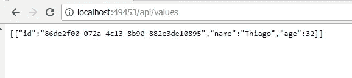

# RavenDB 与 .NET Core

> 原文：<https://medium.com/coinmonks/ravendb-com-net-core-1f008d7479a6?source=collection_archive---------2----------------------->

使用 .NET Core 使用 NoSQL 数据库中的数据


大家好,今天我们将介绍如何在.NET Core 应用程序中访问 NoSQL 数据库中的数据。在本例中,我们将使用 RavenDB。

什么是**RavenDB**?在 WEB 上快速搜索并翻译了一些文本,我们得出了以下结论:“ *RavenDB 是一个基于文档的数据库,我们不是像 SQL Server 或 MySQL 那样将数据存储在行和列中,而是将数据存储在 JSON 文档中。*

最吸引我注意的一点是,它是在.NET 中开发的,其代码由社区维护,这种情况在 Microsoft 项目中变得越来越普遍。如果你想冒险进入你的源代码,请关注 GitHub [RavenDB](https://github.com/ravendb/ravendb) 和 [文档](https://ravendb.net/docs/article-page/3.5/csharp) 的链接。

我们的第一步是安装***RavenDB***,之后我们将使用*Web API*模板创建一个.NET Core 项目来执行我们的第一次集成。

要安装**RavenDB**很简单,只需在[链接](https://ravendb.net/downloads)下载它的可执行文件并选择稳定版本,之后默认的 Windows**next****next finish**,一旦它完成安装和设置,它会在你的桌面上创建一个名为***RavenDB Studio****的快捷方式,只要点击它,它就会在你的浏览器中打开我们银行的管理。我们可以在下面的图片中看到第一步:*


现在我们已经安装了它,我们的下一步是创建我们的项目,在本文中,我们将使用 .NET Core API 模板。为了使帖子不会太长,我们将从 VS 2017 中使用上述模板创建的简单项目开始。随着项目的开放,我们现在需要添加对 ***RevenDB*** 的依赖。为此,只需直接点击参考按钮,然后转到***NuGet***并选择包,如下图所示:


对于那些不熟悉.NET Core 的新框架的人,上一步将为我们的项目依赖项添加一个新的引用,只需展开*依赖关系*->*Nuget*即可查看我们的.dll。我们可以在下面的图片中看到这一步。


在本文中,我们将使用动词*POST,GET,GET By Id,PUT 和 Delete*。让我们开始输入数据。为此,请将代码复制并粘贴到您的 *Controller* ,在本文中,我们将使用在新的.NET API 项目中默认创建的 *ValuesController* 。

```
 [HttpPost]
        public ActionResult Post([FromBody]User user)
        {
            if (user == null)
            {
                return NotFound("Sorry !!");
            }using (var ds = new DocumentStore { Url = "[http://localhost:8024/](http://localhost:8024/)" }.Initialize())
            {
                using (var session = ds.OpenSession("db_home"))
                {session.Store(user);
                    session.SaveChanges();
                }
            }return Ok("Congratulations !!");
        }
```

让我们理解上面的方法,我们正在创建一个实例***DocumentStore*****RavenDB**,并传递我们服务器的 URL(快捷方式在浏览器中打开的 URL),然后启动它。之后,我们打开一个会话与我们的文档 ***db_home,*** 并输入数据到 **session.Store** ,这将采取我们的新用户,并在调用后插入文档 *SaveChanges* ()。

现在我们需要创建我们的 **用户模型** 。为此,在您的**Solution***中创建一个名为***Model*** 的新文件夹,并在其中创建一个名为*User* 的类并将代码粘贴到下面。*

```
 *public class User
    {
        public Guid Id { get; private set; }
        public string Name { get; set; }
        public int Age { get; set; }
    }*
```

*完成后,我们需要向我们的**API**发送一个 POST 来插入我们的第一个记录。为此,我们将使用 Postman 作为 Google Chrome 插件,帮助我们测试 HTTP 请求。打开 Postman 后,在 Headers 中添加 Content-Type application/json,然后将代码粘贴到工具的正文中:*

```
*{  
 "Name": "Thiago",
 "Age": "32"
 }*
```

*现在轮流设计我们的 API,然后发送帖子以创建我们的用户。*

*现在让我们验证这一步,转到 **RavenDB** 的管理,注意我们现在在我们的文档中列出了我们的第一个记录。我们可以在下面的图片中看到这个结果:*

**

*现在我们转到 Get 方法,将代码复制到下面并粘贴到您的**控制器** 。*

```
 *[HttpGet]
        public IList Get()
        {
            IList users = new List<User>();using (var ds = new DocumentStore { Url = "[http://localhost:8024/](http://localhost:8024/)" }.Initialize())
            {
                using (var session = ds.OpenSession("db_home"))
                {
                    users = (from user in session.Query<User>()
                             select user).ToList();
                }
            }return users;
        }*
```

*上面的代码类似于我们的 POST 代码,唯一的区别是我们正在执行查询并使用 Linq 获取所有数据,然后将其传递给我们的 users 变量。这里有趣的一点是,我们不需要进行解析,甚至不需要对 d 进行解析,它将识别数据并将其分配给我们的模型。下图显示了此步骤的结果:*

**

*现在,为了能够通过您的 ID 搜索我们的用户,只需将代码放入您的控制器即可。*

```
 *[HttpGet("{id}")]
        public User Get(Guid id)
        {
            using (var ds = new DocumentStore { Url = "[http://localhost:8024/](http://localhost:8024/)" }.Initialize())
            {
                using (var session = ds.OpenSession("db_home"))
                {
                    return session.Load<User>("users/" + id);
                }
            }
         }*
```

*注意,我们添加了一个新的代码,即 session.Load(),我们可以通过传递参数 users/id 来查找我们的用户。现在,为了让我们验证它,只需在浏览器中调用 /api/values 项目的 URL + 我们要查找的用户指南。*

*我们可以在下面的图像中看到这个结果,注意我们正在传递 Guid 作为参数,然后我们添加了一个断点,以便我们可以看到进入方法的代码。*

**

*现在让我们更新我们的记录。为此,我们将使用方法**PUT**,将代码粘贴到您的**Controller**中,然后运行代码,以便我们可以使用 Postman 发送更新。*

```
 *[HttpPut("{id}")]
        public void Put(Guid id, [FromBody]User user)
        {
            using (var ds = new DocumentStore { Url = "[http://localhost:8024/](http://localhost:8024/)" }.Initialize())
            {
                using (var session = ds.OpenSession("db_home"))
                {
                    user.Id = id;
                    session.Store(user);
                    session.SaveChanges(); }
            }
        }*
```

*我们可以观察到,该方法类似于我们的帖子,但由于我们正在传递我们的用户的 ID,它将理解它不是一个新的记录,并更新而不是插入它。现在在 Postman 中,我们需要将我们的对象添加到您的 body 中:*

```
*{  
 "Name": "Thiago S Adriano",
 "Age": "32"
}*
```

*这样做,通过发送我们的对象,它将更新我们的注册表。*

*好吧,为了完成我们的文章,让我们创建我们的 Delete 方法。为此,将代码粘贴到您的**Controller**中,注意它的语法类似于我们的**PUT**方法。*

```
 *// DELETE api/values/5
        [HttpDelete("{id}")]
        public void Delete(Guid id)
        {
            using (var ds = new DocumentStore { Url = "[http://localhost:8024/](http://localhost:8024/)" }.Initialize())
            {
                using (var session = ds.OpenSession("db_home"))
                {
                    var user = session.Load<User>("users/" + id);if (user != null)
                    {
                        session.Delete(user);
                    }
                }
            }
        }*
```

*现在再次使用 Postman 并传递我们的注册表 ID,它将从我们的数据库中删除它。*

*因此,我们能够通过与 NoSQL 银行集成的.NET Core API Web 应用程序的所有 RestFul 动词。请按照本文中的代码链接 [github](https://github.com/programadriano/apidotcore-ravenDB/blob/master/README.md) 。*

> *Get Best Software Deals Directly In Your Inbox(T11)*

*[](https://coincodecap.com/?utm_source=coinmonks)*