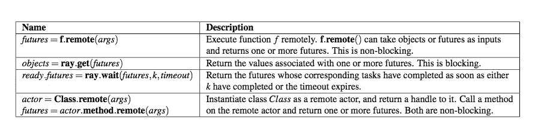
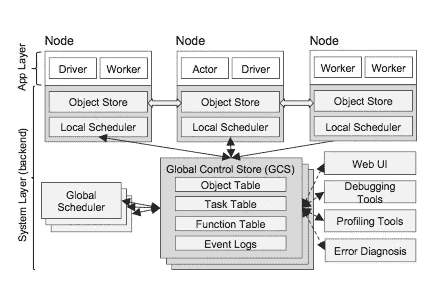
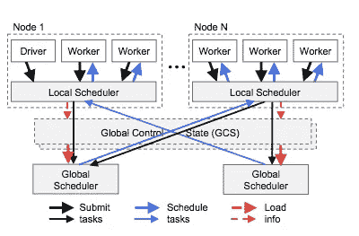
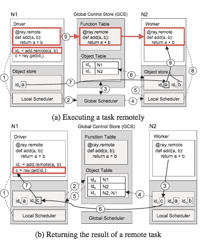

# ray——面向新兴应用的集群计算 ML 框架

> 原文：<https://medium.com/coinmonks/ray-a-cluster-computing-ml-framework-for-emerging-applications-9dfa14934749?source=collection_archive---------1----------------------->

## 介绍

上一篇文章涵盖了伯克利 Riselabs 的一篇论文中概述的设计原则，这是新兴人工智能应用所需的新框架。这篇文章将以这些设计原则为基础，深入探究遵循这些原则构建的 [Ray 框架](https://arxiv.org/pdf/1712.05889.pdf)。我强烈建议在进入这一阶段之前先浏览一下设计原则。这篇文章将依赖于上一篇文章中提到的大量材料。

简单回顾一下上一篇文章:在高层次上，新的 API 应用程序类的框架需要能够支持低延迟的调度、数百万任务的高吞吐量、任务的动态生成、异构任务、任意复杂的数据流依赖。Ray 支持这些需求，进而支持一类新的使用强化学习(RL)的 AI 应用程序，这些应用程序需要支持分布式训练、模型服务和许多模拟的运行。Ray 关注轻量级无状态任务的运行，以及训练所需的耗时的有状态操作。

**典型的 RL 算法**

RL 代理与环境交互的典型示例经历以下迭代算法:

1.  从一些模型开始
2.  使策略(来自模型)与环境交互并获得推荐的动作(模型服务)
3.  通过与模拟环境(模拟)互动获得奖励
4.  重复步骤 2–3，直到模拟完成
5.  使用上一步的结果，重新训练策略。(培训)
6.  重复步骤 1-5，直到结果收敛，奖励最大化

从这个算法可以看出，这个框架需要能够支持模型服务、任务模拟和大数据上的训练。*模型服务*专注于快速呈现策略——快速做出许多决策/推断，并通过有效的负载平衡减少延迟。*模拟*使用策略来评估其在给定环境中的有效性，因为当前算法的效率不足以实时处理物理世界。*模型训练*基于大规模分布式随机梯度下降。这与监督学习形成鲜明对比，在监督学习中，模型训练和模型服务/推理是分离的。训练离线进行，推理在线(实时)进行。

## 光线 API 原语

这在设计原则的文章中有所涉及。但是这里有一个简明的总结来提醒你:

First three pertain to stateless Tasks and the last row corresponds to stateful Actors and their API

## 任务和参与者

上一节提到的任务(前三行)是依赖外部输入的无状态远程函数。可以把它们想象成可以在任何有输入的节点上远程执行的功能。任务很容易恢复，只需重新执行即可。对于小的更新，任务是低效的。

参与者是携带状态的有状态实体。这对于迭代模式非常有用，例如依赖内部状态及其持续更新的训练或参数服务器。参与者拥有可以像任务一样远程执行的方法，但是需要一个“有状态的工作者”来执行。Actors 还使得包装第三方包变得容易，这些第三方包不容易作为任务的输入被反序列化。Actors 对于较小的更新也很有用，这与纯任务设计的批量更新相反。

## 任务图表

Ray 根据用户编写的程序创建一个动态图形。该图形成依赖结构，并且当输入变得可用时，图中的下一个任务由系统执行。该图由表示数据对象、远程函数调用(任务)的节点组成。这个图也有边。数据流边缘捕获任务和数据对象之间的依赖关系。控制边捕获嵌套的任务或功能，这些任务或功能创建了更多的远程功能。到目前为止，我们没有讨论这个模型中的演员。参与者也类似于任务。唯一的区别是捕捉状态。这是通过添加有状态边缘来实现的。当 Actor 调用两个方法 M1 和 M2 时，在由 M1 和 M2 表示的两个任务节点之间添加了一个有状态边。这意味着有状态边链是为同一个参与者调用的所有方法形成的，也有助于从错误中恢复的谱系结构。

## 体系结构

Ray 的系统架构由应用层和系统层组成。让我们看看这两层是如何工作的。

App layer that contains drivers and workers. System layer encompassing the hybrid scheduler.

**应用层**

正如你所看到的，应用层由驱动程序、工作者和参与者组成。*驱动*执行应用程序。*工作者*执行系统中存在的任务或功能。每当声明一个远程函数时，它就被推送到一个工作线程。驱动程序和本地调度程序要求工人执行任务。 *Actor* 类似于 worker，它执行任务，但是它处理前一个方法的状态，并且只调用属于 Actor 的方法。

**系统层**

系统层由三个主要组件组成，分别是全局控制状态(GCS)、全局调度器和内存分布式存储+本地调度器。

***【GCS】***用于存储所有远程功能表、事件日志、对象表等信息。其核心是一个键值存储，并增加了发布-订阅功能。该表还存储了关于对象位置的信息，以便可以有效地将任务和数据放在一起。因为 GCS 维护所有的状态，所以它有助于调度程序的伸缩。此外，GCS 可用于从故障中恢复。粗粒度恢复已经通过诸如 [RDDs、](/coinmonks/apache-spark-and-rdds-fault-tolerant-distributed-in-memory-data-processing-7e5a763d3236)之类的架构得到解决，但是细粒度恢复需要不同的机制，尤其是对于在模拟期间添加的动态任务。这可以通过让 GCS 维护用于恢复的沿袭信息来解决。这允许系统中的所有其他组件都是无状态的，并且不用太担心从故障中恢复。

***全局调度器:*** 全局调度器实际上是一个混合的、自底向上的调度器，其中任务被提交给本地调度器。本地调度程序首先尝试在同一节点上调度给定的任务。如果由于约束(缺少 GPU)或本地节点上的高负载而无法完成，它会将任务提交给全局调度程序。全局调度器通过 GCS 了解所有节点上的整体系统使用情况以及不同任务的数据需求。然后，可以将这些任务提交给全局调度程序选择的节点上的本地调度程序。全局调度器可以找到满足该任务的容量需求的多个节点。因为 Ray 中的任务对延迟非常敏感，所以调度器选择一个节点来最小化任务的等待时间。等待时间被定义为“在所选节点上排队花费的时间”和“将输入传输到该节点花费的时间”的总和。GCS 使用心跳来获取关于数据传输带宽和每个节点的队列大小的信息。此外，如果调度程序成为瓶颈，那么可以使用 GCS 作为数据源来扩展调度程序。

请参见下图，该图使任务计划工作流更加清晰。

Hybrid scheduler that starts with local scheduler and then goes to global scheduler to find another node if needed.

***内存分布式对象存储*** 存在于系统的每个节点上，用于存储任务的输入和输出。对于节点上不存在的任何输入，对象存储会将其复制到本地节点。这也有助于解决热对象瓶颈。对象存储仅限于不可变数据，因此一致性不是大问题。此外，受支持的对象只有那些可以放在单个节点上的对象。

## 在 Ray 中执行远程任务

Typical execution of a remote task

让我们浏览一下在 Ray 中执行一个函数所需的一系列步骤，以及获取结果所需的步骤。考虑系统中有两个节点 N1 和 N2。声明一个远程函数，并向 GCS 注册，然后传播给 N1 和 N2 的工人(上图中的步骤 0)。该应用程序正在 N1 上运行，并希望对两个对象 a 和 b 执行“添加”操作。该操作返回一个未来的“id”，然后 N1 上的应用程序对未来的“id”调用 get()，这是一个阻塞调用。现在，首先让我们一步一步地看看*执行 add* 操作时系统中发生了什么。这显示在图(a)中。

1.  添加任务被提交给 N1 上的本地调度程序。
2.  本地调度器意识到它只有对象“a”在本地可用。因此它将任务提交给全局调度器。
3.  全局调度器在 GCS 中查找对象“a”和“b”所在的位置，然后决定在 N2 上调度它。
4.  N2 上的本地调度程序从本地对象存储中获得关于“a”的信息。“b”在当地有售。
5.  因为对象存储没有“a”，所以它需要从它所在的节点获取它。
6.  N2 上的对象存储从 GCS 得知“a”在 N1 上。
7.  “a”通过来自 N1 的对象存储复制在 N2 上复制
8.  本地调度程序使用本地工作线程调度添加任务
9.  本地工作器使用对象存储来获取“a”和“b”以执行加法。

应用程序的第二部分是使用 N2 上的应用程序引用的未来“id”来获得加法的结果。这显示在图(b)中

1.  N1 上的本地调度程序正在执行对未来“id”的获取。它在本地检查对象存储——它还没有“id”条目。
2.  本地对象存储向 GCS 请求“id”。因为 GCS 没有它，所以向 GCS 注册了一个回调。
3.  同时，在节点 N2 上完成添加。数据存储在 N2 的对象存储中。
4.  N2 对象存储通知 GCS“id”结果的可用性。这登记在对象表中。
5.  GCS 调用 N1 上的回拨，提到“id”在 N2 上的可用性。
6.  N1 上的对象存储从 N2 复制“id”。
7.  现在，N1 上等待 future-get (ray.get)的任务被解除阻塞。

## RL 应用的评估

本文还比较了 Ray 框架与两种 RL 算法及其参考实现的性能。这两个算法是[进化策略](https://blog.openai.com/evolution-strategies/)和[近似策略优化](https://blog.openai.com/openai-baselines-ppo/)。对于这两种情况，基于射线的算法比针对这些问题建立的一次性解决方案执行得好得多。请记住，构建这样的一次性解决方案是相当复杂的。对于 ES，参考解决方案不能扩展到超过 1024 个节点，而 ray 可以扩展到 8192 个节点。类似地，对于 PPO，ray 以低得多的成本(从而提高集群利用率)和少得多的 GPU 数量胜过 OpenMPI 实现。这是可能的，因为任务和参与者可以请求特定的异构资源，并在锁定这些资源时更好地使用数据局部性。

## 结论

无论是设计原则还是实际的框架论文，都是关于新时代 ML 框架需要发展以支持 RL 技术的有趣读物。能够支持混合调度和基于任务/参与者的方法组合的框架似乎很适合这个问题空间。

> [在您的收件箱中直接获得最佳软件交易](https://coincodecap.com/?utm_source=coinmonks)

