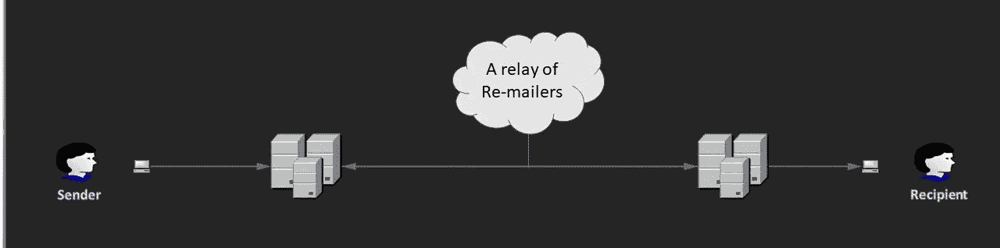
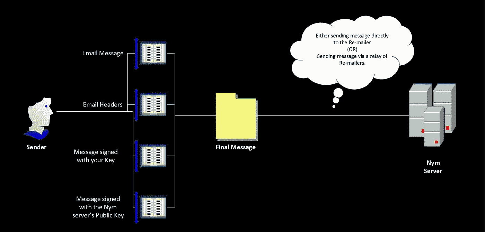
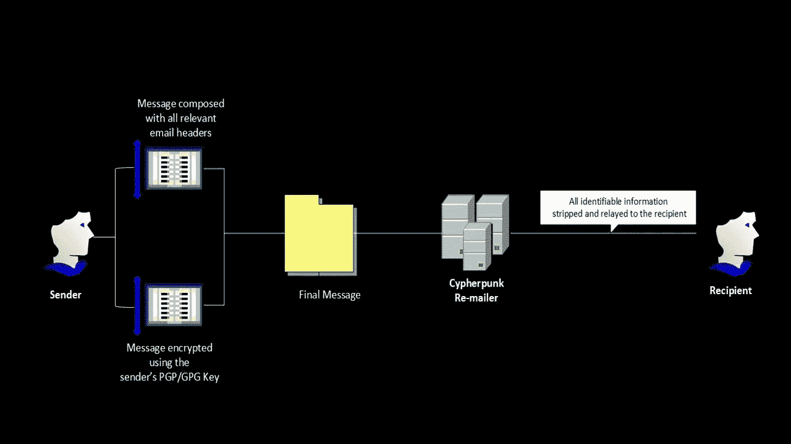

# 转发邮件者——电子邮件隐私被遗忘的阶段！

> 原文：<https://medium.com/coinmonks/re-mailers-the-forgotten-phase-of-email-privacy-4f4745544473?source=collection_archive---------3----------------------->

1971 ，两台电脑之间交换第一封电子邮件的那一年。从那以后，电子邮件世界经历了巨大的发展。电子邮件系统的定义、语法和架构被标准化，并最终跨多个平台使用。直到 25 年后的 1996 年 7 月 4 日，第一个基于 HTML(网络)的电子邮件服务才在世界上出现。

每封电子邮件都有特定的识别信息，如发件人的电子邮件地址、收件人的电子邮件地址、电子邮件主题、发件人的 IP 地址等。，这有助于保持电子邮件的完整性和可靠性。但是，也有需要匿名发送电子邮件的情况。隐私，虽然不知道在任何服务中被广泛优先考虑(回到过去)，但在电子邮件通信中是非常重要的。*匿名转寄邮件*的引入引发了网民对隐私的认可大幅增加，并催生了大多数现代匿名电子邮件服务和匿名器，如 TOR Guard 电子邮件、游击队电子邮件、嘘电子邮件等。


**匿名转寄器**是用于在发送/接收电子邮件时实现匿名的电子邮件服务器。每个转寄者的主要工作是将电子邮件发送到下一个转寄者或最终目的地，但这里的问题是它不会暴露电子邮件的原始发件人。这在因特网上遵循的通用电子邮件路由体系结构中引入了匿名性，并且被证明是传输敏感信息和匿名举报等的强有力的方法。

对于任何成功的电子邮件通信，都有某些关键属性，如发件人的电子邮件地址、收件人的电子邮件地址、发件人的 IP 地址、收件人的 IP 地址、电子邮件的主题、电子邮件正文，然后是最新的附加功能，如抄送地址字段和密件抄送地址字段。如果想实现匿名电子邮件，他们必须找到一种方法来隐藏上述细节，这样除了发件人之外，任何人都不知道该消息是发给谁的以及它的内容是什么。



**A typical email transmission using re-mailers**

对电子邮件属性执行多种类型的操作以实现匿名，并且基于操作的类型，有 4 种类型的匿名转发邮件。

*   假名转寄者
*   赛博朋克转寄者
*   混合主邮件
*   Mix-minion 转寄邮件

## 假名转寄者:

虽然它不是最有效的匿名转寄邮件，但它在匿名方面有其公平的份额和有限的范围。也被称为“*域名服务器*”，它们遵循一套如何代表用户发送或接收电子邮件的指令。

可以指示 Nym 服务器添加、删除或伪造电子邮件传输的某些字段，并且还将电子邮件转发给可用的再发邮件者的列表。

它为其用户分配一个变量(假名),然后存储对应于每个变量的一组指令，说明需要如何处理来自相应用户的电子邮件，即要么去掉电子邮件的几个相关字段，要么通过一组可用的再发邮件者来转发。

假名转寄确实有一定的缺点。这些缺点可以用下面的场景来更好地解释:

> 首先是保存假名变量的服务器受到威胁。所有使用的假名和一套重新邮寄说明可能会暴露，从而使其匿名的特点。
> 
> 第二种情况是，一个国家资助的程序可以监控整个中继服务器的流量，然后填充其他服务器的列表，并猜测运行流量模式。然后可能将该信息用作目标攻击或高级持续威胁操作的一部分。

可悲的是，在任何重大违规行为被发现之前，这些假名的邮件转发者就已经不再使用了。

## 当代域名服务器——假名转寄者的延伸:

也被称为假名服务器，这些服务器为每个用户/实体提供不可追踪的电子邮件地址。无论是域名服务器还是任何转发邮件的人都无法找出哪个假名对应于谁。

要使用当代的 Nym 服务器，任何用户都应满足以下条件:

*   一对 [PGP 密钥](https://en.wikipedia.org/wiki/Pretty_Good_Privacy)
*   关于如何将消息或响应发送回实体的一套自有/客户说明。(更像当前每日电子邮件功能中的*回复*字段)
*   以上两件事合起来就叫做那个消费者的“名”
*   然后，一封电子邮件将被发送到 Nym 服务器，其中包含 PGP 密钥和一套关于如何处理您的电子邮件传输的说明。
*   来自 Nym 服务器的响应将包含使用消费者提供的 PGP 密钥加密的消息，并遵循所提供的指令集。(更像是来自 Nym 服务器的确认)
*   消费者对此的反应将被视为确认。(类似于会话/服务建立确认)



**A typical email transmission by using a Contemporary Pseudonym Re-mailer**

## 赛博朋克转寄者:

也被称为 1 型邮件转发者，我们主要讨论如何以及什么是邮件转发者将从这里开始。以下步骤将简要描述典型的密码朋克转发邮件程序的功能:

*   获取转寄者的公钥:向转寄者发送主题为“ ***转寄者密钥*** ”的邮件，服务器回复其公钥。
*   获取/保存转寄者的公钥，并将其添加到您的 PGP/GPG 实现中
*   您的初始电子邮件必须遵循以下格式:

```
 ***Anon-To:<Intended Email Recipient’s Address>
###
Subject:<Email’s intended Subject>
<Message Text>***
```

*   现在，使用 PGP/GPG 实现，使用转寄者的公钥加密消息。将加密的输出放在手边。
*   现在用下面的格式写一封新邮件，并把它发送给转寄者。

```
***Encrypted : PGP / Encrypted : GPG
 — — Begin PGP/GPG Message — — 
<The Encrypted Message Content>
 — — End PGP/GPG Message — —***
```

*   使用密码朋克转寄程序发送的每封邮件都有一个伪标题，格式如下:
    **::**
    ***请求-转寄-收件人:final@destination.net【最终收件人的电子邮件地址】***

一旦伪报头被附加到加密的消息上，它就通过中继服务器被发送，并且在到达最终服务器时，服务器使用它的私钥来解码消息并将其传送给预期的接收者(它从伪报头中拾取该接收者)。



**A typical email transmission by using a Cypherpunk Re-mailer**

现在我们已经了解了密码朋克邮件转发程序的工作原理，让我们来讨论一下它的缺点。

> 想象一下这样一个场景，有人正在拦截从发送方主机发出的每个数据包。他们将能够截获转发邮件者的公钥，也就是来自发送者的带有伪标题的加密文本。现在，他们需要做的就是用一个新的伪报头(包含攻击者的电子邮件地址)替换伪报头，并向转发邮件者发送一封新的电子邮件。然后，转发邮件者为攻击者做所有的工作，最后将邮件发送给他，从而破坏了邮件的保密性。

## Mix-master 转发邮件:

也被称为 2 型匿名邮件转发者，混合邮件转发者提供单向邮件服务。实现双向 mix-master 的唯一方法是在电子邮件正文中包含回复地址。mix-master 转发邮件的分发可以在[这里](http://mixmaster.sourceforge.net/)找到。

发件人首先将电子邮件发送给转发邮件的人，然后转发给其他转发邮件的人，最后通过 SMTP 发送给目标收件人。然而，mix-master 邮件转发程序的实现需要一个编写邮件的程序。

**Mix-Master 重发邮件客户端:**
有多个客户端程序可以利用 Mix-Master 重发邮件系统，

*   [Mutt 电子邮件客户端](http://www.mutt.org/)
*   [Mixlet](https://sourceforge.net/projects/mixlet/)
*   [执事](https://sourceforge.net/p/mixmaster/mailman/message/6247356/)
*   [快银](https://www.quicksilvermail.net/)
*   [Omnimix](https://www.danner-net.de/om.htm)

这些客户端还可以与 pingers 结合使用，后者与其他重新发送邮件者进行通信，以提供更新的密钥和性能统计信息。由用户决定是运行自己的 pinger 还是从现有的 Pinger 中收集统计数据。mix-masters 的开发者列表和用户邮件列表可以在这里找到。

*   下载源代码并使用 C/C++编译
*   更新 Nym 服务器的列表
*   在代码中调用 ping 命令，或者单独使用它们并更新源代码。也可以参考 mix-master 转寄器的[完整指南](http://mixmaster.sourceforge.net/faq.shtml)来了解完整的实现
*   使用 Linux/Unix 发行版来实现它会导致一个非常平滑的过程，没有错误，步骤如下:

## Mix-minion 转发邮件:

也被称为第三类转寄邮件，这是迄今为止我们讨论过的三种转寄邮件中最有效的。它们利用混合架构，一个关键特征是它们防止消息被窃听。它引入了一个叫做“混合器”的新概念。每个混音器执行以下任务:

*   收到电子邮件
*   解码电子邮件
*   打乱电子邮件标题
*   加密它
*   再次传输到下一个混合器或目的地(在最后一个混合器的情况下)

完整的消息被分成称为“包”的固定大小的块。mix-minion 客户端使用传输路径上每个服务器的公钥对数据包进行加密(就像洋葱路由一样)。然后，传输从第一个混合器开始，到第二个混合器，然后到第三个混合器，依此类推，直到最后一个混合器将普通电子邮件发送给收件人。

Mix-minion 邮件转发程序拥有适用于 Windows、Linux/Unix 和 Mac OS 所有三种平台的客户端。它不再被官方支持或使用，但它的代码在 GitHub 中可供任何人下载/编辑并创建他们自己版本的转发程序。

阅读和研究转寄邮件的人已经证实了一件事——我们目前复杂的隐私水平来自于各种失败的实施(无论是匿名电子邮件或匿名信息还是互联网的使用)。然而，所有讨论过的邮件都与我们无关，因为现在有了更先进的匿名邮件服务。当前的 VPN、匿名器和免费电子邮件服务的基础设施已经给用户提供了这样的选择，即根据需要创建尽可能多的电子邮件地址，并在完成后处理掉它们。在我写这篇文章的时候，我想到的几个很受欢迎的匿名邮件服务是 TOR Guard、游击队邮件、安全邮件、匿名邮件、5ymail、Cyber Atlantis、Anon email 和 W3 匿名邮件转发等。

这就把我们带到了文章的结尾。请考虑这一点，上面的文章是所有互联网上可用的开源材料的合并和简化版本，我还不是一个安全测试专家来验证这一点。此外，我很乐意接受建议和任何必要的更正，使这成为每个人更好的资源！

[](https://coincodecap.com)

> [在您的收件箱中直接获得最佳软件交易](https://coincodecap.com/?utm_source=coinmonks)

[](https://coincodecap.com/?utm_source=coinmonks)