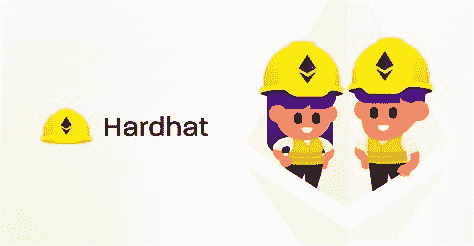

# 使用 hard hat & Truffle react 项目设置—第 1 部分

> 原文：<https://medium.com/coinmonks/react-project-setup-using-hardhat-truffle-part-1-20a596865e?source=collection_archive---------0----------------------->


Photo by [Jeremy Bishop](https://unsplash.com/photos/KFIjzXYg1RM) on [Unsplash](https://unsplash.com/)

在开发智能合约时，使用开发环境非常重要。本文将一起探索 Truffle 和 Hardhat，以翻译它们的命令，以及如何通过在 React 中创建一个小项目来从一个命令适应另一个命令。

## 什么是松露和安全帽？

Truffle 和 Hardhat 都是在以太坊区块链上编写智能合同的开发环境。这些工具允许开发人员:

*   汇编合同
*   测试合同
*   部署合同
*   调试合同

您可以在此了解更多信息:

[松露](https://www.trufflesuite.com/docs/truffle/overview)


Truffle

[安全帽](https://hardhat.org/)



Hardhat

# 项目设置

第一步是在我们开始编写智能契约之前，用 React 建立一个项目。

*   转到您希望项目所在的文件夹

## 块菌设置方法

```
npx create-react-app <project name>
```

输出应该如下所示:

```
npx create-react-app truffle-exampleCreating a new React app in /Examples/truffle-example.Installing packages. This might take a couple of minutes.
Installing react, react-dom, and react-scripts with cra-template...Created git commit.Success! Created truffle-example at /Examples/truffle-example
Inside that directory, you can run several commands:yarn start
    Starts the development server.yarn build
    Bundles the app into static files for production.yarn test
    Starts the test runner.yarn eject
    Removes this tool and copies build dependencies, configuration files
    and scripts into the app directory. If you do this, you can’t go back!We suggest that you begin by typing:cd truffle-example
  yarn startHappy hacking!
```

然后移动到刚刚创建的文件夹中

```
cd <project name>
```

*另一个选择是使用块菌盒，你可以使用 React 创建的块菌盒。要了解更多关于松露盒的信息，请点击这里* [***松露盒***](https://www.trufflesuite.com/boxes)

如果全球没有安装松露

```
npx truffle unbox react
```

如果你在全球范围内安装了松露

```
truffle unbox react
```

您应该会得到类似如下的输出:

```
truffle unbox reactStarting unbox...
=================✔ Preparing to download box
✔ Downloading
✔ Cleaning up temporary files
✔ Setting up boxUnbox successful, sweet!Commands:Compile:              truffle compile
  Migrate:              truffle migrate
  Test contracts:       truffle test
  Test dapp:            cd client && npm test
  Run dev server:       cd client && npm run start
  Build for production: cd client && npm run build
```

> 现在让我们从哈德哈特的角度来看一下

# 安全帽设置方法

因为 hardhat 是一个轻量级的工具，它利用了更多的插件，所以它可以作为一个依赖项安装在你的项目中。

```
npx create-react-app <project name>
```

现在我们应该看到这样的内容:

```
npx create-react-app hardhat-exampleCreating a new React app in /Examples/hardhat-example.Installing packages. This might take a couple of minutes.
Installing react, react-dom, and react-scripts with cra-template...Created git commit.Success! Created hardhat-example at /Examples/hardhat-example
Inside that directory, you can run several commands:yarn start
    Starts the development server.yarn build
    Bundles the app into static files for production.yarn test
    Starts the test runner.yarn eject
    Removes this tool and copies build dependencies, configuration files
    and scripts into the app directory. If you do this, you can’t go back!We suggest that you begin by typing:cd hardhat-example
  yarn startHappy hacking!
```

然后移动到刚刚创建的文件夹中

```
cd <project name>
```

好吧！我们刚刚完成了将松露/安全帽添加到 React 项目中的过程，接下来我们将初始化它们。

# **安装**

现在文件夹已经设置好了，让我们安装开发工具

# **块菌安装方法**

在您刚刚创建的项目文件夹中，安装 truffle。

这只是如果你没有使用松露拆箱！如果使用 ***松露拆箱*** 可以跳过这一步，因为拆箱会执行这一步。

```
truffle init
```

您应该会得到类似如下的输出:

```
Starting init...================> Copying project files to /Examples/truffle-exampleInit successful, sweet!
```

# 安全帽安装方法

进入项目文件夹，安装 hardhat 作为项目的依赖项

```
npm i hardhat
```

现在安装安全帽

```
npx hardhat
```

您应该在终端中看到这个:

```
 888    888                      888 888               888
888    888                      888 888               888
888    888                      888 888               888
8888888888  8888b.  888d888 .d88888 88888b.   8888b.  888888
888    888     "88b 888P"  d88" 888 888 "88b     "88b 888
888    888 .d888888 888    888  888 888  888 .d888888 888
888    888 888  888 888    Y88b 888 888  888 888  888 Y88b.
888    888 "Y888888 888     "Y88888 888  888 "Y888888  "Y888👷 Welcome to Hardhat v2.6.1 👷‍? What do you want to do? …
❯ Create a basic sample project
  Create an advanced sample project
  Create an empty hardhat.config.js
  Quit
```

让我们选择:

```
Create a basic sample project
```

然后设置您的项目根目录:

```
✔ What do you want to do? · Create a basic sample project? Hardhat project root: › /Examples/hardhat-example
```

因为 React 已经有一个. gitingnore 文件，所以选择 no

```
? Do you want to add a .gitignore? (Y/n) › n
```

由于 hardhat 依赖于其他依赖项，我们将需要安装它们，但是为了尽可能接近地进行比较，我们将自己安装它们

> Hardhat 通常使用 ethers.js，但是因为 truffle 使用 web3.js，所以我们也将 web3.js 与 hardhat 一起使用

```
? Do you want to install this sample project dependencies with yarn (@nomiclabs/hardhat-waffle ethereum-waffle chai @nomiclabs/hardhat-ethers ethers)? (Y/n) › n
```

在这个安装过程中，你可能会看到一些警告，但是只要你得到一个项目创建确认，现在就应该没问题了

```
✨  Done in 47.89s.✨ Project created ✨See the README.txt file for some example tasks you can run.
```

# 安全帽安装依赖项

稍后，我们将需要 web3.js 与项目中的区块链进行交互

> 这使得 hardhat 可以与 web3.js 库进行交互

```
npm i @nomiclabs/hardhat-web3
```

> 这使得 hardhat 可以与 web3.js 库进行交互

```
npm i web3
```

我们现在已经知道如何用 Truffle 和 Hardhat 完整地设置和安装 React 项目

## 在第 2 部分中，我们将配置开发环境并开始编写合同！点击此处观看第二部分。

> 加入 Coinmonks [电报频道](https://t.me/coincodecap)和 [Youtube 频道](https://www.youtube.com/channel/UCbyDhTbOiKh2iUMKBi4-4Zg)了解加密交易和投资

## 也阅读

[](https://blog.coincodecap.com/crypto-exchange) [## 最佳加密交易所| 2021 年十大加密货币交易所

### 加密货币交易所的加密交易需要了解市场，这可以帮助你获得利润…

blog.coincodecap.com](https://blog.coincodecap.com/crypto-exchange) [](https://blog.coincodecap.com/crypto-lending) [## 2021 年 9 大最佳加密贷款平台| CoinCodeCap

### 当谈到加密货币贷款时，大量因素等同于良好的收入状况。此外，借款的一部分…

blog.coincodecap.com](https://blog.coincodecap.com/crypto-lending) [](/coinmonks/crypto-trading-bot-c2ffce8acb2a) [## 2021 年最佳加密交易机器人(免费和付费)

### 2021 年币安、比特币基地、库币和其他密码交易所的最佳密码交易机器人。四进制，位间隙…

medium.com](/coinmonks/crypto-trading-bot-c2ffce8acb2a) [](/coinmonks/best-crypto-signals-telegram-5785cdbc4b2b) [## 最佳 4 个加密交易信号电报通道

### 这是乏味的找到正确的加密交易信号提供商。因此，在本文中，我们将讨论最好的…

medium.com](/coinmonks/best-crypto-signals-telegram-5785cdbc4b2b) [](https://blog.coincodecap.com/blockfi-review) [## BlockFi 评论 2021:利弊和利率

### 今天，我们提出了一个全面的 BlockFi 评论，这是一个成立于 2017 年的加密贷款平台，拥有其…

blog.coincodecap.com](https://blog.coincodecap.com/blockfi-review) [](/coinmonks/buy-bitcoin-in-india-feb50ddfef94) [## 如何在印度购买比特币？2021 年购买比特币的 7 款最佳应用[手机版]

### 如何使用移动应用程序购买比特币印度

medium.com](/coinmonks/buy-bitcoin-in-india-feb50ddfef94) [](/coinmonks/best-crypto-tax-tool-for-my-money-72d4b430816b) [## 加密税务软件——五大最佳比特币税务计算器[2021]

### 不管你是刚接触加密还是已经在这个领域呆了一段时间，你都需要交税。

medium.com](/coinmonks/best-crypto-tax-tool-for-my-money-72d4b430816b) [](https://blog.coincodecap.com/pionex-review-exchange-with-crypto-trading-bot) [## Pionex 评论-被动交易者的简单交易机器人

### 在本文中，我们将回顾 Pionex，它提供了加密交易机器人自动化工具，集成了一个…

blog.coincodecap.com](https://blog.coincodecap.com/pionex-review-exchange-with-crypto-trading-bot) [](https://blog.coincodecap.com/best-hardware-wallet-bitcoin) [## 存储比特币的最佳加密硬件钱包[2021]

### 保管您的数字资产很容易，但找到正确的存储方式却是一项繁琐的任务。在线钱包有一个风险…

blog.coincodecap.com](https://blog.coincodecap.com/best-hardware-wallet-bitcoin)