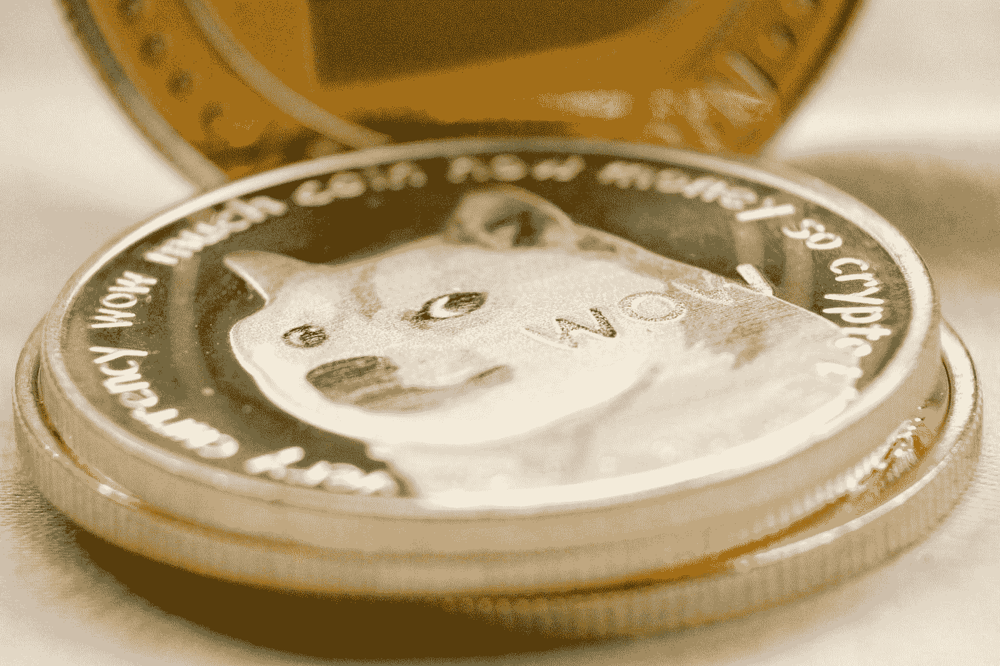

# 谷歌表单上的实时加密价格——Meme 币更新

> 原文：<https://medium.com/coinmonks/real-time-crypto-prices-on-google-sheets-meme-coin-update-45aa5dcec924?source=collection_archive---------1----------------------->

Photo by [Crystal Mapes](https://unsplash.com/@cmapes?utm_source=medium&utm_medium=referral) on [Unsplash](https://unsplash.com?utm_source=medium&utm_medium=referral)

谷歌金融是一个神奇的免费工具，你可以使用一些简单的公式来建立一个投资跟踪器。2021 年早些时候，谷歌增加了一个用户可以使用的加密数据库，所以现在你可以拥有你的加密和股票的实时价格更新。

以下是谷歌金融公式的一个例子: