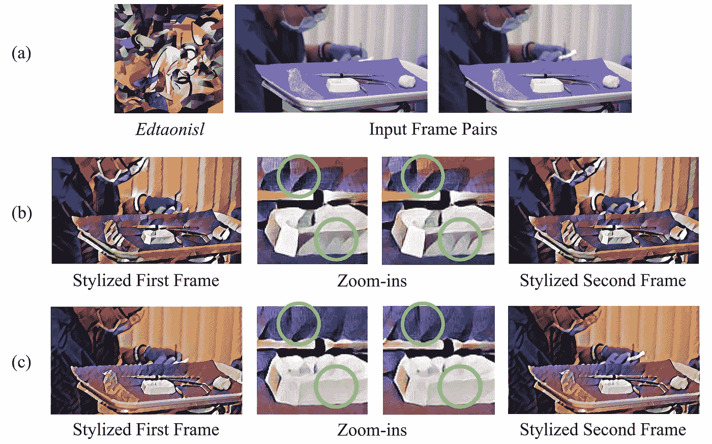
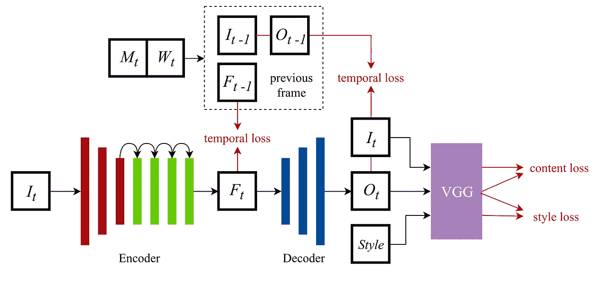
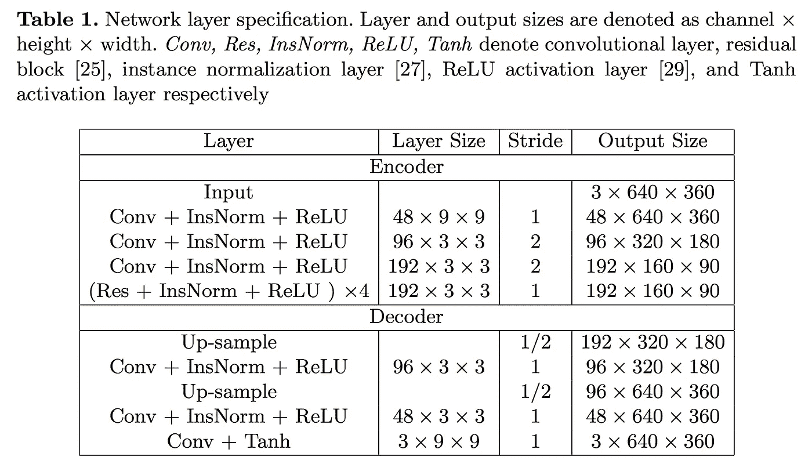
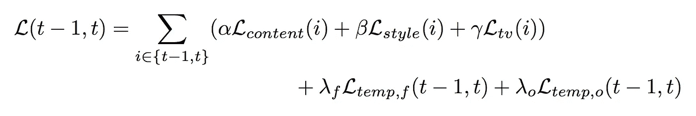
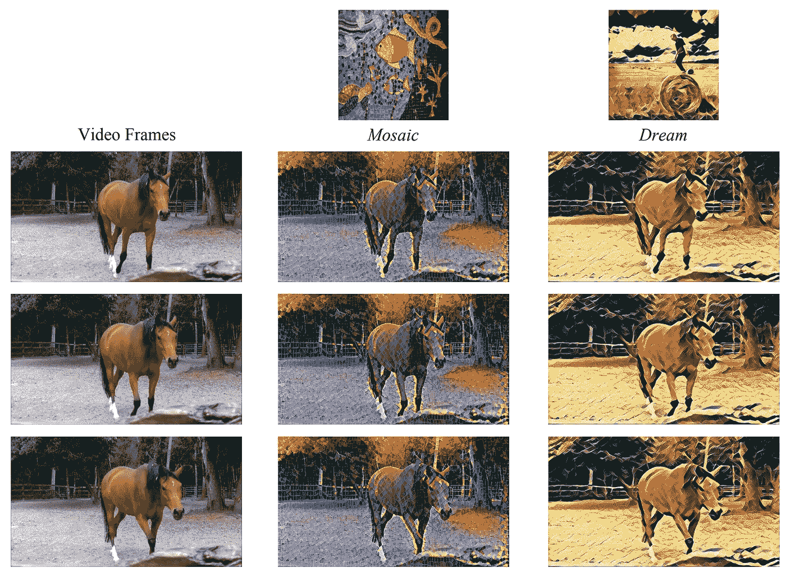
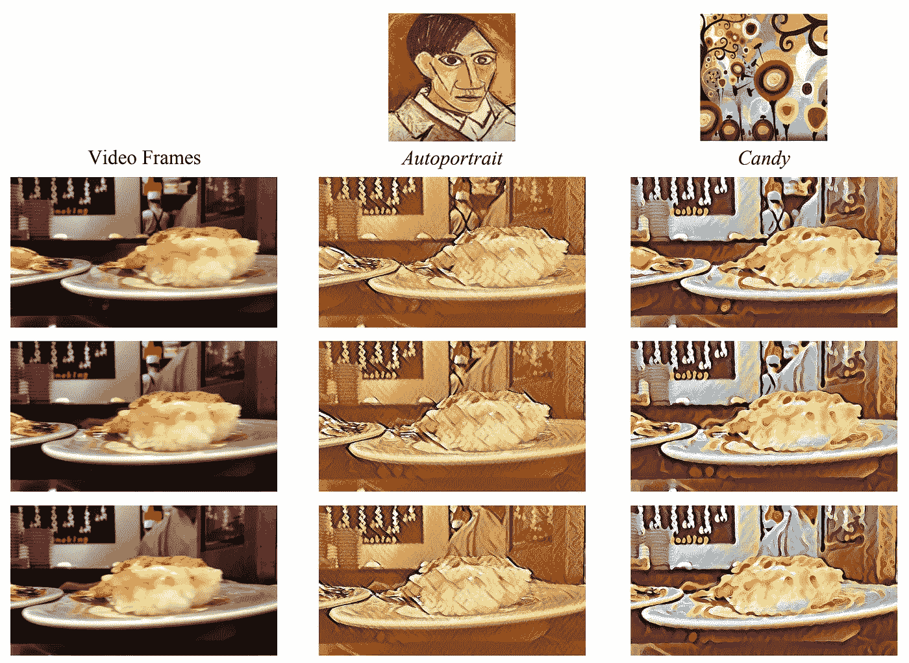
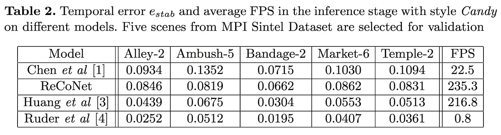
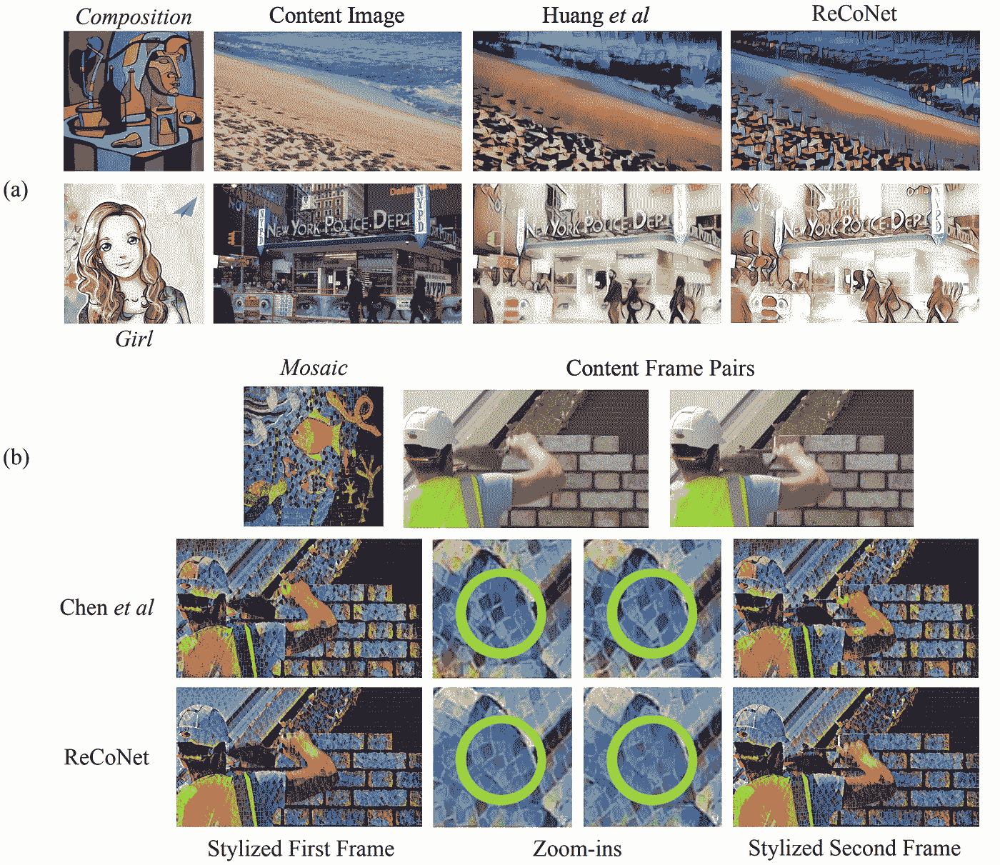
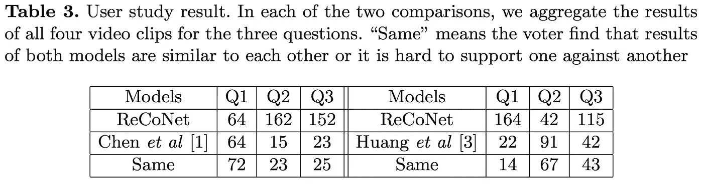

# 实时视频风格传输:快速、准确且时间一致

> 原文：<https://medium.com/coinmonks/real-time-video-style-transfer-fast-accurate-and-temporally-consistent-863a175e06dc?source=collection_archive---------2----------------------->

世界各地的开发人员部署卷积神经网络，用于以其他图片的风格或简单的图像风格转移来重新组合图像。在现有方法达到足够高的处理速度后，视频风格转换也引起了研究者和开发者的兴趣。然而，由于高度的时间不一致性，图像风格转移模型通常不适用于视频，这可以在视觉上观察到连续风格化帧之间的闪烁和移动对象的不一致风格化。一些视频风格传输模型已经成功地提高了时间一致性，但是它们不能同时保证快速的处理速度和良好的感知风格质量。

为了解决这一具有挑战性的任务，最近推出了一种新颖的实时视频风格传输模型 **ReCoNet** 。其作者声称，它可以生成时间连贯的风格转换视频，同时保持良好的感知风格。此外，与其他现有方法相比，ReCoNet 在定量和定性方面都表现出了出色的性能。那么，现在让我们发现，这个模型的作者是如何能够同时实现高时间一致性、快速处理速度和良好的感知风格质量的！

**Figure 1.** Temporal inconsistency in video style transfer: (b) results by Chen et al; © results by ReCoNet

# 建议的方法

实时连贯视频风格传输网络(ReCoNet)是由香港大学的一组研究人员[提出的](https://arxiv.org/pdf/1807.01197v1.pdf)，作为视频风格传输的最先进方法。这是一个前馈神经网络，以实时速度生成连贯的风格化视频。该过程通过编码器和解码器逐帧进行。VGG 损失网络负责捕捉转移目标的感知风格。

**他们方法的新颖之处在于在输出级时间损失中引入了亮度扭曲约束。**允许捕捉输入视频中可追踪像素的亮度变化，并在有照明效果的区域增加风格化稳定性。总的来说，这个约束是抑制时间不一致性的关键。然而，作者还提出了一种特征映射级的时间损失，它惩罚连续帧中同一对象的高级特征的变化，因此，进一步增强了可追踪对象的时间一致性。

# 网络体系结构

现在，让我们来探索建议方法的技术细节，并更仔细地研究网络架构，如图 2 所示。

**Figure 2.** Pipeline of ReCoNet

ReCoNet 由三个模块组成:

1.一个**编码器**将输入图像帧转换成具有聚合感知信息的编码特征图。编码器中有三个卷积层和四个残差块。

2.一个**解码器**从特征地图生成风格化的图像。为了减少棋盘状伪像，解码器包括两个上采样卷积层，最后一个卷积层代替一个传统的去卷积层。

3.一个 **VGG-16** 损失网络计算感知损失。它在 ImageNet 数据集上进行了预训练。

此外，多级时间损失被添加到编码器的输出和解码器的输出，以减少时间不相干。

在训练阶段，实行双框架协同训练机制。这意味着对于每次迭代，网络在两次运行中为两个连续的图像帧生成特征图和风格化输出。注意，在推断阶段，网络在单次运行中仅处理一个图像帧。然而，在训练期间，使用两个帧的特征图和风格化输出来计算时间损失，并且对每个帧独立地计算感知损失并求和。两帧协同训练的最终损失函数是:

其中 *α* 、𝛽、𝛾、𝜆 *𝑓* 和𝜆 *𝜊* 是训练过程的超参数。

# ReCoNet 生成的结果

图 3 展示了所建议的方法如何在三个连续的视频帧上传输四种不同的风格。如您所见，ReCoNet 成功地再现了样式目标的颜色、笔触和纹理，并创建了视觉上连贯的视频帧。

接下来，研究人员对 ReCoNet 与其他三种方法的性能进行了定量比较。下表展示了五种不同场景下四种视频传输模型的时间误差。 *Ruder 等人*的模型展示了最低的误差，但是从它的 FPS 参数可以看出，由于推理速度低，它不适合实时使用。*黄等人*的模型显示出比 ReCoNet 更低的时间误差，但让我们转向定性分析，看看该模型是否能够捕获与 ReCoNet 类似的笔画和微小纹理。

从图 4 的顶行可以明显看出，*黄等人*的模型没有学习到太多关于感知笔画和图案的知识。这可能是因为它们使用感知损失和时间损失之间的低权重比来保持时间一致性。此外，他们的模型使用损失网络中更深层 *relu4_2* 的特征图来计算内容损失，这使得捕捉边缘等低级特征更加困难。

**Figure 4\.** Qualitative comparison of style transfer results against other approaches

图 4 的底行显示*陈等人*的工作很好地保持了内容图像和风格图像的感知信息。然而，放大区域揭示了其风格化结果中明显的不一致性，正如较高的时间误差所证实的那样。

有趣的是，这些模型还通过用户研究进行了比较。在两次比较中，分别对 4 个不同的视频片段应用了 4 种不同的风格，并要求 50 个人回答以下问题:

*   Q1。就颜色、笔画、纹理和其他视觉模式而言，哪个模型在感知上更类似于风格图像？
*   Q2。哪个模型在时间上更一致，例如闪烁伪像更少，并且同一物体的颜色和风格一致？
*   Q3。总体来说哪个型号更好？

如表 3 所示，该用户研究的结果验证了从定性分析得出的结论:ReCoNet 实现了比 *Chen 等人*的模型更好的时间一致性，同时保持了类似的良好感知风格；*黄等*的模型在时间一致性上优于 ReCoNet，但在知觉风格上要差得多。

# 结果

这种新颖的视频风格转换方法在以实时处理速度生成连贯的风格化视频方面表现出色，同时保持了非常好的感知风格。作者建议在输出级时间损失和特征图级时间损失中使用亮度扭曲约束，以在照明效果下获得更好的风格化稳定性以及更好的时间一致性。尽管这些约束在提高结果视频的时间一致性方面是有效的，但在时间一致性方面，ReCoNet 仍然落后于一些最先进的方法。然而，考虑到其在捕捉内容图像和风格图像的感知信息方面的高处理速度和突出结果，这种方法无疑处于视频风格转换的前沿。

[凯特琳娜·科伊丹](/@katerynakoidan/)