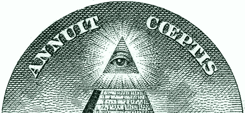
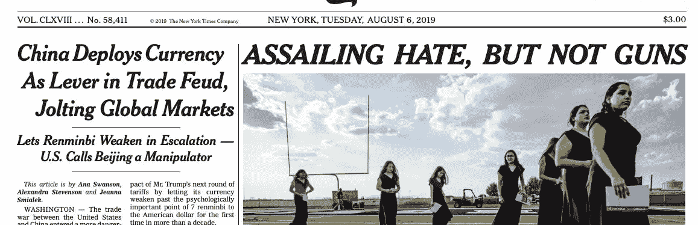
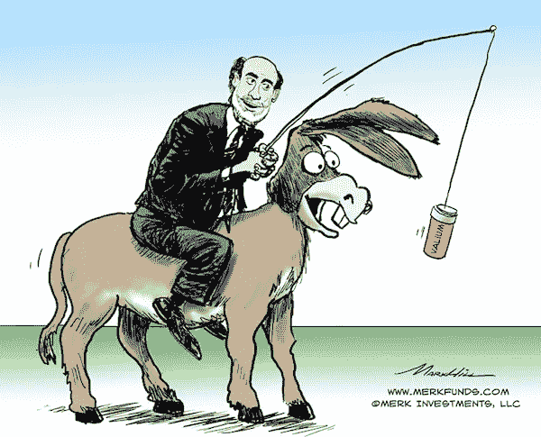
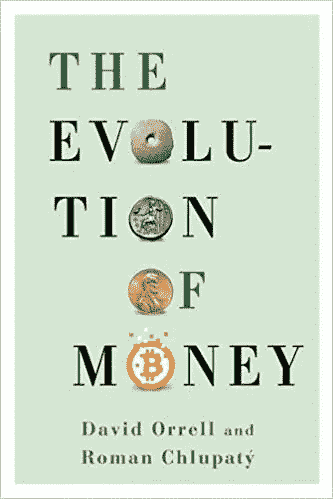

# 真的，钱是什么？

> 原文：<https://medium.com/coinmonks/really-what-is-money-bed76581b2dd?source=collection_archive---------1----------------------->

显然，销毁钞票是违法的。当我和一个朋友把两张 50€的纸币撕成碎片扔进海里时，我并不知道。我只是在测试我能不能做到，因为否则——我心想——我有可能在心理上被金钱所奴役，而我真的不想这样。几年后，在国外生活时，我在网上发现银行是如何创造我辛辛苦苦挣来的钱的。这感觉像是一个存在主义的启示。

钱是什么？人们不妨问，‘上帝是什么？’或者“什么是社会？”上帝总是在不同的地方被谈论，意思是不同的创造者和善良的普遍来源。在世俗的西方，我们认为我们已经克服了这些幻想，但我们经常谈论“社会”，好像所有人类都属于同一个民族国家。‘钱’也是如此。在中国，没有多少人愿意用美元支付，就像普通美国人在讨论生意时不会想到人民币一样。不过，至少你能看到这些人用各自的语言称之为钱的物品、代币或数字。

这东西不像上帝或社会那么无形。它可能像影响我的生活一样影响你的生活，所以真正了解它是个好主意。我们可以从感受一下我们今天常说的“钱”开始。在你的生活中，你可能想尽可能多地积累这些东西，或者你已经放弃了自由的幻想。无论如何，我们可以假设，如果你有足够的钱，你就不需要担心去工作和做那么多你并不真正想做的事情。这可能是真的。

所以，让我们来看看对这个问题的典型回答，比如说，为什么你刚刚赚的十美元有任何价值——除了“因为人们相信他们有价值”。回答如下:“开证行欠你 10 美元”。这个回答很多人都很满意。然而，如果你已经读了这篇文章的这么多，你可能并不满意。事实上，银行怎么会欠你同样的“东西”——如果我们可以称之为东西的话——别人已经给你了？你会发现，所谓的原因，简单地说，就在“银行欠账”这几个字的魔力中。银行“发行债务”。这 10 美元本身就是债务。

这样谈论债务，而不提及作为债权人，到底是谁欠了你什么，是不是很奇怪？然而，事实是人们一直都在这么做。这不仅是他们创造货币的方式，也是他们创造银行、政府，当然还有上帝和社会的方式。这些不是可识别的个体，而是机构或宗教的门面，许多人觉得他们甚至欠他们自己的存在。按照官方说法，在美国，美元是由政府的充分信任和信用支持的。但政府不是特别的人。它的代表不断变化，所有公民都必须效忠于抽象的国家实体，他们必须为之工作的最终主人和债权人。通过这种方式，银行创造的所有货币所代表的债务，包括你的 10 美元，都将得到偿还——假设你为这 10 美元提供商品或服务时支付的不是你。

现在让我们假设你已经成功积累了 100 万美元——100 万美元。也许军方给了你这些代币，刚从中央银行取出来的，作为你为国家服务的奖励。是的，人们愿意给你他们的商品和服务作为交换，因为这样他们也能得到商品和服务。然而，最终，拥有 100 万美元意味着通过他们对美国的忠诚，某些人——可能不是中国人！— *用这些代币欠你*一些商品和服务。首先，这些人需要他们，因为他们以税收的形式欠政府。这个国家创造了这些东西，但是想要回来。因此，你可以放心，你再也不用工作了，因为其他人也被卷入了债务和欲望的疯狂漩涡。还是可以放心？这就变得复杂了，因为不仅‘银行欠你的’这几个字有魔力。同样,“10 美元”这个符号也是有魔力的。谁知道这个数字代表了多少价值，或者在任何时候人们愿意为此付出多少——如果允许他们自己决定的话。

此外，由于银行不断创造这种货币，有一件事你可以肯定:你的 100 万美元将不断贬值。银行被迫为国家服务。不像其他生产者，他们不能生产不同种类的货币并提供给他们的顾客。他们只需要发行新的美元，这样“经济”就会为了“社会”的利益而增长。但是一旦他们又创造了 100 万美元，从数学上来说，你的钱只值一半。随心所欲制造出来的、如此丰富、如此容易的东西，不可能长久保持其价值。一个人当然可以把它当作珍贵的东西，想要回来。人们可以像银行那样贷出去并收取利息。人们可以固定物品的价格以防止其膨胀。然而，最终，这个系统将会崩溃，这个抽象的、永恒的债权人将不得不承认其信用缺失，变得非常不安，并可能像过去在衰退后所做的那样走向战争。

因此，你将不得不把这笔钱投资到其他能让它更保值的东西上，尤其是如果你想给你的孩子留下一些的话。或者，作为一名右翼人士，你可以投票支持那些将支撑美元价值的总统和政策。比如，你可以通过捍卫“反恐战争”来确保美国优先获得世界石油。或者你可以投票给另一个政党，作为一个左翼人士，为了得到更多的钱，或者更多的信贷，或者更多的债务，或者其他任何可以让别人为你提供的东西。

# 货币本身

它通常有助于区分我们能看到的东西和我们不能看到的东西，或者区分真实的东西和想象的东西。我看不到社会或上帝，也许你也看不到，但许多人会说，当你相信它时，你就会看到它。同样，我们要么相信货币是一种在任何地方都有效的交换手段，比如黄金，要么相信中的*是一种只在某个地理区域有效的交换手段。即使你认为黄金的价值仍然只是一个信仰问题，世界上大多数黄金最终出现在国家银行的金库里也一定有原因。有信仰，也有信念。*

事实上，黄金是一种安全的价值储存手段，因为它不能由任何政府或金融系统随意发行。除了作为商品的其他用途之外，它必须被开采和加工到可以用作交换媒介的程度。在整个历史和史前时期，其他东西也有同样的功能，例如，燧石、牙齿、贝壳、珠子、大麦、盐、铜和银。这些东西自然是稀缺的。这意味着与今天法定“货币”的人为稀缺完全不同的东西，法定“货币”只是输入银行账户的一个数字。当一个人拥有这些东西时，你可以肯定的是，要么(I)他们之前已经努力去获得它们，要么(ii)获得任何类似的东西同样需要之前的努力。与上面的“钱”的情况相比，它不需要努力去创造，是为了从别人那里得到一件商品或一项服务而制造的*。*

如果你已经阅读了本文的大部分内容，你可能会同意前面的区别是重要的。我们需要停止使用同一个词来描述这两个非常不同的事物，至少这样我们可以避免我在引言中所阐述的混淆。从现在开始，让我们试着把第一件事叫做*信用*，第二件事叫做*金钱*，尽管这确实很难。

显然，信用是为某些人(实际的或潜在的)创造的交换媒介，这些人相信创造信用的机构，或者被迫相信并向它们致敬。只有在这一事实之后，人们才开始为未来的需要储蓄信贷，尽管储蓄并不是必要的，因为他们总是可以利用这些机构来制造更多的信贷。另一方面，货币是用来为任何一种社会环境储存价值的，是用来与所有人进行交易的，与文化无关。与信用不同，货币成为交换媒介只是因为其他人也同样在为未来做准备。

# 困惑的专家

Bernard Lietaer 是一名经济学家和工程师，在金融系统的顶层工作。我不会用他的广泛的课程来烦你。这么说吧，他非常清楚什么是信用。你可以知道的方法之一是他能够向外行人解释它。在他的《货币的未来》一书中，他写道:

> 我们的主流制度是现代工业时代世界观的无意识产物，它仍然是那个时代价值观和主导情感最强大、最持久的设计者和执行者。例如，我们所有国家的货币使得与我们的同胞在经济上的互动比与“外国人”更容易，因此鼓励了民族意识。类似地，这些货币旨在促进其使用者之间的竞争，而非合作。金钱也是永无休止增长的隐藏引擎，这已经成为工业社会的标志。

你可以看出他知道什么是荣誉的另一种方式是，他关心:“在我们内心深处，我们都想为我们的孩子留下一个更好的世界，我们希望在我们有生之年能够亲身经历这一点。”

然而，伯纳德的主张围绕着什么叫做补充货币。他仍然认为信用和货币是政府的工具，只是由在当地发挥作用的代币来补充。他给出了这方面的工作实例，比如日本的“关爱关系券”，在日本，人们接受这些代币作为交换，比如照顾老人。这个信贷如何运作的清晰例子表明，即使是像伯纳德·里塔尔这样的人也无法逃脱信贷与金钱的混淆。因为帮助老年人是道德的，所以不仅有通过照顾他们来“赚钱”的动机，而且还有一种义务，任何人都可以利用这种义务来感觉他们应该得到帮助。这样，我们又回到了起点，就像瘾君子相信他们控制了事实上控制他们的东西。

另一方面，有些人对经济价值的柏拉图式信仰关注的是物质而不是道德。像大卫·奥雷尔这样的数学家甚至宣称货币和信贷的本质是量子的——是的，就是量子物理学。对奥瑞尔来说，如果你和我决定组成这篇文章的字母是钱——每个字母都有其在字母表中位置的数值——并且我们用它们来调节我们的交换，我们就在这些东西的“虚拟”值和数字的“真实”值之间建立了量子叠加。这是一个非常了不起的观点——我[不是在开玩笑](https://play.google.com/store/books/details/David_Orrell_The_Evolution_of_Money?id=CXu0CwAAQBAJ)(第 56 页)我说的话是从这个观点出发的:人类并不是通过数字来认同房子的价值。相反，这个数字本身就是房子的价值。当电磁波显示自己是会飞的具体粒子时，它们也会出现在货币协议中。也许电磁场被分成了不同的细胞，它们有时会为了各自的价值观而互相开战……(反正我还是回去写吧)。

当我写这篇文章的时候，在谷歌上搜索“什么是钱”的第一个结果是“T1 ”,这说明了另一个有效的错觉。作者是另一位成为作家的顶级经济学家。他的文章确实考虑用我在上面提到的方式来解释类似通货膨胀的东西——作为信用印刷的结果。但与此同时，信贷“本质上是一种商品”，因为它的供应是有限的，所以人们可以用这种商品“购买他们需要和想要的商品和服务”(原文如此)。你会看到奥瑞尔的量子二元性在这种论述中反复出现，交换媒介同时是商品而不是商品。对这位作者来说，区分什么是政策导致的供应受限，什么是政策导致的供应受限，似乎并不重要；或者可以神奇创造的商品和不能创造的商品之间的区别，比如我们早餐吃的东西。

从这个角度来看，我们的环境问题不应该令人惊讶，因为我们的经济学家和政治家认为，地球应该赶上他们的魔力，资源应该流动，以换取这些由数百万国家创造的象征性“商品”。没有任何宗教或政治体系相信他们的伪装本身。他们总是用论据和事实来支持它，比如货物或商品的事实，或者他们在教堂和国库中持有的资产的事实。同样，像上述文章作者这样的经济学家用“事实”来支持他们自己关于信用价值的论点，即如果没有信用，我们将不可避免地诉诸物物交换。Lietaer 也把他对货币未来的建议建立在易货是所有经济交易的核心这一思想的基础上。

“货币”和物物交换之间的这种二分法是经济学教科书不假思索地复制的一个古老神话的一部分。正如奥瑞尔自己所回应的(第 26 页)，人类学家通过研究没有市场经济的人类社会会发生什么，已经完全否定了这一观点。然而，这并不是因为人类学家一般能区分货币和信用。相反，[债务](https://en.m.wikipedia.org/wiki/Debt%3A_The_First_5000_Years)是现在和将来的全部。对许多人来说，除了通过在某个特定领域从制度上强加一个交换体系，无论是否象征性的，世界上根本没有办法拥有一个正常运转的经济。

因此，没有必要纠结于那些相信信用价值的人的困惑；我们可以求助于那些相信货币价值的人，比如黄金或白银，看看是否还有什么困惑。这种更现实观点的倡导者是 T2 奥地利经济学院。这些思想家“大胆”地将创造力和决策能力归于个人而非社会。然而，他们仍然被卷入与另一队的[激烈辩论](https://www.nakedcapitalism.com/2011/09/david-graeber-on-the-invention-of-money-%E2%80%93-notes-on-sex-adventure-monomaniacal-sociopathy-and-the-true-function-of-economics.html)。这又是由于信用与物物交换的旧二分法。不幸的是，奥地利人仍然购买它，因为他们认为货币本身来自以物易物的个人。我从经验中知道这些情感上的困难，尽管我从来不觉得自己是一个奥地利人。当一个人拒绝货币的制度来源时，感觉唯一的避难所是“个人”，所有国家和制度的创造者。否则，一个人就会成为各种预言无意义和毁灭的恶魔的猎物。

# 生物学和比特币

最终，在寻找这个核心问题的答案时，我意识到我必须放弃所有的意识形态。我仍然很难意识到我反对意识形态是多么的意识形态化。我第一个孩子的出生被证明是无价的。事情就是这样，而不是我们希望的那样。你可以读上一句的话，但体会它们的意思是另一回事。金钱的价值同样根植于我们的日常经验，就像所有的生物价值一样。

当人们想到生物学时，他们往往会想到不太存在的东西，如自私的基因或地球母亲。他们相信极端的准确性相当于极端的现实主义，忘记了他们生活在一个动物的世界里。他们没有意识到现实和我们认为应该是什么之间的差异。他们[低估了](https://www.academia.edu/38507581/Childrens_pretence_A_scientific_perspective_on_social_reality)我们想象事物存在的明显强烈的本能，我们想象事物正是因为我们如此希望它存在，因为我们‘爱它’。因此，这些人要么将生物货币理论斥为“纯理论”，要么像量子经济学家一样，接受没有什么是真实的这一离奇现实——如果这样的现实可以被接受的话。但是生物学始于个体观察生物，与它们互动，给它们可理解的名字和功能。生物学是唯一对人类存在有科学见解的研究分支，因为它旨在解释猿类如何相互交往——也是以爱的方式。

Photo by [Roberto Nickson](https://unsplash.com/@rpnickson?utm_source=medium&utm_medium=referral) on [Unsplash](https://unsplash.com?utm_source=medium&utm_medium=referral)

我这篇文章所基于的[金钱生物理论](https://www.academia.edu/40138316/Money_is_a_token_of_cooperation_The_biology_of_indirect_exchanges)认为金钱是合作的象征。我不打算在这里详细阐述，尽管可以说，合作不是人们用工作来支持荣誉的价值时所做的事情——那是利他主义。当人们使用金钱时，他们是在间接合作，共同建设一些东西。如果你看看最高级的货币形式，[比特币](https://bitcoin.org/en/how-it-works)，你会发现这正是其运作背后的理念。尽管比特币只是数字，但它们并不是通过某种机构共识来分配价值的，而是通过一种真正的共识。比特币之所以有价值，是因为一些运行程序的计算机——它本身是由人类运行的——花费精力寻找一个数学难题的答案，并在这样做的过程中，向互联网上的其他计算机提供了先前投资的证据。这些计算机是一个网络的自愿节点，所有这些都验证并建立在那些先前投资的基础上，以创造本质上的电子价值。

比特币的合作、非利他性质[甚至对那些理解其技术细节的人来说也是难以捉摸的](https://www.academia.edu/40138316/Money_is_a_token_of_cooperation_The_biology_of_indirect_exchanges)。他们中的许多人，如[维贾伊·博雅帕蒂](https://medium.com/u/9efdc740067f?source=post_page-----bed76581b2dd--------------------------------)是奥地利经济学的粉丝，尽管比特币的存在对他们的理论[是一个打击](https://mises.org/library/bitcoin-regression-theorem-and-emergence-new-medium-exchange)，他们的理论认为货币是来自物物交换的“最具流动性的商品”。因为比特币还没有像 20 世纪的人认为的那样被普遍接受，所以比特币不被视为货币。但门格尔、米塞斯、哈耶克都是前互联网时代的人，都有着强烈的民族意识。比特币之所以是货币，正是因为它们超越了如此古老的社会背景，因为它们凝聚了人们合作的愿望，无论他们出生在哪里。

# 今后

目前，互联网上有数百种加密货币。几年前[我预测](http://disq.us/p/1al11et)政府会加入这种狂热，但我没有意识到像脸书这样的国家当然也会[加入。并非所有这些硬币都像比特币，但它们都受到了比特币的启发。所有这些硬币都在争夺用户。它们具有不同的技术特征，本质上代表了对货币的不同理解。正如我已经解释过的，不可能有很多这样的幻觉。人们要么相信价值先于金钱，要么相信价值先于金钱。](https://www.theverge.com/2019/7/15/20692263/facebook-libra-cryptocurrency-hearings-congress-trump-bitcoin)

互联网没有国界，尽管它是由美国国防部发起的。它的用户不必遵循相同的政策或拼写系统，如果他们不同意它。他们只是去加入另一个生产不同单词、数字、货币或信用的网络。伯纳德·里塔尔(Bernard Lietaer)可以在比特币发明之前预见到它的到来，所以他想象这场全球性的革命将发生在“补充货币”的生产中。发生的事情远不止这些。人们甚至从性别和养育角色中赚钱。当然，搬家并不像变成另一个人那么容易，但在全球经济中，占主导地位的金钱也必然是全球性的。因此，人们如此喜欢制造自己的硬币是可以理解的，这些硬币引发了左派和右派之间同样古老的[政治斗争。我们想征服世界。我们想把价值放在金钱之后，引导我们天生的动力去创造新的神和社会。](https://www.coindesk.com/short-guide-bitcoin-forks-explained)

没有什么比“金钱”更能揭示社会自恋的本质了。人们说什么或辩护什么都不重要，因为一切都归结于此。信贷是“经济”的燃料——你的国家的经济。它是由中央银行为了“发展”经济而发行的。然而[这种增长似乎不会导致财富从一代人到下一代人的逐步积累。相反，每个人都不得不继续工作，以赚取更多的信贷或支付前几代人留下的债务！](https://www.theatlantic.com/ideas/archive/2019/08/millennials-are-screwed-recession/596728/)

那么，如果不是财富，到底是什么在生长？我认为这是社会成员繁衍成功的表现，如果用几代人来衡量的话。当然，一些人的财富确实增加了，他们可能会留下更多的后代。但他们依赖于来自同一社会的其他人，实际或潜在的人谁将提供商品和服务的信用；这些穷人只有在他们也留下后代的情况下才会这样做——尤其是与其他社会留下的后代数量相比。

我想不出任何其他方式来解释这样一个令人困惑的现象，没有人真正受到责备。如果可以，请告诉我。这种进化过程的无意识本质也解释了为什么似乎没有人理解“钱”；为什么我们爱它又恨它，因为我们被它所控制；为什么国内政治右翼和左翼之间总是存在紧张关系；以及为什么经济学家听起来像某种世俗的牧师。

20 世纪是不断扩张的社会争夺地球控制权的冲突时代。结束了。它的增长无疑是由技术和工业推动的，但它植根于“让它成为货币”或法定货币的竞争性垄断。现在，这个物种正处于这种疯狂的后果之中，遭受着环境带来的后果。我们要做什么？一如既往，这是你的选择。

> [在您的收件箱中直接获得最佳软件交易](https://coincodecap.com/?utm_source=coinmonks)

