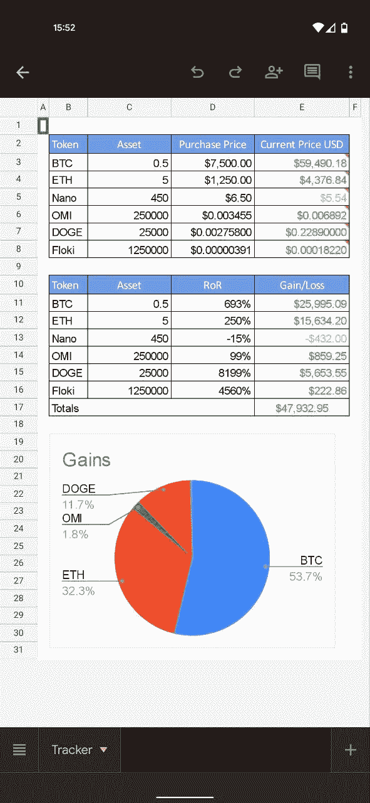

# 实时加密货币跟踪器-手机应用程序与谷歌表！

> 原文：<https://medium.com/coinmonks/realtime-cryptocurrency-tracker-phone-app-with-google-sheets-e16b61f3b80f?source=collection_archive---------12----------------------->

几个月前，我的手机丢了，手机上有我的加密钱包和我用来购买和交易加密货币的所有交易所的应用程序。尽管我的手机和加密钱包都被锁上了，我还是慌了！！！

当这种情况发生时，我决定不再在我的主手机上携带我的加密钱包或交易所，我现在在家里有一个备用设备，安装了这些应用程序，在我的主手机上，我所有的就是我将要向你展示的应用程序。

由于该文件连接到 CoinMarketCap 来检索硬币价格，这意味着如果硬币在 CoinMarketCap 上，您可以在这里跟踪它！

我知道我知道，你可以用 Blockfolio 这样的应用程序完成同样的事情，但我对 Excel 和 Google Sheets 有点着迷，所以我想自己做。

This is how the app looks like.

跟踪器连接到 CoinMarketCap 并检索硬币的最新价格。

这是追踪器的链接:

[https://docs . Google . com/spreadsheets/d/1 HTC r3qs 04 qgdz 1 vgw 5 wckedmnkajtnk qfvohpm 0 SD 9 c/edit # GID = 0](https://docs.google.com/spreadsheets/d/1HtcR3qs04QGdz1VgW5WCkEDmNkajtNKqFvoHPm0SD9c/edit#gid=0)

当你打开链接时，点击**文件**，然后点击**制作副本**:

Click on File, then Make a Copy.

一旦你这样做了，你可以开始修改文件，使之成为你的。实际上，该文件将为您提供:

**令牌**:令牌名称(手工输入)。

**资产**:您持有的代币总数(手动输入)。

**采购价格**:可以是采购价格，也可以是平均成本(手工输入)。

**当前价格 USD** :如果当前价格大于购买价格，则为绿色，否则为红色(Google Sheet formula)。

**RoR** :回报率(谷歌工作表公式)

**收益/损失**:你获得或损失的钱数和总数，这是两者的约定(Google Sheet 公式)。

由于这是一个电子表格，您可以随意添加/删除/修改公式。

# 让我们修改文件

1.  添加/删除行:该文件是作为一个例子创建的，如果你只有 4 个硬币，你可以删除多余的行，或者如果你有超过 6 个硬币，你可以添加更多。这可以通过右键单击一行，然后添加或删除行来实现:

How to add or remove rows.

2.更改令牌的名称以匹配您的名称，因为这是手动输入，您只需修改单元格:

Change the name to match your Assets.

3.该文件最重要的部分是从 CoinMarketCap 检索硬币价格的公式。例如，当您选择单元格 E3 时，您会看到以下公式:

*= import XML(" https://coinmarketcap . com/currences/bit coin/"，"//div[@ class = ' price value ']")*

在括号后面，您会注意到一个 CoinMarketCap 链接，在本例中，该链接将检索比特币的价格。如果您希望用不同的硬币修改此行，您需要修改此链接，否则它将始终检索比特币的价格。

Cell E3 that show the formula.

更具体的说，你需要在链接上修改***/比特币/*** 为你选择的币。为了确保您得到正确的硬币名称，请进入 CoinMarketCap，选择您希望跟踪和替换的硬币。

CoinMarketCap link example.

最后，你需要删除我的评论，用你的替换它:

How to delete my comment.

然后，您可以复制整个公式，并通过右键单击单元格，然后选择*注释:*来添加注释

How to add a comment with the link in it.

3.该文件包含一个录制的宏，该宏将以两种方式刷新文件:

**首先**:如果你正在使用电脑，你可以同时按下: *Ctrl+Alt+Shift+0* 或者你可以选择:扩展，然后宏，然后刷新，如下图所示。

How to run the Recorded Macro.

**第二个**:如果你在用手机上的电子表格，每次打开都会自动刷新宏。

4.现在，如果你还没有在手机上下载 Google Sheets。打开应用程序，点击文件名旁边的 3 个点:

然后，向下滚动并选择*添加到主屏幕*。

对弹出消息执行同样的操作。

这就是你要的:

最后，我制作了一个简短的视频来解释这个文件是如何工作的，如果你想看看的话:

如果您有任何问题，请不要犹豫，留下您的评论或联系我们。

PS。如果你想联系，过来打个招呼！在 [Linkedin](https://www.linkedin.com/in/cajina/) 上。

> 加入 Coinmonks [电报频道](https://t.me/coincodecap)和 [Youtube 频道](https://www.youtube.com/c/coinmonks/videos)了解加密交易和投资

## 也阅读

 [## 杠杆代币[多头代币]终极指南

### 杠杆化令牌是具有杠杆化风险敞口的 ERC20 令牌，不考虑保证金、要求、管理…

medium.com](/coinmonks/leveraged-token-3f5257808b22)  [## 最佳加密交易所| 2021 年十大加密货币交易所

### 编辑描述

blog.coincodecap.com](https://blog.coincodecap.com/crypto-exchange)  [## 2021 年最佳加密借贷平台| 6 大比特币借贷平台

### 获得比特币和其他加密货币的最佳贷款利率

medium.com](/coinmonks/top-5-crypto-lending-platforms-in-2020-that-you-need-to-know-a1b675cec3fa)  [## 2021 年最佳免费加密交易机器人

### 2021 年币安、比特币基地、库币和其他密码交易所的最佳密码交易机器人。四进制，位间隙…

medium.com](/coinmonks/crypto-trading-bot-c2ffce8acb2a)  [## 最佳 4 个加密交易信号电报通道

### 这是乏味的找到正确的加密交易信号提供商。因此，在本文中，我们将讨论最好的…

medium.com](/coinmonks/best-crypto-signals-telegram-5785cdbc4b2b)  [## 5 个最佳社交交易平台[2021] | CoinCodeCap

### 编辑描述

blog.coincodecap.com](https://blog.coincodecap.com/best-social-trading-platforms)  [## BlockFi 评论 2021:利弊和利率| CoinCodeCap

### 编辑描述

blog.coincodecap.com](https://blog.coincodecap.com/blockfi-review)  [## 如何在印度购买比特币？2021 年购买比特币的 7 款最佳应用[手机版]

### 如何使用移动应用程序购买比特币印度

medium.com](/coinmonks/buy-bitcoin-in-india-feb50ddfef94)  [## 加密税务软件——五大最佳比特币税务计算器[2021]

### 不管你是刚接触加密还是已经在这个领域呆了一段时间，你都需要交税。

medium.com](/coinmonks/best-crypto-tax-tool-for-my-money-72d4b430816b)  [## 存储比特币的最佳加密硬件钱包[2021] | CoinCodeCap

### 编辑描述

blog.coincodecap.com](https://blog.coincodecap.com/best-hardware-wallet-bitcoin)  [## Pionex 评论 2021 |免费加密交易机器人和交换

### Pionex 是为交易自动化提供工具的后起之秀。Pionex 上提供了 9 个加密交易机器人…

medium.com](/coinmonks/pionex-review-exchange-with-crypto-trading-bot-1e459d0191ea)