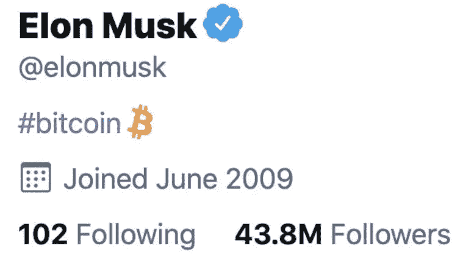

# 加密货币在全球获得认可的原因

> 原文：<https://medium.com/coinmonks/reasons-why-cryptocurrency-is-gaining-acceptance-worldwide-861a1f1dc521?source=collection_archive---------6----------------------->

## 以下是 5 个原因

毫无疑问，像比特币和以太坊这样的加密货币已经在全球范围内获得了价值和认可。Paypal、Square 和特斯拉等公司推出了用比特币交换商品的选项，这是导致比特币价值大幅上升的众多因素之一。

但是整个加密市场又是怎样的呢？

如何解释加密市场的总体势头？这纯粹是因为投资者给那些寻求购买者的一个“故事”吗？仅仅是基于区块链技术的提升吗？嗯，它不是**只是**这些中的任何一个。

这里有许多**因素在起作用。**

话虽如此，以下是加密货币在全球获得认可的原因。

## **虚拟货币的乐观价值**

有些人喜欢认为货币具有许多客观特征，而不是它用于的工具价值。然而，加密货币却大不相同。抛开普通价格飙升的硬币不谈，像 DOGE 和 SHIB，其他成熟的加密货币，特别是比特币和以太坊，已经证明吸引了纯粹对它们给新技术时代带来的东西感兴趣的投资者的注意力。

当分析师谈论传统支付设置如何成为过去时，特定的加密技术，即区块链，被视为市场颠覆者。对 crypto 的乐观(和主观)看法并不能作为世界范围内接受它的主要原因。

原因将在接下来的章节中进一步阐述！

## **买卖过程中各方的利益**

你可能听说过一些零售公司使用 P2P 支付和安全交易的主要加密功能。虽然在讨论硬币的价格时存在重大波动，但商家允许消费者用比特币甚至无数的 Altcoins 支付。消费者在购买产品时可以访问作为奖励的加密相关服务，预计将从这一点向前发展。

## **放宽法规**

虽然中国已经表达了对加密货币的立场，但萨尔瓦多被宣布为第一个宣布比特币为法定货币的国家。其他国家对此持乐观态度，表明它们支持这一倡议。与比特币首次出现在黑暗网络相比，其他国家也有类似的观点。

## **加密货币的多样性方面**

你可能听说过市场上一些硬币上的各种科技项目。硬币中的特征为投资者和感兴趣的个人提供了长期价值，因为它“有所支持”，并且有开发者想要实现的目标。

这是许多密码怀疑论者担心的事情，他们认为这似乎是所有投机者和寻求快速赚钱的小投资者所为。

然而，建立硬币，例如，以太坊有一个区块链平台，有多种激励措施让个人参与加密社区。这可以被认为是乙醚价格大幅上涨的主要原因。

## **每个人都在谈论它！**

Source: Elon Musk’s Twitter Account

你可能已经见过加密和技术爱好者，Elon Musk 在他的 Twitter 账户上提倡比特币和 Dogecoin。你可能在任何地方都听到他的文章引起了加密市场的变化，获得了公众的不同意见。

与这种积极的热情相反，其他投资者，包括沃伦·巴菲特、查理·芒格和比尔·盖茨都不赞成这种新的科技现象。巴菲特表示，这“违背了文明的利益”，他们三人都表示，他们永远不会投资加密货币。

*这为什么会出现在一篇讨论加密货币如何获得全球认可的文章中？*

谈论它就能说出它的名字！

让多个投资者、首席执行官和科技企业家讨论他们对任何事情的看法，可以让其他人知道它的存在，并形成他们自己对它的看法。这可能说起来容易做起来难，但它让人们拓宽了对虚拟货币的理解，并让他们自己决定这是否值得他们花时间和精力投资于这个概念。

这可以被视为加密货币在全球范围内被接受的次要原因之一。但它确实允许在所有加密的事情上使用开放方言(如果有一天一枚硬币成为世界主要货币，这将是所需要的)。

> 加入 Coinmonks [电报频道](https://t.me/coincodecap)和 [Youtube 频道](https://www.youtube.com/c/coinmonks/videos)了解加密交易和投资

## 也阅读

 [## 最佳加密交易所| 2021 年十大加密货币交易所

### ICON _ PLACEHOLDEREstimated 预计阅读时间:28 分钟加密货币交易所的加密交易需要知识…

blog.coincodecap.com](https://blog.coincodecap.com/crypto-exchange)  [## 2021 年 10 大最佳加密贷款平台| CoinCodeCap

### 当谈到加密货币贷款时，大量因素等同于良好的收入状况。此外，借款的一部分…

blog.coincodecap.com](https://blog.coincodecap.com/crypto-lending)  [## 2021 年最佳免费加密交易机器人

### 2021 年币安、比特币基地、库币和其他密码交易所的最佳密码交易机器人。四进制，位间隙…

medium.com](/coinmonks/crypto-trading-bot-c2ffce8acb2a)  [## 最佳 4 个加密交易信号电报通道

### 这是乏味的找到正确的加密交易信号提供商。因此，在本文中，我们将讨论最好的…

medium.com](/coinmonks/best-crypto-signals-telegram-5785cdbc4b2b)  [## BlockFi 评论 2021:利弊和利率| CoinCodeCap

### 今天，我们提出了一个全面的 BlockFi 评论，这是一个成立于 2017 年的加密贷款平台，拥有其…

blog.coincodecap.com](https://blog.coincodecap.com/blockfi-review)  [## 如何在印度购买比特币？2021 年购买比特币的 7 款最佳应用[手机版]

### 如何使用移动应用程序购买比特币印度

medium.com](/coinmonks/buy-bitcoin-in-india-feb50ddfef94)  [## 加密税务软件——五大最佳比特币税务计算器[2021]

### 不管你是刚接触加密还是已经在这个领域呆了一段时间，你都需要交税。

medium.com](/coinmonks/best-crypto-tax-tool-for-my-money-72d4b430816b)  [## 存储比特币的最佳加密硬件钱包[2021] | CoinCodeCap

### 保管您的数字资产很容易，但找到正确的存储方式却是一项繁琐的任务。在线钱包有一个风险…

blog.coincodecap.com](https://blog.coincodecap.com/best-hardware-wallet-bitcoin)