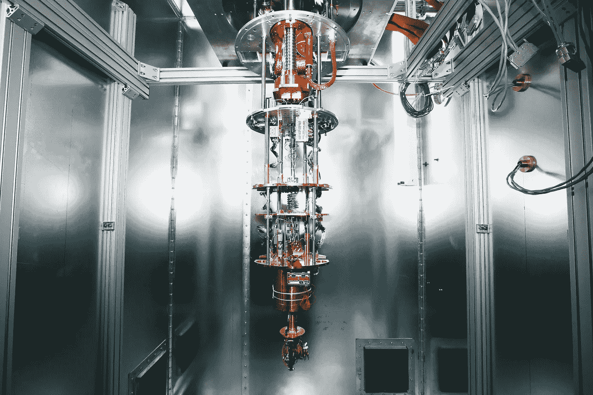
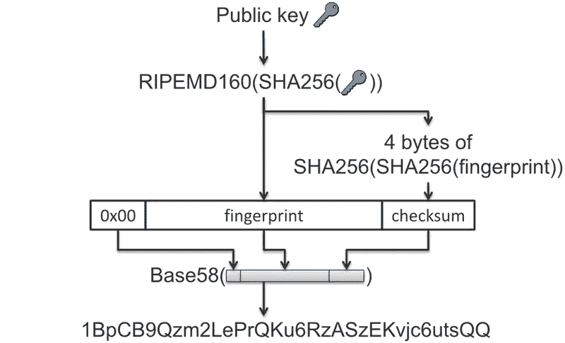

# 量子霸权不会威胁比特币的原因

> 原文：<https://medium.com/coinmonks/reasons-why-quantum-supremacy-wont-threaten-bitcoin-d71f339fa626?source=collection_archive---------2----------------------->

谷歌称，它的一台量子计算机已经能够解决一个在传统计算机上几乎不可能解决的问题，成为第一台实现所谓“量子优势”的计算机。

据报道，谷歌的量子计算机能够在 3 分 20 秒内解决一个计算——证明随机数生成器产生的数字的随机性——这将需要世界上最快的传统超级计算机 Summit 大约 10，000 年。

Source: Reuters

如果是真的，那就是大新闻。上周，一篇包含工作细节的论文被发布到了美国宇航局的服务器上。但是，很快就被撤了下来。几家媒体报道了这些谣言。

秘密世界密切关注着这一事件的发展，他们应该如此。毕竟，自比特币问世以来，量子计算的威胁激励着研究人员、技术专家以及现在的政府开发能够抵御最强大的量子计算机攻击的软件。

“量子至上”到底是什么？为什么它会对加密社区构成威胁？比特币和以太坊在“量子至上”面前会崩溃吗？

# “量子至上”到底是什么？

谷歌据称实现量子至上的消息爆出后不久，该论文就被从 NASA 网站上撤下，原因不明。谷歌尚未对此发表任何评论，但有一个合理的信念，因为谷歌和美国宇航局在去年濒临实现量子优势，当时谷歌在 2018 年与美国宇航局合作，帮助他们证明量子优势。

虽然听起来很强大，但量子至上是一个描述量子计算设备解决经典计算机实际上无法解决的一些特定问题的能力的术语。

谷歌在[的竞争对手](https://diginomica.com/ibm-and-googles-race-quantum-computing-takes-mysterious-turn)，IBM，在 2001 年发布了一台具有 7 个“量子位”(量子位)的量子计算机原型，这是计算机量子能力的一种度量。在过去的两年里，英特尔、IMB 和谷歌分别发布了 49、50 和 72 量子位的类似原型。中科院也实现了 11 个量子比特的量子计算机样机。

## 为什么它会对加密社区构成威胁？

理论上，谷歌声称的 53 量子位量子计算机可以在几秒钟内破解 53 位密码。

但要理解量子计算的潜在威胁，你需要了解比特币的是，它的架构依赖于两种算法:[用于数字签名的椭圆曲线数字签名算法](https://en.bitcoin.it/wiki/Elliptic_Curve_Digital_Signature_Algorithm) (ECDSA)和作为哈希函数的 SHA-256。理论上，量子计算机可以使用 Shor 算法来破解 ECDSA。

比特币钱包包含一组密钥对，每个密钥对由一个私钥和一个公钥组成。ECDSA 是比特币中使用的私钥和公钥背后的加密技术。它包括结合有限域和椭圆曲线背后的数学来创建单向方程。私钥是一个数字，通常是随机选取的。从私钥开始，比特币使用椭圆曲线乘法(一种单向加密函数)来生成公钥。根据公钥，比特币使用单向加密哈希函数来生成比特币地址。

私钥可以应用于交易的数字指纹，以产生数字签名。这个签名只能由知道私钥的人生成。与此同时，任何有权使用公钥和交易指纹的人都可以用它们来验证签名。如果一台计算机获得公钥，并使用公钥计算私钥，它就可以操纵区块链上的资产。

比特币使用 secp256k1 作为其公钥密码中椭圆曲线的参数。这意味着基于私钥计算公钥很容易，但反过来就非常困难，从而保证了整个过程的安全。

Source: Wikipedia

[SHA-256](https://en.bitcoin.it/wiki/SHA-256) 是美国国家安全局设计的 SHA-2 加密哈希函数的成员。SHA 代表安全散列算法。加密散列函数是在数字数据上运行的数学运算；通过将计算出的“散列”(算法执行的输出)与已知和预期的散列值进行比较，人们可以确定数据的完整性。任何数据都可以生成单向散列，但数据不能从散列中生成。

[Shor 的算法](https://arxiv.org/pdf/1710.10377.pdf)可以通过在假设的量子计算机上计算离散对数来破解椭圆曲线密码。理论上，量子计算机可以使用 Shor 算法从你的公钥中获取你的私钥，正如《量子抵抗账本》的 Jack Matier 最近在[媒体邮报](/the-quantum-resistant-ledger/quantum-supremacy-and-the-case-for-quantum-security-today-in-blockchain-390fe55daab5)中解释的那样。一篇论文[预测](https://arxiv.org/pdf/1710.10377.pdf)量子计算机最早在 2027 年可以在不到 10 分钟(600 秒)内破解比特币的签名方案。

## 比特币和以太坊在“量子至上”面前会崩溃吗？

据估计，在一台包含 4000 个量子位和 1 亿个门的量子计算机上，2048 位 RSA 密钥可以被破解。专家推测，这种大小的量子计算机可能在未来 20-30 年内问世。那么这是否意味着比特币不再安全了呢？不完全是。

考虑到谷歌的机器只有 53 个量子位，它仍然比不上比特币使用的那种加密技术。此外，肖尔的算法还不会对比特币构成威胁。

比特币钱包地址基于 ECDSA 的公钥私钥体系。但是，钱包地址不直接使用公钥。相反，它使用公钥的哈希值。如果你没有公开你的公钥，Shor 的算法就没用了。因此，即使量子计算机破解了加密算法，它也无法威胁到从未进行过任何交易的地址。

虽然比特币和其他证明有效的硬币使用的原生加密算法目前是安全的，但事实是量子技术的进步速度正在加快，假以时日，这可能会构成威胁。但是就像量子技术是如何发展的一样，加密项目也是如此。

已经有人在努力为后量子时代开发新的加密算法。

从事分片工作的以太坊开发者贾斯汀·德雷克[表示](https://www.trustnodes.com/2018/07/07/casper-perhaps-2019-sharding-maybe-2020-says-ethereum-researcher)以太坊团队正在开发以太坊 3.0，尽管还处于非常早期的研究阶段。他说，我们计划进行超级二次扩展。

在一次采访中，程序员和作家 Vitalik Buterin 被问及对 ETH 3.0 的愿景时，[说](https://docs.ethhub.io/other/ethereum-2.0-ama/)“斯塔克斯，斯塔克斯和许多斯塔克斯。希望有一些好的方法来实现 2 秒的平均阻塞时间。无论是在基础层还是通过各种易于使用的第 2 层系统，都可以实现极其有效的跨片通信。”ETH 3.0 将专注于量子抵抗和量子安全。

同样，比特币可以升级其算法和分叉，以应对量子计算机潜在的威胁。比特币在过去十年取得了令人难以置信的进步。它见证了计算机的飞速发展。迄今为止，没有一种先进技术——无论是单核 CPU、多核 CPU、超级计算机还是人工智能——能够挑战比特币的加密货币系统。可以肯定地说，比特币和以太坊不会受到量子霸权的威胁。相反，它将在面对这些挑战时完善自己。

