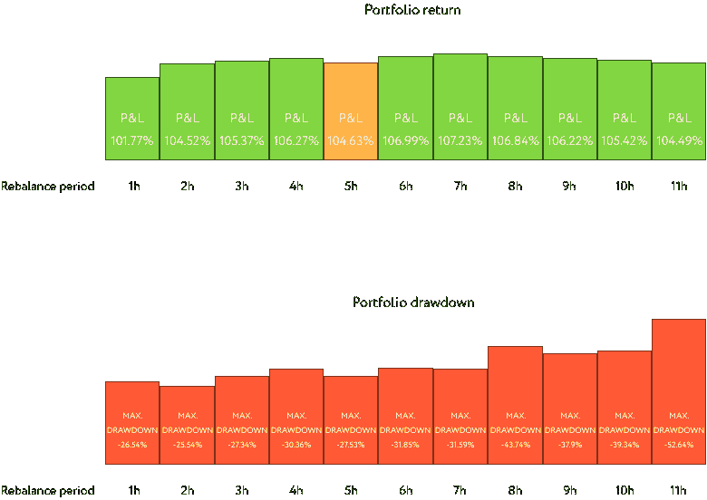

# 加密产品组合的再平衡策略

> 原文：<https://medium.com/coinmonks/rebalancing-strategy-for-your-crypto-portfolio-590397f2282b?source=collection_archive---------0----------------------->

在本文中，我们将尝试找出为我们的加密产品组合选择哪种重新平衡策略，以及重新平衡会如何影响我们的加密产品组合。

# 加密货币投资决策

首先，投资者能得到的最大礼物之一是一个能消除投资决策中的情绪的策略。这样的策略是重新平衡加密产品组合。

其次，值得注意的是，对于再平衡来说，投资的距离或视野以及风险承受程度很重要。

# 加密货币投资前景

我所说的投资期限是指一段时间，可以是 1 年、3 年或更长时间。投资者首先需要决定并遵循他的投资周期，因为在大多数情况下，再平衡不会在短时间内产生预期的效果。然而，鉴于其高波动性，加密货币投资组合可以在 1 个月的时间内显示出良好的结果，因此监控和监测您的加密货币投资组合非常重要。

> 另请阅读:最佳加密交易机器人

# 为什么要重新平衡加密产品组合？

那么，再平衡对投资组合有什么影响呢？重新平衡是恢复加密组合的原始结构。让我们看一个重新平衡加密货币投资组合的例子。

重新平衡平滑了我们加密投资的盈利能力，迫使我们低买高卖。重新平衡加密货币投资组合是一种战术工具，允许您将投资组合中的加密货币份额恢复到其原始分配。再平衡不是一个目标，它只是一个机械工具。在 Holderlab 中，我们按周期和阈值实现了手动和自动再平衡；我们将进一步讨论这个问题。

# 加密货币组合存在哪些类型的再平衡？

手动平衡你决定你什么时候需要恢复平衡，如果你认为时机已经到来或者有足够的偏差。不幸的是，在做投资决策时，我们必须排除情绪，坚持明确的规则。让我们更详细地考虑另外两种类型的再平衡—阈值再平衡和定期再平衡。

# 加密货币投资组合的阈值再平衡

加密货币的阈值再平衡代表投资组合中的一种加密货币达到一定增长水平的时刻，例如，在 5%的水平，我们再平衡这个加密投资组合。

我们来看看上面加密货币分布的测试结果:

## 5%阈值重新平衡

结果:P&L — 117.68%，最大下降— 79.87%(由于我们的测试组合不太多样化)

此外，我们建议查看所有可能的阈值再平衡分布及其盈利能力和最大提款的图表。

正如我们从阈值再平衡的分布图中看到的，我们没有开始计算超过 6%阈值的再平衡，因为投资组合的提款超过了 95%。显然，我们不能允许这样的减值，这也可能是由于我们投资组合和相关性的多样化。

看看这个密码组合的相关性。

1 年的相关性估计。我们看到四项资产中的三项彼此高度相关。这就影响了我们的支出规模。

# 加密货币投资组合的定期再平衡

当你需要在不同时间重新平衡你的投资组合时，定期重新平衡是一种策略，例如，每周一次或每 5 小时一次。

正如我们所见，随着每小时再平衡时间的增加，投资组合的回报相当有限。投资组合提取不会像阈值再平衡那样呈指数增长。正如我们所见，从 8 小时的再平衡期开始，盈利能力下降，支出增加。

# 每日和每周定期重新平衡

正如我们所见，与小时周期相比，下降显著增加，而风险和盈利能力与阈值再平衡值相当。

## 摘要

在本文中，我们研究了再平衡的原则以及使用它的必要性。我们的测试投资组合不是非常多样化，并且部分资产彼此之间有很强的相关性。在下面的文章中，我们将研究加密投资组合的多样化及其与风险和盈利能力的关系。

**归属**

本文由 [Holderlab.io](https://holderlab.io/?utm_source=coincodecap.com) 供稿，在 Holderlab 的帮助下，你可以自动化你的自动再平衡加密货币投资组合的策略。您可以选择近币种投资组合的手动、定期或阈值再平衡。现在免费重新平衡您的加密组合。

*本文并非投资或投资加密货币的建议，也不被视为投资建议。一定要小心，因为投资加密货币风险很大，需要咨询理财顾问。过去的收益不能保证未来的收益。*

## 另外，阅读

*   最好的比特币[硬件钱包](/coinmonks/the-best-cryptocurrency-hardware-wallets-of-2020-e28b1c124069?source=friends_link&sk=324dd9ff8556ab578d71e7ad7658ad7c)
*   [加密复制交易平台](/coinmonks/top-10-crypto-copy-trading-platforms-for-beginners-d0c37c7d698c)
*   最好的[加密税务软件](/coinmonks/best-crypto-tax-tool-for-my-money-72d4b430816b)
*   [最佳加密交易平台](/coinmonks/the-best-crypto-trading-platforms-in-2020-the-definitive-guide-updated-c72f8b874555)
*   [unis WAP 最佳钱包](/coinmonks/best-wallets-to-use-uniswap-e91a6385d9e8)
*   最佳[密码借贷平台](/coinmonks/top-5-crypto-lending-platforms-in-2020-that-you-need-to-know-a1b675cec3fa)
*   [block fi vs Celsius](/coinmonks/blockfi-vs-celsius-vs-hodlnaut-8a1cc8c26630)vs Hodlnaut
*   [莱杰 vs 特雷佐](/coinmonks/ledger-vs-trezor-best-hardware-wallet-to-secure-cryptocurrency-22c7a3fd391e)
*   [顶级 DeFi 项目](/coinmonks/defi-future-10-promising-projects-in-the-defi-world-ff2b697ab006)
*   [bits gap review](/coinmonks/bitsgap-review-a-crypto-trading-bot-that-makes-easy-money-a5d88a336df2)——一个轻松赚钱的加密交易机器人
*   为专业人士设计的加密交易机器人
*   [3commas Review](https://blog.coincodecap.com/3commas-review-an-excellent-crypto-trading-bot) |一款优秀的密码交易机器人
*   [3Commas vs Cryptohopper](/coinmonks/cryptohopper-vs-3commas-vs-shrimpy-a2c16095b8fe)
*   Bitmex 保证金交易的白痴指南
*   加密摇摆交易的权威指南
*   [Bitmex 高级保证金交易指南](/coinmonks/bitmex-advanced-margin-trading-guide-2270c195ce25?source=friends_link&sk=1d986cca731f5084b9a2db4a4bc4a7ad)
*   开发人员的最佳加密 API
*   [加密套利](/coinmonks/crypto-arbitrage-guide-how-to-make-money-as-a-beginner-62bfe5c868f6)指南:新手如何赚钱
*   顶级[比特币节点](https://blog.coincodecap.com/bitcoin-node-solutions)提供商
*   最佳[加密制图工具](/coinmonks/what-are-the-best-charting-platforms-for-cryptocurrency-trading-85aade584d80)
*   了解比特币最好的[书籍有哪些？](/coinmonks/what-are-the-best-books-to-learn-bitcoin-409aeb9aff4b)

> [在您的收件箱中直接获得最佳软件交易](https://coincodecap.com?utm_source=coinmonks)

