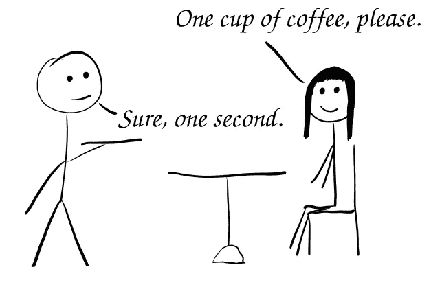
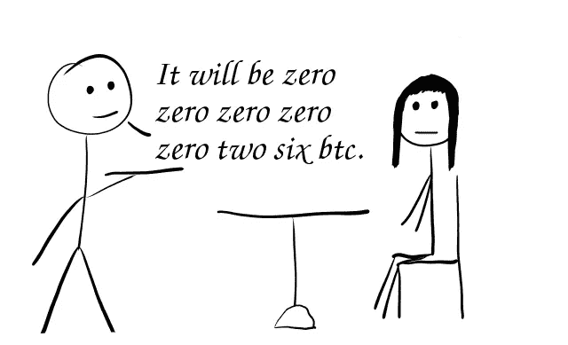
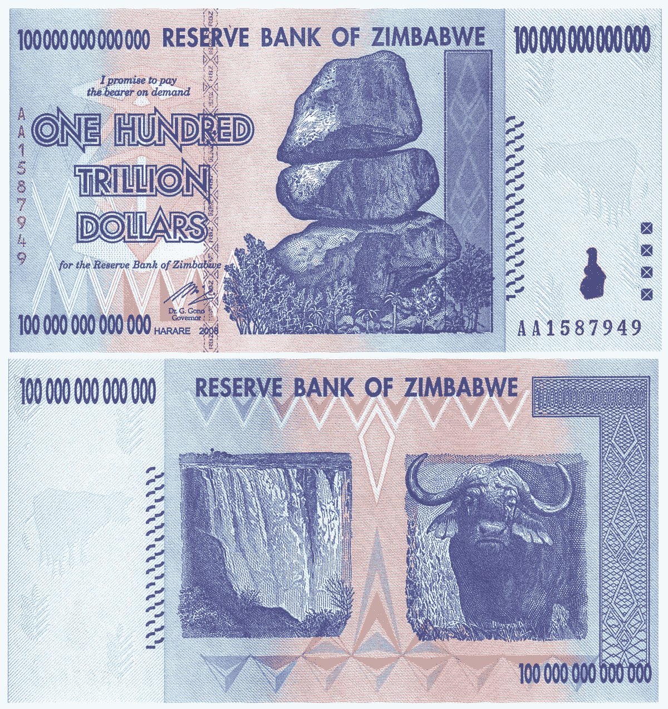

# 比特币价格的重新计算

> 原文：<https://medium.com/coinmonks/recalculation-of-the-bitcoin-price-62105784b66e?source=collection_archive---------3----------------------->

对于加密货币，尤其是比特币来说，去年是不可思议的一年。它的价格成功回到了 5 位数，并最终打破了历史新高。但是成功也带来了一些困难。我们所有人通常都在处理比 1 BTC 少得多的资金。例如，1 美元一杯咖啡等于 0.000026 BTC。很没用，是吧？所以我决定解释我们如何解决这个问题。

# 重新定义理论

我们定期观察法定(经典)货币的重新定义过程。根据维基百科，重新定义是改变流通中的纸币或硬币面值的过程。这可能是因为通货膨胀使货币单位变得很小，只有大面额的货币在流通。最著名的例子是津巴布韦元:

一般来说，实施货币再命名是为了应对恶性通货膨胀，恶性通货膨胀会逐步提高产品和服务的价格，降低货币的实际价值。随着时间的推移，价格变得过大，阻碍了日常交易，因为携带大量钞票的风险和不便，可能输入零的错误，或者只是因为人脑(意识)不能很好地处理大数。当局可以通过重新命名来解决这个问题:引入一个新的单元来取代旧的单元，将固定数量的旧单元转换成一个新单元。如果通货膨胀是重新定义的原因，这个比例远大于 1，通常是 10 的正整数次幂，如 100、1000，甚至 100 万，这个过程可以称为“切零”。

# 比特币的解决方案

然而，我们有通货紧缩模型的比特币。结果，不断增长的需求和通货紧缩使得 BTC 的单位变得如此之大，以至于我们不得不处理 BTC 的极小部分。这也可能导致在发送交易时出现打字错误，并且看到这样的数字带有零会感到不舒服。

此外，重新定义还有另一个原因:通货紧缩。因此，重新定义的比率也必须相反。好的比例是 0.001，那么以美元计算的“新”比特币价格会少 1000 倍。此外，没有必要介绍新的单位。的确，我们还是可以称之为“比特币”。

> 再一次。如果你今天拥有 1 辆总价值为 40，000 美元的 BTC，你将自动拥有同样总价值为 40，000 美元的 1000 辆 BTC。但是 1 BTC 的价值是 40 美元。

值得注意的是，如果我们在分隔符前的十进制数字上添加三个零，我们必须在分隔符后删除三个零，以节省 satoshis 中的总流通供应量。比特币的最小分数是 satoshi (0.00000001 BTC)，因此在重新定义后，1 Satoshi 将等于 0.00001 BTC。

你有没有想过为什么一个聪等于 0.00000001 BTC？我认为中本聪以 0.001 的比率奠定了两次重新提名的机会。因此，在第二次重新定义后，一个聪将等于 0.01 BTC，这是法定货币中典型的“分”比率。

# 结论

是时候重新计算比特币价格了。与意见领袖和开发者分享这篇文章。我希望我们将来能处理更多合适数量的 BTC，并加快采用过程。