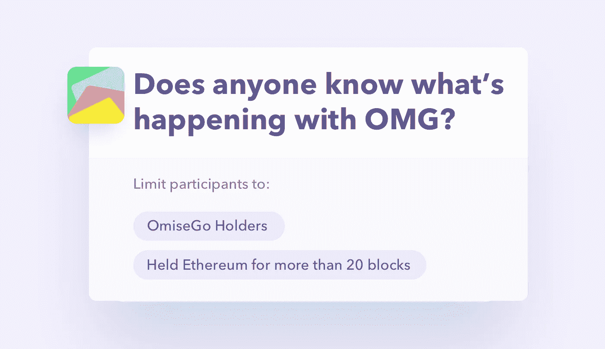

# 获得优质答案的以太*

> 原文：<https://medium.com/coinmonks/receive-ether-for-quality-answers-50179c30ce28?source=collection_archive---------2----------------------->

## *或任何 ERC20 令牌

Tok'n'talk 是代币持有者的社交平台。你可以在这里或[这里](/coinmonks/social-network-for-any-token-960afd36d280)了解更多信息，或者直接跳到[网站](http://tokntalk.club)。

我们正在开发一个功能，将奖励讨论线程参与者以太或特定 ERC20 令牌的被动收入。我们试图建立一个有机的生态系统，这将激励社区更多地参与他们的项目，并将广告客户置于一个新的角色，这将服务于社区而不是平台。

赞助不再只是丰富平台的制度。现在成员的报酬取决于他们对社区的贡献。

## 报名参加 tokntalk.club/threads[的测试版](https://tokntalk.club/threads)

# 它是如何工作的？

## 1.开始讨论

每个讨论线程可以被限制到具有特定令牌或经济行为的人。例如:“仅限 OMG 持有者”、“仅限持有以太坊超过 X 个街区的人”、“仅限拥有 siring Cryptokitties 的人”等。

它确保线程的每个参与者除了创建高质量的线程和获得奖励之外，还有相同的动机(持有/行动)。现在线的质量越好，以后的收益越大。

## 2.接受乙醚或任何 ERC20

每当被赞助的地方被购买，每个人都收到乙醚或令牌的基础上，他们在线程的活动和影响。每个人都可以对赞助的地方出价，这是一个持续的拍卖，因此每个人都有持续的支出。

## 3.继续接收

早期发布的有价值的内容可以保证被动收入，直到以太坊结束。接收令牌的权利是可交易的，它开启了关于特定线程的重要性的整个推测领域。

# 基于令牌的广告定位

该功能允许基于令牌的目标定位。发布者知道线程参与者的兴趣:他们的令牌余额、以前的交易等。

参与者对赞助内容的反应也会有所不同，因为资金被用于对他们有利的地方，而不是平台。

# 我们需要你的帮助

没有设置，没有验证，没有帐户创建。你甚至可以在没有钱包的情况下发布消息，然后领取奖励。我们正在尽最大努力做到尽可能方便用户。

这就是为什么我们需要您的帮助和反馈。

加入关于 [Tok'n'talk](http://tokntalk.club) 、[电报](https://t.me/joinchat/Ff2fyUYwRF7m3Vxew5UxnA)或[的讨论，注册电子邮件更新。](http://eepurl.com/dHDPgb)

> [直接在您的收件箱中获得最佳软件交易](https://coincodecap.com/?utm_source=coinmonks)

