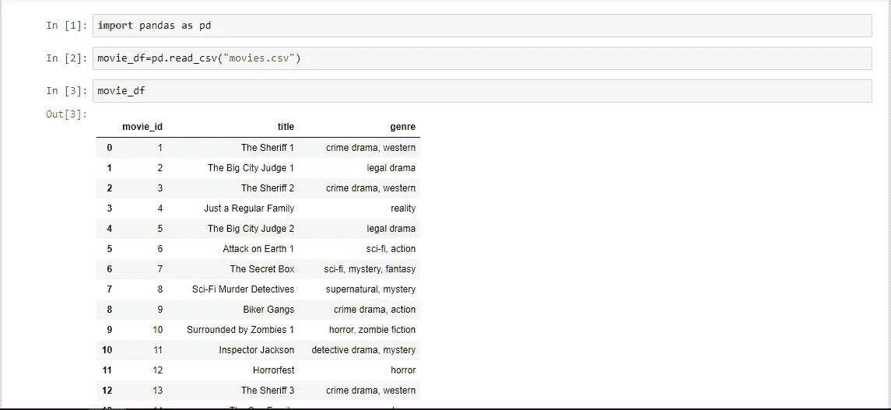
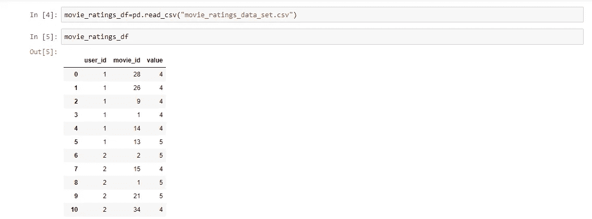
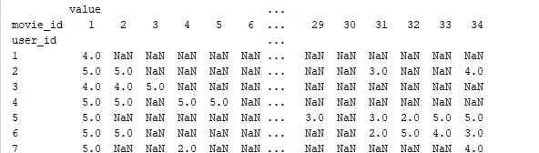
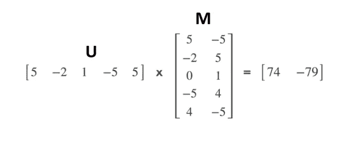
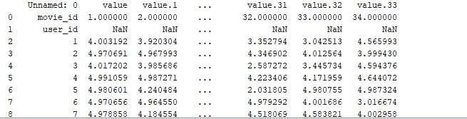
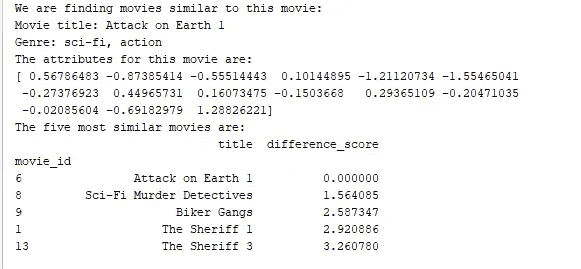
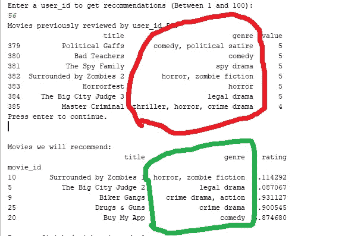
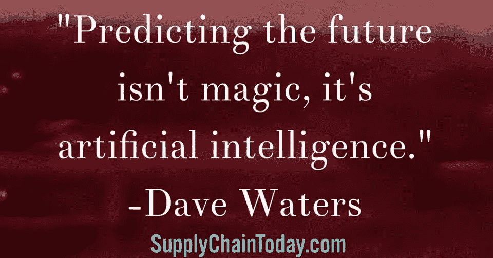

# 推荐引擎:Python

> 原文：<https://medium.com/coinmonks/recommendation-engine-python-401c080c583e?source=collection_archive---------1----------------------->

现在，每日系统在推荐引擎的帮助下，引导你度过一生。他们根据你的兴趣向你推荐产品。例如，如果你在 IMDb 或网飞等网站上搜索一部好电影，它会根据你的兴趣为你提供推荐。


它不仅适用于电影，也适用于其他服务，如在线购物、在线课程等。这怎么可能呢？有什么猜测吗？

是的。在机器学习的基础上使用 python 是可能的。让我们进入核心部分。

**什么是推荐系统？**

从技术上讲，推荐系统是信息过滤系统的一个子类，它试图预测用户对某个项目的“评分”或“偏好”。

实际上，这个系统根据你过去的购买或兴趣为你提供物品或产品。

**制作推荐系统的类型？**

*   基于内容的推荐—基于产品属性
*   协作过滤——基于相似用户

**基于内容的推荐:**

系统利用每个产品的知识来推荐新产品。

例如:如果你有兴趣看一部爱情电影，那么系统会向你推荐该类型的电影列表。

如果你有关于你要推荐的产品的描述性数据，那就很好了。

**协同过滤:**

系统没有任何关于产品的知识，但它只根据用户过去的评分进行推荐。

例如:假设您对一系列电影进行了评级。如果你给了一部恐怖片 4.5/5，给了一部冒险片 1.5，那么以后系统会推荐恐怖片。

现在让我们继续构建系统的步骤。

在这个模块中，我们利用了大量的数据集。

**使用的数据集列表:** movies.csv，movie_ratings_data_set.csv



movies data set



movie ratings data set

**以矩阵形式表示产品评论:**

```
***# Convert the running list of user ratings into a matrix using the 'pivot table' function***ratings_df = pd.pivot_table(df, index=**'user_id'**, columns=**'movie_id'**, aggfunc=np.max)
print(ratings_df)**#aggfunc is used to handle duplicate data. If an user rated the same movie twice it would consider the maximum value for the duplicates.**
```



Ratings matrix

**处理矩阵中的缺失数据:**

每个人的兴趣都是独特的。假设用户评级反映了一部电影对用户独特兴趣的吸引程度。

例如:如果用户#1 给电影# 1 5 个等级，那么显然他/她可能给该类型的其他电影相同的等级。

这是在矩阵分解的帮助下完成的，将在下面讨论。

**用户评分:**

计算用户评分的步骤包括

*   模拟电影如何吸引人们的兴趣。
*   模拟用户的兴趣。
*   衡量用户兴趣与电影属性的匹配程度。

1.  **模拟电影诉求(矩阵 M):**

*   行动上诉评级
*   戏剧吸引力等级
*   浪漫吸引力评级
*   艺术上诉评级
*   大众喜爱的吸引力等级

现在我们有了属性，我们将根据列出的属性给出从-5 到+5 的评分。

2.**模拟用户兴趣(矩阵 U):**

*   行动兴趣等级
*   戏剧兴趣分级
*   浪漫兴趣等级
*   艺术利率
*   迎合大众的兴趣等级

同样，我们将根据列出的属性从-5 到+5 给用户评级。

3.**计算用户兴趣:**

将矩阵 M 和矩阵 U 相乘，我们可以得到每个属性的分数。如果我们对每个用户都这样做，我们可以得到所有电影的评论矩阵。

基于线性代数，我们将矩阵表示为，



Matrix Multiplication

我们可以使用 numpy 库只用一行代码来执行这个操作。

**矩阵分解:**

应用矩阵分解来寻找潜在的(隐藏的)特征:

```
U,M=matrix_factorization_utilities.low_rank_matrix_factorization(ratings_df.as_matrix(),num_features=15,regularization_amount=0.1)
```

乘以得出预测评级:

```
predicted_ratings = np.matmul(U, M)
```

现在预测收视率如下。



Predicted Ratings

对于用户#1，可以看出电影#34 获得了最高分。所以这是我们应该推荐给他/她的第一部电影。当我们向用户推荐时，用户可能会对我们的预测进行评分，我们可能会将其添加到矩阵中以供将来计算。

> “我们的评级越高，阵列中的孔洞数量就越少，为矩阵提供精确值的优化就越好。”

**矩阵分解的工作:**

矩阵分解是一种将大矩阵分解成小矩阵的思想。它用于填补收视率数据集中的漏洞，因为用户可能不会对某些电影进行评级。它只是使用迭代算法从较大矩阵到较小矩阵的反向操作。起初我们猜测，然后检查，经过几次反复，我们更接近正确的答案。

**第一步:**

用随机数设置 U 和 M 矩阵的元素，如果我们把它们相乘，那么结果将是随机的。

**第二步:**

检查计算出的矩阵与真实矩阵有多大差异。获得一个成本函数。我们称这种差异为成本。

> “代价是我们犯了多大的错误”

**第三步:**

用数值优化算法搜索最小成本。目标是让成本函数更接近于零。数值优化算法将在每次迭代中对数字进行微调。

Scipy 的 fmin_cg()函数用于求最小成本。

**第四步:**

重复步骤 3，直到我们得到最小成本。

在迭代的某个时刻，我们会得到最小的成本，U 和 M 的值就是我们使用的值。如果我们再次乘以 U 和 M，我们会得到一点不同于原始矩阵，但这不是一个主要的缺陷，因为我们更接近它！

**使用潜在表示的产品相似性:**

我们的系统不能推荐任何产品，直到用户给出任何评级或评论(即:首次用户)。对于这类用户，我们可以向他们展示一些类似的产品。通过使用矩阵分解计算产品属性，我们还可以计算产品相似性。

在进行并发运算以寻找相似性之后，我们得到如下结果



Finding similarity

**最终产品:**

我们的产品根据给定的用户 id 给出推荐。它基于过去的评论训练系统，并给我们一个非常接近兴趣集的结果。



Recommended Movies

**避免过度拟合:**

考虑两种不同类型的电影，如恐怖喜剧和严重恐怖，一个糟糕的推荐系统可能会通过丢弃其他所有东西来获得恐怖属性。这可以通过正则化来避免，正则化可以减少单个属性的权重。

> “正则化量越高，单个属性的权重越小”

**参考文献:**

*   “使用矩阵分解和协同过滤的电影推荐系统”

**谢谢…祝您愉快:)**

