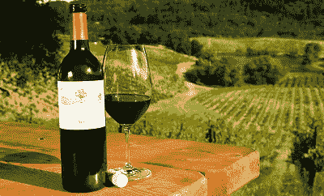
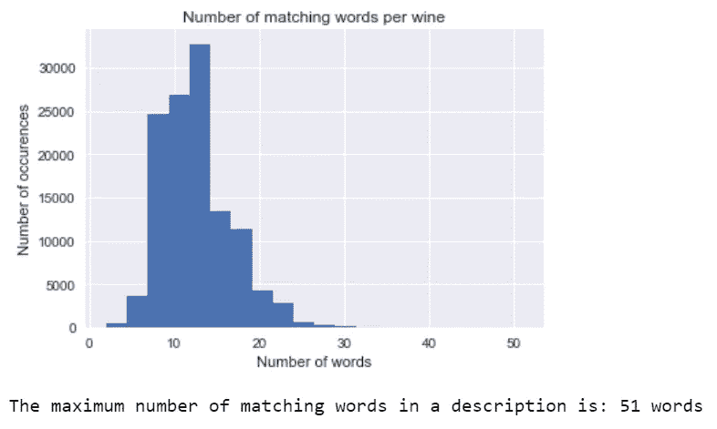

# 推荐一瓶完美的葡萄酒

> 原文：<https://medium.com/coinmonks/recommending-the-perfect-bottle-of-wine-118c28ba736e?source=collection_archive---------1----------------------->



和大多数好兄弟一样，我尽量在特殊场合给妹妹买贴心的礼物。碰巧的是，我姐姐喜欢葡萄酒，而我喜欢数据，所以当我偶然发现[这个数据集](https://www.kaggle.com/zynicide/wine-reviews)有超过 130，000 种葡萄酒的分数和评论时，这是一个完美的机会来利用我对数据的兴趣。

它始于给我妹妹的一条无辜的短信:


我们的目标是建立一个推荐系统，使用她喜欢的葡萄酒列表来挑选一些我可以买给她作为生日礼物的葡萄酒。虽然选择的样本量很小——相对于 13 万种葡萄酒，只有少数几种——但我们可以使用过滤和语言处理来进行初步预测，随着时间的推移，随着她喜欢和不喜欢的葡萄酒列表的增长，我们可以继续将数据输入我们的推荐系统，并重新运行代码。

**数据和代码**

[数据](https://www.kaggle.com/zynicide/wine-reviews)是从[葡萄酒爱好者](http://www.wineenthusiast.com)那里刮来的，由 [Kaggle](http://www.kaggle.com) 用户以. csv 格式发布。它包括大约 130，000 条不同葡萄酒的评论，变量包括葡萄酒的国家、评论者的描述、积分排名、价格、地区、品种和酒厂。

该项目的完整代码发布在[我的 GitHub 这里](https://github.com/jordanbean/WineRecommender/blob/master/Wine_Project-checkpoint.ipynb)。

**推荐系统:它们是什么？**

推荐系统通常采用三种形式之一:协同过滤、基于内容的过滤以及两者的混合。

*协同过滤*是分析一个用户的行为，并基于其他相似用户做出推荐。例如，网飞基于我的观看历史知道我观看了哪些节目，并且可以推荐其他用户“喜欢我”(即具有相似的观看历史)也观看过的节目。

*基于内容的过滤*被隔离到单个用户，并获取他们过去购买或使用过的物品，通过描述或其他识别变量来寻找相似的物品。因此，当我在亚马逊上购买某种混合咖啡时，我可能会被推荐其他品种，这些品种具有相同的烘焙度，来自类似的地区，并且/或者在描述中有重叠的词。

*混合方法*顾名思义——基于内容和协同过滤的结合。如果我们回到网飞，他们可以(也确实)建立一个模型，可以识别与我的观看历史相似的节目，然后根据像我这样的人的观看行为对这些节目进行排名。

对于这个项目，因为我们没有其他用户可以比较，我们将严格使用基于内容的过滤。输入将是我们知道我妹妹喜欢的葡萄酒，推荐将是那些表现出与这些葡萄酒相似特征的葡萄酒——地区、描述、品种。

我决定构建三个独立的算法，然后将这三个混合起来作为最终的选择。第一个使用她已经喜欢的葡萄酒的特征，在那些特征过滤器中找到最高等级的葡萄酒；第二种方法使用文本数据和相似度对葡萄酒进行排序；最终使用 Python 的 scikit-learn 库中的语言频率技术。

**基本推荐系统**

基本推荐系统识别 Arielle 喜欢的葡萄酒(“训练”葡萄酒)的特征，并搜索符合这些特征的其他葡萄酒，然后根据分数和价格对它们进行排名。

这是通过对年份、价格、国家和品种等结构化变量设置一系列过滤器来实现的；在以后的迭代中，我们将在描述和标题列中使用更多的非结构化文本数据。

这将只给我们来自我们的“训练”数据的国家列表的葡萄酒，这些葡萄酒在固定的年份范围内生产，在我们的价格范围内，并且是我们知道她喜欢的葡萄酒类型/品种。

在设置了这些过滤器之后，为了得到各种类型和价位的组合，我为每种独特的品种确定了排名最高的葡萄酒，一个选择低于中间价格，一个选择高于中间价格。最终结果是 4 个品种的 8 种葡萄酒(GSM、黑比诺、起泡酒和西拉)，每个品种都有低价和高价的选择。

```
def rec_basic(df):

    """
    Look for the wines that match the most common characteristics of the ones that we that Arielle already enjoys.

    This includes setting up year, price, variety, and country filters. For each unique variety, find a high and low priced wine within our range that is the top rated and fits our filtered variables. The function will return a data frame with two recommendations per wine.
    """

    current_wine = df[df['arielle_choice'] == 1]

    current_filter = (df['arielle_choice'] != 1) # We don't want a wine that she already has tried

    year_min = current_wine.year.min()
    year_max = current_wine.year.max()

    year_filter = ((df.year >= year_min) & (df.year <= year_max)) # Filter for the year range of wines that she enjoys

    price_min = current_wine.price.min()
    price_max = current_wine.price.max()

    price_mid = price_min + ((price_max - price_min) / 2) # Create midpoint for high/low price adjuster

    price_filter = ((df.price >= price_min) & (df.price <= price_max)) # Filter for her typical price points

    countries = list(set(current_wine.country))

    country_filter = (df.country.isin(countries)) # Filter for country

    varieties = list(set(current_wine.variety))

    variety_filter = df.variety.isin(varieties) # Filter for wine type

    filtered_df = df[current_filter & year_filter & price_filter & country_filter & variety_filter] # Filtered data frame

    recommendation = []

    for variety in varieties: # Recommendation for each of her favorite varieties 

        var_df = filtered_df[filtered_df.variety == variety]

        lower_price = var_df[var_df.price <= price_mid] # One pick that's below the mid-point pricing
        higher_price = var_df[var_df.price > price_mid] # and one that's above

        top_rec_low = lower_price[['country','designation','points','price','title','variety']].sort_values(
            by='points',ascending=False)[:1] # Extract the highest rated lower-priced wine
        top_rec_high = higher_price[['country','designation','points','price','title','variety']].sort_values(
            by='points',ascending=False)[:1] # Extract the highest rated higher price wine

        recommendation.extend(top_rec_low.index) # Add the index value of the lower priced wine to the list
        recommendation.extend(top_rec_high.index) # Add the index value of the higher priced wine to the list

    rec_df = df.loc[df.index.isin(recommendation),:] # Extract only the recommendation index values from the data

    rec_df.sort_values(by=['variety', 'price'], ascending=True, inplace=True) # Sort/group by wine type then price

    return rec_df  # Return the recommendation data frame
```


Recommendations from the basic filtering

上述内容的局限性在于，我们正在将我们对宇宙的看法缩小到一组共同的、一致的特征。这些建议都是在西海岸(和美国)，因为那是她现在所在的地方，也是她最努力的地方，而且是在 2005 年到 2014 年之间。因此，虽然这是一个良好的开端，但我们仍然希望将我们的视野扩展到美国境外，进入新的领域，这将引导我们…

**文字推荐**

我们将构建的第二个推荐系统将组合给定行中的所有文本和值，然后在该观察中寻找与我们的“训练”选择中的单词相匹配的唯一单词的数量。

我们将通过使用 Python 中的 NLTK 库根据预定义的模式对每个观察中的文本进行“标记化”来实现这一点。

标记化是一种基于模式将一组文本值分割成唯一项的方法，例如，我们可以只提取单词、单词和数字、单词、数字和特殊字符等。从文本字符串。

例如，对最后一段的第一句进行标记会产生一个值列表[“标记化”、“是”、“一个”、“方式”、“到”…]。为了更进一步，我们去掉了常见的“填充词”(也称为停用词)，这些词不会给句子的意义增加价值(“一个”、“一个”、“这个”、“等等”)。删除了停用词的句子的最终标记化版本看起来像这样:["标记化"、"方式"、"分割"、"设置"、"文本"、"值"…]。

随着每一个句子被分割成一组成分，我们可以在更微观的层面上处理文本，以寻找观察结果之间的模式和相似性。

接下来，我们将在合并的“培训”评论(即 Arielle 已经告诉我她喜欢的葡萄酒)中创建一个包含所有独特单词的列表。

然后，我们将遍历每个观察中的标记化单词；对于每个标记化的单词，如果它出现在我们的单个单词训练列表中，我们将为该变量的计数器加 1，最后的计数器值作为相似性的代理。

一旦我们通过将一行中的每个条目连接到一个文本字符串中、对值进行标记并删除停用词来准备好数据，我们就可以开始寻找数据与我们想要的训练文本字符串的相似性了。



在应用了一些额外的排序和过滤后，我使用一个[最小最大缩放器](http://scikit-learn.org/stable/modules/generated/sklearn.preprocessing.MinMaxScaler.html)来缩放新的相似性变量(匹配单词的数量)(它根据数据相对于数据范围的值将数据放在 0-1 的范围内),并找到了美国葡萄酒和国际葡萄酒的最佳结果。


Top recs for U.S. wines


Top recs for international wines

这里的限制是描述葡萄酒的词汇基本上是无限的。一个人可以称葡萄酒为“果味十足”，而另一个人可以说“水果味十足”。意思基本上是一样的，但我们的系统不会发现这种差异。

虽然我们引入了更多的数据和因素，但我们仍然对美国葡萄酒有固有的偏见，因为与她喜欢的相匹配的国家和地区都包含在我们的文本字符串中。因此，为了尝试和弥补这一点，我们将只使用描述列，这是与每种葡萄酒相关的评论，描述了风味、成分或评论者对质量的其他看法。

**相似度推荐**

虽然前两个建议主要是在其他库的帮助下从零开始构建的，但我们将利用预打包的库来完成最终系统的繁重工作。我们的目标是仅使用 description 列来查找数据集中与我们的训练数据最相似的其他葡萄酒。这与第二个建议中所做的大致相当，但采用了更数学化的方法。

这个系统的核心将建立在所谓的术语频率逆文档频率(TFIDF)上。我发现[这篇文章](https://janav.wordpress.com/2013/10/27/tf-idf-and-cosine-similarity/)很好地解释了这个概念。

概括来说，给定一系列文本观察值，术语频率(TF)是单个文本字符串(观察值)中某个词的频率的度量，而逆文档频率(IDF)是它在样本中所有观察值中出现的频率的度量。然后计算 TFIDF 值，作为 TF 和 IDF 的乘积。

在我们的数据中，观察的 TF 值是葡萄酒描述中的一个词(假设“浆果”一词在描述中)在该描述中出现的频率，占所有词的百分比，而 IDF 将测量“浆果”在数据中所有葡萄酒描述中出现的次数。

在计算了每个观察中每个单词的 TFIDF 值之后，我们需要一种方法来度量单个观察和数据集中其他观察之间的相似性。再一次，把它带回到手头的任务，这意味着取 Arielle 喜欢的葡萄酒，并根据它们的 TFIDF 值找到与那些葡萄酒描述最相似的葡萄酒。

有许多不同的方法来计算相似性。在尝试了几种不同的方法并阅读了一些资料后，我决定采用余弦相似度。上面关于 TFIDF 的文章也很好地解释了余弦相似性。

使用我们从文本转换为数字的数据(它们的 TFIDF 值)，我们可以在“向量空间”中绘制这些数字点，并使用线性代数和三角学计算从该点到向量空间中绘制的所有其他点的距离。

如果这没有多大意义，那也没关系，因为这对我来说也是一个非常混乱的概念，但是余弦相似性的输出范围从-1 到 1，其中-1 表示两个项目完全相反，1 表示它们相同。处理文本数据时，输出范围缩小到 0 到 1。

通过循环她喜欢的每种葡萄酒，结果是一组推荐，这些推荐是其余数据中最相似的描述。

正如之前的美国偏见练习中的问题一样，美国葡萄酒的风味和描述方式很有可能不同于国际葡萄酒，所以除了一般的建议，我只过滤了非美国葡萄酒，并为该群体挑选了最匹配的葡萄酒。


Top US matches by description similarity


Top International matches by description similarity

这种方法的最后一个注意事项是，为了计算相似性，我只使用了 Arielle 的“首选品种”中的葡萄酒(即葡萄酒类型:Syrah、GSM 等。)因为文件的大小限制了在我的计算机上本地使用 130K+描述的整个列表。

**结论:我们应该挑选哪种葡萄酒？**

有趣的是，这三个不同的系统之间没有重叠，这显示了推荐系统中存在的主观性。三个推荐者中的每一个都单独地采取一个单独的但似乎合理的路线来发展推荐，然而集体的结果是独特的。

鉴于此，一旦汇总了每种方法的结果，我们就有大约 60 个“建议”需要整理。既然 60 块我都买不到她，那就该在推荐的“科学”上施点“术”了。

我开始剔除那些没有相关价格或者价格超过 50 美元的葡萄酒(抱歉，Arielle，我还买不起真正好的东西)。此外，正如 [Stax 大数据分析显示的](http://www.stax.com/big-data-champagne-and-sparkling-wine/)，50 美元以下的起泡酒和香槟有很多价值。

然后，我知道我的妹妹和 GSM 是她给我的品种中她最喜欢的一种，并插入我自己对 Syrah 的偏好，我只过滤了这两种类型的葡萄酒以及得分为 90 或更高的葡萄酒的数据。

最后，我决定每种都要一个，一个是美国本地的，另一个是国外的。因为此时只剩下一种国际葡萄酒，而且是一种 GSM，这就成了 GSM 品种的简单选择。对于 Syrah，我应用了一个过滤器，该过滤器将返回美国制造的排名最高的 Syrah

就是这样！从 130，000 种葡萄酒减少到两种，使用数据得出解决方案。我们最终的获胜者是来自塞拉丘陵 Fenaughty 葡萄园的 [2010 加州西拉](https://www.winemag.com/buying-guide/donkey-goat-2010-fenaughty-vineyard-shiraz-syrah-syrah-sierra-foothills-el-dorado)和来自南澳大利亚的 [2011 丛 GSM](https://www.winemag.com/buying-guide/john-duval-wines-2011-plexus-rhone-style-red-blend-g-s-m-barossa-valley) 。


下一个挑战是找到能买到葡萄酒并送货上门的地方，但找到合适葡萄酒的旅途乐趣最终让这一切都变得值得。

> [在您的收件箱中直接获得最佳软件交易](https://coincodecap.com/?utm_source=coinmonks)

[](https://coincodecap.com/?utm_source=coinmonks)