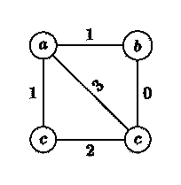
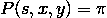

# 递归熔炼智能合同

> 原文：<https://medium.com/coinmonks/recursively-smelted-smart-contracts-cf9c5ea4d6bd?source=collection_archive---------5----------------------->

## 第一部分—基础理论

> “智能合同的基本思想是，多种合同条款(如留置权、担保、产权界定等。)可以嵌入到我们处理的硬件和软件中，以这种方式使违约者为违反合同付出昂贵的代价(如果愿意，有时会高得惊人)。”—尼克·萨伯

# 介绍

我们希望通过[递归熔炼](/@recursivesmelting/recursive-smelting-10721f181fcc)的智能合约系统实现的七个主要目标如下:

1.  **富有表现力的** —智能合同系统应该允许广泛的应用。
2.  **可验证** —所有用户都应该能够验证合同是否被正确执行。
3.  **双层**——智能合同的执行不是落在用户身上，而是落在“执行者”身上。
4.  **低风险** —违约应该受到严厉的惩罚。
5.  **隔离** —智能合约被允许存在于彼此不同的经济/生态系统中。
6.  **占用空间小** —在不牺牲表现力的情况下，存储在区块链上的数据量应该最小化。
7.  **私有—** 智能合同状态不是先验公共的。

由于以太坊的成功，我们一直把它作为范例。人们可以看到以太坊很好地满足了这些目标中的三个:图灵完备性是最具表现力的，矿工执行智能合同而不是典型用户(双层)，由于采矿的去中心化性质和现有的共识机制，风险肯定很低。

然而，如何才能真正验证智能合同执行正确？以太坊节点——对普通用户来说入门要求太高。有人可能会正确地认为，鉴于采矿的博弈论，“每个人都需要验证一切”的偏执水平是没有根据的，但事实仍然是，以太坊智能合同在严格意义上是可以验证的，但对大多数用户来说不是这个词的实际意义(本文[最近的论文](https://arxiv.org/abs/1809.09044)解决了这个问题)。

以太坊当然不是隔离的——用户出价让他们的交易进入一个有限的区块，因此互相出价执行他们的智能合约。这种拍卖是以太坊范围内的，如果一个特定的智能合约获得了相当大的关注(例如可怕的“Cryptokitties”)，其他用户将不得不相应地出价(并等待)。在某种程度上，这就是 Plasma 解决的问题——合同被暂时隔离到一个离链容器中，在“Plasma 退出”期间使用主链作为仲裁者。

以太坊的内存肯定不小——在撰写本文时，区块链大约为 100GB。虽然对矿商来说是可管理的，而且可能不会对集中化产生负面影响，但存储开销隐含在你支付给矿商的每笔费用中。

# 术语

我们快速浏览一下所需的符号和定义。我想很多观众对这一部分都很熟悉。随你怎么撇！

## 图形标记

一个 ***图*** 是 ***顶点*** 、 *V* 、 ***边*** 、 *E* 的集合。

*G* 的一个 ***顶点标号*** 是一个函数*f*:*V*→*S*其中 *S* 是标号的集合。同样， *G* 的一个 ***边标号*** 是一个函数*f*:*E*→*S*。

2.1 A graph labelling

## 有向无环图

一个 ***有向图*** *G* 是顶点 *V* 和边*e*⊆*v*×*v*的集合。

2.2 A directed labelled graph

我们将进入顶点 u 的边( *v* ， *u* )表示为 in( *u* )，将离开 *v* 的边( *v* ， *u* )表示为 out( *v* )。

一个 ***有向无环图*** (DAG)是一个有向边不构成封闭循环的图，也就是说，你不能沿着边的方向走回你来的地方。

2.3 A directed acyclic labelled graph

## 支持标签

我们描述一对( *f* ， *g* )，其中 *f* 为顶点标注， *g* 为边标注，作为 ***标注*** 。

假设 *G* 是一个 DAG， *G* 是一个子图。我们说 *G* 的一个标签( *f* ， *g* )在一个 DAG G 上有 ***support*** '如果 *f* 和 *g* 在其他地方都映射到⊥，我们把这表示为 supp(*f*)=*g*'。

2.4 A labelling supported on subgraph

结果是，支持内的顶点是令牌事务，支持外的顶点是常规事务。

## 逻辑与秩序理论

楔形符号∧在这里用来表示逻辑合取，与 how 类似

用于表示集合 *X* 上的和与积，我们表示为

作为 *X* 上的逻辑合取。

假设 *x* 和 *y* 是 DAG 中的顶点。我们说 *x* ⋖ *y* 如果从 *x* 到 *y* 有一条有向边。我们说 *x* < *y* 如果有顺序*x*⋖…⋖*y*；也就是说，有一条从 *x* 到 *y* 的有向路径。同理， *x* ≤ *y* 就是 *x* < *y* 或者 *x* = *y* 。

我们将所有顶点 *c* 的集合表示为使得*x*≤*c*≤*y*为[ *x* ， *y* ]，将所有顶点 *c* 的集合表示为使得 *x* ≤ *c* 为↑ *x* 和 *c*

## 比特币交易的 DAG

正如你现在可能已经猜到的，比特币交易的集合符合 DAG 的定义——交易是顶点，边是赎回输入的输出。

对于事务 *t* 和 *t'* 我们看到 *t* ⋖ *t'* 暗示 *t'* 花费 *t* 的一个输出，并说 *t* 是 *t* 的父级。如果 *t* < *t'* 我们说 *t* 在历史的 *t'* 。

注意， *G* 中的 *x* < *y* 可能不是指某个子图 *G* 中的*x<*y*。我们假设所有的顺序符号都是由比特币交易 DAG 给出的顺序。*

人们可以想象标记这个 DAG 的各种方式——一个例子是用它们的事务 ID 标记每个顶点，用它们的输出脚本标记边。与主题相关的另一个可能的边标记是:用输出的[值(数量)标记每个边。我们现在看到了一个有趣的特性——输入标签的总和等于输出标签的总和。这是比特币数量守恒，由比特币矿工强制执行。](https://en.bitcoin.it/wiki/Transaction#General_format_.28inside_a_block.29_of_each_output_of_a_transaction_-_Txout)

一个简单的例子可能是:每个事务， *t* ，包含一个 OP_RETURN，指定事务的类型(生成、铸造或转移)和每个输出的各种数量(定义 out( *t* )上的边标签)。具体来说， *f* ( *t* ) =(转移，(3，4，2))，而 *g* (t，t1) = 3， *g* (t，t2)=4， *g* (t，t3) = 2。

采用这种方法的例子有:[彩色硬币](http://coloredcoins.org/)、 [SLP](https://simpleledger.cash/) 和 [BitcoinToken](http://www.bitcointoken.com) 。他们为比特币 DAG 边缘提供了一个很好的标签，但没有先验的理由期待(令牌)数量保持不变，就像上面一样——矿工不会强制执行它。这就是用户共识被注入的地方和原因，我们接下来将访问它。

总之，DAG 令牌搭载在比特币交易图的 miner enforced 拓扑上，并通过用定义顶点和边标签的数据补充交易来添加覆盖图。顶点和边标记对构建用户共识所需的数据结构进行编码。

# 用户共识

## 本地支票

A ***局部检查****C*:*V*→{真、假}是表单的函数

其中 c 是布尔值可计算函数， *c* (⊥，…) = false。局部检查基本上是通过分析顶点的标签及其进入和离开边标签来执行的检查。

正如我们上面看到的，如果我们有一个标签，( *f* ， *g* )，其中 *f* ( *t* ) =(转移，(3，4，2))和 *g* ( *t* ，*t’*)= 3， *g* ( *t* ， *t*

## DAG 令牌—第二部分

如何从本地检查中创建共识规则？我们现在回到 DAG 令牌的主题。

DAG 令牌由它的局部检查 c 定义，其具有以下限制:如果所有的 *t'* ⋖ *t* 都使得 *C* ( *t'* ) =假，则

1.  *C* ( *t* ) =假，或者
2.  *t* =gen 和 *C* (gen) = true，其中 gen 是一个不同的 genesis 事务。

确定 *t* 是否在 ***令牌的总账*** *L* 中的过程由以下机制描述

5.1 DAG consensus mechanism

因此，为了检查 *t* 是否为有效交易(在分类账中)，我们首先对 *t* 执行本地检查，然后检查 supp( *f* )中的所有父交易是否都在 *L* 中。这定义了一个通过[gen， *t'* ] ∩ supp( *f* )的向后遍历，最终终止于根据定义在 supp( *f* )中没有父事务的起源事务。

第一个最直接的观察应该是，如果 *f* ( *t* ) = ⊥，我们就知道 *t* 不在分类账中。我们可以通过注意到 *t* 没有通过定义的本地检查来看出这一点，因此(5.1)中的合取返回 false。

第二个更微妙的观察应该是分类帐必须是一个连通的子图:假设它不是，并且我们有一个独立于 gen 的组件。然后我们在 *L* 中有一个事务 *t* ，其中对于所有的 *t'* ⋖ *t* 我们有那个 *C* ( *t'* ) = false。根据 DAG 的性质，我们看到要么 *t* 是 gen，要么 *t* 不在 *L* 中——这是一个矛盾。

# 递归熔炼

## 七个目标和 DAG 令牌

**富于表现力与占用空间小:**如果我们希望智能合约富于表现力，那么我们需要支持事务中记录的大型(可能不断增长的)状态，因此区块链的占用空间也会相应增长？

**双层、可验证、低风险:**如果图表变得太大，执行变得笨拙怎么办？用户将无法验证交易链，导致欺诈机会增加或依赖可信的第三方。我们如何外包智能合同的执行，以保持低风险？

**Private:** 假设我们想要一个智能合约，在不暴露个人数据点的情况下，从敏感数据中生成统计数据。例如:医疗记录、选举等。我们如何让这样一个智能契约的内部工作保持私密，同时又保持它的可验证性呢？

## 状态和转换

在(非常)高的层面上，以太坊智能合约与一个地址相关联。该地址指向合同的当前状态和有关其操作的规则。当地址接收输入时，合同状态被更新，并且如果需要，产生到其他地址的输出。

我们如何在 DAG 令牌中反映这一点？以太坊的契约结构与我们迄今为止启发式定义的内容几乎是一对一的关系:

1.  附有数据的输入和输出是边缘标记。
2.  契约状态是顶点标记。
3.  关于如何更新状态的规则由本地检查编码。

这是克莱门斯的伟大著作所采用的方法，也是我们继续发展的方法。我们要指出的是，这不是一个公然剽窃的案例——[这](https://www.reddit.com/r/btc/comments/99iwkt/recursive_smelting_a_token_layer_protocol_on/e4qafif/)发生在 BitcoinToken 发布之前。

## 递归和遍历

回想一下 DAG 共识机制(5.1)

我们可以对 SNARKs 做的是将右边的术语压缩成更易于管理的东西，而不是对*t’*的整个历史追溯到创世纪交易进行相当笨拙的遍历和评估。

## zk-SNARKs

忽略细微之处，zk-SNARK 方案通常包括两个函数:

谚语

其中 *S* 是一个语句(以 x 和 y 为自变量)， *x* 是公共输入， *y* 是私有输入，π是证明 *S* ( *x* ， *y* )的证明。

验证者

当给定公共输入 x 时，检查 *s* ( *x* ， *y* )的证明，并适当地返回真或假。

SNARKs 需要几毫秒的时间来验证，并且大小通常小于一千字节。

## 症结所在

这将是相当令人费解的，所以请花时间阅读以下部分。

在高层次上，在递归熔炼中，发送者嵌入了一个证明，π *t*

在顶点标签 *f* ( *t* )内，并为用户提供了一种将证明中描述的每个*t’*与真实事务图中的 *t* 相耦合的方式。

然后我们以检查π *t* 的方式构造 *C* ( *t* )，因此，到(5.1)时，局部检查足以检查 *t* 是否在分类帐中！

我们用三种尝试来解决这个问题，前两种有严重的缺陷，最后一种是递归熔炼的规范。

## 首次尝试-非递归

设 *C* ( *t* )为如下语句:

1.  智能合同在 *t* 中正确执行。
2.  *t* 包含一个证明π，证明下面指定的形式 *S* 的陈述。
3.  *V* (π) =真。

让 *S* 成为陈述:

这是使用 SNARKs 的一个很好的原型。如果用户想要验证交易 *t* ，他们只需检查智能合约是否正确执行，交易是否附有适当的证明π，然后验证证明是否正确。我们可以断定(5.1)成立！

唉，不可能那么容易。我们简化了交易验证者的工作，但是要发送交易，您需要生成证明，而要生成证明，您需要[gen，*t '*∩supp(*f*)中的每一笔交易。这意味着，要发送一个事务，您无论如何都需要遍历图来收集所有的证明输入——更不用说将潜在的数千个事务输入到证明程序中的巨大开销了。回到绘图板。

## 第二次尝试—递归

设 *C* ( *t* )为如下语句:

1.  智能合同在 *t* 中正确执行。
2.  t 包含一个证明，π *t* ，证明下面形式 *S* 的陈述。
3.  *V*(π*t*)=真。

让 *S* ，将一个列表( *t1* ，…， *tn* )作为私有输入，成为语句:

1.  *C* ( *ti* )对所有 *ti* 都成立。

在这里花点时间注意递归。每个令牌交易 *t* 将包含一个证明π *t* ，该证明由发送方通过执行 *P* ( *S* ，-，( *t1* ，…， *tn* )生成，其中( *t1* ，…， *tn* 是交易*ti*⋖*t*

*在验证πt 时，我们知道 *C* ( *ti* )适用于所有 *ti* ⋖ *t* 。也就是说，对于我们拥有的每一个 *ti* ⋖ *t* 来说:一个具有正确形式的标记被包含，智能合同被正确执行，并且对于每一个 *tj* ⋖ *ti* 使得 *tj* in supp( *f* )我们拥有那个 *C* ( *tj 【T73 这种递归继续下去，直到我们到达起源事务。**

*太好了！人们通过检查 *t* 中的智能契约执行来检查 *C* ( *t* )，并检查 *V* (π *t* )=true，然后得出结论 *t* 在 *L* 中！*

*唉，不可能那么容易。仔细观察会发现存在一个灾难性的攻击媒介:*

1.  *Alice 创建了一个欺诈性令牌交易 *tf* 。通过错误地执行智能合同或以某种方式破坏共识规则，输出有利于 Alice。*
2.  *Alice 创建第二个令牌交易， *t* ，消费， *tf* 。这一次，她正确地执行了智能合约，但由于她的输入来自她自己的无效令牌交易，她获得了欺诈的好处。现在，她不是生成自己的证明π *t* ，而是在分类帐的其他地方插入一个从有效代币交易*t’*复制的证明π*t’*。*
3.  *鲍勃想要验证 *t* 是否在分类账中——他发现智能合约执行正确，πt 中证明的语句 *S* 具有正确的形式，并且 V(πt)=true。*
4.  *鲍勃认为 *t* 是一个有效的令牌交易，而实际上，它花费了一个无效的令牌交易，因此它本身也是无效的。*

*这里出了什么问题？通过使 *t* 的父交易成为私有输入，我们掩盖了它们的真实性质——Alice 能够通过使用实际上信任*t’*的证明来欺骗验证者/接收者，并错误地使用它来信任 *t* 。注意，这种攻击在第一次尝试中更加明显。*

*你可能会问，我们能否将父事务公开而不是私有输入？答案是否定的——如果它们是πt 的公共输入，那么它们将是每个证明的公共输入，因此，像我们的第一次尝试一样，我们必须以某种方式将[gen， *t'* ] ∩ supp( *f* )中的所有事务传递给验证器。*

*这就是耦合的主题——我们需要确保我们验证的证明确实与它所在的事务相关，同时将事务私下硬编码在证明中。我们再次使用公众意见，但在第二次尝试中，我们喜欢笨拙的方式。*

## *第三次尝试——递归和耦合*

*设 *C* ( *t* )为如下语句:*

1.  *智能合同在 *t* 中正确执行。*
2.  **t* 包含一个证明πt，证明下面形式 *S* 的陈述。*
3.  *V(π *t* ，ih*t*)= true for ih*t*= hash(txid*1*| | txid*2*| |..|| txid *n* )其中 txid *i* 是 *t* 的输入中给出的**交易 id。***

*设 *S* ，取一个公共输入 ih，私有输入一个事务列表( *t1* ，…， *tn* )，为语句:*

1.  *hash(id(*t1*)| | id(*T2*)| |..| | id(*TN*)= ih 其中 id( *ti* )是 *ti* 的**计算交易 id。***
2.  **C* ( *ti* )对所有 *ti* 都成立。*

*人们应该考虑一段时间，理解它的含义。*

*重复:如果爱丽丝想要创建一个交易 *t* ，她生成并嵌入由 *P* ( *S* ，ih，( *t1* ，…， *tn* ))生成的证明，其中 ih 是 hash(id(*T1*)| | id(*T2*)| |..|| id( *tn* ))和 *t1* ，…， *tn* 是 *t* 的父令牌交易。如果 Bob 想要验证交易 *t* 是否在分类账中，他检查在 *t* 中正确执行的智能合约，检查π *t* 中的语句是否具有正确的形式，并评估 V(π *t* ，ih)。*

*让我们重温一下我们在第三次尝试中发现的攻击。*

1.  *Alice 创建了一个欺诈性令牌交易 *tf* 。它的输出通过打破共识规则而有利于爱丽丝。*
2.  *Alice 创建第二个令牌交易 *t* ，花费 *tf* 。她正确执行智能合约，并插入从有效令牌交易复制的证明*t’*。*
3.  *鲍勃想要验证 *t* 是否在分类帐中—他发现智能合约执行正确，他计算 ih *t* = h(id( *tf* ))并且他发现 V(π *t'* ，ih *t* )=false。这是因为到 *t'* 的输入和到 *t* 的输入是不相同的，如果它们是相同的，我们要么有双重花费，要么有哈希冲突。*
4.  *鲍勃拒绝 *t2* 。*

*好吧，但是如果爱丽丝把骗局隐藏得更深呢？*

1.  *…*
2.  *…*
3.  *爱丽丝创建了第三个令牌交易 *t2* ，消费 *t* ，从而从欺诈中获利(在 *tf* )。同样，她正确地执行了智能合同，然后试图创建一个证明π *t2* 来将她的罪行更深地隐藏在交易图中。为此，她需要先计算 ih *t2* = h(id( *t* ))，然后执行 *P* ( *S* ，ih *t2* ， *t* )。π *t2* 没有产生，因为 *S* 对于私有输入 *t2* 和公共输入 ih *t2* 不为真。为什么？它包含 V(πt '，ih *t* )项，我们在上面的攻击尝试中看到它是假的。*

*厉害！这看起来是个不错的候选人。*

# *结束语*

*让我们回顾一下我们在这里取得的成就:*

1.  *我们列出了有用符号和表达式。*
2.  *我们已经发现了用于创建 zk-SNARK 注入 DAG 智能契约的良好候选方案。*
3.  *我们已经了解了一些攻击媒介。*

*然而，我们仍有一些工作要做:*

1.  *突出细微之处，填写警告，并解决额外的攻击媒介。*
2.  *展示这个智能合同系统实现了我们概述的七个目标。*
3.  *给出应用实例和实现细节。*

*这些将是以后文章的主题。敬请期待！*

> *[在您的收件箱中直接获得最佳软件交易](https://coincodecap.com/?utm_source=coinmonks)*

**