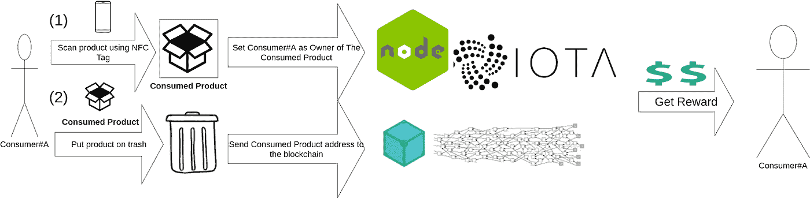
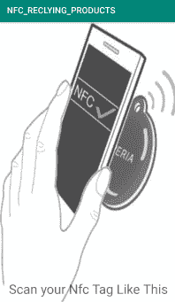
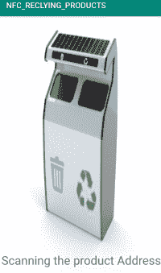
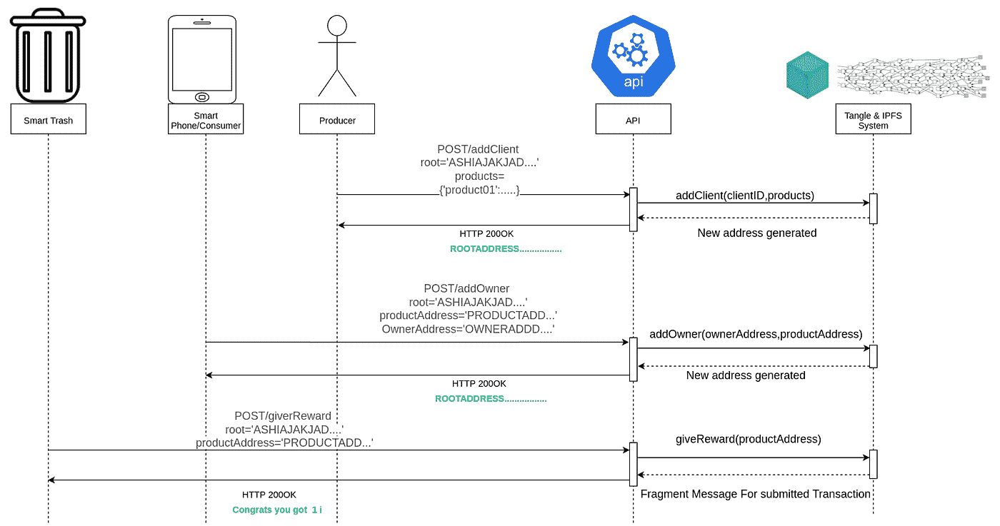

# 使用 IOTA 的回收系统

> 原文：<https://medium.com/coinmonks/recycling-system-using-iota-2172ecc7444?source=collection_archive---------2----------------------->

大家好，在上一篇文章中我谈到了用 Tangle 和 IPFS 实现一个数据库系统。今天我将展示我的数据库的一个用例。我将创建一个回收系统。回收行业面临着严峻的挑战，回收材料的数量不一致，难以估计。所以我们会用区块链来解决这个问题。

# 应用场景

消费者#A 想要回收他的笔记本电脑、智能手机或手表……不管是什么。消费者#A 使用智能手机上的 NFC 扫描他消费的产品，并转到我们的智能垃圾桶。我们的智能垃圾桶扫描 NFC 标签，并向消费者#A 发送一些 MIOTA 作为回收奖励。



Diagram will be explained in details next

# 它是如何工作的

假设一个笔记本电脑工厂有兴趣在用户使用后回收他的笔记本电脑。

1-工厂会将他所有的笔记本电脑数据和 id 发送到我们的系统，并保存在我们的系统中。(id 将是进入每台笔记本电脑的钥匙)

2-所有笔记本电脑将被保存，状态如下:“未找到，被消费者#a 找到，在垃圾箱#B 找到”

数据库将如下所示:


3-所有笔记本电脑都将有 NFC 标签来写入 ID。

4-现在消费者将扫描他想要回收的笔记本电脑。扫描笔记本电脑后，API 调用会将消费者设置为回收笔记本电脑的所有者。



Scan product using your phone

5-每当消费者将他的笔记本电脑放入我们的垃圾桶，他将获得代币作为奖励。



The smart Trash scan product and check its owner to give token.

# API 实现

首先，我将从 API 设计开始，它看起来像这样:



Recycler Sequence Diagram.

每个 API 端点如何工作:-

**‘init’**get-call 初始化 MAM 根并准备好使用数据库(它不应该作为 API 调用，但这将在第二个版本中改变)。

路线:

```
app.route(‘/init’)
.get(recycler.init);
```

控制器:

```
exports.init = async (req,res) =>{
const response = await manageClients.init()
res.json('DB initialized with some clients with root',response )
}
```

实现:(将初始化 MAM 的根并添加客户机虚拟数据)

```
const init = async()=>{products['HELLODRAYMANRNFELVTJREBCXJETCFEUGXBZHEGHCJHIYIFPQEQGDXILJZYUQMOYSELXIG9KUYOSYBFAY'] = {'name':'product01','address':'HELLODRAYMANRNFELVTJREBCXJETCFEUGXBZHEGHCJHIYIFPQEQGDXILJZYUQMOYSELXIG9KUYOSYBFAY','owner':false,'producer':'client01'}products['AB9CCUACOSC9VHQQFSVUGOVLAGNYJYDPROPBYTZIGNVOF9KMFNXBMSUGFFA9HTVHBPKPGGIBGSRJPUXZK'] = {'name':'product02','address':'AB9CCUACOSC9VHQQFSVUGOVLAGNYJYDPROPBYTZIGNVOF9KMFNXBMSUGFFA9HTVHBPKPGGIBGSRJPUXZK','owner':false,'producer':'client01'}products['LHSQELEGSRM9IAQCUBPXOLYXDMFOAPNJFS9JPOJBSRUDJAIRTWHTZCJCFLVYVRJPGPNXEWDDRGTCGKRAB'] = {'name':'product03','address':'LHSQELEGSRM9IAQCUBPXOLYXDMFOAPNJFS9JPOJBSRUDJAIRTWHTZCJCFLVYVRJPGPNXEWDDRGTCGKRAB','owner':false,'producer':'client01'}const ipfsHash = await addIPFS.execute(products)const root = await mamManage.send(ipfsHash)return root}
```

**‘添加客户’**呼叫后生产者/回收者注册到我的服务。

路线:

```
app.route('/addClient').post(recycler.addClient);
```

控制器:

```
exports.addClient = async (req,res) =>{
const response = await manageClients.addNewClient(req.body.root,req.body.products)
res.json("added new client succefuly "+response)
}
```

实施:

```
const addNewClient = async (_root,_products)=>{
const currentPropretiesRoot = _root
const currentPropretiesHash = await mamManage.fetch(currentPropretiesRoot)
const currentPropretiesString = await catIPFS.execute(getLastHash(currentPropretiesHash))
const currentPropretiesJSON = JSON.parse(currentPropretiesString)
const productsJSON = JSON.parse(JSON.stringify(_products))
for(let i = 0; i < productsJSON.length;i++){
currentPropretiesJSON[productsJSON[i].address] = productsJSON[i]
}
const newPropretiesHash = await addIPFS.execute(currentPropretiesJSON)
const newPropretiesRoot = await mamManage.send(newPropretiesHash)
return newPropretiesRoot
}
```

**“添加所有者”**致电后，消费者将成为某个产品的所有者。

路线:

```
app.route('/addOwner')
.post(recycler.addOwner);
```

控制器:

```
exports.addOwner = async (req,res) =>{
const response = await manageClients.addNewOwner(req.body.root,req.body.productAddress,req.body.ownerAddress)
res.json("added new owner  "+ response)
}
```

实施:

```
const addNewOwner = async(_root,productAddress,ownerAddress)=>{
const proprietiesHash = await mamManage.fetch(_root)
const currentPropretiesString = await catIPFS.execute(getLastHash(proprietiesHash))
const currentPropretiesJSON = JSON.parse(currentPropretiesString)
currentPropretiesJSON[productAddress].owner = ownerAddress
const newPropretiesHash = await addIPFS.execute(currentPropretiesJSON)
const root = await mamManage.send(newPropretiesHash)
return root
}
```

“给予奖励”后调用将发送奖励给产品的所有者。

路线:

```
app.route('/giveReward')
.post(recycler.giveReward);
```

控制器:

```
exports.giveReward = async (req,res) =>{
const response = await giveReward.execute(req.body.root,req.body.productAddress)
res.json(response)
}
```

实施:

```
const sendToken = require('./sendToken')
const fetchToMap = require('./fetchToMap')
giveRewards = async(root,productAddress) =>{
const OwnerAddrress = await fetchToMap.execute(root)
console.log(OwnerAddrress[productAddress].owner)
await  sendToken.execute(OwnerAddrress[productAddress].owner,1)
return "Send 1 i. Congrats"
}
```

# 演示

现在，为了展示我的项目，我为消费者和智能垃圾制作了一个 android 应用程序。短视频(1:16)

[](https://drive.google.com/file/d/1IBTMFGMtq1qYzt7-xjbmmavqh8U8aToB/view?usp=sharing) [## 20191230_014822.mp4

### 编辑描述

drive.google.com](https://drive.google.com/file/d/1IBTMFGMtq1qYzt7-xjbmmavqh8U8aToB/view?usp=sharing) 

你可以在下面的资源库中找到 android 应用和 API:[https://github.com/yehia67/Recycling-System-IOTA](https://github.com/yehia67/Recycling-System-IOTA)

**下一步做什么**

在下一个版本中，我将把 Datamarketplace 和 accountHub 添加到我的项目中来创建一个完整的系统，并可能使用 ESP32 来处理智能垃圾桶。

> [直接在您的收件箱中获得最佳软件交易](https://coincodecap.com/?utm_source=coinmonks)

[](https://coincodecap.com/?utm_source=coinmonks)[](https://coincodecap.com)