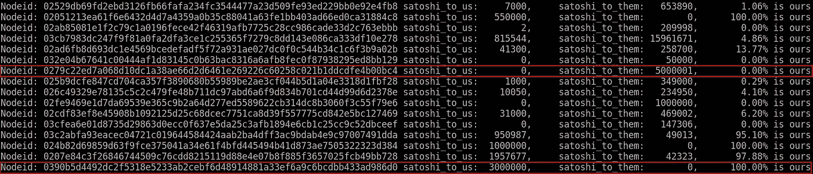
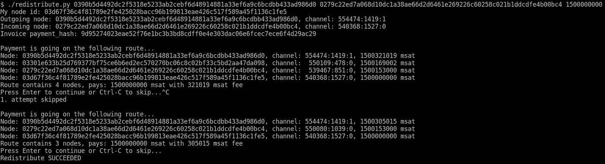
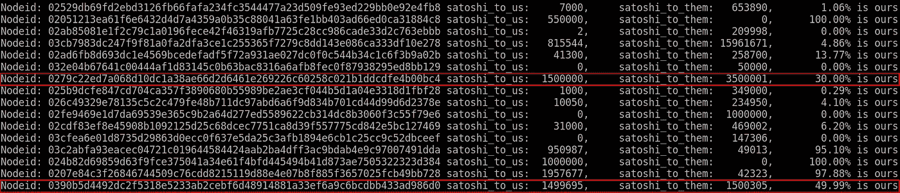

# 重新分配闪电渠道的余额

> 原文：<https://medium.com/coinmonks/redistribute-lightning-channels-balances-9ba3265584ee?source=collection_archive---------3----------------------->

## 当一个闪电通道资金过多而另一个资金过少时该怎么办。

## 过多和过少的缺点

闪电网络渠道被设计成双向支付渠道。这意味着如果爱丽丝和鲍勃有一个闪电通道，那么爱丽丝可以向鲍勃付款，反之亦然，鲍勃可以向爱丽丝付款。如果条件合适。

实际上，事情是这样发生的:Alice 资助 Bob 一个频道。在这个初始状态下，所有通道的余额都属于 Alice。因此，Alice 可以向 Bob 发送付款，但是 Bob 没有任何东西要发送给 Alice。直到爱丽丝通过渠道送来一些钱。并且如果其中一方将所有可用余额发送给另一方，同样的情况可能会发生。在这种情况下，支付渠道只是单向的，只在一个方向起作用。

一个普通的[雷电网络节点大约有 5 个通道](https://lightningpeach.com/ln-monitor)。一些渠道可能只有单向交易有余额。因此，对 Alice 来说，典型的情况可能是只有几个用于支出支付的通道和几个用于收入支付的通道。这个案例有它的缺点。如果 Alice 的一两个伙伴暂时脱机，可能会严重影响 Alice 发送或接收事务的能力。此外，爱丽丝可以在双方之间转移支付。对于单向信道，这个特征也有严重的限制。

## 能做些什么

如果节点将一些资金从其一个渠道转移到另一个渠道，则可以优化渠道余额的分布:

1.  为自己开具发票
2.  通过外发渠道发出付款
3.  在网络间转移支付
4.  通过输入通道将它带回来

这样，传出通道将为将来的传入事务保留一些空间。类似地，传入通道将为传出事务保留一些空间。使用的单向信道变成双向的。

# 技术零件

我正在运行 [c-lightning 0.6.2rc1](https://github.com/ElementsProject/lightning/releases) 作为我的闪电节点。我正在使用 [pylightning](https://github.com/ElementsProject/lightning/tree/master/contrib/pylightning) 来用 Python 更容易地管理 lightning 客户端。

## 调查当前形势

下面是几行 Python 代码，用于显示连接通道上的可用余额:

结果如下:

I am going to redistribute the balances between the red framed channels

其中 100%是我的，它是一个传出通道，没有为传入交易预留。其中 0%是我的，是传入渠道。

我用红色标记了两个节点进行演示:
0279 c 22 ed 7 a 068d 10 DC 1 a 38 AE 66 D2 d 6461 e 269226 c 60258 c 021 B1 ddcdfe 4 b 00 BC 4 看起来适合于接收付款。还有[0390 b5 d 4492 dc2f 5318 e 5233 ab 2 cebf 6d 48914881 a 33 ef 6a 9 c 6 BC dbb 433 ad 986d 0](https://1ml.com/node/0390b5d4492dc2f5318e5233ab2cebf6d48914881a33ef6a9c6bcdbb433ad986d0)看起来很适合一个外向的人。
我将尝试在他们之间转移一些资金。

## 优化分配

困难的部分来了。有一些复杂的管理工作，包括路线规划、路线费用计算、发票处理、发送带有支付散列的交易等。

实际上只需要三个参数:

1.  传出节点 id:节点的公钥，付款通过它传出
2.  传入节点 id:节点的公共密钥，通过它支付回来
3.  以毫卫星为单位的汇款金额

这里有一个脚本，它接受这三个参数并为我们做所有其他的工作。

The code is in the public domain without any warranty, use it with your own responsibility.

让我们试着重新分配一些资金，看看会发生什么:

redistribute.py is running

重新分配成功。幸运的是，传出和传入节点之间有一个开放的通道。因此，我可以选择一个包含三个步骤的路由:传出节点、传入节点和我的节点。结果如下:

The two channels now have some reserve for incoming and outgoing transactions.

我通过节点发送了 0.015 BTC 或 55 美元，这花费了我 0.00000305015 BTC 或 1 便士(2019 年 1 月价格)。

只需付出很少的努力，在闪电通道之间重新分配资金就相对便宜，而且可能会增加网络的弹性和可用性。

感谢阅读！如果你喜欢它，打开一个频道到[我的闪电网络节点](https://1ml.com/node/03d67f36c4f81789e2fe425028bacc96b199813eae426c517f589a45f1136c1fe5)，或者在 Medium 或者 [Twitter](https://twitter.com/gallizoli) 上关注我！欢迎反馈意见和建议！

> [直接在您的收件箱中获得最佳软件交易](https://coincodecap.com/?utm_source=coinmonks)

