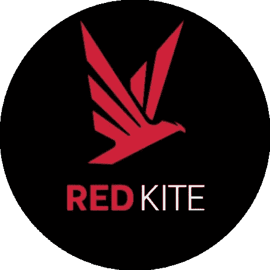

# 红风筝-一个波尔卡多特发射台

> 原文：<https://medium.com/coinmonks/redkite-a-polkadot-launchpad-f683a2786f94?source=collection_archive---------2----------------------->

最近各种发射台的拥挤意味着更高的进入门槛和仍然没有得到有保证的分配。有时，即使你得到了分配，它比乘数还少，根本不起作用。试图积累像 BNB 或 Daomaker 这样的平台的代币是昂贵的。仅仅一个 BNB 就要花费大约 458 美元！

虽然 HODL 好项目是最重要的战略，以最大限度地提高你的利润，你可能还想得到更早的项目。如果您没有良好的关系，您将无法参加售前活动。旧的 ico 现在已经被发射台取代了。这些发射台进行公开销售。如果你认为你已经错过了重要的发射台，那么，这是不正确的。一个名为 Gamestarter 的重要发射台刚刚推出。

## **为什么是红风筝？**

当我们参加草间弥生拍卖时，我们发现这个项目叫做，波尔卡史密斯，在拍卖中竞争。虽然它没有赢得第一阶段的拍卖，但在调查这个项目时，我发现它相当有趣。它将自己定位为“*Polkadot*上 DeFi & NFT 应用的一站式生产中心。”Polkasmith 是 Polkafoundry 的金丝雀版本(就像 Kusama 对于 Polkadot 一样)。该项目是为推出 NFT 市场，开放贷款平台，并在此基础上跨链指数等。但最重要的是，它有一个发射台，叫做红风筝。

Redkite 已经启动了一些重要的项目，如 Tribe、Bunicorn 等。其最近的 IDO，步骤英雄是非常炒作，并已看到巨大的需求。未来，它还将推出 NFT 贸易，这是一个很好的项目。

在我进一步的调查中，我发现这个项目属于 Icetea Labs，一家不错的投资公司。一家加密投资公司拥有的发射台将确保与 Icetea 实验室相关的项目最终将在该平台上启动。这些项目将受到严格审查，因为冰茶实验室将自己投资于它们，它们将确保代币价值的分配和保留。

看看价格，历史最高价是 2.92 美元，现在是 0.50 美元。差不多打了 85 折。现在，如果一个项目走低，这意味着两件事，要么这个项目走向死亡，要么它被严重低估。红色风筝中的步英雄伊多立刻做了大约 13x。这个发射台才刚刚开始。

最近有消息称，Icetea Labs 正在与 Polygon 合作创建一个名为 GameFi 的游戏平台。这是极其重要的一步。对 Icetea 的信心增加了，这也几乎肯定会确保 GameFi 有一天会在 RedKite 上推出。

Polkafoundry 将再次参与草间弥生 parachain 拍卖的第二阶段。一旦他们得到它，并找到一个好平台的稳定性，他们就可以建立。

即将推出的 PKF 赌注者也将获得赌注奖励(相比之下，道 maker 赌注，给 0%)。PKF 代币的效用只会越来越大。

随着 tokenomics、平台和如此低的价格的发展，这是一个被高度低估的发射台，并准备在未来爆发。

## **弊端**

该项目最近出现了一些问题，一个机器人发布了一个 IDO 的欺诈合同细节，导致一些用户的资金损失。Polkafountry 团队处理的很漂亮，给受影响的人退款。该平台还面临着初期问题，特别是在处理负载方面，但我相信这些问题将很快得到解决。

## **结论**

任何参与 parachain 众筹贷款的平台都有我的尊重，因为这表明了它对底物生态系统的奉献。以波尔卡斯塔尔为例。在我看来，尽管他们做得很好，但他们滥用了波尔卡多特的名字来获得额外的关注。这是一个关于价值观的问题。他们甚至没有参加过 parachain 拍卖。Polkafoundry 走的是另一条路，仍然被低估。

***注:*** *本帖最初发表于* [*此处*](https://crypto.writer.io/p/redkite-a-polkadot-launchpad) *与* [*上的子帖同*](https://crypto.writer.io/) *。*

**通过我的推荐加入**

[Crypto.com](https://binance.com/en/register?ref=E8PCD3AF)——[币安](https://platinum.crypto.com/r/sut3pd9bzn)

跟我来

**👉** [推特](https://twitter.com/rumadas123)

**👉**[**Linkedin**](https://www.linkedin.com/in/ruma-das-a1439320/)

*   **包括附属链接**

> **加入 Coinmonks [电报频道](https://t.me/coincodecap)和 [Youtube 频道](https://www.youtube.com/c/coinmonks/videos)了解加密交易和投资**

## **另外，阅读**

*   **[OKEx vs KuCoin](https://blog.coincodecap.com/okex-kucoin) | [摄氏替代度](https://blog.coincodecap.com/celsius-alternatives) | [如何购买 VeChain](https://blog.coincodecap.com/buy-vechain)**
*   **[币安期货交易](https://blog.coincodecap.com/binance-futures-trading)|[3 commas vs Mudrex vs eToro](https://blog.coincodecap.com/mudrex-3commas-etoro)**
*   **[如何购买 Monero](https://blog.coincodecap.com/buy-monero) | [IDEX 评论](https://blog.coincodecap.com/idex-review) | [BitKan 交易机器人](https://blog.coincodecap.com/bitkan-trading-bot)**
*   **[CoinDCX 评论](/coinmonks/coindcx-review-8444db3621a2) | [加密保证金交易交易所](https://blog.coincodecap.com/crypto-margin-trading-exchanges)**
*   **[Bookmap 点评](https://blog.coincodecap.com/bookmap-review-2021-best-trading-software) | [美国 5 大最佳加密交易所](https://blog.coincodecap.com/crypto-exchange-usa)**
*   **[如何在 FTX 交易所交易期货](https://blog.coincodecap.com/ftx-futures-trading) | [OKEx vs 币安](https://blog.coincodecap.com/okex-vs-binance)**
*   **[CoinLoan 审查](https://blog.coincodecap.com/coinloan-review) | [YouHodler 审查](/coinmonks/youhodler-4-easy-ways-to-make-money-98969b9689f2) | [BlockFi 审查](https://blog.coincodecap.com/blockfi-review)**
*   **[CoinFLEX 评论](https://blog.coincodecap.com/coinflex-review) | [AEX 交易所评论](https://blog.coincodecap.com/aex-exchange-review) | [UPbit 评论](https://blog.coincodecap.com/upbit-review)**
*   **[AscendEx 保证金交易](https://blog.coincodecap.com/ascendex-margin-trading) | [Bitfinex 赌注](https://blog.coincodecap.com/bitfinex-staking) | [bitFlyer 点评](https://blog.coincodecap.com/bitflyer-review)**
*   **[AscendEx Staking](https://blog.coincodecap.com/ascendex-staking)|[Bot Ocean Review](https://blog.coincodecap.com/bot-ocean-review)|[最佳比特币钱包](https://blog.coincodecap.com/bitcoin-wallets-india)**
*   **[Bitget 回顾](https://blog.coincodecap.com/bitget-review)|[Gemini vs block fi](https://blog.coincodecap.com/gemini-vs-blockfi)|[OKEx 期货交易](https://blog.coincodecap.com/okex-futures-trading)**
*   **[美国最佳加密交易机器人](https://blog.coincodecap.com/crypto-trading-bots-in-the-us) | [变化回顾](https://blog.coincodecap.com/changelly-review)**
*   **[在印度利用加密套利赚取被动收入](https://blog.coincodecap.com/crypto-arbitrage-in-india)**
*   **[霍比评论](https://blog.coincodecap.com/huobi-review) | [OKEx 保证金交易](https://blog.coincodecap.com/okex-margin-trading) | [期货交易](https://blog.coincodecap.com/futures-trading)**
*   **[麻雀交换评论](https://blog.coincodecap.com/sparrow-exchange-review) | [纳什交换评论](https://blog.coincodecap.com/nash-exchange-review)**
*   **最好的[加密税务软件](/coinmonks/best-crypto-tax-tool-for-my-money-72d4b430816b) | [硬币追踪评论](/coinmonks/cointracking-review-a-reliable-cryptocurrency-tax-software-5114e3eb5737)**
*   **[Stackedinvest 审查](https://blog.coincodecap.com/stackedinvest-review) | [北海巨妖审查](/coinmonks/kraken-review-6165fc1056ac) | [期货交易机器人](/coinmonks/futures-trading-bots-5a282ccee3f5)**
*   **最佳[加密借贷平台](/coinmonks/top-5-crypto-lending-platforms-in-2020-that-you-need-to-know-a1b675cec3fa) | [杠杆令牌](/coinmonks/leveraged-token-3f5257808b22)**
*   **最佳[加密制图工具](/coinmonks/what-are-the-best-charting-platforms-for-cryptocurrency-trading-85aade584d80) | [最佳加密交易所](/coinmonks/crypto-exchange-dd2f9d6f3769)**
*   **[比特币基地僵尸工具](/coinmonks/coinbase-bots-ac6359e897f3) | [AscendEX 审查](/coinmonks/ascendex-review-53e829cf75fa) | [OKEx 交易僵尸工具](/coinmonks/okex-trading-bots-234920f61e60)**
*   **[如何在印度购买比特币？](/coinmonks/buy-bitcoin-in-india-feb50ddfef94) | [瓦济克斯评论](/coinmonks/wazirx-review-5c811b074f5b)**
*   **[隐翅虫替代品](/coinmonks/cryptohopper-alternatives-d67287b16d27) | [HitBTC 审查](/coinmonks/hitbtc-review-c5143c5d53c2)**
*   **[折叠 App 审核](https://blog.coincodecap.com/fold-app-review) | [Kucoin 交易机器人](/coinmonks/kucoin-trading-bot-automate-your-trades-8cf0ca2138e0) | [Probit 审核](https://blog.coincodecap.com/probit-review)**
*   **[雷米塔诺审查](https://blog.coincodecap.com/remitano-review)|[1 英寸协议指南](https://blog.coincodecap.com/1inch)**