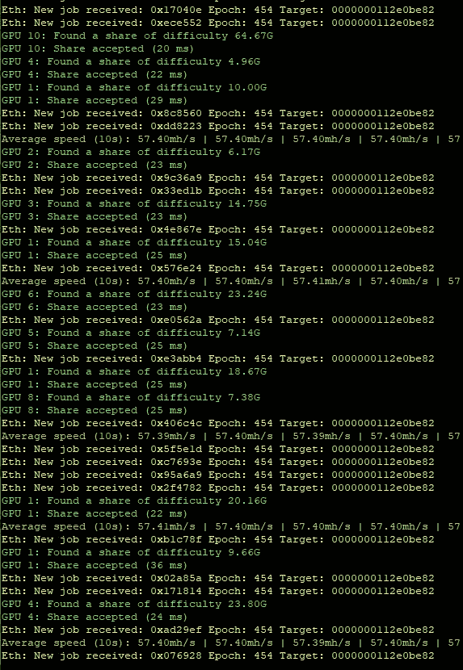
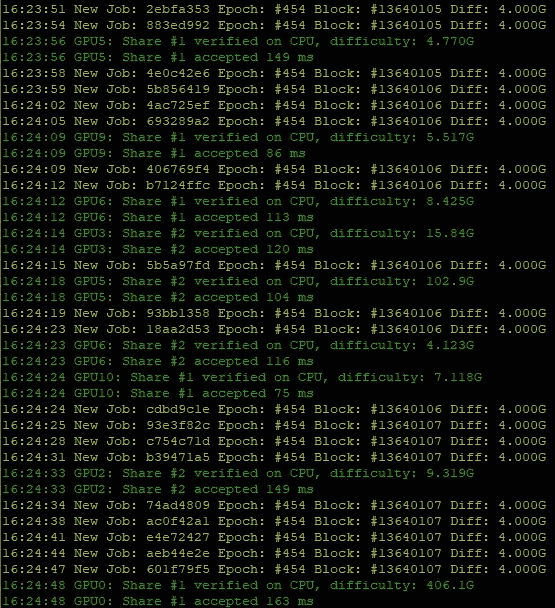
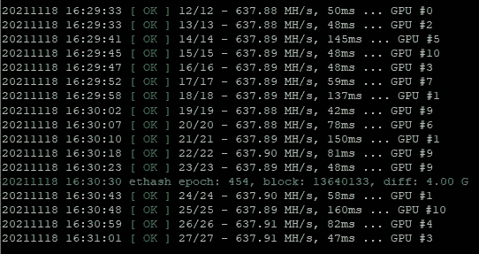
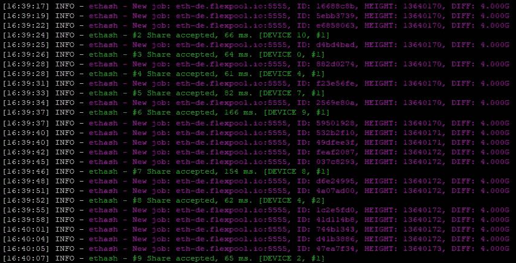
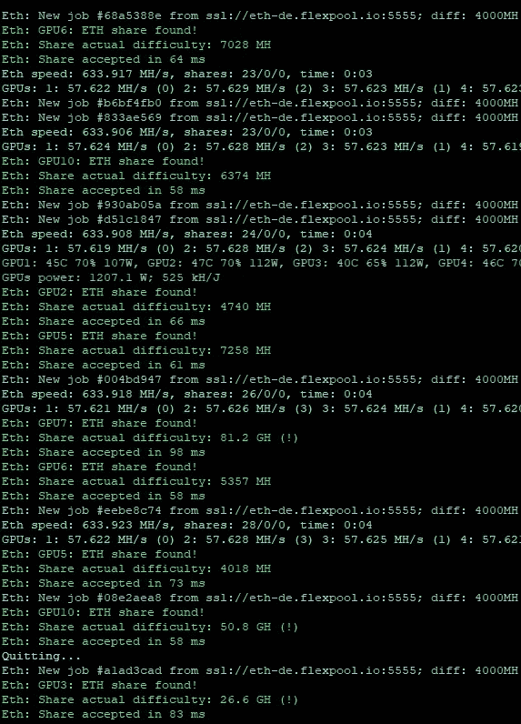

# 减少死亡

> 原文：<https://medium.com/coinmonks/reduce-stales-eth-617f8e5e5e3f?source=collection_archive---------3----------------------->

我们没有注意到的一个问题是长期采矿中的一个重要收入，那就是库存，我们应该设法减少库存以获得最大利润。同样重要的是，有一些池，如果你有一个高比率的 os stales 你不会得到报酬。我们将尝试解释降低成本的不同方法，并比较不同的矿工:

*   Wifi 连接通常会导致 stales 增加，因为从发现共享到交付到池会有很大的延迟。如果无法用 lan 线缆连接，请尝试放置一个好的 wifi 接收器和一个天线，并且尽量不要靠近 GPU，以避免信号上的噪声。
*   互联网服务提供商(ISP)，有时他们没有直接连接，这也可能产生延迟，这是更复杂的检查另一个 ISP 是否可以解决问题。
*   游泳池距离，通常尝试连接到您附近的游泳池将有助于您减少 stales。

现在，我们将运行一个 11x3070 钻机，通过 Wifi 连接到 Flexpool EU，查看不同的矿工

lolMiner 1.36a

gminer 2.72

t-rex 0.24.7

NBMiner 39.7

PhoenixMiner 5.8c

简历:

*   lolMiner 1.36a =最短:40 毫秒，最长:72 毫秒，平均:49.6 毫秒
*   Gminer 2.72=最小值:86 毫秒，最大值:163 毫秒，平均值:119.44 毫秒
*   T-Rex 0.24.7=最短:48 毫秒，最长:160 毫秒，平均:80.06 毫秒
*   NBMiner 39.7=最小值:61 毫秒，最大值:154 毫秒，平均值:82.37 毫秒
*   PhoenixMiner 5.8c =最短 58 毫秒，最长 98 毫秒，平均 68.78 毫秒

我们也问过 dev lolMiner #lolliedieb，为什么 lolMiner 有较低的值，他告诉我们，值显示是时间池，应该按 x 2 计数。

> 加入 Coinmonks [电报频道](https://t.me/coincodecap)和 [Youtube 频道](https://www.youtube.com/c/coinmonks/videos)了解加密交易和投资

## 另外，阅读

*   [5 大最佳社交交易平台](https://blog.coincodecap.com/best-social-trading-platforms)|[NFT 瓦济克斯](https://blog.coincodecap.com/wazirx-nft-india)
*   [10 本关于加密的最佳书籍](https://blog.coincodecap.com/best-crypto-books) | [英国 5 个最佳加密机器人](https://blog.coincodecap.com/uk-trading-bots)
*   [ko only Review](https://blog.coincodecap.com/koinly-review)|[Binaryx Review](https://blog.coincodecap.com/binaryx-review)|[Hodlnaut vs CakeDefi](https://blog.coincodecap.com/hodlnaut-vs-cakedefi-vs-celsius)
*   [比斯勒评论](https://blog.coincodecap.com/bitsler-review)|[WazirX vs coin switch vs coin dcx](https://blog.coincodecap.com/wazirx-vs-coinswitch-vs-coindcx)
*   [赢取注册奖金——10 大最佳加密平台](https://blog.coincodecap.com/earn-sign-up-bonus)
*   [7 大副本交易平台](https://blog.coincodecap.com/copy-trading-platforms) | [买币点评](https://blog.coincodecap.com/buycoins-review)
*   [XT.COM 评论](https://blog.coincodecap.com/profittradingapp-for-binance)币安评论 |
*   [SmithBot 评论](https://blog.coincodecap.com/smithbot-review) | [4 款最佳免费开源交易机器人](https://blog.coincodecap.com/free-open-source-trading-bots)