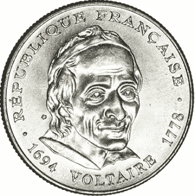
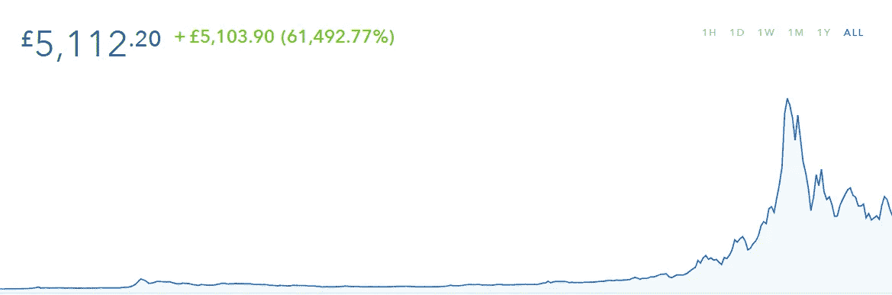

# 重构通货膨胀

> 原文：<https://medium.com/coinmonks/reframing-inflation-67b63968c7e4?source=collection_archive---------4----------------------->

人们注意到，我们对货币的定义过于狭隘，使用了不同的定义，这往往排除了许多使用中的货币形式。

当理解*通货膨胀*时，这就成了问题；由于我们货币的约束价值取决于央行设定的通胀率——因此，要理解货币，我们应该理解通胀本身。

根据这一调查(尽管我们可能对货币的定义过于狭隘)，我们可以对*货币*的实际含义达成相对明确且普遍接受的理解:交易中的**交换媒介**。

对通货膨胀得出类似的定义更成问题——这个定义为理解新货币形式背景下的通货膨胀提供了自己的见解。

# 消费基础的变化

约翰·纳西在《讨价还价问题》( T9 )( 1950)中展示了货币是如何有利于贸易的，并在非合作的情况下给予双方利益。

这与亚当·斯密是并行的；他的《国富论》(出版于 1776 年)在用于构建一门新科学的语言上是苛刻的；用相同的经济和非合作术语解释社会状况。

斯密热衷于区分的一点是*真实*价格(价值)和*名义*价格(金钱)——*真实*价格指的是生产一件商品的努力(工作)；*名义*价格参考当时*波动*黄金(或其他贵金属)的可获得性。

[Voltaire Coined](/@jongulson/le-petit-volontaire-f58843b39bc5)

随着货币从金属硬币演变成纸质形式，通货膨胀开始出现(在语言中)——不是指价格——而是纸币上发生的事情。随着时间的推移——似乎与凯恩斯革命同时发生——它被重新定义为价格描述。

随着技术(包括软件)开始影响商品和服务的实际价格——在节省时间的创新和适销解决方案方面——纳什的讨价还价问题演变成了[纳什均衡](https://en.wikipedia.org/wiki/Nash_equilibrium)并在此过程中重新定位了史密斯的[看不见的手](https://en.wikipedia.org/wiki/Invisible_hand)来解释市场参与和我们的消费习惯，这并非巧合。

# 货币基础的变化

人们注意到，货币的定义过于狭隘，人们也看到了新形式的货币是如何在央行管理之外演变的——比特币和加密货币是最明显的例子。

人们还注意到货币的不同*级别*，其中一些专门用于银行间的交易(或高级别结算)。

所有这些导致货币经济学家[弗朗西斯·科波拉](http://www.coppolacomment.com/2012/07/the-nature-of-money.html)在 2012 年断言:

> “货币种类的激增意味着我们对货币的衡量存在严重缺陷……如果未来在于国际电子货币与各国货币自由竞争，那么央行货币供应政策能发挥什么作用(如果有作用的话)就很成问题了……”[金钱的本质](http://www.coppolacomment.com/2012/07/the-nature-of-money.html)

这张空前的比特币价格图证实了弗朗西斯的洞察力。

Bitcoin all time performance priced in GBP Sterling (source: Coinbase) taken 18 August 2018

# 比特币的 Bancor 式特征

科波拉进一步阐述了她对新电子货币的看法:

> “……在电子货币的国家汇率管理方面，可能需要国际合作。或许是时候建立一个新的(虚拟的)布雷顿森林体系了？”[金钱的本质](http://www.coppolacomment.com/2012/07/the-nature-of-money.html)

正是在布雷顿森林会议上，我们可以从传统的角度来看待比特币——我们可以通过在超国家清算系统——国际清算联盟——内考虑凯恩斯的 bancor 提案来做到这一点，以创建一个新的二战后类似黄金的标准，其中拟议的 bancor 是全球储备货币，实际上，跨国支付在这里流动。

这条推文为 bancor 的报道提供了进一步的深度:

# 月亮上的悲怆

人们援引尼采来解释传统的比特币叙事:需要感受难以用传统方式积累财富的一代人；或者是那些误解比特币的人，因为他们听到的故事对他们来说更有感情色彩。

这条推文很直接:

在这方面，比特币制造者会经常谈到‘月亮’；或者去中心化的弊端，以及抵制通货膨胀、不受审查的货币的需要。这个问题——尼采在个人基础上感受到的一种虚无主义的悲哀——是它低估了对比特币的另一种理解:通过*点对点*，Satoshi 指的是高水平的结算资金，就像凯恩斯提出的 bancor[国与国]一样。

除了凯恩斯依靠(国家的)利他意图来采用(班科尔)标准的地方，比特币可以从纳什重新定位亚当·斯密的角度来看待:通过国际货币市场的均衡(博弈论)。

# 金钱:后现代主义的最后边疆

除了一些价格稳定的一般指标外，通货膨胀实际上是什么还不清楚；T2 的通货膨胀是由货币供应的增加引起的，还是 T4 的通货膨胀是由货币供应的增加引起的，还是与价格行为有关，在一个确定的层面上也同样不清楚。

Light eruption

更令人困惑的是，如果我们一开始就不能全面定义通货膨胀，那么理解通货膨胀的原因和管理。

我们再次回到纳什，一个理论概念(Nash)发展起来，世界货币——实际上是通过以消费者价格指数趋势为目标的地方央行管理自己——在国际地位上达到对等。纳什创造了这样一个场景:理想货币。

这有时被误解为目标是零通胀，这误解了理想货币引入的新形式货币语言:货币通过在全球范围内达到相对价值来消除通胀。

这条推文的作者将观众的注意力转移到比特币可能是什么以及它在当今市场上如何运作:

这位评论员准备捍卫最后一个堡垒，暗示比特币的工作证明算法应该被禁止，因为它消耗能量——不理解(显然)这需要比特币通过货币市场游戏创造的那种国际协作:

在一个真实价格和名义价格单一化——国家货币体系趋同——是当今世界的一条不归路的世界里，得出这样的结论并不令人吃惊；一个通胀只存在于央行管理者头脑中的世界。

> [直接在您的收件箱中获得最佳软件交易](https://coincodecap.com/?utm_source=coinmonks)

