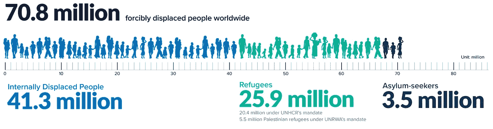

# 难民之地——生物识别、区块链和自我主权身份的演变

> 原文：<https://medium.com/coinmonks/refugee-land-the-evolution-of-biometrics-blockchain-and-self-sovereign-id-7d18f0d5e623?source=collection_archive---------2----------------------->

Photo by fabio on Unsplash

根据联合国人权办公室的统计，全世界大约有 7080 万人被迫流离失所。其中，近**2590 万**拥有难民身份，另有**350 万**是寻求庇护者。另外**280 万**被联合国认定为**无国籍**，意思是*不拥有任何国家国籍的人，因此被剥夺了国籍和获得教育、医疗、就业、行动自由等基本权利。*[【UNHR】](https://www.unhcr.org/en-us/figures-at-a-glance.html)。

从某种角度来看，这些数字比加拿大总人口少 500 万。根据联合国难民署的全球重新安置报告，趋势已经预测到 2020 年全球将增加 144 万难民。考虑到[南美](https://www.brookings.edu/blog/up-front/2019/12/09/venezuela-refugee-crisis-to-become-the-largest-and-most-underfunded-in-modern-history/)、[中东](https://www.aljazeera.com/ajimpact/sanctions-iran-create-migrant-crisis-europe-190522193857815.html)、[亚洲](https://www.mercycorps.org/articles/bangladesh/rohingya-refugee-crisis-quick-facts)和[非洲](https://www.unrefugees.org/news/south-sudan-refugee-crisis-explained/)不断升级的地缘政治紧张局势，加上[气候难民](https://www.unhcr.org/en-us/climate-change-and-disasters.html)不断上升的风险，推测在新的十年内将实现相当于一个国家规模的流离失所人口并不算过分。

2020 年将标志着有史以来人口迁移的最高水平。当每个国家都在难民安置和新移民的国内情绪之间寻求平衡时，问题就来了。流离失所的人们能够回家吗？

> [发现并回顾最佳区块链软件](https://coincodecap.com)

# 难民危机是一种身份危机

为了参与经济，从事重新安置和服务，以及重新融入社会，必须有身份记录。

在大多数情况下，随着流离失所者被安置到临时营地，人口数据是由较大的人道主义组织收集的。随着这些操作积累越来越多的个人和敏感数据，滥用的风险也在增加。掠夺性国家或个人可以利用包括姓名、年龄、性别和数百万需要援助的人的需求在内的信息。[(来源)](https://www.thenewhumanitarian.org/feature/2020/1/1/humanitarian-crisis-to-watch?utm_source=The+New+Humanitarian&utm_campaign=df6a4f4236-10_Crises_2020_2020_01_06&utm_medium=email&utm_term=0_d842d98289-df6a4f4236-75555233)

ID 应该能够让**跨越机构和国际边界、跨越时间参与进来。**

所有形式的身份都应该为个人数据的存储和使用提供**所有权。**

身份应该是可移动的，可访问的，并能抵抗审查。

# 生物识别、区块链和自主身份(SSID)的机遇

在考虑流离失所者时，解决身份危机的努力还必须倡导自我主权的解决方案，使个人能够控制自己的身份。

**生物识别和区块链技术的出现提供了一个独特的机会。**通过将信息存储在**加密的**介质上，个人数据(生物特征)的认证系统可以与身份凭证分离，从而有助于**保护隐私**。区块链系统还提供了比传统身份记录更高的安全级别，因为它们**排除了第三方中介**。由于生物识别技术的创新，访问区块链数据是可传输的，比持有私人密钥的风险更小。由于区块链的分散性质，**数据可以在灾难中幸存**，灾难可能会摧毁一个更集中的记录保存系统。这种分散的结构也使得 SSID 受到审查阻力，这意味着没有中央权力机构可以清除任何存储在区块链的记录。

> 自我主权身份是关键，特别是对移徙人口或面临风险/受压迫的人口而言，在这些地方，中央权力机构不顺从，在某些情况下甚至不存在。

自 2017 年叙利亚难民危机以来，采取措施为流离失所人口提供身份一直是像 [ID2020](https://id2020.org/digital-identity) 和 [UNHR](https://www.coindesk.com/united-nations-sends-aid-to-10000-syrian-refugees-using-ethereum-blockchain) 这样的组织的核心工作，这些组织一直致力于基于生物识别的区块链身份解决方案。

重述流离失所人口，需要身份解决方案，区块链提供了一个独特的机会，因为:

-实行开放边境政策的国家**有权**要求入境者提供身份证明，以确保本国公民的安全**但不需要获得一个人的全部数据。**

-流离失所者将更有能力提供技能、资产、信用评级、教育证书、医疗健康等记录。—所有这些都有助于更有效的重新安置过程。

-在国家接受流离失所者但不提供工作机会的情况下，将身份与钱包应用程序配对允许难民在全球市场内交易。

# 社会压力系统的演变

## 自我主权数字身份的演变是流离失所者有能力对来自原籍国的不良行为者施加压力，而不会对自己或家人构成风险。

2019 年，非洲国家加蓬以非常规的方式应对操纵选举。受地理距离的保护，旅居国外的加蓬公民使用社交媒体鼓励他们的国内同行通过投票和用智能手机记录计票过程来参与公平选举。虽然腐败仍然渗透到选举中，但故事仍在讲述；**那些受到地理距离保护的人可以很好地(或者在某些情况下更好地)激发家里的变化。要了解整个故事，请收听来自 Radiolab 的播客**

这种远距离的社会压力系统可以表现为:

-发送和接收资金

-参与投票

-游说联合国或其他人道主义团体

-自由、匿名发言(媒体渠道)

-获取可能被审查的信息

区块链技术为保护弱势群体的身份提供了机会，提供了凭证所有权，并提供了一个平台，无需*需要*中介的帮助就可以发表意见并采取行动。无论是通讯功能，钱包功能，还是其他功能，**除非流离失所者有施加社会压力的手段，否则他们有可能变得沉默、被遗忘，并最终永久流离失所。**

> [在您的收件箱中直接获得最佳软件交易](https://coincodecap.com/?utm_source=coinmonks)

