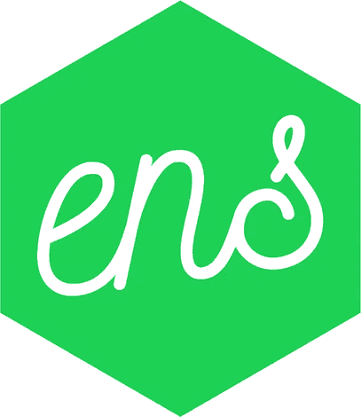

# 注册。用 ENS 测试域

> 原文：<https://medium.com/coinmonks/register-test-domain-with-ens-72b04c30d5ea?source=collection_archive---------5----------------------->

Cee，five，ef，dee，ef，four，ow，six，seven，哦等等，是 ow，seven，six，bee…这当然不是你想分享以太坊地址或 Swarm 和 IPFS 内容散列的方式。你复制并发送它或扫描二维码，但这种体验仍然不如使用容易记忆、可读的名称。同样，正如 DNS 为 IP 地址解决了这个问题一样，ENS 的目标是在以太坊生态系统中缓解这个问题。



Ethereum Name Service logo

ENS 代表以太坊名称服务，这是一组在以太坊区块链上提供分布式命名系统的智能合约。ENS 本身不是以太坊栈的一部分，而是一个[社区驱动的规范](https://github.com/ethereum/EIPs/issues/137)，你可以很容易地使用你的自定义域名解析器来扩展它。

在本教程中，我将指导您完成在 Rinkeby 上注册测试域的过程。您可以很容易地将以下步骤应用于其他只改变地址的测试网。

与 Mainnet 或 Ropsten 上不同，Rinkeby 上的 ENS 不支持。eth 域，并且仅限于使用. test 域。正在注册。测试域名更快，因为它不需要你通过[拍卖](https://docs.ens.domains/en/latest/userguide.html#auctions)过程。测试域也在 28 天后到期，这使得它足以在开发阶段使用。

# 注册。测试域

在我们开始之前，让我们下载一下 [ensutils-testnet.js](https://github.com/ethereum/ens/blob/master/ensutils-testnet.js) ，它包含了一些 ABI 和 helper 函数，可以使这个过程更加简单。硬编码的 ENS 地址对我们没有好处，因为我们想使用 Rinkeby，而不是 Ropsten。另一方面，如果你想在 Ropsten 上注册一个名字，你就万事俱备了。前往[线 220](https://github.com/ethereum/ens/blob/master/ensutils-testnet.js#L220) 并更改 ENS 合同地址。

```
var ens = ensContract.at(
  '0xe7410170f87102df0055eb195163a03b7f2bff4a'
);
```

我已经准备了一个要点，包含了在 Rinkeby 上运行 ensutils 所需的所有更改: [ensutils-rinkeby.js](https://gist.github.com/MichalZalecki/db02810da8e582d0494adb2c5fd31f3c#file-ensutils-rinkeby-js) 。

*   主网上的 ENS:`0x314159265dd8dbb310642f98f50c066173c1259b`
*   Ropsten 上的 ENS:`0x112234455c3a32fd11230c42e7bccd4a84e02010`
*   ENS on Rinkeby: `0xe7410170f87102df0055eb195163a03b7f2bff4a`

完成后，使用 geth 连接到正在运行的 Ethereum 节点，并加载 ensutils 脚本。

```
$ geth attach [http://127.0.0.1:8545](http://127.0.0.1:8545)
> loadScript("./ensutils-rinkeby.js")
```

在我们注册之前，让我们检查一下您想要拥有的名称是否可用。

```
> testRegistrar.expiryTimes(web3.sha3("michalzalecki"))
0
```

如果返回的时间戳是 0，或者是过去的，那么你可以注册这个名字。

```
> testRegistrar.register(web3.sha3("michalzalecki"), eth.accounts[0], {from: eth.accounts[0]})0x986a21970a14258fae1bfc952e731ec88cb94818d78a4c68212da312e6eee2f0
```

等待区块链包含事务。现在，您可以通过重新检查到期时间和所有者来确认注册。

```
> testRegistrar.expiryTimes(web3.sha3("michalzalecki"))
1527679534> ens.owner(namehash("michalzalecki.test"))
"0xY0urAdd355"
```

恭喜你，你已经在 ENS 上出名了！

# 公共解析器

你拥有一个名字，但它还没有解决任何问题。你需要一个解析器。据我所知，在撰写本文时，Rinkeby 上还没有官方的公共解析程序。好消息是任何人都可以创建和部署一个。如果您不想创建解析器，请跳到下一节。

克隆 ENS 存储库，安装依赖项并删除构建目录。

```
git clone https://github.com/ethereum/ens npm install rm -rf build
```

更改松露配置，这样你就可以部署到 Rinkeby。

```
*// truffle.js*
module.exports **=** {
  networks: {
    rinkeby: {
      host: "127.0.0.1",
      port: 8545,
      network_id: 4
    },
  },
  solc: {
    optimizer: {
      enabled: **true**,
      runs: 200,
    },
  },
};
```

我们不需要部署所有契约，只需要部署 PublicResolver。让我们删除不必要的迁移文件并创建一个新的。

```
*// 2_public_resolver.js*
**const** PublicResolver **=** artifacts.require("./PublicResolver.sol");

**const** ENS **=** "0xe7410170f87102df0055eb195163a03b7f2bff4a";

module.exports **=** **function**(deployer) {
  deployer.deploy(PublicResolver, ENS);
};
```

最后一步是运行迁移。

```
./node_modules/.bin/truffle migrate --network rinkeby
```

如果你想知道更多关于在 Etherscan 上验证你的合同的信息，并给你的解析器一点可信度，那么读一下我的另一个教程:

[](/coinmonks/how-to-verify-smart-contract-on-etherscan-b9a79cb8793a) [## 如何在 Etherscan 上验证智能合约？

### 为什么要验证您的智能合同？看情况。这主要取决于您的用例。它总是下来…

medium.com](/coinmonks/how-to-verify-smart-contract-on-etherscan-b9a79cb8793a) 

# 解析域

我们需要将我们的名字指向解析器，并设置一个我们的域要解析的地址。如果你没有你的解析器，你可以用我的。

```
**>** publicResolver **=** resolverContract.at("0x5d20cf83cb385e06d2f2a892f9322cd4933eacdc")**>** ens.setResolver(namehash("michalzalecki.test"), publicResolver.address, {from: eth.accounts[0]})0x939da269d9cf314ef61cba8226501b2f140383b968b6274f74a99b36bc7b986b
```

现在，您可以检查 ENS 是否保存了您的域的解析器地址

```
**>** ens.resolver(namehash("michalzalecki.test"))
"0x5d20cf83cb385e06d2f2a892f9322cd4933eacdc"
```

我将把域设置为指向我的帐户地址，但此时它可以是任何地址。

```
> publicResolver.setAddr(namehash("michalzalecki.test"), eth.accounts[0], {from: eth.accounts[0]})0x621a39c3cb0af3d951102453e11fb6f037918c2a63731c3b519b11d639ce22c0
```

现在让我们看看我们的域解析到哪个地址。我们可以通过直接调用 public resolver 或者使用 getAddr helper 函数来实现。

```
**>** getAddr("michalzalecki.test")
"0x7d20cb28c496a76173ee828ecacfb08deb379e8d"**>** publicResolver.addr(namehash("michalzalecki.test"))
"0x7d20cb28c496a76173ee828ecacfb08deb379e8d"
```

如果您想在客户端或 oracle 上解析地址，那么您已经拥有了所需的所有工具。您可以使用 ensutils 的解析器和帮助器函数的 ABI。也有[以太坊-ens](https://www.npmjs.com/package/ethereum-ens) 但是它不支持 web3 1.0。

# 结论

ENS 是一个伟大的项目，它试图让以太坊成为一个更友好的地方。虽然开发人员体验还不是很好，但它是一个强大的基础，并且广泛采用了流行的项目，如 MyEtherWallet、MetaMask 或 Mist。

当然，ENS 的内容比我们在这里介绍的要多。有一个合适的[文档](https://docs.ens.domains/en/latest/)可以回答许多问题并提供多个例子。如果你想更多地了解这个项目及其背后的人，可以喝杯咖啡，看看尼克·约翰逊的演讲— [以太坊 ENS —以太坊名称服务](https://www.youtube.com/watch?v=Cr2Iik6aD9s)。

*原载于 2018 年 5 月 3 日*[*【michalzalecki.com】*](https://michalzalecki.com/register-test-domain-with-ens/)*。*