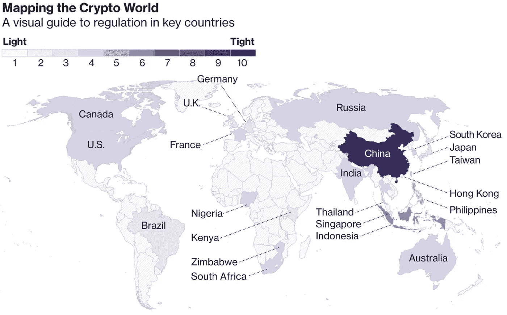

# 规范未来的交易媒介:比特币

> 原文：<https://medium.com/coinmonks/regulating-the-medium-of-exchange-for-the-future-bitcoin-cf8a59836f5b?source=collection_archive---------7----------------------->

## 这篇文章是关于区块链和加密货币行业内监管或合规发展的最新指南，涵盖 2017 年至 2018 年 6 月 30 日期间。

# 比特币的日益流行

世界知名的假名软件开发商[中本聪](https://www.coindesk.com/information/who-is-satoshi-nakamoto/)创造了[比特币](https://en.wikipedia.org/wiki/Bitcoin)作为基于[数学证明](https://cointelegraph.com/explained/proof-of-work-explained)的电子支付系统。基本思想是建立一种独立于任何中央权力机构的交换手段。比特币与传统的数字法定货币在赋予[利益](https://www.mybitcoin.com/cryptocurrency-vs-fiat-bitcoin-benefits/)的能力上有很大不同，比如安全性、不变性和所有交易信息的快速验证。

比特币的价值从实际上的 0 美元增长到 2017 年 12 月 15 日的最高值 17，900 美元，市值(2270 亿美元)达到大约整个加密货币市场的一半(5170 亿美元)。比特币的统治地位标志着加密货币在全球前所未有的普及。

如今，政府和机构越来越多地涉足加密货币领域，有可能利用它们来改善现有的业务运营(例如 [Stellar Network](https://www.stellar.org) 促进跨境支付)，甚至作为一种安全支付的形式。鉴于其法定货币不断面临恶性通货膨胀和实物盗窃，第三世界国家正越来越多地探索使用比特币作为一种安全透明的点对点支付形式。

# **为什么比特币需要监管**

简单来说，加密货币行业非常年轻。在比特币以及如何确保交易安全的问题上，政府和机构与普通人一样一无所知。

大多数处理比特币的加密货币相关业务越来越成为不良活动的目标。恐怖分子和非法犯罪集团一直在利用比特币的匿名性进行洗钱活动，而据报道，黑客一直在从我们今天看到的大型加密交易所窃取资金。Mt.Gox 臭名昭著的原因是价值 4 . 8 亿美元的比特币因黑客活动而丢失。

比特币可以以多方面的方式造福世界，这是一个无可争议的事实，但只有当全球监管进展足够快，通过严格的法律确定性和监督在行业内建立投资者的保护和信心时，比特币的大规模采用才能发生。

# 全球监管发展

无论是 ICO 筹款、加密货币交易还是分布式账本技术，所有形式的加密或区块链相关活动都面临着来自全球监管机构的更大压力。一些国家接受并欢迎比特币的好处，而其他国家由于政治、经济和社会冲突而回避它。

自 2018 年初以来，在加密领域建立监管立足点方面，三项重要发展一直在进行中。

*开发 1:中央监管机构和自律机构之间的合作*

集中化的自律组织正在承担监管监督和执行的关键责任。例如，美国旨在根据代币的特征(公用事业诉证券)对其进行监管，而日本则对加密资产和加密交换操作采取公平和标准的政策。类似地，小型自我监管组织在各种司法管辖区涌现，作为中央监管机构的辅助，合作确保合规和立法成熟和充分。一个例子是由 16 个注册的加密货币交易所组成的日本加密货币商业协会(JCBA)的成立。

*发展 2:全球监管机构在监管方面处于领先地位*

国家联盟之间的全球联合监管也已经建立，以在国际层面上指导加密监管。一个例子是 20 国集团峰会，世界上 20 个领先的工业化国家和新兴国家将在各自的国家采用相同的标准化密码规则。韩国最近宣布，他们将遵守 20 国集团关于 ICO 和密码交换规定的密码规则。

*开发 3:美国成为加密货币监管的标尺*

美国是世界上最大的经济体之一，并积极制定密码行业的法规，许多国家将在未来几个月内“效仿”SEC 的立场。美国证券交易委员会(SEC)正在研究制定更严格的要求，并对数字资产存储公司实施有关加密交易的证券法。对于 ICO 代币销售，它们是合法的，但受到严格监管。美国证券交易委员会采用“豪威测试”,如果一项发行是对一个普通企业的资金投资，并合理预期从他人的创业或管理努力中获利，则认为该发行是否属于证券。

目前有 3 种与加密货币监管相关的管辖区，即市场领导者、温和管辖区和不受欢迎的管辖区。更多关于法规的信息和它们的发展方向将在下面详细说明。

# 市场领头人

替代硬币是比特币流行和采用的最终结果，带来了监管全球加密货币相关活动的巨大需求。

今天，我们有市场领导者来接受 ico，并以最有效和透明的方式对其进行监管。澳大利亚、爱沙尼亚、直布罗陀、马恩岛和瑞士是最突出的例子。

**澳洲** *(ICOs 允许和管制)*

ICO 的法律地位取决于令牌的结构、操作和权利。例如，如果代币带有与发行公司的所有权或未来利润相关的权利，则它被视为具有与传统股票类似定义的证券代币。澳大利亚证券和投资委员会(AIC)的一份[信息表](https://asic.gov.au/regulatory-resources/digital-transformation/initial-coin-offerings-and-crypto-currency/) 对其监管条款进行了深入阐述和覆盖。最后，ico 必须遵守披露要求，例如准备在 AIC 注册并向投资者提供的招股说明书。

**爱沙尼亚** *(ICOs 允许和管制)*

爱沙尼亚金融监督局(EFSA)已经为 ico 建立了一个法律框架。声明代币将被视为证券，取决于其结构，如《证券市场法》( SMA)和《债务法》等现有法规中的定义。

与澳大利亚类似，构成证券发行的 ICO 将受与要求披露要求(即编制招股说明书)的公开发行相关的法规管辖。

**直布罗陀**

直布罗陀金融服务委员会已经[提出了专门针对监管“代币的推广、销售和分销”、代币二级市场以及提供代币投资相关投资建议的立法](http://gibraltarfinance.gi/20180309-token-regulation---policy-document-v2.1-final.pdf)。

将为在直布罗陀或从直布罗陀推广、销售或分销的每一个 ICO 指定一个授权赞助方，负责遵守 ICO 令牌立法。

**瑞士** *(ICOs 允许并监管)*

瑞士金融市场监管机构(FINMA)专注于基本的经济功能，对 ICO 发行的代币进行分类。目前有 3 个类别。

*支付令牌*——与密码货币同义，没有其他功能或与其他开发项目的联系。如果代币打算用作支付形式并且已经可以转让，则需要遵守反洗钱法规。

*实用令牌* —旨在提供对应用程序或服务的数字访问的令牌。如果公用事业令牌的唯一目的是授予应用程序或服务的数字访问权限，并且在发行时公用事业令牌已经可以以这种方式使用，则公用事业令牌不具备证券资格。

*资产(证券)代币*——代币赋予参与真实的实体基础、公司或收入流，或分红或支付利息的权利。就其经济功能而言，代币类似于股票、债券或衍生品。交易此类代币有证券法要求，而《瑞士义务法典》中的民法要求要求 ICO 方发布官方招股说明书。

# 中等管辖权

单位美国、日本和新加坡都认识到拥抱区块链技术和密码货币相关活动的经济利益。但是，他们会极其谨慎地行事，毫不犹豫地禁止或起诉任何损害其打击通过密码货币洗钱和资助恐怖主义活动的实体。最近的一个发展是日本禁止交易像 Monero 和 Zcash 这样的匿名硬币。

## **澳大利亚**

加密活动是合法的，但受到严格监管。证交会将适用[联邦证券法](https://www.sec.gov/ICO)，并根据证交会内部测量的事实和情况，认定特定投资交易是否涉及证券的要约或出售(无论使用的术语如何)。

需要注意的两个最重要的发展是，

[1]被视为证券的 ico 必须在 SEC 注册。

[2]在 ico 中出售的代币可以有许多名称，但仅仅称之为实用代币或使其具有某种实用性并不妨碍代币被视为证券产品。

## 美国国内的法规方向

美国证券交易委员会(SEC)考虑区块链公司的未决证券强制执行通知，明确表示他们不会大幅修改法律以适应区块链公司。他们将不断发布规则来澄清而不是限制，特别是针对当今加密令牌的混合性质(*什么是足够的效用以将其从一种证券转变为不同类型的投资交易的问题*)。

自成立以来，ICO 模式主要是作为一种不受政府监管的融资渠道。尽管法规会提高合规的启动成本，但它最终会鼓励企业创新，并证明对 ico 的需求是合理的。美国证券交易委员会(SEC)的[立场是，ico 必须与任何其他传统纯金融资产及其融资模式生活在同一个生态系统中。](https://www.bitcoinmarketjournal.com/investor-alert-blockchain-regulations-headed/)

## 新加坡

监管机构对 ico 和加密货币相关活动的态度非常积极。新加坡拥抱区块链和加密活动。新加坡货币当局已经制定了规章。一份咨询文件( [*数字代币发行指南*](http://www.mas.gov.sg/~/media/MAS/Regulations%20and%20Financial%20Stability/Regulations%20Guidance%20and%20Licensing/Securities%20Futures%20and%20Fund%20Management/Regulations%20Guidance%20and%20Licensing/Guidelines/A%20Guide%20to%20Digital%20Toke) )发布了，内容涉及证券和期货法案(SFA)范围内的代币类型。任何属于 SFA 的代币都将受到监管。SFA 没有直接规定，除非货币与发行人资产或财产的所有权或担保权益相关。如果这种权利附属于货币，发行者必须向新加坡金融管理局登记，除非因其他原因获得豁免。

MAS 还确认，作为证券或集体投资计划(CIS)的代币将受到 SFA 规定的披露义务的约束。发行要求将附有在新加坡金融管理局注册的招股说明书。在下列情况下，要约将被豁免

[a]少于 500 万新元

[b]在 12 个月内向不超过 50 人进行私募

[c]在特定条件下向合格投资者或机构投资者发放。

有关 MAS 对 ico 的监管立场的完整澄清列表，请参见其[媒体出版物发布声明。](http://www.mas.gov.sg/News-and-Publications/Media-Releases/2017/MAS-clarifies-regulatory-position-on-the-offer-of-digital-tokens-in-Singapore.aspx)

## 新加坡加密货币监管方向

新加坡金融管理局的规定旨在恢复投资者对加密领域的信心和信任。他们在加密法规中建立了任意的限制，以确保不存在潜在的系统性威胁风险和可能影响其全体民众(投资者)的事件。这导致[发布了新的层级结构](https://www.coindesk.com/singapore-proposes-regulatory-boost-for-decentralized-exchanges/)，将加密交易所的监管与传统的单层“认可市场运营商”(RMO)框架分开。

新加坡继续欢迎加密货币，过去他们对加密货币监管不干涉的做法帮助新加坡成为一个温和的司法管辖区。RMO 框架的改变可能会为数字资产交易所在中国的生存开绿灯。尽管如此，他们仍然保持警惕——新加坡最近阻止了 8 家非 MAS 注册的数字资产交易所和一家 ICO 令牌发行商的运营，因为他们的服务被视为与证券或期货相关。

## 日本

JFSA 金融厅已经明确宣布 ico 是合法的。ICO 发行的代币被归类为“虚拟货币”,具有专有价值，

可用于结算商品和/或服务的付款，并可与法定货币兑换

[a]可以与另一种虚拟货币兑换

可以通过电子数据处理系统传输

[c]不以日元或任何外国法定货币计价

## 日本加密货币法规的走向

日本公开接受 ICOs 和任何其他加密活动。2018 年 6 月，自我监管机构(如 JVCEA，由 16 家获得许可的加密货币交易所组成的日本虚拟货币交易所协会)和政府监管机构宣布，合作的唯一目的是加强所有加密相关活动的监管框架和指导方针。JVCEA 负责人 Taizen Okuyama 提到，他将主要解决实施安全和内部控制的问题，以努力建立公众信心，并为所有加密相关活动建立一个健康的加密市场，并在适当的监督下进行。

# 不受欢迎的管辖区

除了韩国和中国等少数例外，大多数国家都欢迎比特币。

## 韩国

ICO 禁令是在 2017 年 9 月中国禁止密码相关活动的几周内出台的。ICO 禁令禁止一切形式的区块链融资方式，“无论技术术语如何”。据金融服务委员会(FSC)称，代币发行被视为“过度投机”，构成“违反资本市场法”。

尽管韩国国内有禁令，但韩国人仍可以投资海外进行的 ico。此外，许多韩国初创企业在本地交易所上市数字硬币之前，通过将 ico 注册到海外来规避禁令。

## 韩国加密货币法规的走向

《韩国时报》的一篇报道称，如果代币销售额超过一定门槛，ICO 禁令可能会被取消，这表明韩国当局可能会取消 ICO 禁令。此外，FSS 金融监督局新任局长尹锡赫恩宣布，在不久的将来将放松市场上的加密监管禁令，以帮助像朝鲜这样的技术国家的市场繁荣发展。

2018 年 6 月，韩国当局公开宣布他们打算[像传统商业银行](https://www.ccn.com/korea-will-regulate-cryptocurrency-exchanges-like-commercial-banks-legitimizing-industry/)一样监管加密活动，实施严格的反洗钱/KYC 政策，以遏制欺诈活动，重建投资者的信心。韩国金融情报室将监督业务和监督。

最后，南韩将在当地采用 [G20 的统一加密货币法规](http://bitcoinist.com/fud-no-more-south-korea-set-to-adopt-g20s-unified-cryptocurrency-regulations-provide-clarity/)。这一统一法规的第一个框架将于 2018 年 7 月发布。

## 中国

中国对 ico 采取了坚定的立场，自 2017 年 9 月以来完全禁止它们。这项禁令也适用于所有其他加密活动，包括提供硬币和用于交易这些硬币的交易所。中国认为 ico 被用于未经授权的非法融资活动，并警告公众高度警惕货币发行融资风险和交易风险。所有已经开始或完成 ICO 的组织都被指示将其资金返还给投资者。ico 也被认为违背了中国的政治立场，即固有的共产主义和严重依赖于中央集权的政府结构，因为 ico 和密码相关活动通过提供分散的自由严重破坏了他们的社会结构。最重要的是，中国担心秘密市场的波动性，这可能会破坏中国金融体系的稳定。

## 中国加密货币监管方向

Xi 总理和中国央行行长都就区块链的好处和加密货币的积极方面及其对国家的经济利益发表了大胆的言论。

此外，2018 年 5 月 30 日，中国国有媒体发表了一篇文章，称“由于担心加密泡沫，中国政府可能会在数字货币革命中落后”，含蓄地表明[中国当局可能会重新思考政府对加密](https://usethebitcoin.com/chinas-state-run-newspaper-globaltimes-calls-for-crypto-regulations/)的立场。

禁令颁布后，中国最高级别的政府喉舌中央电视台(CCTV)对国内 ico 进行了抨击，称其至今仍很猖獗。所谓的“空中硬币”的出现——指的是没有合法注册的商业实体支持的象征性项目——声称空中硬币的数量增加了 30 倍，这表明 [ICO 禁令如何对中国当局产生了适得其反的效果](https://www.coindesk.com/china-state-tv-token-sales-still-rampant-after-central-bank-ban/)。

2017 年禁令后，非法活动呈上升趋势，而媒体则表示中国正在倒退到数字革命。截至今天，禁令没有解除的迹象，但监管机构正在继续密切关注从长远来看恢复加密货币活动是否有益。

# 结论

如果世界想要最大限度地采用和利用比特币这样的技术，监管是必不可少的。在为加密货币活动制定立法时，不同的国家可能有不同的方法，但美国和国际论坛(如 G20)等大型参与者最终将影响和塑造监管，形成统一的标准化格式-最终允许区块链和加密货币业务无国界运营。

***注:本文首发于***