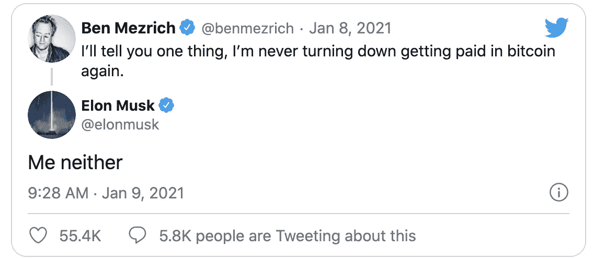

# 比特币监管来了

> 原文：<https://medium.com/coinmonks/regulation-is-coming-for-bitcoin-6f9693237e19?source=collection_archive---------7----------------------->

Photo by [Joshua Miranda](https://www.pexels.com/@joshuamiranda?utm_content=attributionCopyText&utm_medium=referral&utm_source=pexels) from [Pexels](https://www.pexels.com/photo/similar-cubes-with-rules-inscription-on-windowsill-in-building-4027658/?utm_content=attributionCopyText&utm_medium=referral&utm_source=pexels)

至少可以说，比特币最近运行良好。2020 年 7 月，它的交易价格约为 10，000 美元，到今天(2021 年 1 月 19 日)已飙升至 36，000 美元。比特币的市值目前高达 6726 亿美元。不可否认的是，交易者、散户投资者、机构投资者和监管机构都感受到了比特币的日益流行。在这篇文章中，我将讨论比特币越来越受欢迎，它如何引起监管机构的注意，以及我对这是好是坏的看法。

# **比特币人气上升**

随着比特币的市值不断增加，它吸引了机构投资者的大量兴趣。根据弗兰克·恰帕罗最近的一篇题为[的文章，大机构只对比特币感兴趣，NYDIG 首席执行官](https://www.theblockcrypto.com/linked/91500/big-institutions-are-only-interested-in-bitcoin-says-nydig-ceo)讨论了投资者只对比特币感兴趣有多认真，因为它是市值最大的加密货币。首席执行官罗伯特·古特曼说，

> “在我最近与认真寻求配置 5000 万美元以上的投资者进行的 100 次对话中，100%都是关于比特币的，0%是关于任何其他加密资产的。”

在[彭博](https://www.bloomberg.com/news/articles/2021-01-05/scaramucci-sees-massive-gains-for-bitcoin-in-comparison-to-gold)最近的一篇文章中，天桥资本最近进入了比特币领域，他们宣布了一项针对富裕投资者的比特币基金。天桥资本的经理安东尼·斯卡拉穆奇说，

> “比特币比黄金更好地成为黄金……它更容易储存，更难窃取，更便于携带，因此，就价值储存而言，它已经成为未来的分类账或储存方式。”

最后，如果我还没有把我的观点讲清楚的话，随着比特币越来越受欢迎，埃隆·马斯克最近也加入了比特币的行列，他通过 Twitter 漫不经心地谈论比特币。

在华尔街和著名首席执行官们的关注下，监管机构肯定不会落后太多。进入…

# **监管者的眼睛**

在罗伯特·史蒂文斯的一篇文章中，2020 年 11 月，比特币是市值第 20 大的资产(约 3000 亿美元)。在大约两个月的时间里，比特币的市值翻了一倍多。这使得比特币成为市值第 12 大的资产，超过了伯克希尔哈撒韦、三星、Visa、强生、摩根大通和沃尔玛等公司。比特币变得太大了。

 [## 按市值排名的资产-CompaniesMarketCap.com

### 按市值排列全球顶级资产，包括贵金属、上市公司、加密货币、交易所交易基金

companiesmarketcap.com](https://companiesmarketcap.com/assets-by-market-cap/) 

监管机构不能再忽视比特币及其在金融界日益巩固的地位。最近，两位著名监管者公开批评比特币。

2021 年 1 月 13 日，欧洲央行(ECB)行长克里斯蒂娜·拉加德(Christine Lagarde)在接受[路透社](https://www.reuters.com/article/us-crypto-currency-ecb/ecbs-lagarde-calls-for-regulating-bitcoins-funny-business-idUSKBN29I1B1?rpc=401&)采访时表示，将比特币描述为“高度投机的资产”，并用于洗钱。克里斯汀呼吁对比特币进行全球监管，以堵塞允许非法活动发生的“漏洞”。然而，我还想指出的是，欧洲央行现任行长克里斯蒂娜·拉加德(Christine Lagarde)在 2016 年也因巨额政府支出的非法活动而被定罪。根据 Independent.co 的，

> “国际货币基金组织总裁拉加德女士被怀疑橡皮图章式地签署了一项协议，实际上是用纳税人的钱收买了这位商业巨头……民事法庭后来撤销了异常慷慨的裁决，宣布仲裁过程和交易是欺诈性的，并命令塔皮先生偿还这笔钱。"

那么谁在指责谁呢？但是不管怎样…

大约一周后，据 Coindesk 报道，财政部长珍妮特·耶伦告诉参议院金融委员会，加密货币是她的一个担忧。耶伦接着说，

> “我认为许多(加密货币)至少在交易意义上被用于非法融资，我认为我们真的需要研究如何减少它们的使用，并确保反洗钱不会通过这些渠道发生。”

珍妮特·耶伦(Janet Yellen)后来收回了自己的评论，称比特币和其他加密货币能够“为美国带来潜在的好处”，并有可能提高金融系统的效率。你可以在这里找到文章。

你可能已经听说比特币被用于非法交易。这不是什么新鲜事！然而，据[Bitcoin.com](https://news.bitcoin.com/ecb-christine-lagarde-global-bitcoin-regulation-btc/#:~:text=While%20serving%20as%20the%20managing%20director%20at%20the,made%20while%20she%20served%20as%20France%E2%80%99s%20finance%20)报道，Morgan Creek Digital 合伙人 Anthony Pompliano 制作了一个视频，解释比特币“比其他任何货币更少被用于非法目的”。此外，区块链分析公司 chain analysis 向政府和 50 多家网络安全公司提供数据、软件、服务和研究，最近发布了一份 2020 年犯罪活动[报告](https://blog.chainalysis.com/reports/cryptocurrency-crime-2020-report)。该报告显示，犯罪活动仅占所有加密活动的 0.34%，即 100 亿美元的交易量！这些数据直接反驳了克里斯蒂娜·拉加德和珍妮特·耶伦最近的言论。

# **监管是好是坏？**

我知道你在想什么……这对比特币持有者来说肯定是件坏事，对吧？不完全是，如果做得正确的话会很好。我所在的阵营认为，比特币需要监管才能成为主流。

首先让我们看看对比特币的糟糕监管会是什么样子——

回到 2020 年 12 月 9 日， [Coindesk](https://www.coindesk.com/us-lawmakers-tell-mnuchin-to-back-off-from-potential-crypto-wallet-regs) 报道当时的财政部长史蒂夫·姆努钦想要推出一项“了解你的客户”(KYC)法规。该 KYC 法规将要求加密交换在加密货币交换发生之前验证自托管钱包的身份。包括俄亥俄州参议员沃伦·戴维森在内的许多人将这项提议的规则描述为“对用户隐私的侵犯”，并可能阻碍创新，导致美国落后于世界其他国家。

现在让我们看看正确的监管可能是什么样的——

简单来说，对比特币的资本收益征税是件好事。美国国税局视比特币为财产，依法纳税。不过我确实认为，如果想从比特币和其他加密货币中获利，就需要缴纳一些税。税收为我们的道路、高速公路、社会保险和联邦医疗保险(以及其他)买单。这通常对每个人都有好处，我也赞成。

监管比特币将创造更多需求，并最终推动人们接受比特币。[coin desk 在一篇文章中指出，监管为何能帮助比特币](https://www.coindesk.com/regulation-help-bitcoin)，

> “通过让比特币成为纳税或完成重大金融交易的一种手段，它为比特币提供了 T4 的合法性。**这自然而然地将知识、熟悉度和对比特币的需求分散到了更广泛的人群中，培养了对比特币的接受度……需求的增加反过来又能帮助应对比特币目前的波动性。**”

# 结论

我相信对大多数人来说，比特币是个谜。许多家庭办公室、退休基金和机构仍然没有完全理解它，因此——信任它。因此，监管可以为投资者、基金和机构提供界限和安全感。我认为我们没有必要把对比特币的监管视为坏事。我们生活在一个被治理的社会，需要有一些为大众提供安全的规则和条例。不过，我确实认为我们需要提高警惕，确保针对比特币的法规不会侵犯我们的隐私和权利。就像我说的，如果操作正确，监管可能会为比特币的大规模应用打开大门。

> 加入 Coinmonks [电报组](https://t.me/joinchat/EPmjKpNYwRMsBI4p)，了解有关加密交易和投资的信息

## 此外，请阅读

*   什么是[闪电贷款](https://blog.coincodecap.com/what-are-flash-loans-on-ethereum)？
*   最佳[加密交易机器人](/coinmonks/crypto-trading-bot-c2ffce8acb2a)
*   [3 商业评论](/coinmonks/3commas-review-an-excellent-crypto-trading-bot-2020-1313a58bec92) | [Pionex 评论](/coinmonks/pionex-review-exchange-with-crypto-trading-bot-1e459d0191ea) | [Coinrule 评论](https://blog.coincodecap.com/coinrule-review-a-perfect-trading-bot)
*   [AAX 交易所评论](/coinmonks/aax-exchange-review-2021-67c5ea09330c) | [德里比特评论](/coinmonks/deribit-review-options-fees-apis-and-testnet-2ca16c4bbdb2) | [FTX 密码交易所评论](/coinmonks/ftx-crypto-exchange-review-53664ac1198f)
*   [n 零审核](/coinmonks/ngrave-zero-review-c465cf8307fc)
*   [按位交换审查](/coinmonks/bybit-exchange-review-dbd570019b71) | [位码审查](https://blog.coincodecap.com/bityard-reivew)
*   [3Commas vs Cryptohopper](/coinmonks/3commas-vs-pionex-vs-cryptohopper-best-crypto-bot-6a98d2baa203)
*   最好的比特币[硬件钱包](/coinmonks/the-best-cryptocurrency-hardware-wallets-of-2020-e28b1c124069?source=friends_link&sk=324dd9ff8556ab578d71e7ad7658ad7c)
*   [总账 vs 平均](https://blog.coincodecap.com/ngrave-vs-ledger)
*   [密码本交易平台](/coinmonks/top-10-crypto-copy-trading-platforms-for-beginners-d0c37c7d698c)
*   [莱杰纳米 s vs x](https://blog.coincodecap.com/ledger-nano-s-vs-x)
*   [Vauld Review](https://blog.coincodecap.com/vauld-review)|[you hodler Review](/coinmonks/youhodler-4-easy-ways-to-make-money-98969b9689f2)|[BlockFi Review](/coinmonks/blockfi-review-53096053c097)
*   最好的[加密税务软件](/coinmonks/best-crypto-tax-tool-for-my-money-72d4b430816b) | [硬币追踪评论](/coinmonks/cointracking-review-a-reliable-cryptocurrency-tax-software-5114e3eb5737)
*   最佳[加密借贷平台](/coinmonks/top-5-crypto-lending-platforms-in-2020-that-you-need-to-know-a1b675cec3fa)
*   [莱杰 Nano S vs Trezor one vs Trezor T vs 莱杰 Nano X](https://blog.coincodecap.com/ledger-nano-s-vs-trezor-one-ledger-nano-x-trezor-t)
*   [BlockFi vs Celsius](/coinmonks/blockfi-vs-celsius-vs-hodlnaut-8a1cc8c26630)|[Hodlnaut 回顾](https://blog.coincodecap.com/hodlnaut-review)
*   [Bitsgap 审核](/coinmonks/bitsgap-review-a-crypto-trading-bot-that-makes-easy-money-a5d88a336df2) | [Quadency 审核](/coinmonks/quadency-review-a-crypto-trading-automation-platform-3068eaa374e1)
*   [埃利帕尔泰坦评论](/coinmonks/ellipal-titan-review-85e9071dd029) | [赛克斯斯通评论](https://blog.coincodecap.com/secux-stone-hardware-wallet-review)
*   [BlockFi 审查](/coinmonks/blockfi-review-53096053c097) |在您的加密中赚取高达 8.6%的利息
*   [DEX Explorer](https://explorer.bitquery.io/ethereum/dex) 和[区块链 API](https://explorer.bitquery.io/graphql)
*   [加密套利](/coinmonks/crypto-arbitrage-guide-how-to-make-money-as-a-beginner-62bfe5c868f6)指南:新手如何赚钱
*   最佳加密制图工具
*   了解比特币的[最佳书籍有哪些？](/coinmonks/what-are-the-best-books-to-learn-bitcoin-409aeb9aff4b)

> [直接在您的收件箱中获得最佳软件交易](/coinmonks/newsletters/coinmonks)

