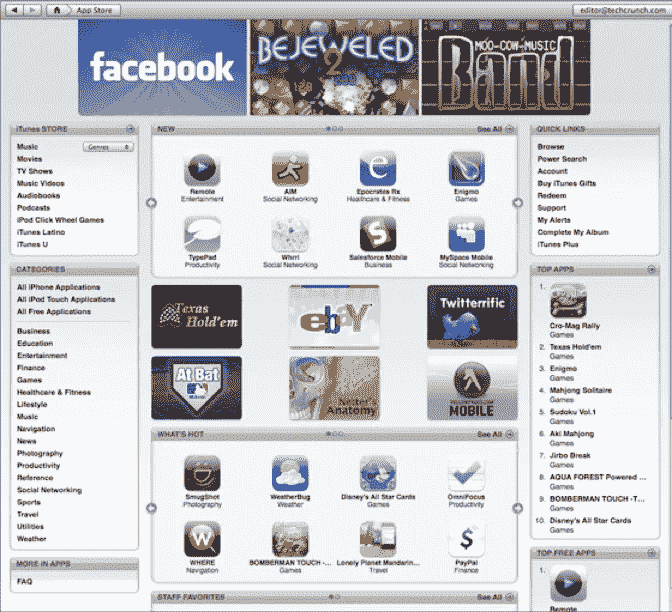
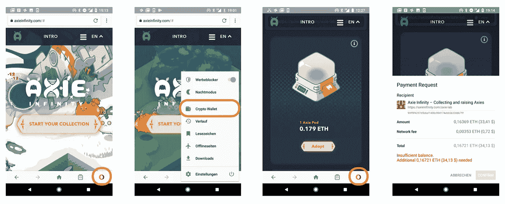

# 重新想象我们使用网络的方式

> 原文：<https://medium.com/coinmonks/reimaging-the-way-we-will-use-the-web-138fbfc8f911?source=collection_archive---------5----------------------->

许多当前围绕 Web 3 的想法和文章以及密码驱动的互联网的未来可能会是什么样子，都自下而上地关注于[未来的 Web 堆栈](https://github.com/w3f/Web3-wiki/wiki)——在下文中，我更愿意从自上而下的角度来看待堆栈，而不仅仅是强调这样一个事实，即我们今天使用的许多服务从幕后看起来很可能会有所不同，但更重要的是，我们在幕后与它们交互的方式也会有很大不同。

当我们回顾历史时，我们可以认为 Web 1 是一个“只读”的互联网——我喜欢认为它是一个开放的、以浏览器为中心的网络，允许人们在互联网上消费内容。

当我们想到 Web 2，[许多人称之为“读写”Web](https://media.consensys.net/a-warm-welcome-to-web3-89d49e61a7c5)——我喜欢把它看作一个封闭的、以应用程序为中心的 Web，它在过去十年中主要发生在移动设备上，让人们不仅可以消费内容，还可以成为内容本身的一部分，同时必须生活在封闭的、专有的系统矩阵中。

[https://www.flickr.com/photos/macrolensfan/4452824641](https://www.flickr.com/photos/macrolensfan/4452824641)

# 这是红色药丸。

当我们想到 web 3 时，许多人认为它是一个有状态的 Web，而不是无状态的 Web 1 和 2——我喜欢把它看作是一个开放的、以浏览器为中心的 Web 的重新发现，它将比以往任何时候都更强大——让我们详细说明一下。

当苹果公司推出 iPhone 和后来的 App Store 时，很难想象我们今天生活的世界会是什么样子。移动网络从一个非常杂乱的基于 WAP 的用户体验发展成为丰富多彩的东西，网络突然变得触手可及。

苹果、谷歌和微软推出了自己的移动平台，拥有专有的应用商店，里面充满了为他们的设备量身定制的精彩内容。虽然微软很晚才意识到这个世界不需要第三个主要的移动平台，但苹果的应用商店和谷歌 Play 商店在不到十年的时间里就成为了价值数十亿美元的企业。

但是，从那时起，网络出版商就不得不平行运作，通过移动设备将内容呈现在消费者眼前。过去以浏览器为中心的单一色彩的网络战略，通过为各种移动平台设计、开发、运输和更新多种本地应用程序，变成了一个双重(如果不是三重)的开发和维护周期。

但是开发者和发行商不仅要在三大平台之间做出选择(或者选择所有平台)，还要在更宏观的层面上，在备受争议的应用和移动网络之战中选择一方，在移动竞赛的早期中[是非常明显的赢家。](https://techcrunch.com/2014/04/01/mobile-app-usage-increases-in-2014-as-mobile-web-surfing-declines/)

[https://techcrunch.com/2008/07/10/app-store-launches-upgrade-itunes-now/](https://techcrunch.com/2008/07/10/app-store-launches-upgrade-itunes-now/)

让我们来分析一下为什么会出现这种情况，以及为什么许多开发者决定专注于本地应用而不是以浏览器为中心的移动战略。

虽然在最初几年缺乏某些功能显然是一个问题，但随着时间的推移，浏览器[在原生应用功能方面有了显著改善](https://www.forbes.com/sites/forbestechcouncil/2018/03/09/why-progressive-web-apps-will-replace-native-mobile-apps/#5618a6552112)——今天我可以轻松地在脸书或 YouTube 上观看视频，在 Spotify 上播放歌曲，还可以玩可用的游戏，所有这些都通过我的移动浏览器来完成。因此，很明显，应用程序和移动网络之间的差距已经比过去小得多。

# **天下没有免费的午餐。**

另一个关键方面是分发——在早期，苹果应用商店和谷歌 Play 可能仍然是发现新应用的伟大工具。但由于两家商店都有数百万个应用程序，今天绝大多数出版商最终会在应用程序安装广告上花费巨额资金，以支持新产品发布和脱颖而出。只有在大量广告支出的支持下，iOS 和 Android 上的分发才能发挥作用，这就是为什么数字广告行业中的这一部分从利基市场发展成为数十亿美元的市场。在这个领域建立了一家公司后，我可以肯定地说，单独向任何一家应用商店提交应用程序(除了非常罕见的病毒案例)都不会有任何吸引力，除非发布会得到大量广告支出的支持。话虽如此，现实中提供分销的并不是商店，而是出版商本人。

所以最后归结到一个核心方面:[app 用户货币化](https://jmango360.com/wiki/mobile-app-vs-mobile-website-statistics/)。

当我们回顾苹果在 2008 年推出 App Store 时， [iTunes 已经是美国最大的音乐供应商](https://web.archive.org/web/20110519040721/http:/www.apple.com:80/pr/library/2010/02/25itunes.html)，后来甚至是全球最大的音乐供应商——利用 App Store 的这一客户群让苹果在发布时就拥有了[数百万用户账户和信用卡详细信息](https://www.digitalmusicnews.com/2014/04/24/itunes800m/)。

因此，从第一天开始，开发者就可以接触到大量已经准备好在 iOS 上(微)付费和互动的用户，类似地，Android 也看到了数量快速增长的 [Google Play 用户](https://mashable.com/2015/09/29/google-play-1-billion-users/#D6mgj2Z3OPqs)——这使得开发者甚至更大的出版商都乐意捐出他们收入的 30 %,特别是在最初几年，以便能够利用这个庞大的用户群。

从技术上来说，你可以说 iOS(某种程度上还有 Android)本来是一个围绕身份和支付层构建的底层操作系统，作为核心命题嵌入到开发者的堆栈中。虽然这在很长一段时间内对许多发行商来说显然是有益的，但就在最近，我们已经看到了大发行商退缩的初步迹象，Epic Games 决定在 Google Play 之外发布堡垒之夜。

Epic Games 显然是一个足够大的发行商，能够承担这样的风险，并试图通过在中心商店以外发行来利用其强大的品牌和忠诚的用户群。但是，这也是一个迹象，表明生态系统已经到了这样一个地步，开发者和出版商对这两个主要平台的“围墙花园”方法越来越感到不舒服，我们甚至可能在未来从其他出版商那里看到更多这种情况。

# **回到一个开放甚至更强大的网络。**

考虑到这一点，让我们想象一下，如果我们能够为应用开发者提供同样的通用方法，让他们在移动网络上像在 iOS 或 Android 上一样简单、无摩擦地赚钱，会发生什么？

我们将清楚地看到更多的发行商(甚至是开发商 longtail 中的较小发行商)跟随 Epic Games 转向其他发行内容的方式，在增长、产品种类和最终消费者注意力转移方面具有类似的动力，正如我们在过去十年中从这些商店的推出到我们今天的位置所看到的那样。

我相信这是一个巨大的机会，在我们解决了([或继续解决](https://www.usv.com/blog/the-myth-of-the-infrastructure-phase))所有隐藏的东西之后，我们就有了 crypto 和 Web 3。如果我们思考目前围绕[自我主权身份](https://thecontrol.co/understanding-decentralized-identity-433abb343279)解决方案正在发生的事情，并想象与一种通用元支付方法(如 crypto)配对，这种方法可以在各种网络属性上工作，并深深嵌入到接触点(如[钱包](https://blog.coinbase.com/goodbye-toshi-hello-coinbase-wallet-the-easiest-and-most-secure-crypto-wallet-and-browser-4ba6e52e4913)、[浏览器](https://blogs.opera.com/mobile/2018/07/opera-launches-first-browser-with-built-in-crypto-wallet/)甚至[手机](https://www.htcexodus.com/))中，我们将从本质上重新创建当今现有平台的关键支柱，这导致了围绕开发者及其产品货币化的如此强大的主张:身份和支付基础设施。

dapp user flow (collectible game) on the Opera browser with embedded wallet

这并不是说 Web 3 对消费者的影响仅限于移动生态系统——但是今天大多数消费者与 Web 的互动都是通过移动设备进行的，这就是为什么 Web 3 的影响在这些设备上最明显。与此同时，从我们与网络的所有接触点来看，通过移动设备的交互仍然是迄今为止最受阻碍和限制的，这就是为什么 Web 3 的影响将对这些设备产生最大的破坏性。

很明显，这些 Web 3 构件中的许多还没有被构建、采用和扩展，以使这样的开发者生态系统真正开花结果，我相信这些关键支柱将特别围绕四个核心命题:a .可伸缩性；b .稳定性；c .身份；我和 d. privacy 将在接下来的几周里更详细地讨论它们。

但一旦我们到达那里，我们可能已经看到了类似的开发人才和创新涌入该领域的热潮，所有这些最终都会回流到浏览器，使网络比以往任何时候都更加开放、独立和强大。

感谢[塞巴斯蒂安·布鲁姆](https://twitter.com/LeBastif)、[查尔斯·哈默尔](/@charleshamel)、[卡蒂克·塔尔瓦](https://twitter.com/TheRealKartik)、[彼得·米切尔](https://twitter.com/pmofficial95)和[贾斯珀·德·古耶](https://twitter.com/JasperGooijer)提供反馈。

> [直接在您的收件箱中获得最佳软件交易](https://coincodecap.com/?utm_source=coinmonks)

