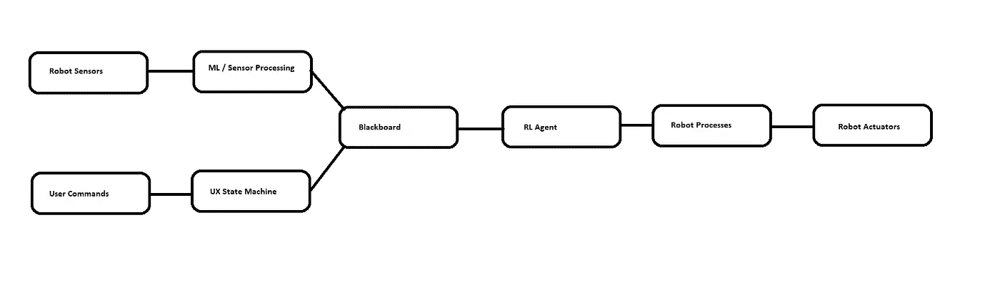
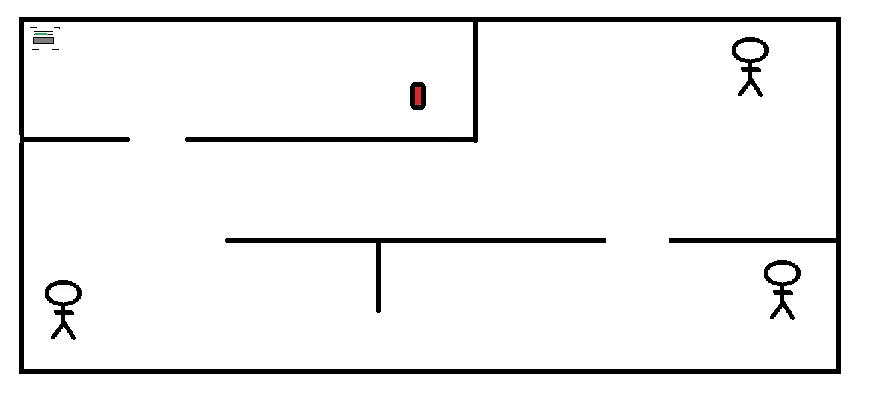
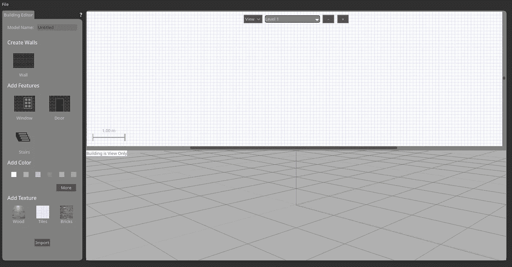
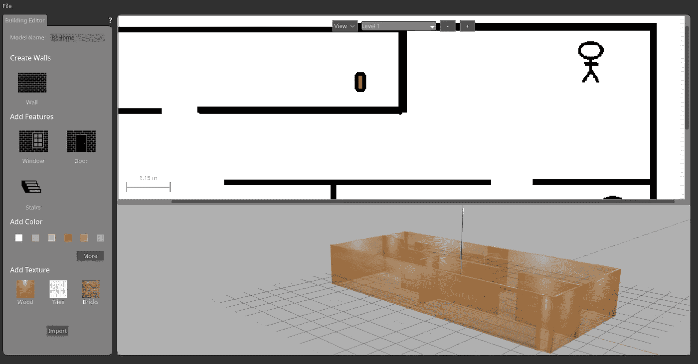
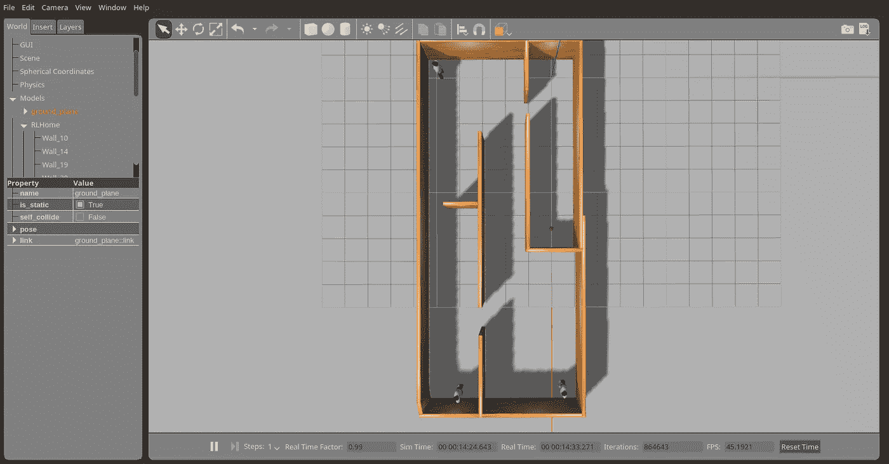

# 家用机器人的强化学习。2

> 原文：<https://medium.com/coinmonks/reinforcement-learning-for-home-robotics-pt-2-7ba18cc500b9?source=collection_archive---------6----------------------->

## 营造环境



Purposed RL Architecture

## 介绍

在这篇文章中，我们将迈出第一步，构建上图中概述的 RL 系统。在这里，我们将建立我们设计的家用机器人将存在的环境。为了不贪多嚼不烂，这个世界将受到以下限制:

*   世界上所有的物体都是静止的。
*   我们每集都使用相同的布局。
*   每集给机器人的命令可以是随机的。

我们的世界将以上一篇文章介绍的家居布局为基础，如下图:



Marvin’s World

本文的目标是使用 Gazebo 在 ROS Kinetic 中构建这个静态环境。

> 注意:我知道 ROS 2.0 正在路上，但是在我写这篇文章的时候，它还没有正式发布。此外，我对它还没有足够的了解，所以无法放心地将我目前的工作转移到 platform 上。当它正式发布的时候，我已经花时间复习了，我会在博客上写一些关于如何将东西转换到新的 ROS 2.0 系统的文章。在此之前，我将假设当前的 ROS 1.0 系统，我通常在笔记本电脑上使用 Kinetic。

## 凉亭建筑编辑

我们将首先使用 Gazebo Building 编辑器为代理环境构建布局。



Gazebo Building Editor UX

上面我们可以看到露台建筑编辑器。由于这不是一个关于 Gazebo 特性的全面教程，我们将只讨论为 Marvin 构建训练环境所需的特性。如果你想了解更多关于露台建筑编辑器的信息，你可以在这里找到。

设计环境的第一步是导入布局。我们可以点击窗口左下方的“导入”按钮。从这里，我们可以选择表示我们布局的 png 文件(在本例中，我使用了与本文前面的“Marvin 的世界”相同的 png 文件)。

导入布局后，系统会提示我们设置比例。我们在图像上选择一个间隔来代表一米。在这种情况下，我大致用门口的长度来表示这个值。



Placing the Walls

下一步是放置建筑物的墙壁。通过选择界面左侧的“墙”图标，然后在上一步中导入的图像模板中描摹墙，可以将墙放置在模型中。

使用建筑编辑器的最后一步，我们将为建筑添加纹理。要做到这一点，我们选择“木材”纹理(再次从界面的左侧)，并通过在界面底部的 3D 预览中单击每一面墙来将其应用到墙上。

## 凉亭世界

一旦我们完成了我们的建筑，我们会想把它放在一个露台世界里。这是相当容易的，因为在我们离开建筑编辑器后，它将为我们预先放置到世界中。我们要做的第一件事是改变建筑物的位置，使(0，0)位置(由图像中的蓝色 z 轴标记)位于我们希望 Marvin 开始的位置。

接下来，我们的凉亭世界需要一些人(至少如果我们要遵循提供的设计)。Gazebo 有一些内置模型可以帮助解决这个问题。我们将从名为“站立的人”的“插入”选项卡中抓取其中一个模型，并将其插入到原始楼层地图上有“站立的人”的任何地方。

最后，我们需要添加我们的汽水罐，我们会发现这在 Gazebo 中相当容易做到，因为它为我们提供了一个“汽水罐”模型，与我们正在寻找的完全匹配！我们将把它放在世界上类似的位置，然后保存文件。

一旦所有这些都完成了，我们的世界将会如下图所示:



Overhead view of the World

## 启动世界

我们为代理设置环境的最后一步是在 ROS 中为它创建一个启动文件。这将使我们在添加更多组件时更容易配置仿真。

下面是加载 RL 环境的启动文件。这个启动文件加载 Marvin 的机器人描述文件，加载 gazebo 中的世界，并将机器人放置在世界中的 0，0 位置。

```
<?xml version="1.0" encoding="UTF-8"?> 
<launch>  
   <include file="$(find rover_slam)/launch/marvin_bot_description.launch"/>  

   <arg name="world" default="empty"/>  
   <arg name="paused" default="false"/>  
   <arg name="use_sim_time" default="true"/>  
   <arg name="gui" default="true"/>  
   <arg name="headless" default="false"/>  
   <arg name="debug" default="false"/>      <include file="$(find gazebo_ros)/launch/empty_world.launch">
      <arg name="world_name" value="$(find rover_slam)/worlds/RL_World.world"/>    
      <arg name="paused" value="$(arg paused)"/>    
      <arg name="use_sim_time" value="$(arg use_sim_time)"/>    
      <arg name="gui" value="$(arg gui)"/>    
      <arg name="headless" value="$(arg headless)"/>    
      <arg name="debug" value="$(arg debug)"/>  
   </include>

<!--spawn a robot in gazebo world-->   
<node name="urdf_spawner" pkg="gazebo_ros" type="spawn_model" respawn="false"    output="screen" args="-urdf -param robot_description -model rover_slam" />

</launch>
```

> 上面的代码片段假设世界文件已经被命名为“RL_World.world”，这是一个由名为“marvin_bot_description.launch”的启动文件加载的 urdf 文件。它应该放在它所使用的 ROS 包的习惯“World”文件夹中。

## 后续步骤

这就结束了本文需要讨论的内容。因为在 Gazebo 中创建一个环境相当简单，所以这个条目比迄今为止的其他条目要短一些(也可能比它之后的任何条目都要短)。

在下一篇文章中，我将介绍到目前为止在这个博客中描述的马文机器人的当前模拟的修改。这些修改旨在促进机器人在 RL 环境中的使用，而不是依赖于模仿[包容](/@genefoxwell/decentralized-subsumption-8237316fb335)架构的硬编码规则集。

在那之前，

分享享受！