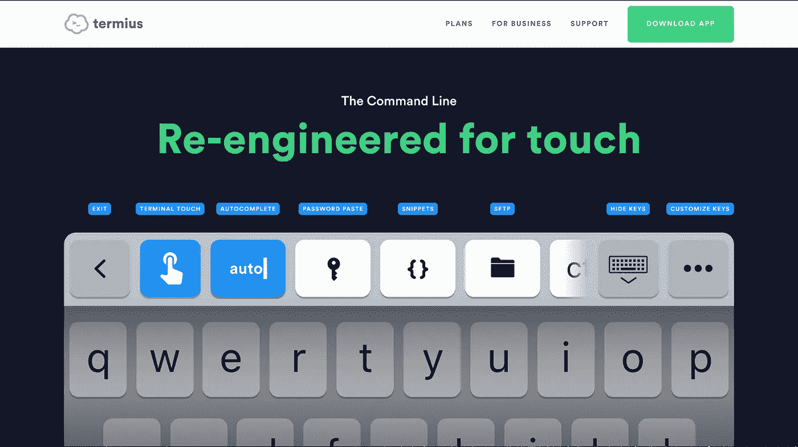

# 📡使用智能手机在 Raspberry Pi 上远程编写和运行代码

> 原文：<https://medium.com/coinmonks/remotely-writing-and-running-code-on-a-raspberry-pi-using-a-smartphone-3623fa837079?source=collection_archive---------1----------------------->


Often I would lie in bed, either scrolling through posts on [**wtf**](http://www.wtfjapanseriously.com/2014/03/blog-post.html?m=1) Japan seriously, creating ridiculously large, exorbitantly expensive shopping carts on [adafruit](http://adafruit.com), or deceiving myself into thinking I’m improving my Japanese language abilities when I’m really just coming up with ridiculous things to say and hearing how they sound in Japanese language — [日本語です](http://www.jisho.org)。These kind of activities are great and all, but sometimes the typical quotidian fluff just doesn’t quite cut it. Sometimes, an exciting novel use of your smartphone — that “number 1 device” {一番ききです} that happens to be most comforting at times of boredom and ennui — is just what is needed to keep one from losing their mind and being destined for [Asphodel Meadows](https://en.wikipedia.org/wiki/Asphodel_Meadows). So, after struggling in the doldrums for the last time, at least for the night anyway… and boring myself into a fugue state, my mind started to run free, and in that moment of stochastic neuronal phantasmagoria, a curiosity was found, and within a blink of my eyelids I had realized that which was found.


source: [gifmagazine](https://img.gifmagazine.net/gifmagazine/images/693268/medium.gif)

我想要*从我的智能手机*远程操纵我的树莓派，要么通过使用远程控制命令行，要么通过使用虚拟桌面(我目前正在为 [**VNC 桌面**](https://www.realvnc.com/en/)——敬请期待)。我选择在脑海中搜索一个特定示例的解决方案:远程控制我的 Raspberry Pi，以便操作一个连接有多个 led 的 Arduino 板(再次提醒，请继续关注)。对于这个特殊的例子，我最终使用了虚拟桌面，但是在我的研究中，我注意到了很多关于使用 [**SSH**](https://www.ssh.com/ssh/protocol/) 远程连接到计算机的命令行以便在远程环境中工作的讨论。

鉴于我最近对 bash 脚本和节点的兴趣，以及我最初对直接在我的 pi 上编码并从远程位置(即使是我的床)执行该代码的兴趣，这个远程环境业务听起来是个好时机。快速搜索后，我找到了一个看起来很精致、免费、简单明了的应用程序→ [**Termius**](http://www.termius.com) 。

> ***所以，这就是我们今天要学习的内容——如何从你的智能手机上远程控制一台电脑(比如树莓派)。***

更具体地说，我们将使用智能手机在 Raspberry Pi 上远程编码和运行文件服务器。

开始了。


[snipe @ github](https://github.com/snipe/awesome-emoji/blob/master/mario/supermariowalkright.gif)

我讨厌这样做，但我会立即给你一个选择，一个可以被看作是你勇敢程度的启发:

1.  在台式机/笔记本电脑上编写服务器代码，然后在智能手机上运行/编辑代码。
2.  在您的智能手机上设置 Termius，从您的手机上编写服务器代码，并运行/编辑服务器代码。当然，如果你愿意，你可以创建新的代码。

选项 1 要简单得多，因为键盘是输入设备，而不是触摸屏，并且使用触摸屏导航 vim 存在一些固有的困难。如果您选择此选项，请照原样遵循本文的其余部分。我必须指出:这种方法更多的是为了备份——以防在 Vim 上用智能手机的方法编写一个相对较长且复杂的节点脚本对于新手编程爱好者来说过于困难。

选项 2 ( **推荐**选项)要求您跳到🐆并按照说明设置 Termius 以远程连接到 Pi。一旦这些步骤完成，从这一点遵循教程的其余部分👇主要用你的智能手机转发。去吧，跳到豹子上🐆，并设置 Termius！我们很快会在这里见到你。

# **将 Raspberry Pi 设置为文件服务器**

有许多方法可以做到这一点，但在这个例子中，我们通过使用易于安装和配置的 Node.js/Javascript 和几乎所有 Linux 发行版都附带的 Vim 来保持事情相对简单，如果您决定选择*并从您的智能手机编写所有代码。否则，打开你选择的无聊编辑器……(我有承诺问题——MAC vim，不，VS Code，不，Atom，不 VS Code……我不知道)……然后在桌面或笔记本电脑上按照下面的步骤操作。*

***在您的 Raspberry Pi 上安装节点→***

*在您的 Raspberry Pi 终端中运行以下命令:*

```
*$ wget -O - https://raw.githubusercontent.com/audstanley/NodeJs-Raspberry-Pi/master/Install-Node.sh | sudo bash$ node -v*
```

*这将获得 NodeJs 的最新版本，并将其安装在您的 Raspberry Pi 上。*

*为了测试我们的成功，在终端中键入`node -v`，然后按<进入>。如果节点安装成功，您应该会看到控制台输出的版本号。*

**

*node successfully installing on Raspberry Pi running [**Raspbian**](https://www.raspberrypi.org/downloads/raspbian/)*

***通过获取一些有趣的包来熟悉 Node→***

*为了让人们熟悉流行的 NodeJs 软件包管理器，我们应该从他们的[网站](http://www.npmjs.com)下载一个漂亮的 NPM 模块——我们将下载并安装的软件包是为了让我们的命令行输出更加美观。*

*要安装 Chalk，请在 Raspberry Pi 上的终端中键入以下命令:*

```
*$ npm install chalk -g*
```

*继续并测试所有内容:*

**

*   *在 Raspberry Pi 中进入命令行/bash 终端(您可能已经在那里了)*

*在终端中输入以下命令:*

```
*$ node
> // you're now in the node repl
> const chalk = require('chalk');
> console.log(chalk.hex('#6ca04e')('This is a green color, invoked using a hex code'));*
```

*   *您应该会看到以绿色打印出来的文本💚*

*粉笔是一个伟大的 NPM 包，NPM 作为一个包经理是相当令人印象深刻的，无论是在受欢迎程度和规模。如果你想要更多 NPM 的东西，看看我的两个 NPM 套餐:*

> ***grabrandom** :这是一个接受一个参数`grabrandom`的命令行工具，简单地将一个随机的 ascii art 命令行打印到终端。*

**

*screenshot of grabrandom npm/node module*

> ***弹出** →一个简单的命令行工具，接受一个参数`ejectall`，快速安全地弹出所有连接的可移动媒体设备。*

**

## ***使用 Javascript 编写文件服务器***

```
*/*Javascript for instantiating our server -- There's quite a bit going on, but I'll do my best to explain below
*/ // here we acquire all the necessary modules to use for our Node/Javascript server 
// require fs module for file system tools
const fs = require('fs'); 
// require path module for path formatting
const path = require('path'); 
// require http module for server
const http = require('http'); 
// require url module for url tools
const url = require('url'); 
// declare port variable for specifying a specific port, if desired
const port = process.argv[3] || 8000; 
// here's the module from earlier. Aesthetes rejoice, command colors!
const chalk = require('chalk'); 
// shorten log statements in hope of more pithy/organized code
const log = console.log;const makeServer = ('request', (request, response) => {
  let targetPath = url.parse(request.url).pathname;
  log(chalk.hex('#4268f4')(targetPath));

  if (targetPath === '/') {
    file = '***<path to your file goes between these single quotes*>**';
  } else if (targetPath === '/file2') {
      file = '***<path to your file goes between these single quotes>***';
  } else {
      response.writeHead(404);
      response.end(404 + ' error has occurred -- FILE NOT FOUND');
      return;
  }
  const filePath = path.join(__dirname, file); 
  const src = fs.createReadStream(filePath); 
  src.pipe(response);
});
server = http.createServer(makeServer);
server.listen(port);
log(chalk.hex('#90BA3E')(`Listening on 127.0.0.1: ${port}`));*
```

*上面的代码是我们制作文件服务器的 Javascript。**需要注意的是:上面的代码中有两个地方需要将它们现有的内容替换为有意义的内容(找到中间有指令的< >符号)。***

*有必要将该内容(包括`<>`括号)替换为您试图提供的文件的位置路径。*

****注意:这个文件服务器代码是存在于树莓派上的！！！您可以在 Raspberry Pi 上本地编写这些代码，或者使用连接到 Raspberry Pi 的智能手机远程编写这些代码，如前所述！！！****

## *创建一个新文件夹并放入光盘*

*在您选择的位置创建一个新文件夹。姑且称之为`piServer`。如果您决定采用选项 2，那么您需要使用命令行参数创建一个文件夹。*如果你还在节点 repl 中，无法退出，可以输入* `*.exit*` *并回车退出。**

```
*// after navigating to the desired location for the new folder
// type the following commands$ mkdir piServer// now change directory into our piServer folder$ cd piServer*
```

*既然我们已经创建了 piServer 文件夹并将目录更改到该文件夹，我们需要为文件服务器代码创建 Javascript 文件。这可以通过创建文件的典型方法以图形方式实现，否则您可以通过键入以下命令用命令行创建文件*

*`touch server.js`*

*现在我们需要打开新创建的文件`server.js`，它现在位于`piServer`文件夹中。为了远程打开文件，我们将使用 vim。在命令行中，我们需要给出`[**vim**](https://www.openvim.com/)`命令和一个参数——要在 vim 编辑器中打开的文件——与我们要打开的文件在同一个目录中(即分别是`piServer`和`server.js`)。从上面的步骤中，你可能已经到达了你需要的地方。如果是，请键入*

*`$ vim server.js`*

*如果您不在`piServer`文件夹中，通过键入`cd`并按 enter 键，然后按`cd locationYouChose/piServer`键，切换回主目录`~`。最后，键入`vim server.js`。*

*或者，在`piServer`文件夹中使用`vim server.js`命令/参数可以跳过使用`touch`创建文件然后在 vim 编辑器中打开文件的步骤——vim 将创建并打开文件。*

*如果你使用的是图形桌面，那么你可以像平常一样打开文件。您也可以使用命令行在您选择的编辑器中打开文件→ `open server.js -a atom`*

****关于 Vim 的快速注释:*** 一旦你习惯了，Vim 真的很好用，我正在慢慢地采用它(并不是说我会永远只使用它)。对于命令行代码编写来说，vim 真的很棒，在我看来，这也是我们在这里使用它的原因。要开始，按下`i`进入-插入-模式，这允许您在文档中键入新字符。在 Vimland 中，鼠标是魔鬼，所以浏览一个文档只需要使用键盘(参见 macVim for Desktop use)。要向左、向下、向上或向右移动光标，分别使用`H`、`J`、`K`或`L`键。一旦你写完代码，按下`esc`并输入`:x`然后按下回车键——这将退出并保存你的代码。*

## *⌨️:我们开始编码吧*

**

*Photo by [Markus Spiske](https://unsplash.com/@markusspiske?utm_source=medium&utm_medium=referral) on [Unsplash](https://unsplash.com?utm_source=medium&utm_medium=referral)*

*既然我们的空白 Javascript 文档`server.js`已经打开，我们可以开始编写上面看到的文件服务器代码了。*

*首先要做的是*要求*在我们的 Node/JS 脚本中使用所有必要的模块。有几个:*

*将下面的每一行输入到`server.js`文档中。*

```
*const fs = require('fs');*
```

*文件系统输入和输出处理需要`[fs](https://node.readthedocs.io/en/latest/api/fs/)` [模块](https://node.readthedocs.io/en/latest/api/fs/)——您可以使用它提供的方法创建、编辑、删除目录和文件，以及读取和写入文件。*

```
*const path = require('path');*
```

*需要`[path](https://node.readthedocs.io/en/latest/api/path/)` [模块](https://node.readthedocs.io/en/latest/api/path/)来处理和转换文件路径。它的方法包括许多有用的工具，比如抓取文件路径的某些部分，用单斜杠替换双斜杠，等等。*

```
*const http = require('http');*
```

*`[http](https://node.readthedocs.io/en/latest/api/http/)` [模块](https://node.readthedocs.io/en/latest/api/http/)允许建立和管理 http 服务器和客户端连接。*

```
*const url = require('url');*
```

*`[url](https://node.readthedocs.io/en/latest/api/url/)` [模块](https://node.readthedocs.io/en/latest/api/url/)是解析 URL 对象的方法所必需的。*

*在调用节点和运行`server.js`脚本时，`port`变量允许将自定义端口指定为参数。`process.argv[3]`表示对节点的调用命令，`[3]`表示`process.argv`命令调用行的索引 3。这导致`node server.js 8080`将服务器的端口设置为 8080→node[1]server . js[2]8080[3]。注意`||`垂直线，它们等于布尔值`or`，如果在索引[3]处没有提供参数，那么`port`默认为`8000`。*

*接下来是之前的`chalk`模块，你应该熟悉这个。只要记住它让事情变得美好👸*

*最后，我设置了一个变量`log`来代替`console.log`,试图缩短/清理代码→ `console.log(chalk.hex('#cccccc')('schadenfreude'))`变得`log(chalk.hex('#cccccc')('schadenfreude'));`稍微好一点。你可以效仿我的做法。*

*以下是目前为止您应该有的内容:*

```
*const fs = require('fs');
const path = require('path');
const http = require('http');
const url = require('url');
const port = process.argv[3] || 8000;
const chalk = require('chalk');
const log = console.log;*
```

## *服务器对象及其方法*

*接下来，我们需要使用一个流行的`[**EventEmitte**](https://nodejs.org/api/events.html#events_class_eventemitter)**r**` 来处理 http 活动**、**`Server`对象的请求和响应。直到代码的后面才调用`createServer`方法，主要是因为文件路径处理和为导航到不同文件而设置的路由。*

```
*const makeServer = ('request', (request, response) => {
  // the next bit of code will go here

};
server = http.createServer(makeServer);
server.listen(port);
log(chalk.hex('#90BA3E')(`Listening on 127.0.0.1: ${port}`));*
```

*`makeServer`是一个变量，它指向创建一个`Server`对象的简写。稍后会调用`createServer`方法来处理每个 http 请求，从而为`[***Server***](https://nodejs.org/en/docs/guides/anatomy-of-an-http-transaction/)`对象添加一个监听器——这就是 EventEmitter。*

## *路由和文件路径处理逻辑*

*现在我们需要设置路由和文件路径处理逻辑。*

```
*const fs = require('fs');
const path = require('path');
const http = require('http');
const url = require('url');
const port = process.argv[3] || 8000;
const chalk = require('chalk');
const log = console.log;const makeServer = ('request', (request, response) => {
  **let targetPath = url.parse(request.url).pathname;
  log(chalk.hex('#4268f4')(targetPath));

  if (targetPath === '/') {
    file = '*<path to your file goes between these single quotes*>';
  } else if (targetPath === '/file2') {
      file = '*<path to your file goes between these single quotes>*';
  } else {
      response.writeHead(404);
      response.end(404 + ' error has occurred -- FILE NOT FOUND');
      return;
  }
  const filePath = path.join(__dirname, file); 
  const src = fs.createReadStream(filePath); 
  src.pipe(response);**
});
server = http.createServer(makeServer);
server.listen(port);
log(chalk.hex('#90BA3E')(`Listening on 127.0.0.1: ${port}`));*
```

*一个扩展的`if... else...`条件语句使用`path`模块所需的方法确定与目录名连接的文件路径→以便创建一个新的变量`filePath`，这个信息稍后将用于创建一个读流— `fs.createReadStream(filePath);`忽略 if else()语句后面的另一个文件路径……这将在后面解释(可能在下一篇博客文章中)。暂时忽略它，但是按照你看到的写代码。*

*最后，我们需要一个文件来提供服务。该文件可以是(但不限于)纯文本、jpeg、gif 等格式。为了让事情变得有趣，至少对我来说，我们将使用我最喜欢的事物之一的图片。还要注意的是，这个步骤(保存图像)**需要**物理访问 Raspberry Pi，因此当执行“完全”远程方法时，这将是唯一需要在 Raspberry Pi 上物理完成的步骤。*

*右键单击下面的图像，然后单击“将图像另存为…”*

*先存成`sansfeld`吧。确保将文件保存在我们的`piServer`文件夹/目录中。*

**

*Save this file as `sansfeld.jpg` — Seinfeld and DIY 4 LIFE * [photo used for educational purposes only](https://www.gettyimages.com/event/s-seinfeld-season-5-144789963#/season-5-pictured-jason-alexander-as-george-costanza-julia-as-elaine-picture-id138407106)**

*现在我们已经将一个文件(我们的图像文件— `jpg`)保存在与`server.js`相同的目录/文件夹中，我们可以将保存的图像的相对路径放入服务器文件代码中。*

**

*这就是我们需要将`<path to your file goes between these single quotes>`替换为“sansfeld.jpeg”文件的相对路径→ `/sansfeld.jpg`的地方。*

**

*下面是对完整代码的最后一次检查:*

**

*Using a typical editor with a graphical user interface*

**

*Screenshot of vim editor version of server.js (using iPhone 6s plus)*

*为了防止代码抛出错误，嵌套在`} else if {`语句下的第二个`file = ''`应该替换为指向您自己文件的路径，或者替换为`null`或`''`。`bigFile_Dude.txt`文件将在未来正式推出。*

## *🐆 ***豹子想引起你的注意*** 👇*

# ***为智能手机设置 SSH***

**文章/指南的这一部分将涵盖 iOS/iPhone 设备和 Google/Android 设备的使用案例，但需要注意的是，我只在 iPhone 6S Plus 上尝试过这种情况。**

## *安装 Termius*

**

*要安装 Termius，只需访问[www.termius.com](http://www.termius.com)并点击右上角的“下载应用”。这将保证您获得适合您设备的正确版本。*

*一旦你安装了 Termius，打开应用程序，准备下一步。*

## *在 Termius 上配置 SSH*

**这一部分并不特别难，但是一定要注意成功 ssh 连接到您的 Raspberry Pi 所需的必要信息。**

*远程连接到 Raspberry Pi 需要 3 个必要的信息:*

*   *Raspberry Pi 用户名→在 Raspberry Pi 的终端输入`whoami`即可找到——按<输入>并记下打印的名称。一个全新的 Pi 镜像(即 Debian/Raspbian)使用`pi`作为用户名。*
*   *Raspberry Pi 密码→这个你应该知道——你必须在你自己的✋上找到它如果你有一个新的 Raspberry Pi，密码可能是`raspberry`*
*   *Raspberry Pi ip 地址→在您的 Raspberry Pi 终端中键入此命令`ip addr show`,然后按< enter >找到设备的 ip 地址。记下这个地址。*

*gif showing how to get the ssh connection going*

*现在我们已经有了输入 Termius 的必要信息，并通过 SSH 连接到我们的 Raspberry Pi，打开智能手机上的 Termius 应用程序。*

*我们越来越接近互联，这允许许多有趣的事情。请留意我发布的多篇文章，这些文章涉及一些有趣的想法，可以通过远程连接到 Raspberry Pi 来进行尝试，Raspberry Pi 本身与微控制器(如 Arduino Uno)物理连接，微控制器本身可以控制多个其他设备。有很多乐趣和学习，只是说。*

*反正我跑题了——我们输入我们的树莓 Pi 信息吧。*

**

*screenshot showing where to input the username and password data*

*打开 Termius，点击**新主机。***

*这里有两件重要的事情，目前:**主机名**和**使用 SSH** 。*

*在**主机名**字段中输入您的 Raspberry Pi 的 ip 地址——我们在上面的步骤中找到的 ip 地址。然后，点击**使用 SSH** 切换按钮展开选项，在**用户名**字段中输入 Raspberry Pi 用户名，在 **Termius** 应用程序的**密码**字段中输入密码。*

*最后，点击**保存。这将把您带到一个只有一个列表的列表:您新创建的 SSH 连接。***

**通过编辑连接参数/设置的* ***别名*** *字段，可以更改该连接的名称/别名。**

**

*screenshot showing an established host connection with a user-set **alias** of ‘**piSrvr’***

## *测试一下*

*确保你的树莓派已经启动。然后点击 Termius 应用程序中的连接。如果一切顺利，您应该会从智能手机上看到您的 Raspberry Pi 的命令提示符！*

*使用您新创建并连接到 Raspberry Pi 命令行的远程会话(SSH ),键入`node`并按回车键。*

*现在，键入`npm install grabrandom -g`并按 enter——这将安装我的 grabrandom npm 包。*

*安装完成后——很小，很快——键入`grabrandom`,然后按回车键。*

*您应该看到一个有趣的 ascii 艺术打印到终端！*

## *远程运行我们的服务器代码*

****看这个很重要！→如果您已经跳到 Termius 部分(您现在正在阅读的部分)，并计划使用您的智能手机完成本文中的步骤，那么请回到您跳过的地方，享受剩下的学习，然后再回到这里！否则，继续阅读。****

*我们的服务器代码可以通过这种远程连接从您的智能手机上执行。*

*首先，进入`piServer`目录:*

```
*$ cd ~
$ cd location_of_piServer/piServer*
```

*现在，使用`node`运行`server.js`。*

```
*$ node server.js*
```

*如果一切顺利，您应该会看到:*

**

*现在在你最喜欢的**桌面**网络浏览器中打开一个新窗口。在地址栏中，键入正在监听的本地地址(即本地主机`127.0.0.1`，然后是代码中指定的端口`8000`——除非在命令行中调用 node 时给出了额外的参数，即`node server.js 8080`)。点击回车键，你应该会在你的浏览器中看到上面的‘sans feld’图像！如果您愿意，您可以从奶奶家访问该文件，而不是在本地访问，尽管这将需要一些额外的设置步骤——这将在下一篇文章中介绍！如果您使用的是远程桌面，您可以在服务器运行时通过在 web 浏览器的地址栏中键入 ip 地址和端口号来访问它。请记住，Termius 也可以安装在您的台式机/笔记本电脑上。这对于使用一些首选机器远程访问 Raspberry Pi 或其他微型计算机，或者如果您当时没有微型计算机的显示器和键盘，会很有用。*

*从技术上讲，这篇文章不是一个系列的一部分，但仍然应该被视为我目前正在撰写的一个系列的初始起点，该系列涉及远程控制计算机的几个不同的有趣用例。*

*希望你喜欢这篇文章。现在，不用睡觉，只要躺在床上盯着蓝光，编写一两个服务器的代码，建立一些网站…你可以做这一切，用你的智能手机在床上写，只使用树莓派上的命令行——这很有趣，这是极端爱好者 nerdom 的乐趣享受，并按照我的媒体页面继续关注未来涉及远程编码和微硬件项目的文章！🛰*

**

*Photo by [Louis Reed](https://unsplash.com/@_louisreed?utm_source=medium&utm_medium=referral) on [Unsplash](https://unsplash.com?utm_source=medium&utm_medium=referral)*