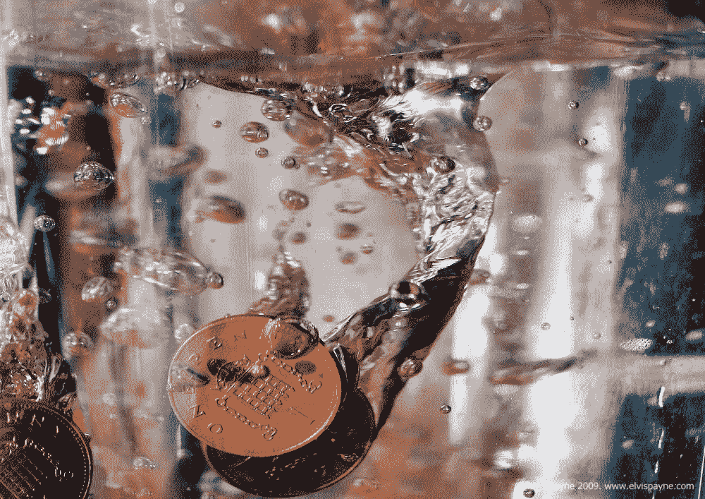
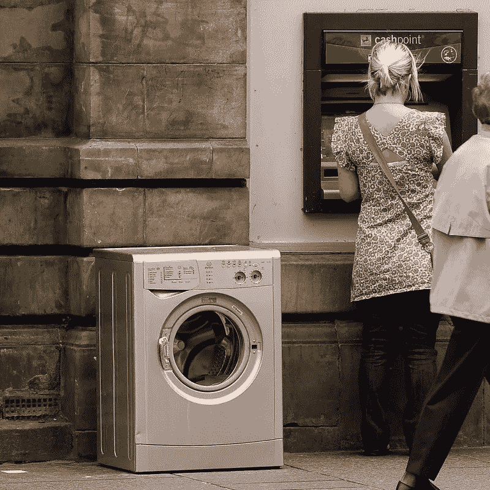

# 报告称，美国国税局在 2020 年查获了 35 亿美元的秘密洗钱现金

> 原文：<https://medium.com/coinmonks/report-claims-irs-seized-3-5-billion-of-crypto-laundered-cash-in-2020-944567e219ae?source=collection_archive---------6----------------------->

Image credit: [Elvis Payne](https://www.flickr.com/photos/24141278@N00/2189055523)

您知道吗，2020 年美国国税局(IRS)查获了超过 35 亿美元的加密货币资产？你没看错，那是 35 亿美元，而不是 350 万美元，尽管这似乎是一个高得令人难以置信的数字。然而，现实情况是，比特币、DogeCoin 和以太币等加密货币以及加密交易所是洗钱活动的温床，因为它们是分散的，不受当权者的监管。

Image credit: [Seth M](https://www.flickr.com/photos/14057878@N00/2672367566)

通过加密洗钱是如此容易，今天你只需走到任何一台比特币 ATM 机前，几秒钟就能完成过去需要几个月的事情。

根据上周发布的[国税局年度犯罪报告](https://www.irs.gov/pub/irs-pdf/p3583.pdf)，其在 2020 年从加密活动中缴获的 35 亿美元代表了其税务执法部门缴获的*全部*资产的 93%。

我认为这个数据很好地证明了我上面的观点——因为账本上没有加密规定，今天的大部分洗钱都是通过比特币等完成的。也许剩下的 7%代表了围绕 NFTs 的非法活动？

玩笑归玩笑，也许你听说过司法部几年前成立的[网络安全部门](https://www.justice.gov/criminal-ccips/cybersecurity-unit)？国税局也有一个网络犯罪部门(CCU)。他们也很忙，而且会变得更忙。如果你考虑到这个相对不为人知的 CCU 在 2020 年揭露的网络犯罪活动的数量，然后结合最近与加密货币和集中化有关的头条新闻，或许一幅画面开始浮现？也许加密的狂野西部时代即将结束？

今天，美国政府不仅在讨论加密的集中化，还在积极粉碎许多利用加密目前分散状态和缺乏监管的非法企图。事实上，美国国税局的年度犯罪报告分享了 2020 年以来一些更臭名昭著的加密货币洗钱案件，其中包括这些赢家:

沃洛季米尔·克瓦舒克 T3——克瓦舒克来自乌克兰，居住在美国，在微软西雅图总部担任工程师。在 MSFT 任职期间，他想出了一个从公司内部窃取并出售 Xbox 礼品卡代码的秘密方法！尽管克瓦舒克采取了预防措施，并使用了混合器(Chipmixer.com)来掩饰他的加密资金的流动，但他最终变得贪婪和粗心。也许华盛顿湖边价值 140 万美元的房子太贵了？随后，他被自己的雇主微软逮捕，微软也进行了自己的调查。在他被捕时，克瓦舒克已经偷了超过 15 万张 Xbox 礼品卡，价值超过 1000 万美元！说到混音器…

根据美国国税局的消息，加密货币混合器比特币迷雾(Bitcoin Fog)的创始人罗曼·斯特林戈夫(Roman Sterlingov)因涉嫌经营比特币迷雾(Bitcoin Fog)而在洛杉矶国际机场被捕，比特币迷雾是暗网上运营时间最长的比特币洗钱服务。美国国税局的指控称，超过 120 万枚比特币(交易时价值约 3.36 亿美元)通过比特币迷雾传送，斯特林戈夫通过他的服务在 BTC 产生了高达 800 万美元的收入，每笔交易收取约 2%的费用。

也许你很久没听过这个词了， [**丝路**](https://www.irs.gov/pub/irs-pdf/p3583.pdf) ？也许你和我一样，一直在等待并想知道丝绸之路创始人罗斯·乌布里希特在 2015 年因洗钱等罪名被捕并被定罪时被迫没收的数千枚比特币发生了什么？这是美国历史上最大规模的比特币扣押，根据美国国税局的年度犯罪报告，截至 2020 年 11 月 4 日，当这些硬币被实际扣押时，它们的价值超过 10 亿美元。

底线呢？如果集权和监管不会破坏加密货币党，那么国税局和 CCU 肯定会。美国政府已经发出通知。也许你还在持有你的硬币，期待另一次大的反弹，或者一系列反弹的到来？这可能为时已晚——比特币已经跌破 5 万美元。

表示“受到某种对待的人”:dividend | reverend

> 加入 Coinmonks [电报频道](https://t.me/coincodecap)和 [Youtube 频道](https://www.youtube.com/c/coinmonks/videos)了解加密交易和投资

## 另外，阅读

*   [电网交易机器人](https://blog.coincodecap.com/grid-trading) | [Cryptohopper 审查](/coinmonks/cryptohopper-review-a388ff5bae88) | [Bexplus 审查](https://blog.coincodecap.com/bexplus-review)
*   [7 个最佳零费用加密交易平台](https://blog.coincodecap.com/zero-fee-crypto-exchanges)
*   [分散交易所](https://blog.coincodecap.com/what-are-decentralized-exchanges) | [比特 FIP](https://blog.coincodecap.com/bitbns-fip) | [Pionex 审查](https://blog.coincodecap.com/pionex-review-exchange-with-crypto-trading-bot)
*   [用信用卡购买密码的 10 个最佳地点](https://blog.coincodecap.com/buy-crypto-with-credit-card)
*   [最好的卡达诺钱包](https://blog.coincodecap.com/best-cardano-wallets) | [Bingbon 副本交易](https://blog.coincodecap.com/bingbon-copy-trading)
*   [印度最佳 P2P 加密交易所](https://blog.coincodecap.com/p2p-crypto-exchanges-in-india) | [柴犬钱包](https://blog.coincodecap.com/baby-shiba-inu-wallets)
*   [八大加密附属计划](https://blog.coincodecap.com/crypto-affiliate-programs) | [eToro vs 比特币基地](https://blog.coincodecap.com/etoro-vs-coinbase)
*   [最佳以太坊钱包](https://blog.coincodecap.com/best-ethereum-wallets) | [电报上的加密货币机器人](https://blog.coincodecap.com/telegram-crypto-bots)
*   [交易杠杆代币的最佳交易所](https://blog.coincodecap.com/leveraged-token-exchanges) | [购买 Floki](https://blog.coincodecap.com/buy-floki-inu-token)
*   [3Commas 对 Pionex 对 Cryptohopper](https://blog.coincodecap.com/3commas-vs-pionex-vs-cryptohopper)|[Bingbon Review](https://blog.coincodecap.com/bingbon-review)
*   [加密复制交易平台](/coinmonks/top-10-crypto-copy-trading-platforms-for-beginners-d0c37c7d698c) | [如何在 WazirX 上购买比特币](/coinmonks/buy-bitcoin-on-wazirx-2d12b7989af1)
*   [CoinLoan 点评](https://blog.coincodecap.com/coinloan-review)|[Crypto.com 点评](/coinmonks/crypto-com-review-f143dca1f74c) | [火币保证金交易](/coinmonks/huobi-margin-trading-b3b06cdc1519)