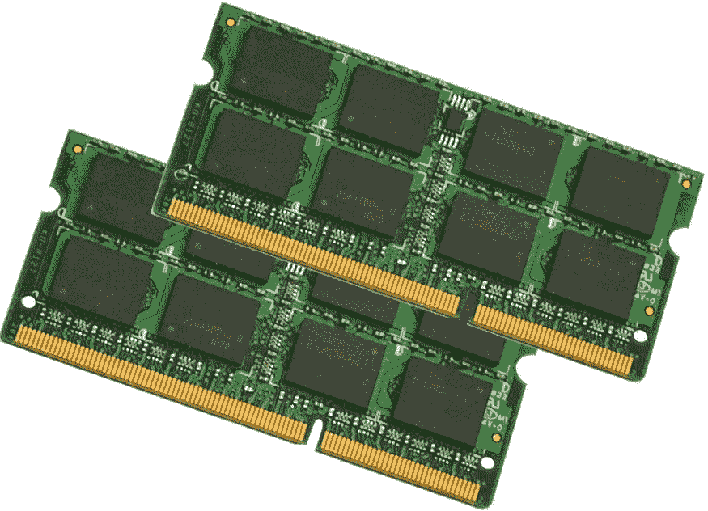

# 资源分配稳定参考 pt2:EOS RAM 市场

> 原文：<https://medium.com/coinmonks/resource-allocation-stablecoins-pt2-the-eos-ram-market-643c93482a4a?source=collection_archive---------8----------------------->

ENTER THE RAM MARKET

更新:当我和其他人讨论的时候，我会在文章的底部添加更新。我的第一反应在最下面…

在这个*命题的第一部分*中，我引用了 MultiCoin Capital 的 Myles Snider 的文章[*Stablecoins 概述*](https://multicoin.capital/2018/01/17/an-overview-of-stablecoins/) ，该文章展示了 stable coins 的三种设计:

1.  **集中签发借据**
2.  **抵押担保**
3.  **铸币税份额**

对此我提出了第四种稳定硬币的可能性:r *资源活动。*在资源活动稳定的情况下，支持不是来自元价值令牌或链外资产的安排，而是通过使用链上资源和内部网络-本地市场。当时，我受到了 GasToken 团队工作的启发，但由于当前以太坊网络的局限性，以及 GasToken 功能最终将被淘汰的机制，我去了别处。

当时 EOS 还没有推出，所以相对来说，网络在实践中是如何工作的还不为人所知。现在这个网络已经启动并上线了，它似乎是尝试构建资源活动支持的 stablecoin 的理想场所。

# 公羊市场

EOS Ram 市场的行为是 EOS network 推出时许多未知因素之一。丹·拉利默认为，投机行为将会受到这样一个事实的影响，即大宗商品生产商可能会出人意料地向网络中添加随机存取存储器，从而导致随机存取存储器——投机者的资产大幅贬值。然而，现实情况是，这种风险在最坏的情况下被投机者解释为“一种业务成本”，市场已经飙升。

虽然关于如何管理飙升的 RAM 价格正在进行大量的讨论，许多人呼吁取消它，但许多评论家没有认识到的是，RAM 市场代表了我所知道的区块链世界第一个真正的*连锁*资源市场。在我看来，这是一件大事。Neo 和以太坊有气，但是没有实现网络原生市场。这是我们第一次都拥有资源*对其所属的网络来说是固有的*，对网络的使用来说是关键的，以网络本地货币(eos)来命名的*以及在链上生存的*市场。**

# 为什么这很重要？

成为网络本地人很重要，因为:

1.  ***分散:*** 虽然 EOS RAM 已经[开始在交易所交易](https://bitbns.com/eos-ram-price-inr-india/)，但它本身就是一种分散的资产。它存在于链上，用户现在可以通过 Scatter 直接购买 RAM，无需第三方。
2.  ***本质有价值*** *:* 就像以太坊的气一样，RAM 本质有价值。这对于部署应用程序来说是必要的，对于拥有 EOS 名称来说是最低限度的必要(尽管对于进行交易来说不是必要的——用户可以在 EOS 上免费交易)。它的价值直接来源于 EOS 网络在现在和未来的感知有用性，并且随着 EOS 的增长，它的价值、需求和供应都将增长。
3.  ***继承 EOS 网络特性:*** 或许最重要的是——EOS RAM 作为资源继承了 EOS 链的原生特性。这意味着企业可以指望砌块生产商至少部分负责并有兴趣解决可能由安全问题引起的结构性问题。

这意味着 RAM 是一种更安全的链上(和网络本地)资源，而不是一些稳定的内容所拥有的链外附属资源。事实上，随着最近的 Bancor Hack 事件，我们在技术上对“代码即法律”的准备程度值得质疑。虽然完全和彻底的去中心化是一个高尚的(也是可取的)目标，但智能合约的复杂性与我们当前部署智能合约的专业知识不太相符，这限制了非网络本地 stablecoins 的信任/效用。在当前的 stablecoin 实现中，智能合约的失败会导致不可逆转的损失。

由网络本地资源支持的 EOS 稳定币使 EOS 网络具有独特的地位，能够拥有快速、廉价的内部市场，可以平衡系统资源、需求和链上铸币税。为了构建复杂的连锁金融产品，我们需要由 EOS 提供的内部市场。我建议我们保留国内 RAM 市场，并致力于发展能够稳定市场力量的经济体系。

与此同时，我正在密切关注 RAM 辩论。

(…未完待续—)

**更新:**关于坂本名史和吉尔伽美什在 EOSIO Gov telegram 频道的评论，我想澄清几点。

我不打算让砌块生产商成为 RAM stablecoin 的唯一“支持者”，他们最多是“最后的求助者”，因为砌块生产商*实际上*控制着 RAM，他们确实有一个特殊的地位，能够实际控制供应。也就是说，我相信块生产者在这个角色中是可以信任的，因为他们对整个网络作为一个整体负责。然而，这种稳定货币的日常运作将通过市场力量和连锁智能合约来实现。网络原生稳定币的真正独特之处在于，EOS 市场不需要*神谕*，这是现有稳定币的一个主要弱点。我们可以在链上做任何事情，就像 Maker 的 Maker-coin 对戴来说是最后的投票机制，BlockProducers 对 RAM 来说是最后的手段。(BTW: RAM 只是*EOS 上可以支持稳定币的网络原生资源之一*，所以不是 RAM 一个人)。在黑天鹅事件的情况下，区块生产商有能力介入并支撑一个由网络资源支持的稳定核心，这将给建立在 EOS 基础上的企业带来巨大的安心。与以太坊不同，像 Bancor hack 这样的黑客攻击意味着钱永远消失了，如果有必要，可怕的情况或错误可以得到纠正。