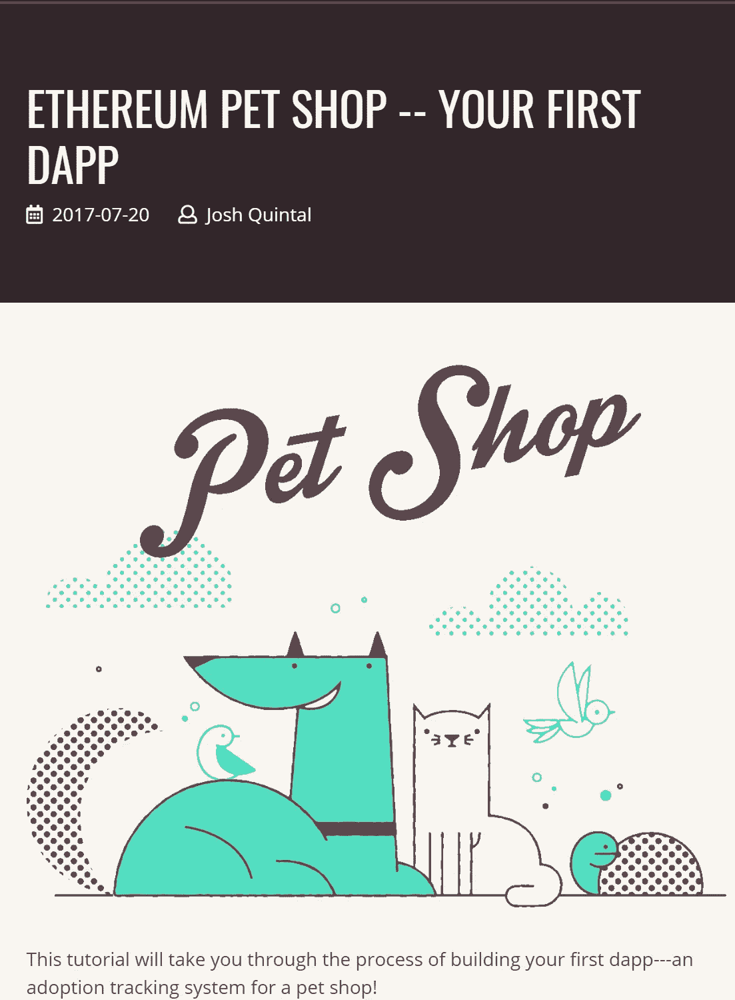

# 关于如何学习编写 Solidity 智能合约的资源。

> 原文：<https://medium.com/coinmonks/resources-on-how-to-learn-solidity-smart-contracts-3d4a2c2c29e8?source=collection_archive---------6----------------------->

Navigating the choppy seas of Solidity

这是一个关于如何开始撰写可靠的智能合同的指南。为了开始理解如何编写智能合同，我推荐几个资源。在教我自己学会可靠之后，让我们首先进入资源。

我们将涉及的第一个资源是织机网络的 Cryptozombies。这组教程将带您从不知道如何编写智能合同到实现 ERC 721 令牌，这是 cryptokittens 在令牌中使用的模板。您还将学习如何将其连接到基本的 web UI。课程的格式是，左边是你必须解决的课程，右边是你完成任务的源代码。隐型僵尸教程的目的。你可以在[https://cryptozombies.io/en/course/](https://cryptozombies.io/en/course/)找到隐型僵尸。

Cryptozombies Example

在学会混音之后，我推荐的下一个教程是可以教你如何分辨松露的。Truffle 是一种构建和迁移程序到以太坊网络和其他各种网络的方法。一个很好的入门学习松露的教程是宠物店教程。本教程将教你使用 Truffle 的基本知识，比如处理智能合约的编译和迁移。我们使用迁移是为了将您的代码部署到以太网。你可以在 https://truffleframework.com/tutorials/pet-shop 的[找到宠物店教程](https://truffleframework.com/tutorials/pet-shop)

一旦你完成了 Cryptozombies 和 Truffle，接下来你真正应该学习的是如何使用来自 Ethereum.org 的智能合约 IDE[Remix](http://remix.ethereum.org)。这是一个功能齐全的系统，您可以使用它来制作新的智能合同原型，并使用 gists 与他人共享，或者自己编写。还有其他选择，比如只使用一个编辑器，但是 remix 目前有很多特性，比如静态分析工具。此外，它还具有一个成熟的调试器，能够使用 Metamask 注入的 web3 provider，这是一个用于以太坊的纯 javascript 运行时，以及测试和部署到这些网络的方法。你可以在 remix.ethereum.org 找到这个。

Remix with Lucas Series.

喜欢还是不喜欢上面的教程？下面评论。寻找智能合约开发商？在 jherman@aconsapart.com 联系我。想捐点比特币给我吗？我的 BTC 地址是 3 bopkmewxls 1 eemsntz 7 are 8 qiconhxia。

> [直接在您的收件箱中获得最佳软件交易](https://coincodecap.com/?utm_source=coinmonks)

