# 重新思考计算机视觉的初始架构——第 1 部分

> 原文：<https://medium.com/coinmonks/rethinking-the-inception-architecture-for-computer-vision-part-1-2938cc7c7872?source=collection_archive---------1----------------------->

我最近读了这篇关于初始架构的论文。我也在这里整理笔记。这个记录研究论文以备将来参考的酷主意是受 Jae Duk Seo 的启发。

Rethinking the Inception Architecture for Computer Vision

# Conv 篮网开赛前的小历史

在卷积神经网络用于图像分类之前，特征提取和分类用于计算机视觉中对图像进行分类。特征提取是一个耗时的过程，必须根据数据仔细选择特征。因此，每次根据图像来定制特征就变成了一项麻烦的任务。

深度学习兴起后，卷积神经网络开始用于图像分类、图像分割和其他计算机视觉任务。

## 什么是 ImageNet？

[ImageNet](http://image-net.org/) 是一个正式的项目，旨在(手动)将图像标记和分类为近 22，000 个独立的对象类别，用于计算机视觉研究。

然而，当我们在深度学习和卷积神经网络的背景下听到术语*【ImageNet】*时，我们很可能指的是 [*ImageNet 大规模视觉识别挑战*](http://www.image-net.org/challenges/LSVRC/) ，简称 ILSVRC。

这个图像分类挑战的目标是训练一个模型，该模型可以将输入图像正确地分类成 1，000 个单独的对象类别。

模型在大约 120 万张训练图像上进行训练，另外 50，000 张图像用于验证，100，000 张图像用于测试。

这 1，000 个图像类别代表了我们在日常生活中遇到的对象类别，如狗、猫、各种家用物品、车辆类型等。你可以在这里找到 ILSVRC 挑战赛[中物体类别的完整列表](http://image-net.org/challenges/LSVRC/2014/browse-synsets)。

说到图像分类，ImageNet 挑战是计算机视觉分类算法的事实上的基准。

Alex net——这是最早使用的 CNN 架构之一。它由 5 个卷积层和 3 个全连接层组成。首次使用了 ReLu 激活函数，解决了渐变爆炸和渐变消失的问题。此外，它使用辍学作为一种正规化技术。它包括 11x11、5x5、3x3、卷积、最大池、数据扩充、带动量的 SGD。它在每个卷积和全连接层之后附加 ReLU 激活。

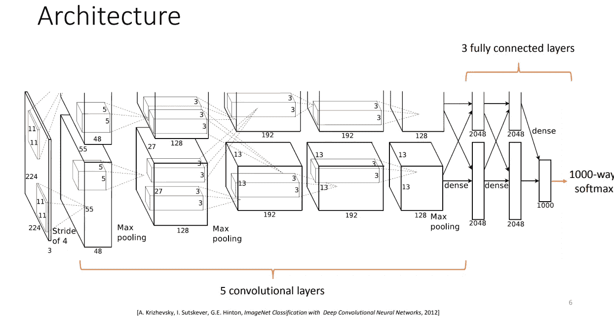

VGG16 — VGGNet 在[论文](https://arxiv.org/abs/1409.1556) *中介绍了用于大规模图像识别的极深卷积网络。*它确实是一个非常深的架构，由 16 个卷积层组成。

它只使用 3x3 过滤器，最大池，并有一个非常统一的架构。

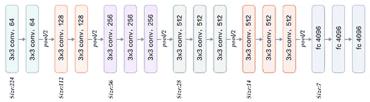

这意味着深度卷积架构中的架构改进可以用于提高大多数其他计算机视觉任务的性能，这些任务越来越依赖于高质量的学习视觉特征。

## 介绍

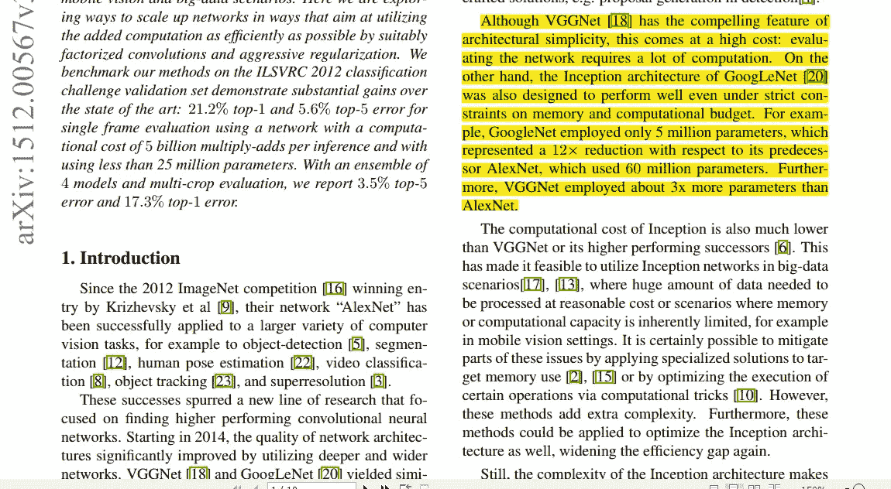

基本上，如果我们采用旧的方法，AlexNet 即使对于通常需要制定特殊功能的任务也能给出很好的准确性。但是 AlexNet 有大量的参数，这使得它的计算非常昂贵。虽然 VGGNet 的架构更加统一和简单，但它的参数比 AlexNet 多 3 倍。

GoogLeNet(初始架构)的计算成本很低。因此，它可以用在内存或计算能力有限的地方(大数据场景)。但是由于这个架构比较复杂，所以很难对其进行改动，使其变得更好。我们将在本文中看到一些技术。

## 一般设计原则

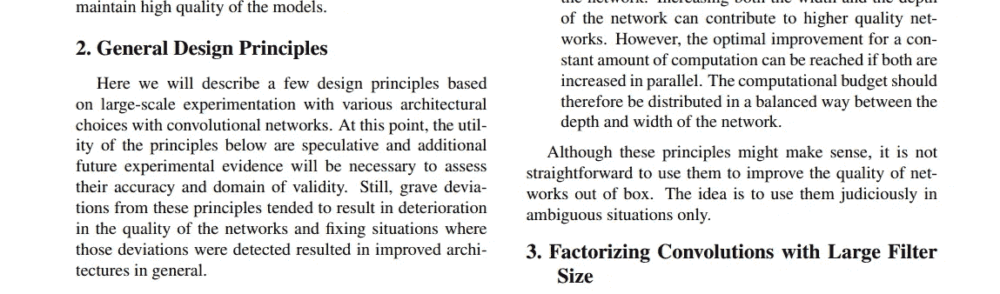

基于实验证据的 CNN 架构的一些一般原则是:

1.  通过极度压缩避免瓶颈。尺寸应该逐渐减小。
2.  **增加每张牌的激活次数将导致** [***解除特征***](https://www.tik.ee.ethz.ch/file/11601d4777e61d25ee085e4419bc4308/LearningDisentRepresentations.pdf) **并导致更快的训练。**
3.  在进行空间聚合之前降低输入的维度，而不会损失太多的表示。
4.  在网络的高度和宽度之间分配计算预算。

## 分解具有大滤波器尺寸的卷积

基本上，在论文[深入探讨卷积](https://arxiv.org/abs/1409.4842)中，介绍了初始架构，它将不同滤波器大小的滤波器输出连接在一起。除了连接之外，它还引入了降维技术。(将进一步讨论)

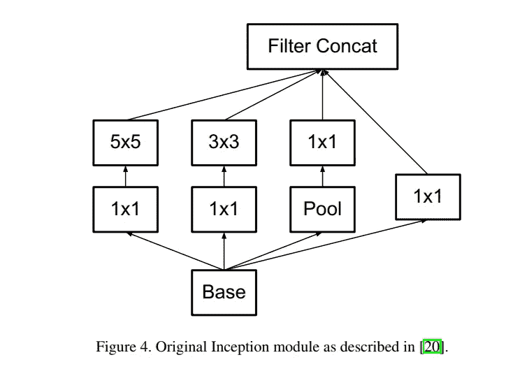

但是，像 5x5、7x7 这样的大滤波器尺寸的卷积计算量非常大。如果我们用两个 3×3 的过滤层代替 5×5 的过滤层，会怎么样

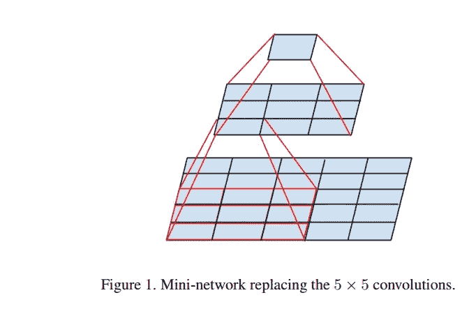

可以想象，这个两层网络与 5x5 卷积做同样的工作，但是参数更少，因此计算量更少。因此，我们的计算时间减少了(9+9/25)。

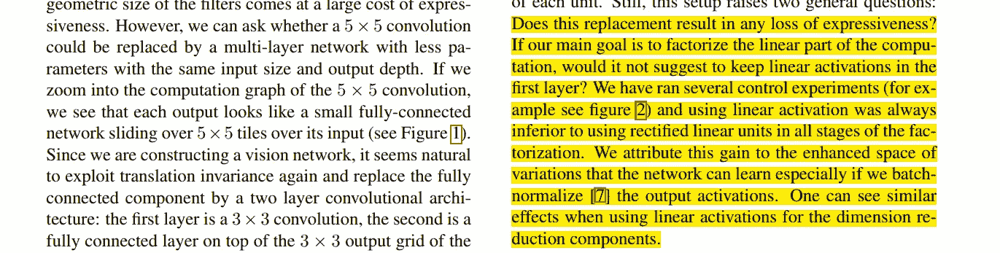

## 额外阅读——初始架构中的维度缩减

## 卷积解释:

使用 3×3 滤波器的卷积运算:

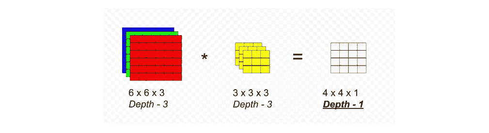

卷积运算 1x1 滤波器，深度 3，滤波器数量-1:

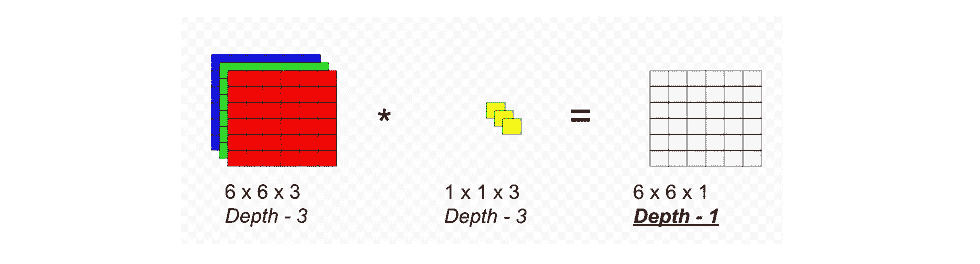

卷积运算 1x1 滤波器，深度-3，滤波器数量- 2:

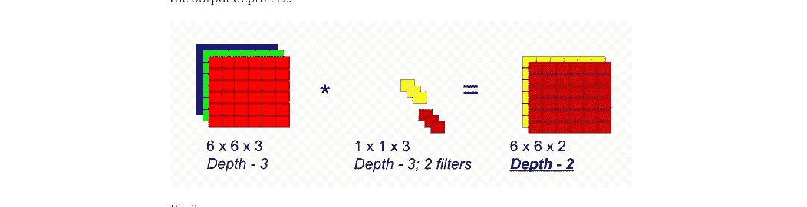

卷积运算 1x1 滤波器，深度- 3，滤波器数量-3:

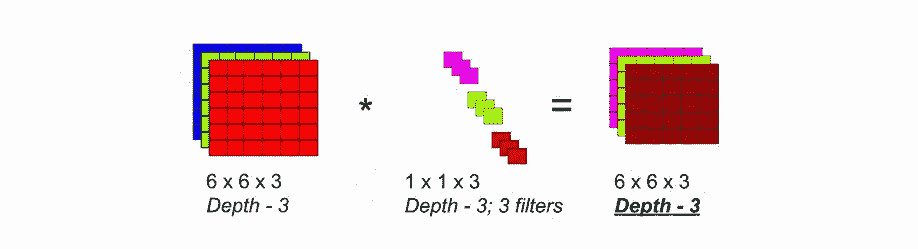

## 1x1 卷积如何减少运算次数？

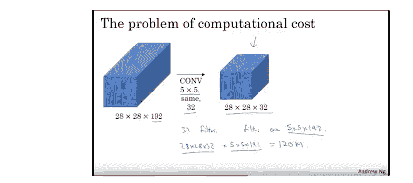

在上面的卷积中，

28x28(输入图像的大小)x5x5(滤镜的大小)x192(通道)x32(滤镜的数量)= 120，422，400 次操作

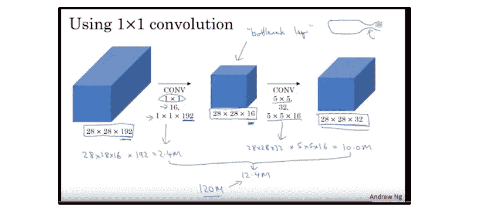

中间有 1x1 卷积，运算次数变为:

28 x 28 x 1 x 1 x 192 x 16+28 x 28 x 5 x 5 x 16 x 32 = 12，443，648-->**运算次数减少 10 倍**

## 资源

 [## ImageNet: VGGNet、ResNet、Inception 和 exception with Keras-PyImageSearch

### 几个月前，我写了一篇关于如何使用卷积神经网络(特别是 VGG16)对图像进行分类的教程…

www.pyimagesearch.com](https://www.pyimagesearch.com/2017/03/20/imagenet-vggnet-resnet-inception-xception-keras/)  [## ResNet，AlexNet，VGGNet，Inception:理解卷积网络的各种架构

### 好的 ConvNets 是有数百万个参数和许多隐藏层的野兽。事实上，一个糟糕的经验法则是:‘更高…

cv-tricks.com](http://cv-tricks.com/cnn/understand-resnet-alexnet-vgg-inception/)  [## 1x1 卷积是如何用于降维的？

### 回答(第 1 题，共 5 题):我明白为什么这很令人困惑。从表面上看，如果你用一个 1x1 内核卷积…

www.quora.com](https://www.quora.com/How-are-1x1-convolutions-used-for-dimensionality-reduction)