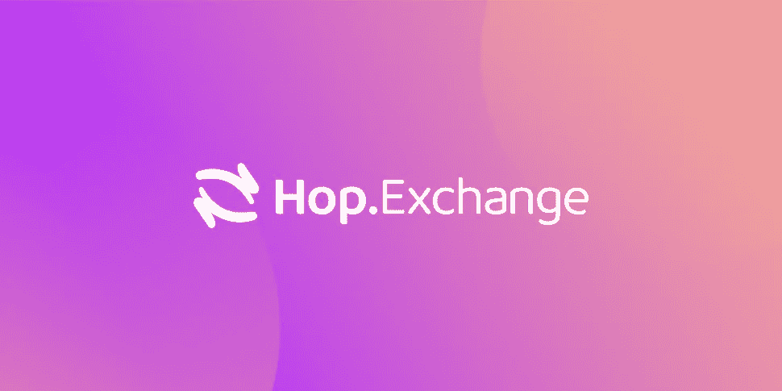

# 追溯空投—跳跃和连接

> 原文：<https://medium.com/coinmonks/retroactive-airdrop-hop-connext-ce5333d04d77?source=collection_archive---------1----------------------->

如果你关注加密货币行业超过几周，你可能对空投很熟悉。就在几周前，准确地说是 9 月 8 日，当我在沃尔格林汽车穿梭药房排队时，我读到 dYdX 空投价值 **$100k+** 。失望中我的头撞击着方向盘——*那本可以还清我的学生贷款*。太糟糕了，美国用户被排除在空投之外(感谢监管机构)。不管怎样，这是一个很好的教训。每个项目最终都会有一个标志，这是行业发展的方向。因此，在那一天到来之前，与这些项目互动是值得的。为什么？早期用户会得到回报，我们已经一次又一次地看到了这一点。如果你没有钱模仿，甚至没有钱为此建立投资组合，那就开始使用这些东西吧。

> “加密货币空投——将加密货币存放在公共加密钱包中的行为——被用作多种类型的区块链项目的营销、流动性创造和网络引导工具”——Cryptopedia

通常，当现有协议宣布推出本机令牌时，会发生追溯空投。那些满足特定标准的人，通常是通过在截止日期前进行交易或对项目做出贡献，在启动时获得一定的令牌分配。

让我们回顾一下过去一年的其他一些追溯性空投；也许那会让你点击进入一个更大的钱包。

**Uniswap**——2020 年 9 月，400 UNI。今日价值:**$ 8450。**

资格标准-在 2020 年 9 月 1 日之前以任何方式与该方案有过互动。

**1 英寸**-2020 年 12 月，约 1636 英寸。今日价值:**$ 4270。**

资格标准-在 2020 年 12 月 24 日之前以任何方式与方案互动。

继续前进，乐观主义和 Arbitrum 已经正式启动！虽然以太坊的第二层并非没有错误，但他们已经开启了新的生态系统。通常，当寻找潜在的追溯空投时，新的生态系统是最好的选择。在这里，新的应用程序已经产生，并希望吸引用户。有时，最简单的事情，如代币交换，将为你赢得后来宣布的空投的一部分。看着这些新的第二层，我把目光投向了[跳协议](https://hop.exchange/)和[连接协议](https://connext.network/)。

> “Hop 允许用户快速、轻松地在第二层、侧链和第一层以太坊之间直接传输令牌。”
> 
> “Connext 的核心是不同链条上的流动性池网络。用户在这些池之间交换价值，类似于 Uniswap 等 AMM 指数。”

简而言之，两者都是 DeFi 协议，允许您在许多不同的链之间快速桥接资产，包括但不限于:Arbitrum、乐观、以太坊 Mainnet、Polygon 和 xDai。Connext 支持的比 Hop 多一些，包括币安智能链、Fantom Opera 等。尽管如此，这两个案例看起来都像是 DeFi 协议追溯空投/fairdrop 的教科书案例。如果您所做的至少是对这些进行一次交换，那么您就有机会了。客观地说，如果你在截止日期(快照日期)之前在 DYDX 上进行了一次交易，你得到了 310.75 美元的 dYdX，在撰写本文时价值为 3，698 美元(今天市场也崩溃了)。

**动作:**与[跳协议](https://hop.exchange/)和[连接](https://connext.network/)执行一次交易。

祝好运和狩猎愉快。

*—布兰登·戈斯*

> 加入 Coinmonks [电报频道](https://t.me/coincodecap)和 [Youtube 频道](https://www.youtube.com/channel/UCbyDhTbOiKh2iUMKBi4-4Zg)了解加密交易和投资

## 也阅读

 [## 最佳加密交易所| 2021 年十大加密货币交易所

### ICON _ PLACEHOLDEREstimated 预计阅读时间:28 分钟加密货币交易所的加密交易需要知识…

blog.coincodecap.com](https://blog.coincodecap.com/crypto-exchange)  [## 2021 年 10 大最佳加密贷款平台| CoinCodeCap

### 当谈到加密货币贷款时，大量因素等同于良好的收入状况。此外，借款的一部分…

blog.coincodecap.com](https://blog.coincodecap.com/crypto-lending)  [## 2021 年最佳免费加密交易机器人

### 2021 年币安、比特币基地、库币和其他密码交易所的最佳密码交易机器人。四进制，位间隙…

medium.com](/coinmonks/crypto-trading-bot-c2ffce8acb2a)  [## 最佳 4 个加密交易信号电报通道

### 这是乏味的找到正确的加密交易信号提供商。因此，在本文中，我们将讨论最好的…

medium.com](/coinmonks/best-crypto-signals-telegram-5785cdbc4b2b)  [## BlockFi 评论 2021:利弊和利率| CoinCodeCap

### 今天，我们提出了一个全面的 BlockFi 评论，这是一个成立于 2017 年的加密贷款平台，拥有其…

blog.coincodecap.com](https://blog.coincodecap.com/blockfi-review)  [## 如何在印度购买比特币？2021 年购买比特币的 7 款最佳应用[手机版]

### 如何使用移动应用程序购买比特币印度

medium.com](/coinmonks/buy-bitcoin-in-india-feb50ddfef94)  [## 加密税务软件——五大最佳比特币税务计算器[2021]

### 不管你是刚接触加密还是已经在这个领域呆了一段时间，你都需要交税。

medium.com](/coinmonks/best-crypto-tax-tool-for-my-money-72d4b430816b)  [## 存储比特币的最佳加密硬件钱包[2021] | CoinCodeCap

### 保管您的数字资产很容易，但找到正确的存储方式却是一项繁琐的任务。在线钱包有一个风险…

blog.coincodecap.com](https://blog.coincodecap.com/best-hardware-wallet-bitcoin)