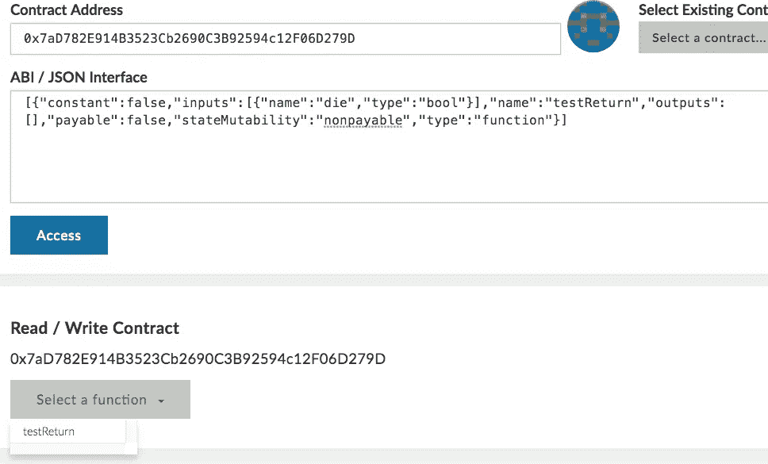
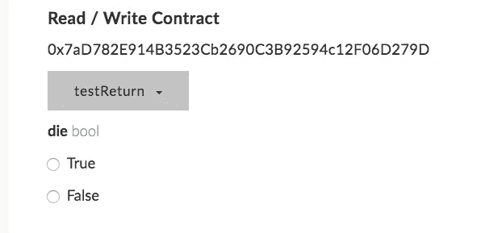

# 可靠性合同中的返回值

> 原文：<https://medium.com/coinmonks/return-values-in-solidity-contracts-2a034b31d553?source=collection_archive---------1----------------------->


## 如果唯一的其他选择是恢复，没有必要返回一个布尔值

我在各种渠道看到过这样的评论:对于一个返回错误输入的函数来说，在成功时返回一个布尔值`true`是一个很好的实践。

```
function doSomething(uint someData) public returns (bool) {
   require(someCondition);
   ....doSomethingHere;
   return true;
}
```

这种观点从根本上说是有缺陷的，因为返回值绝对是 ***无用*** 。

> [发现并回顾最佳区块链软件](https://coincodecap.com)

可以通过多种方式调用合同的函数

1.  作为交易的一部分从外部拥有的地址
2.  使用命名调用从同一个或另一个协定中
3.  使用未命名调用从同一个或另一个合同

我可能用错了#2 和#3 的名字，所以我会给出例子

让我们看看下面的合同，它可以在 rinkeby 网络上找到，网址为“[0x7ad 782 e 914 b 3523 CB 2690 C3 b 92594 c 12 f 06d 279d](https://rinkeby.etherscan.io/address/0x7ad782e914b3523cb2690c3b92594c12f06d279d#code)

```
contract a {
    function testReturn(bool die) public  {
        require(!die);
    }
}
```

# 从外部拥有的地址(EOA)打电话

这将包括启动我的密码或我的钱包，

*   选择合同页面，
*   插入以下 ABI

```
[{"constant":false,"inputs":[{"name":"die","type":"bool"}],"name":"testReturn","outputs":[],"payable":false,"stateMutability":"nonpayable","type":"function"}]
```

这给了你这个屏幕



*   并使用 true 或 false 调用 testReturn 函数



务必记住从 Rinkeby 网络使用 rinkeby 测试乙醚进行此操作(*可从水龙头. rinkeby.io* 获得)

运行该功能后，您可以在 etherscan 中检查日志。

*   用 die = `true '调用它，事务恢复(myCrypto / MEW 将试图阻止您这样做)
*   用 die = `false '调用它，事务成功

在这两种情况下，你只看到成功或失败。添加一个布尔返回值不会获得更多信息，因为来自 EOA 的事务无法返回一个即使通过检查区块链也能读取的值。

# 从协定中调用命名函数

一个契约可以很容易地调用另一个契约

```
contract test {
    a public ab = a([0x7aD782E914B3523Cb2690C3B92594c12F06D279D](https://rinkeby.etherscan.io/address/0x7ad782e914b3523cb2690c3b92594c12f06d279d#code)); function testIt(bool die) {
        ab.testReturn(die);
    }
}
```

事实是，你从下面的例子中什么也得不到

```
contract b {
    function testReturn(bool die) public returns (bool) {
        require(!die);
        return true;
    }
}contract test {
    b public ab = a([0x7aD782E914B3523Cb2690C3B92594c12F06D279D](https://rinkeby.etherscan.io/address/0x7ad782e914b3523cb2690c3b92594c12f06d279d#code)); function testIt(bool die) {
        if (ab.testReturn(die)) {
            log0("OK");
        } else {
            log0("BAD");
        }
    }}
```

虽然您可以测试返回结果，但它永远不会返回 false。如果`ab.testReturn`恢复，调用事务也恢复，因此“BAD”将永远不会被记录。

# 从协定中调用未命名的函数

也可以像这样通过从另一个契约发送一个原始事务来调用一个公共函数

```
contract test {
    address public ab = [0x7aD782E914B3523Cb2690C3B92594c12F06D279D](https://rinkeby.etherscan.io/address/0x7ad782e914b3523cb2690c3b92594c12f06d279d#code);

    function testReturn(bytes data) public {
        if (ab.call.value(0)(msg.data)) {
            log0("OK");
        } else {
            log0("notOK");
        }
    }
}
```

在这种情况下，您需要传入指示调用所需的字节，这是通过接受函数签名的 keccak256 的前 4 个字节，后跟包含 0(假)或 1(真)的 32 个字节来完成的。

你可以在林克比网上的`[0x 5178224d 088 a 43260 db 46 e 46 EB 2 c 26 e 60 FD 1 a3 CD](https://rinkeby.etherscan.io/address/0x5178224d088a43260db46e46eb2c26e60fd1a3cd#code)看到这样的合同。

在这种情况下，即使调用恢复，您也会得到一个返回值，因为返回值只是告诉您子事务是否成功。

不幸的是，Etherscan 在查看 Rinkeby 时有一些问题——它无法获得两个事务的日志，但是如果您检查日志，您会看到后续的事务记录正常，而失败的事务记录不正常，如下面的日志所示

```
0x892236e1eca9a65235dcb213c7548030332def523cc0c620e423d5f64208739e OK0xa51bccf52e207c7a3ce54759894bf3cebcc23aaa3315f2c6ae238fb12d6bc8fc
notOK
```

# 结论

如果一个函数只有两个选项——运行或恢复——让它返回一个状态标志来指示它是否成功是没有意义的。

如果您对它进行未命名的调用，返回值指示调用成功或失败，而不管它返回的任何变量，如果您通过 name* 调用它，它将在失败时恢复调用约定，因此布尔回复不传递任何额外信息。

# 事后思考

很有可能我忽略了一些东西——但是到目前为止，还没有人能指出我推理中的一个缺陷。如果你能找到这样一种情况，当被调用的契约恢复或返回 true 时，返回一个布尔值真的很有用，请在评论中告诉我。

> 加入 Coinmonks [电报频道](https://t.me/coincodecap)和 [Youtube 频道](https://www.youtube.com/c/coinmonks/videos)获取每日[加密新闻](http://coincodecap.com/)

## 另外，阅读

*   [复制交易](/coinmonks/top-10-crypto-copy-trading-platforms-for-beginners-d0c37c7d698c) | [加密税务软件](/coinmonks/crypto-tax-software-ed4b4810e338)
*   [网格交易](https://coincodecap.com/grid-trading) | [加密硬件钱包](/coinmonks/the-best-cryptocurrency-hardware-wallets-of-2020-e28b1c124069)
*   [密码电报信号](http://Top 4 Telegram Channels for Crypto Traders) | [密码交易机器人](/coinmonks/crypto-trading-bot-c2ffce8acb2a)
*   [最佳加密交易所](/coinmonks/crypto-exchange-dd2f9d6f3769) | [最佳加密交易所](/coinmonks/bitcoin-exchange-in-india-7f1fe79715c9)
*   开发人员的最佳加密 API
*   最佳[密码借贷平台](/coinmonks/top-5-crypto-lending-platforms-in-2020-that-you-need-to-know-a1b675cec3fa)
*   [免费加密信号](/coinmonks/free-crypto-signals-48b25e61a8da) | [加密交易机器人](/coinmonks/crypto-trading-bot-c2ffce8acb2a)
*   [杠杆代币的终极指南](/coinmonks/leveraged-token-3f5257808b22)