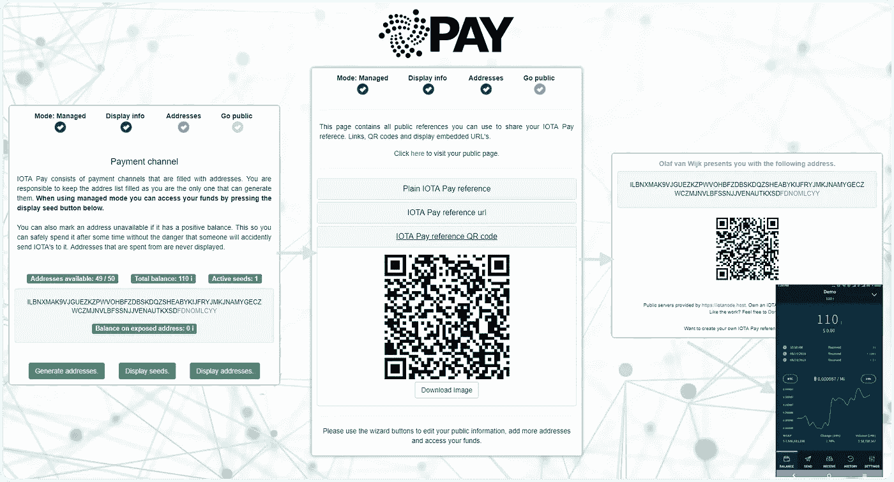
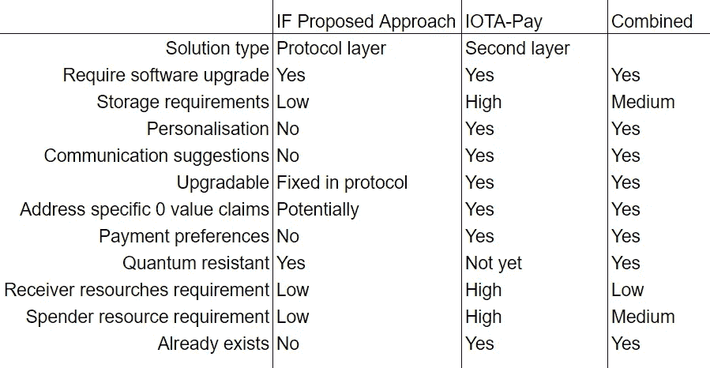

# 可重复使用的 IOTA-Pay 地址！

> 原文：<https://medium.com/coinmonks/reusable-addresses-with-iota-pay-38c4b3f10333?source=collection_archive---------0----------------------->

## 一种有效的分散式以人为中心的 IOTA 地址管理解决方案，也解决了可重用地址的问题。

熟悉 IOTA 的人都知道，它以 Tangle 的形式采用了一种新的分布式分类帐技术。与区块链相比，Tangle 具有完全不同的属性，如无限可扩展性、无矿工、无交易费和量子抗性。

## 可重用地址问题

IOTA 基金会最近发表的一系列文章(Part: [1](https://blog.iota.org/a-proposal-for-reusable-addresses-part1-bc6dbca84cbf0) 、 [2](https://blog.iota.org/a-proposal-for-reusable-addresses-part-2-d83d328ff1b3) 、 [3](https://blog.iota.org/a-proposal-for-reusable-addresses-part-3-9ec6fa1929d7) )很好地解释了什么是可重用地址问题以及它的成因:

> “其中一个选择是使用[抗量子签名方案](https://public.tangle.works/winternitz.pdf)，它(虽然对量子计算机是安全的)不允许从同一个地址多次消费，而不会将该地址的资金置于风险之中。
> 
> 该功能的大多数批评者认为，量子计算等问题不是迫在眉睫的威胁，当脆弱的签名算法成为真正的问题时，可以进行调整。尤其是当替代方案给当前用户带来可用性问题的时候。"

IOTA-Pay 专注于“人类发起的交互”,作为 Tangle 之上的第二层解决方案来实现，以准确解决上述问题以及更多问题！IOTA-Pay 与提议的协议级解决方案密切相关，因为它们都解决了这个问题，本文稍后将进行详细的比较。

## 第二层方法

为了在不需要任何第三方的情况下制定一个有效且完全可验证的解决方案，我们已经为任何试图解决该问题的解决方案确定了一些关键要求。已经提出了不同的第二层方法来解决 IOTA 的这个问题，但是所有这些方法都缺少这些关键特征中的一个或多个:

1.  它**需要一个可重复使用和不可伪造的参考**，别名，帐户，地址等。这里的要点是，它需要是可验证的独特的东西。必须有人能够独立验证此类证明的正确性，并能够识别欺诈行为。
2.  发送到该参考/地址**的所有信息**的**来源必须是可验证的**。这样，当我们暴露一个未使用的地址时，我们至少知道是同一个人在做这件事。
3.  **IOTA 种子绝不能离开客户**。任何解决方案都不应该要求将种子发送到后端服务才能工作。也不应该在这样的后端服务中生成和存储种子。这损害了 DLT 最基本的安全保障。这自动意味着 IOTA 特定地址也必须在客户机上生成。
4.  **任何两方都不能使用相同的资金**。似乎很明显，但如果我给你钥匙，你就有资金了，对吗？但我们生活在一个数字世界，因此无法保证密钥创建者自己不会保留一份副本。这将要求接收方立即采取行动，以确保资金安全(他必须将资金转移到另一个地址，直到他这样做，资金是不安全的。).
5.  软件需要**开源**。要信任软件，我们需要能够查看其来源。这不是 100%的保证，但这是最低要求。
6.  用于其功能的软件**不应该依赖于除 IOTA 节点**之外的任何后端服务器。通过仅使用 IOTA 节点，通信变成纯粹的“纠缠谈话”。这意味着该方法可以容易地移植到每种语言和平台，而只依赖于 Tangle 协议。

第一点和第二点解决起来很重要，但也是这个问题的每个真正的分散解决方案的基础。IOTA-Pay 如何在技术层面上解决这一问题的详细描述如下:[https://medium.com/coinmonks/iota-origin-d26b399d3cca](/coinmonks/iota-origin-d26b399d3cca)

第一点和第二点解决后，其他因素主要是软件设计选择，但对于创建标准 voor 单一参考支付仍然很重要。

## IOTA-支付

IOTA-Pay 将所有这些关键功能整合到一个功能齐全的网站(和 API)中，允许您创建一个公共参考(地址)并与任何人分享。通过将 IOTA 地址添加到这样的引用中，您实际上创建了一个可重复使用的地址，因此可以在每次需要向某人汇款时进行通信。您可以通过普通的 URL，以纯文本或 QR 码的形式共享此参考。你(或你的钱包)所要做的就是确保推荐信中至少有一个未使用的地址，你就可以开始了。

最棒的是。这是百分百的纠结，完全去中心化！

## 就这些吗？

如前所述，IOTA-Pay 旨在使 IOTA 更加以人为中心，这意味着创建可重用的引用/地址并不是 IOTA-Pay 能够或实现的唯一事情。

IOTA-Pay 仍在开发中，但当前的用户界面已经提供了一些使 IOTA 更易于使用的功能，而仅使用协议级实现是不可能的。

*   **推荐人/地址个性化**:(可选)将您的姓名、电子邮件地址或网站附加到推荐人，以便您可以个性化您的公共页面。您也可以提供一个特定的电子邮件地址，只有当您的参考超出地址时才会显示给用户！
*   **将地址标记为不可用**:有了这个选项，你可以告诉全世界你打算花掉你的一分一毫，所以最好不要发送任何东西到那里。API 会自动选择一个新的！在花费上不再有竞争条件。
*   **选择首选 IOTA-Nodes** :你(或者你的钱包)也可以告诉 IOTA-Pay 使用特定的节点来检查花费。通过设置您自己的钱包来使用相同的节点，您可以消除网络传播错误(支持 IOTA-Pay 的钱包应该会自动做到这一点)。IOTA-Pay-Api 将始终尊重这些节点，并尝试在任何其他节点之前使用它们。
*   **手动或自动** : IOTA Pay 可以自动为你生成种子和地址！但是对于那些足够谨慎而不相信这种方法的人来说，也可以手动将地址添加到 IOTA Pay 中(手动或通过 QR 码)。
*   (即将到来)**循环地址**:在一个地址上出现可配置数量的 IOTA 后，显示一个新地址。在所有暴露的地址上平均分布接收到的 IOTA。
*   这还不是全部！但大多数其他功能都是为希望将 IOTA Pay 集成到其钱包软件中的开发者准备的。

正如从一些特征中注意到的，IOTA-Pay 的最大好处是通过钱包集成获得的。这是为了利用保持状态带来的优势(我们都知道:三位一体打败了老钱包！).下面是一些例子，它们大大简化了 IOTA 支付和钱包软件的使用。

1.  **自动地址管理**。通过在钱包中实现 IOTA-Pay，钱包可以在消费 IOTA 时自动处理向 IOTA-Pay 引用添加额外地址，完全消除了对任何手动 IOTA-Pay 相关动作的需要！
2.  **通讯录**。钱包可以保存一个参考列表以备将来使用，并跟踪它们的状态以进行超快速的地址检索。
3.  **私人引用**。IOTA-Pay 可以从单次登录生成几乎无限数量的引用。足够有一个单独的联系人！
4.  许多并行即时支付使用**循环地址。**如果您有一个包含您所有 IOTA 的地址，并且您想要进行微交易，您需要等到确认后再发送另一个微交易。IOTA Pay 使用地址列表和一种独特的方式来描述它们。这允许发送要传达的偏好，并在多个输出中拆分支出。这允许许多快速并行支付。在发送新交易之前，您不再需要等待交易被确认。注意:这消除了所谓的“连续花费”的需要

## 协议级和第二层共生

IOTA-Pay 已经解决了 IOTA 基金会建议的协议层方法正在解决的问题:可重用的地址…但在第二层方法中，让我们更仔细地比较这两种方法，看看如果我们将两者结合起来会有什么好处！

## 结论

IOTA-Pay 非常欢迎使用协议层方法来解决可重用地址问题。然而，只有可重用的地址并不能使它成为一个完整的解决方案。IOTA-Pay 已经开始工作，因为它从一开始就被设计为可升级的，所以它可以很容易地将正常地址与可重复使用的地址进行切换，并获得协议层解决方案带来的所有好处。然而，我们已经可以使用可重复使用的 IOTA-Pay 参考，如果/当可重复使用的地址实施时，它将使 IOTA-Pay 更好，升级路径更容易，而无需改变技术接口！

谢谢你看我的文章！一定要看看下面的链接。

*   【https://iota-pay.net 实际地点
*   IOTA 基金会可重复使用的地址:零件: [1](https://blog.iota.org/a-proposal-for-reusable-addresses-part1-bc6dbca84cbf0) 、 [2](https://blog.iota.org/a-proposal-for-reusable-addresses-part-2-d83d328ff1b3) 、 [3](https://blog.iota.org/a-proposal-for-reusable-addresses-part-3-9ec6fa1929d7)
*   [IOTA-支付捐款网址](https://iota-pay.net/#/public/IOTAPAY000AKRRYXDOVKRPXH9KUBEATTKWYLUJATXLKRPXWP9ZQIDUAHWENCMGQKOLHETNMAMXHPOZBVGBTWOCAOCUS)
*   [Github](https://github.com/ovanwijk/iota-pay)
*   [推特](https://twitter.com/ovanwijk)
*   [不和谐](https://discord.gg/nSdsn5E)
*   [IOTA 生态系统项目](https://ecosystem.iota.org/projects/iota-pay)
*   可应要求访问该网站的资源。我想防止诈骗模仿网站。

这是一个没有资金支持的个人项目，任何捐赠都会很有帮助！:ljq 9 pgeaacthzitjbobpctxzdqlndak qjeqspgczbasffemjkopqwtsimmwvfebjwwensqnpqgbajuigzafxnzzdlf 9

(或使用 IOTA-Pay 捐款地址)

> [在您的收件箱中直接获得最佳软件交易](https://coincodecap.com/?utm_source=coinmonks)

