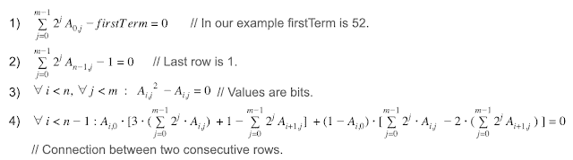
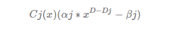
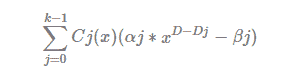
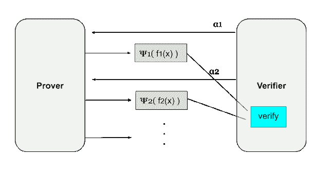
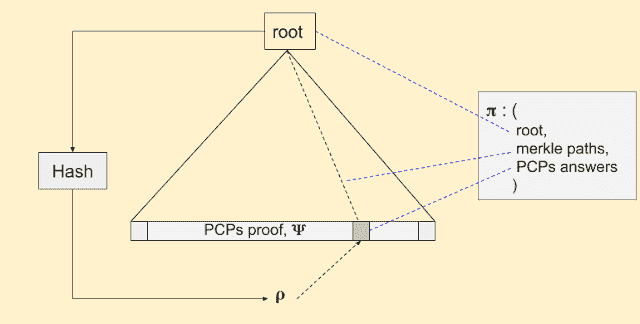
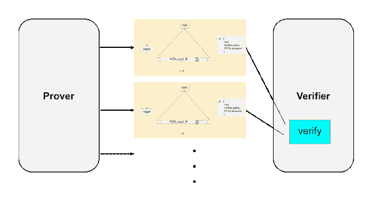
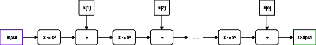

# 揭示所有神秘的 ZK-stark

> 原文：<https://medium.com/coinmonks/reveal-mysterious-zk-starks-42d00679c05b?source=collection_archive---------1----------------------->

在这篇文章中，我会尽量减少数学公式，让它尽可能容易理解

人们说 S **T** ARKs 是新一代 S **N** ARKs。不仅仅是因为它更快，最重要的是因为这两个品质。STARKs 和
2 不需要可信设置。它们是量子抗性的

然而，斯塔克斯并不完美，这是有代价的:证据的大小。STARK 的验证大小约为 40-50KB，而 SNARKs 的大小仅为 288 字节。此外，STARKs 相对较新——从最初的概念发表到现在才两年左右。我们可能还需要一些时间来验证他们的贪婪。

在 STARKs 中，S 代表“可伸缩”。T 代表透明性，STARKs 解决了 S **N** ARKs 的主要弱点之一，“可信设置”。

ARKs 不依赖于椭圆曲线加密和配对，它们使用更简单的加密假设，比如散列。这意味着 STARKs 不需要一个可信的设置，可以抵抗量子计算机的攻击者。

SNARKs 和 STARKs 都基于多项式验证。区别在于如何*隐藏秘密*，如何*简洁验证*，如何*实现不交互*。

让我们快速回顾一下 SNARKs 是如何工作的。

爱丽丝有一个多项式 P(x)，鲍勃有秘密 s。目标是，
爱丽丝不知道 s，鲍勃不知道 P(x)，但是鲍勃可以验证 P(s)。通过‘同态 Hindins’隐藏秘密 s，s → H(s)，QAP/匹诺曹简洁验证，将 H(s)放入 CRS(公共引用串)实现不交互。更多详情看[我之前的帖子](/taipei-ethereum-meetup/深入瞭解-zk-snarks-7a0187f399f1)(抱歉…是中文)。

# 转换

零知识证明的第一步是将假设的“问题”转化为多项式。本节只讲解如何将问题转化为多项式。至于如何转换的细节，这里就不做过多解释了。

## 问题→约束→多项式

SNRAK 和 STARK 都是基于高维多项式的。如果多项式为:x + 3x + 3 = 0，那么多项式的解就很容易猜到。如果多项式是 x ^ 2000000 + x ^ 1999999 +…，难度会高很多。

第一步是将问题转化为多项式。在这里，我将使用一个 Collatz 猜想作为例子。什么是柯拉兹猜想？
1。如果数字是偶数，除以 2
2。如果数字是奇数，乘以 3 再加 1。(3n+1)

任何正整数，遵循上面两条规则，最后都是 1。以 52 为例，
52->26->13->40->20->10->5->16->8->4->2->1。

记录每个操作的结果。这称为执行跟踪，如上面的 52-> 26-> 1。然后我们把执行轨迹转换成多项式如下(执行轨迹到多项式的转换不是这里的重点。详情请参考 StarkWare 的[这篇文章](/starkware/arithmetization-i-15c046390862)

[https://medium.com/starkware/arithmetization-i-15c046390862](/starkware/arithmetization-i-15c046390862)

## 合成多项式

然后把上面四个带极限条件的多项式合二为一，最后一个叫做“合成多项式”，这个多项式就是后面要验证的多项式。

如开头所述，SNARKs 和 STARKs 都使用高维多项式。然后，我们将介绍 STARK 实现零知识信息交换、透明性和可伸缩性的方法。

## 度数调整

这一步是为以后的验证准备的。如果最高次数不是 2 的幂，我们将最高次数的约束多项式调整到 2^n.，直到比最高次数大的最接近的 2 的幂。

假设每个约束多项式(不是合成多项式)为 Cj (x)，次数为 Dj，D >= Dj 且 d 等于 2 ^ n .为了达到 d 次，将这些多项式乘以次数(D-Dj)

合成多项式的结果将是

aj、βj 由验证者提供。因此，合成多项式是由证明者和验证者共同完成的。

****本节的要点是将多项式调整到 D(2 的幂)次。不懂可以跳过流程……***

# 星期五

FRI 是“快速 RS IOPP”(RS = " Reed-Solomon "，IOPP = "交互式 Oracle Proofs of Proximity ")的简称。FRI 使验证变得简洁。在介绍 FRI 之前，我们先讨论一下如何证明自己知道多项式 f(x)？

## RS 擦除代码:

擦除编码是对原始数据的扩展，使数据具有容错性。实现这一点的方法是将所有数据编码为一个多项式，并验证该多项式。例如，如果你有两个点，你可以做一条线，然后在这条线上挑出 3 个点。这三个点中的任何两个都可以重建原始点。假设有 d 个点我们可以构造一个 d-1 次多项式 y = f (x)。通过验证 f (z1)来验证 z1 是正确的数据？= Y。

回到上面的问题，如何证明自己知道多项式？最直接的方法是计算所有的根。通过擦除编码，假设 d + 1 个点，根据拉格朗日插值，可以构造一个 d 次多项式 h (x)。如果两个多项式在任一点 d(在一个区间内)相同(f (z) = h (z)，z = z1，z2 … zd)，那么意味着我知道 f (x)。但是我们面对的是一个高维多项式，d 是 1-2 百万，这样的测试效率低下，不可行。FRI 解决了这个问题，将验证的次数从几百万到几十次。

## 降低复杂性

假设合成多项式为 f (x)，通过找一个二元多项式来表示原多项式，降低多项式的次数。假设 f (x) = 1744 * x ^ {185423}，我们求出 y，这样 y = x ^ {1000}。多项式可以改写为 g (x，y) = 1744 * x ^ {423} * y ^ {185}。这样，从 10 万次降到了 1000 次，多项式的次数也通过这种方式大大降低了。StarkWare 目前的实现是 2 的幂，所以 y = x (f (x) = g (x，x))。

我们在这里使用的另一个策略是将一个多项式分成两个较小次数的多项式。我们分成多项式的奇数和偶数系数，

> f(x)= g(x ) + xh(x)

举个例子，

> f(x)= A0+a1x+a2x+a3x+a4x⁴+a5x⁵
> g(x)= A0+a2x+a4x⁴，(g(x)= A0+a2x+a4x)
> h(x)= a1x+a3x+a5x⁴，(h(x) = a1 + a3x + a5x)

有了这两个技能，复杂度每次降低 2 倍。FRI 协议由两个阶段组成，提交阶段和查询阶段。

**提交阶段:** 提交阶段与前面的描述相同。每次分解多项式时，验证者提供一个随机数，然后形成新的多项式。一遍又一遍地重复这个过程。

f(x)= F0(x)= G0(x)+x * h0(x)
= =>f1(x)= G0(x)+α0 * h0(x)，← α0(验证者提供)
== > f2(x) = g1(x) + α1*h1(x)，← α1(验证者提供)
=>。。。

**查询阶段:** 该阶段是对证明者提供的多项式 f0(x)，f1(x)，f2(x)，…，进行验证。验证者采样 z 并查询 f(z)和 f(-z)(该域需要满足 L = {x :x ∊ L}。这里不解释了。).所以，我们可以，

> F0(z)= G0(z)+z * h0(z)
> F0(-z)= G0(z)-z * h0(z)

验证者可以通过解方程知道 g0(z)、h0(z)，并计算 f1(z)，然后 f1(x)等等。

Interactive Oracle Proofs (IOPs)

借助 FRI (RS 擦除代码，IOPs)，验证次数从数百万次减少到 20–30 次(log2 (d))，从而使验证更加简洁。我们解决了复杂性问题，但是我们仍然有交互问题！

****相对于 SNARKs:SNARKs 中 QAP 和匹诺曹用于验证。***

# 非相互作用

我们使用 Micali 构造来说明如何实现非交互式验证。Micali 构造由两部分组成，PCPs(概率可检验证明)和 hash 函数。PCPs 是一种带有随机本地检查的证明系统。换句话说，证明者产生一个长证明(这是大量的数据)，验证者通过随机抽样进行检查。过程是这样的:证明者产生证明𝚿，验证者随机检查 n 个点。

我们在这里的目标是拥有:
1。一个小小的证明，
2。不互动。

随机抽样有助于实现一个小的证明，但是交互作用呢？思路很简单，就是预采样。我们从𝚿预抽样一个短证明，这个短证明代表原始证明，𝚿，发送给验证者。显然，校准者不是预采样的候选人。为了解决这个问题，我们使用 [Fiat-Shamir 启发式](https://en.wikipedia.org/wiki/Fiat%E2%80%93Shamir_heuristic)进行预采样。

首先用证明𝚿构造一棵 merkle 树，然后散列 merkle 根得到一个随机数𝛒，其中𝛒是预采样的索引。把𝛒选择的小块和大块的 merkle 路径和 merkle 根放在一起，我们称这个组合为𝛑，这是一个明显的证明。

到目前为止，只有哈希算法(一种加密轻量级算法)被使用。hash 函数的选取是这个证明系统唯一的全局参数(每个人都需要知道)，不像 SNARK 有 KCA 使用的(α，β，𝛾)等全局秘密参数，使用 HH(同态隐藏)隐藏这些秘密，然后生成 CRS。因为这个证明系统是基于公共散列函数的，所以它不需要预先生成的秘密。因此，STARK 可以实现透明性，并且不需要可信的设置。

然后用 PCPs 和 Fiat-Shamir 启发式代替 FRI 的交互部分(验证者提供的值α)。我们可以实现无互动。

****与 SNARKs 相比:SANRK 的非交互是将全局参数放入 CRS。因为 CRS 中的值是公开的，所以 HH 需要隐藏秘密。***

# MIMC

无论是 SNRAKs 还是 STARKs，都需要将多项式转换为算术电路。因此，电路的复杂性至关重要，它与证据生成和验证的时间有关。STARKs 采用 MiMC 作为哈希函数，电路复杂度较低。这就是它的工作原理，

[https://vitalik.ca/general/2018/07/21/starks_part_3.html](https://vitalik.ca/general/2018/07/21/starks_part_3.html)

MiMC 有一些非常有用的特性:难以计算、易于验证、计算不可并行化。这些实现了 VDFs(可验证延迟功能)的主要目标。这是 Vitalik 提出的一个[建议](https://ethresear.ch/t/hash-based-vdfs-mimc-and-starks/2337)使用 MiMC 作为 VDF 候选。

## **最终想法:**

向后计算 MiMC 电路比向前计算要多花 100 倍的时间。

从上面的解释，我们可以理解为什么 STARK 不需要可信设置，但是为什么它是抗量子的？在 SNARK 中使用 HH 来隐藏秘密，HH 依赖于椭圆曲线，但是椭圆曲线并不具有抗量子性(这意味着私钥可以从公钥中导出)。

stark 在他们的整个过程中只使用哈希函数，目前没有有效的算法来破解哈希函数——因此，stark 被理解为可以抵抗量子攻击。

欢迎任何需要纠正的反馈或错误。

**参考资料:** [STARK Deep Dive:STARK Core Engine](/starkware/starkdex-deep-dive-the-stark-core-engine-497942d0f0ab)**STARK ware 的系列:** -[STARK Math:The Journey Begins](/starkware/stark-math-the-journey-begins-51bd2b063c71) -[算术化 I](/starkware/arithmetization-i-15c046390862)
- [算术化 II
-](/starkware/arithmetization-ii-403c3b3f4355)[低度测试](/starkware/low-degree-testing-f7614f5172db) - [一个高效 STARKs 的框架 第二部分:谢天谢地今天是周五](/starkware/a-framework-for-efficient-starks-19608ba06fbe) - [斯塔克斯，第三部分:进入杂草中](https://vitalik.ca/general/2018/07/21/starks_part_3.html) [ZK-斯塔克斯——创建可验证的信任，甚至对抗量子计算机](/coinmonks/zk-starks-create-verifiable-trust-even-against-quantum-computers-dd9c6a2bb13d) [https://ether eum . stack exchange . com/questions/59145/ZK-snarks-vs-ZK-STARKs-vs-bullet proofs-updated](https://ethereum.stackexchange.com/questions/59145/zk-snarks-vs-zk-starks-vs-bulletproofs-updated)

> 加入 Coinmonks [电报频道](https://t.me/coincodecap)和 [Youtube 频道](https://www.youtube.com/c/coinmonks/videos)了解加密交易和投资

# 另外，阅读

*   [Bookmap 评论](https://coincodecap.com/bookmap-review-2021-best-trading-software) | [美国 5 大最佳加密交易所](https://coincodecap.com/crypto-exchange-usa)
*   最佳加密[硬件钱包](/coinmonks/hardware-wallets-dfa1211730c6) | [Bitbns 评论](/coinmonks/bitbns-review-38256a07e161)
*   [新加坡十大最佳密码交易所](https://coincodecap.com/crypto-exchange-in-singapore) | [收购 AXS](https://coincodecap.com/buy-axs-token)
*   [红狗赌场评论](https://coincodecap.com/red-dog-casino-review) | [Swyftx 评论](https://coincodecap.com/swyftx-review) | [CoinGate 评论](https://coincodecap.com/coingate-review)
*   [投资印度的最佳加密软件](https://coincodecap.com/best-crypto-to-invest-in-india-in-2021)|[WazirX P2P](https://coincodecap.com/wazirx-p2p)|[Hi Dollar Review](https://coincodecap.com/hi-dollar-review)
*   [加拿大最好的加密交易机器人](https://coincodecap.com/5-best-crypto-trading-bots-in-canada) | [库币评论](https://coincodecap.com/kucoin-review)