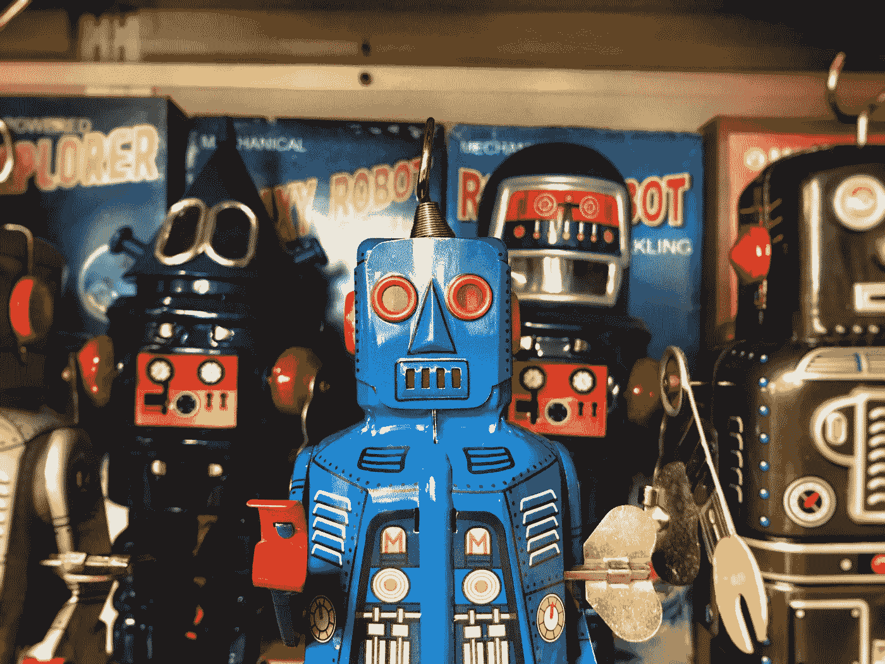
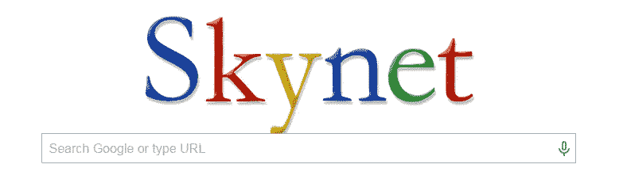
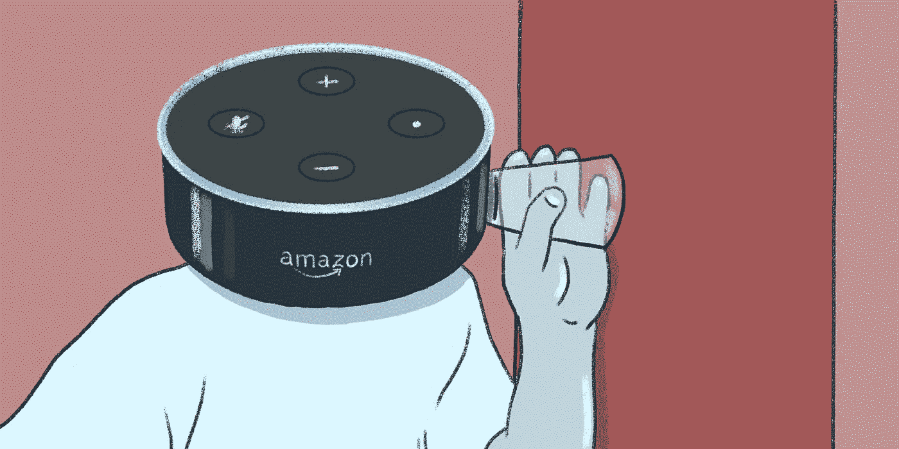
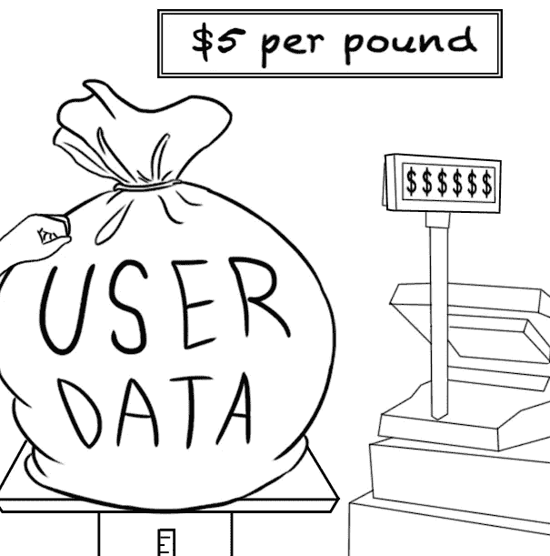
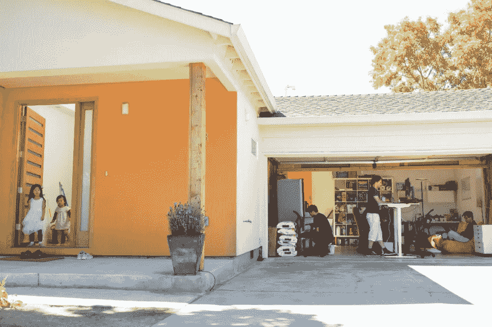

# 人工智能书呆子的复仇

> 原文：<https://medium.com/coinmonks/revenge-of-the-ai-nerds-5a6bb370b059?source=collection_archive---------1----------------------->

## **区块链将如何拯救我们的生活并为你的数据付费**

> *“我认为一大块工作岗位将在 15 年后被取代。”—李开复谈自动化威胁*

在科幻电影中*她的*设定在不久的将来的洛杉矶*，*主角西奥多购买了一个操作系统，配有人工智能虚拟助手，由斯嘉丽·约翰逊配音的萨曼莎。两人一拍即合，最终变得浪漫起来，尽管萨曼莎是一个没有身体的电脑合成声音。这部电影于 2013 年上映，当时看起来很诡异。最近重新看了一遍，我发现自己在想，“这很可能会发生。”

思想家和未来学家凯文·凯利说，为了确定未来的这种趋势，我们应该看看今天在社会边缘发生了什么。在计算机被大规模采用之前，计算机迷们一直在修补它们。早在比特币和区块链出现的几年前，密码朋克们就对加密货币着迷了。

现在，在数据计算和区块链的帮助下，**普遍基本收入(UBI)**这个以前处于边缘的想法正迅速浮出水面。UBI 是一种社会保障体系，每个公民都将定期获得定期付款。这是一个针对人工智能和自动化在未来几十年夺走我们工作的威胁而提出的解决方案。

这种对失业的恐惧已经存在了很长时间，但却没有什么表现。在 1900 年代早期，马车消失了，但是随着汽车工业的出现，新的工作岗位被创造出来。即使是优步，虽然对出租车行业具有高度破坏性，但也为任何人创造了新的机会，让他们可以把自己的车变成创收机器。

然而，随着技术继续渗透到我们生活的方方面面，趋势正朝着相反的方向发展，越来越多的工作岗位被破坏，越来越少的工作岗位被创造。金融、制造和零售等大型行业不再有就业增长。亚利桑那州的麦当劳已经完全由机器人在 T2 运营，数十家快餐连锁店将实现餐厅自动化。像华盛顿邮报、雅虎这样的大型媒体出版商。和福布斯都是[用 AI 生成文章](https://www.forbes.com/sites/bernardmarr/2019/03/29/artificial-intelligence-can-now-write-amazing-content-what-does-that-mean-for-humans/#7cb4d49e50ab)；不像人类作家，它永远不会抱怨或请病假。尽管优步在增长，但他们的最终目标是拥有无人驾驶汽车，彻底消除对司机的需求。

这些新技术将会破坏比它们创造的更多的工作，麦肯锡的一份报告预测，由于机器人技术、机器学习、人工智能和自动化的进步，到 2030 年，机器人将取代多达 8 亿份工作。(关于这方面的更多信息，请查阅伟大的著作《机器人的崛起》

为了应对这一威胁，总统候选人杨安泽把它放在了竞选的最前沿，发誓要给美国人每月 1000 美元的津贴，不问任何问题。

他说，*“…世界上最聪明的人现在预测，在未来 12 年内，三分之一的美国工人将会因为自动化而失业。我们目前的政策还不足以应对这场危机。即使是我们最有远见的政治家也毫无准备。”*

在美国，UBI 的支持率从 12%上升到 48%(T1)(东北大学-盖洛普调查)。大多数模型通过向每个人提供相同的支出来支付系统费用，而不考虑工作投入。实现全民健康保险的资金可以通过削减军费开支(不太可能)、逐步取消甚至开征新税来筹集。虽然有一些[有趣的提议](https://futurism.com/heres-how-we-could-fund-a-ubi-program-in-the-united-states)，但是最近在[芬兰](https://www.theguardian.com/world/2019/feb/08/finland-free-cash-experiment-fails-to-boost-employment)和[加拿大](https://www.theguardian.com/world/2019/feb/08/finland-free-cash-experiment-fails-to-boost-employment)失败的 UBI 实验告诉我们，以一种明智的方式分配金钱并不像看起来那么简单。

最重要的是，我们需要决定这将来自谁的钱包。答案可能就在我们的指尖下——利用并出售我们的*数据*来创造普遍的基本收入。这个起初听起来像是一个未来的想法，但是今天随着新区块链技术的出现，它看起来越来越可行。

为了理解这一壮举是如何实现的，我们首先需要理解我们是如何走到今天这一步的。

# **新数据霸主**

> 唐纳德·特朗普警告选民，墨西哥人和中国人会抢走他们的工作，因此他们应该在墨西哥边境建一堵墙。他从未警告选民算法会夺走他们的工作，也没有建议在与加州的边境上建立防火墙。” —尤瓦尔·赫拉利，21 世纪的 21 个教训

启蒙思想家约翰·洛克将我们三项不可剥夺的权利归类为生命、自由和财产。他将地产定义为“每个人都有权拥有他们通过赠与或交易创造或获得的一切，只要这与前两项权利不冲突。”洛克在 300 多年前说过这句话——比火车早 100 年，比空调早 200 年，比互联网早 280 年。

如果洛克今天还活着来更新他的观点，他可能会争辩说*数据*属于这第三种权利。毕竟，数据是‘我们通过礼物或交易创造的’，不是吗？每当你喜欢脸书的一个条目，在 Instagram 上发布并分享一张照片，或者在网飞**上选择一部电影，你都在产生有价值的数据。**你在谷歌地图、Gmail、谷歌文档上做的一切，以及你在“云中”做的几乎所有事情都是为了挖掘数据。谷歌正在处理超过 14eb 的数据，或超过**160 亿 GB。那是一大堆数据。**

谷歌能够积累的数据越多，你使用谷歌的时间越长，你的数据就越有价值。当技术能够比人类更廉价更快速地执行任务时，我们就不再是必要的了。换句话说，在谷歌和脸书上执行无报酬的平凡数字任务，你不仅为这些营销巨擘创造了有价值的数据，也为有朝一日将取代你工作的机器学习机器人创造了有价值的数据。

这可能不太直观，但这显然是谷歌联合创始人拉里·佩奇的设想。“从统计意义上来说，颠覆性技术公司的目标是降低 GDP，”佩奇说。“消除正在被衡量的交易成本，代之以没有被衡量的便利。因此，经济在萎缩，但每个人都得到了更好的待遇。许多技术正在摧毁不需要的东西。**最终结果是，你的经济会减少，但福利会提高。”**(资料来源:大卫·皮林在《成长错觉》一书中)。

不幸的是，佩奇并没有准确解释在技术让我们的经济萎缩之后，我们将如何实现这种“更高的福利”。从[收入不平等的加剧](https://www.washingtonpost.com/us-policy/2019/02/21/income-inequality-is-rising-so-fast-our-data-cant-keep-up/?noredirect=on&utm_term=.68e35bff1362)和经济流动性的降低来看，这种由技术驱动的“福利”似乎更有可能落入少数人手中。

> 你=

## **但是我喜欢自拍！**

虽然你可能会感到震惊、恼火，或者两者兼而有之，但你也可能会辩称，使用这些让日常生活变得更轻松的优质服务、折扣和免费赠品，比如免费短信、搜索和电子邮件工具，你已经获得了相当可观的回报。“我喜欢在每次兴奋的时候拍照，”你可能会补充说。

不可否认，科技公司为我们提供了新的生活标准和我们喜欢的服务。我也使用这些服务。重点不是谴责他们或试图回到一个没有他们的世界，这既不可行也不可取。相反，它是为了思考未来和**质疑我们在当前数字社会中拥有的潜在*协议*** 。

问题是，尽管你做出了贡献，但你实际上并不拥有你的数据。谷歌、亚马逊、阿里巴巴和脸书的最大股东拥有你的数据。这些互联网巨头然后通过向广告商出售这些数据来赚钱。他们可以为所欲为。

这是怎么发生的？这些公司能够“迅速扩大规模”并占据主导地位，因为没有产权规则来管理数据和隐私世界。这些数据霸主筹集了大量的资金，因为他们找到了一种方法来为他们的网站带来大量的流量，而大量的流量创造了大量的数据。

# **事情变暗的地方**

> “我现在确信，谷歌搜索是有史以来收集的关于人类心理的最重要的数据集。”—谷歌数据科学家塞思·大卫多维茨

谷歌已经可以根据人们对症状的搜索来预测流感的流行。如果使用得当，这些数据实际上对社会很有帮助。更阴险的是，如果有人在搜索“如何杀人”和“尸体处理技术”，谷歌也知道。

问题是，如果进行搜索的人是你的邻居，你会想知道吗？你有权利知道吗？也许他们是一个为犯罪学课程做无害研究论文的学生。或者他们打算杀了你。

道德和伦理的含义是有趣的辩论。但重点是——你怎么看待上面的例子并不重要。如果谷歌控制了你的数据，那么无论如何你都没有发言权。他们可以任意使用你的搜索数据；支持或反对你。

这就是问题所在。那就是《少数派报告》(《T21 》)中人们在犯罪之前就被逮捕的情节不仅是现实的，而且凭借我们现有的技术，这在今天也是可能的。这是一个比技术夺走我们的工作更深层次的问题。

我们就像火鸡一样，快乐地享受在主人的花园里漫步的日子，直到我们在感恩节那天面对它们令人震惊的变心的现实。但不像火鸡不知道屠夫在磨刀，我们应该足够聪明地接受暗示。

# **亚马逊知道你什么时候吃饭，拉屎，睡觉**

Source: [Dailydot](https://www.dailydot.com/debug/alexa-smart-speaker-vulnerabilities/)

到 2020 年，亚马逊、谷歌和脸书将占美国广告支出的 63%。人们不禁要问，他们是如何为消费者增加价值的？谷歌在谷歌地图上增加了一些小功能，但总的来说，变化不大。然而，谷歌地图的每次使用 r 的*收入增加了。额外价值从何而来？是的，你猜对了。你的数据。*

这些数据的价值将会大幅增加。物联网(IoT)正在连接我们生活的各个方面，并在您的日常生活中产生丰富的数据流。谷歌已经知道你最深的秘密——那些你不会与你最亲密的朋友或家人分享的秘密，但是那些你在凌晨 3 点没人看的时候输入搜索栏的秘密(除了有人*在看)。*

你如此友好地邀请到你家的 Alexa 正在从你身上变得富有——不仅从你的音乐选择和杂货订单，而且几乎所有有任何数字输入的东西。如果你的亚马逊 echo 或谷歌 home 连接到你的飞利浦灯泡，那么亚马逊知道你什么时候睡觉。互联设备的级联——从厕所到炉子以及其他一切——意味着，坦率地说，亚马逊将很快知道你何时吃饭、拉屎和睡觉。

> 在这样的世界里，难道你不想至少对你的数据有一些控制吗？

# **作为全民基本收入的数据**

如果不是政府主导的解决方案，而是每个人都为他们的数据付费，会怎么样？如果个人因其数据而获得报酬，那么这种数据收入可用于创造一种普遍的基本收入。毫无疑问，对更多税收的恐惧让很多人放弃了 UBI。但数据驱动的 UBI 可以从被动收入中提取社会税收“负担”,并大幅减少/削减我们的税单。也许**数据**是实现 UBI 功能系统的缺失部分。

我们已经利用技术从*中赚钱。我可以拿出我的 iPhone，在 Airbnb 上列出我的公寓，成为一名优步司机，或者在 Upwork 上成为一名自由职业者。在我所有的互动之下，是一个矩阵状的数据流，它通过数千次互动与我的个人资料联系在一起。如果我也能利用这一点呢？*

想象一下，向营销人员提供**个性化和相关的**数据可以获得报酬。你不会被无关的购物广告吓到，这些广告根据你的过去历史重新定位你，你会知道这些数据是如何被使用的，反过来，你可能会更愿意分享这些数据。数据将会更加准确和丰富，这对公司更有用，对你也有好处，因为你可以得到你真正想要的超个性化的推荐。这会是一个双赢的局面。

## 我的数据值多少钱？

[Source](https://thebestvpn.com/how-free-vpns-sell-your-data/)

很难得出一个准确的数字来确定你的数据有多少价值，但我们知道仅在美国，广告行业的收入(脸书和谷歌 80%的收入都来自广告行业)就超过了 1300 亿美元。脸书每位用户的平均年收入是 108 美元，这看起来不是很多钱，但当你把你使用的所有在线/移动服务结合起来时，这个数字可能会高得多。

在一个有趣的实验中，[费德里科·赞尼尔](https://www.kickstarter.com/projects/1461902402/a-bit-e-of-me)将他所有的数据放在网上出售，包括他所有的网页浏览记录、电脑活动和照片，包括时间戳和地理位置。他能够**捞到 2733 美元。**

请记住，一些最有价值的数据类型是金融、保险、医疗和其他你通常不会在网上分享的个人数据。也就是说，他们*正在*开始在网上共享——以 23andme 为例，它已经在向第三方出售[你的基因数据。](https://gizmodo.com/23andme-is-selling-your-data-but-not-how-you-think-1794340474)也有公司在为你的基因数据开发[应用商店。我们的数据将会以我们无法理解的方式被共享、解析和聚合。](https://www.extremetech.com/extreme/253004-helix-launches-dna-app-store)

你的数据价值可能不足以使 UBI 成为有效的月津贴。可能就是一个月几百块吧。然而，随着自动化的兴起，以及前面提到的连接我们的汽车、房屋、硬件、软件和几乎所有东西的数十亿美元的物联网市场*，我们数据的价值将继续增加。*

## 好吧，让脸书和谷歌见鬼去吧。我就不能保存并出售我自己的数据吗？

不幸的是，事情还没那么简单。想象一下，优步试图在没有广泛的智能手机网络的情况下，将街上的每辆车都变成私人司机——这几乎是不可能的。同样，虽然你拥有大量的数据，但普通人没有能力出售自己的数据。识别谁要你的数据，把自己的数据打包，然后想办法卖掉，太难了。需要有一个您可以轻松使用的底层基础设施。目前，普通人需要太多的摩擦和专业技术。

# **人工智能书呆子的复仇**

如果以前为谷歌、脸书和微软工作的顶级人工智能、机器学习和数据安全头脑走到一起，而不是为互联网巨头制造更多工具，而是提供给公众使用，会怎么样？

The Harmony garage headquarters

进入[和谐区块链网](https://harmony.one/)。运营 Harmony 的亚马逊、谷歌和微软的前技术高管已经筹集了[1800 万美元的资金](/harmony-one/meet-the-harmony-team-f211ea407b48)，但仍然在车库里工作(通常是一个好迹象)。他们正在融合他们的知识，将这种人工智能驱动的数据控制交给个人。

Harmony 是区块链的一个公共项目，旨在创造技术，让你拥有自己的数据并将其货币化。他们使用区块链在技术层面上通过双管齐下的方法来解决这个问题——**深度分片**和**零知识证明**。

第一部分，深度切分，解决了我之前描述的关于创建一个实际上允许普通人赚钱的基础设施的问题。需要有一个足够快的网络，能够保存大量数据，快速确认和验证数据的使用，并相应地发放奖励。深度分片是一种新的网络层，支持这种速度和可扩展性。

第二块，零知识证明，解决了隐私顾虑。它允许人们在不暴露所有数据的情况下验证信息。这样，你就可以分享你的收入(一个非常私人的问题),而不必暴露你的身份。[密码爱好者可以在这里阅读更多关于这项技术的内容。

Harmony 的解决方案不仅仅是将你的数据货币化，还标志着从数据集中到数据主权的意识形态转变。

他们并不是唯一致力于此的人。

三分之二的韩国手机用户已经通过名为 [AirBloc 的应用程序赚钱了。](https://airbloc.org/)另一款应用 [Wibson](https://wibson.org/) ，为你的社交媒体数据支付代币。英国初创公司 [digi.me](http://digi.me/) 允许你在一个你可以控制的应用程序中上传和存储数据。

从公司拥有的数据到你拥有的数据的转变可能是自公元前六世纪希腊雅典民主统治以来最强大的民主化浪潮。数据驱动的普遍基本收入模式从政府分配转变为自下而上的个人数据所有权和货币化模式——而基础的区块链理工大学正在使这成为可能。

# 拥有供给机器的燃料

在工业世界，石油大亨们拥有经济的燃料。在数字经济中，学习机器的燃料是数据。机器人可能真的会取代我们包装书籍、杂货和其他我们在亚马逊或阿里巴巴上购买的产品的工作。如果这能让我们的生活更轻松，那就这样吧。但是当我们订购、分享和推荐这些产品时，我们将从这些数字化的日常工作中赚钱，而不是从互联网垄断中赚钱。

随着散布恐惧的政客们创造了一个机器人管理世界的虚假现实， *Harmony* 和其他人正在创造一个有着不同结局的不同未来。就像 19 世纪镀金时代控制黄金和石油的强盗大亨一样，互联网巨头已经商品化并控制了我们的数据。在人工智能爱好者构建新的分散数据基础设施——数字时代的铁路——的帮助下，消费者正在通过互联应用程序获得对他们数据的控制。数据仍然是一种商品，但我们正在获得商品的所有权。我们的个人数据将是我们在经济和社会层面上最有价值的经济*投入*。

*感谢阅读！如果你喜欢，你可以* [*在这里关注我的博客*](https://mishayurchenko.me/) *并在我的每周简讯* [*中看到我的最新文章。*](https://mailchi.mp/780498b6e587/newsletter-signup)

> [直接在您的收件箱中获得最佳软件交易](https://coincodecap.com/?utm_source=coinmonks)

